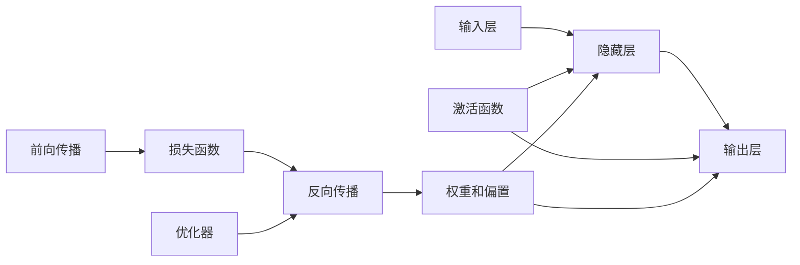

# Neural Network

## 1. 背景介绍
### 1.1 问题的由来
人工神经网络(Artificial Neural Network,ANN)是一种模仿生物神经网络(动物的中枢神经系统,特别是大脑)的结构和功能的数学模型或计算模型,用于对函数进行估计或近似。神经网络由大量的人工神经元联结进行计算。大多数情况下人工神经网络能在外界信息的基础上改变内部结构,是一种自适应系统。

人工神经网络的发展历史可以追溯到20世纪40年代,当时科学家们开始尝试用数学模型来模拟神经元的工作原理。1943年,McCulloch和Pitts提出了第一个神经元数学模型,该模型成为了后来人工神经网络的基础。之后,Hebb在1949年提出了著名的Hebb学习规则,为神经网络的学习能力奠定了基础。

20世纪50年代到60年代,人工神经网络的研究进入了一个低谷期。直到1986年,Rumelhart等人提出了反向传播(Backpropagation,BP)算法,使得多层前馈神经网络的训练成为可能,人工神经网络的研究才再次进入一个繁荣期。

### 1.2 研究现状
目前,人工神经网络已经在许多领域取得了巨大的成功,如模式识别、自然语言处理、语音识别、计算机视觉等。一些著名的神经网络模型如卷积神经网络(Convolutional Neural Network,CNN)、循环神经网络(Recurrent Neural Network,RNN)、长短期记忆网络(Long Short-Term Memory,LSTM)等,已经在相关领域达到了甚至超过了人类的水平。

深度学习的崛起更是将神经网络推向了一个新的高度。一些复杂的神经网络结构,如残差网络(ResNet)、生成对抗网络(Generative Adversarial Network,GAN)等,使得神经网络能够处理更加复杂的任务。

同时,神经网络的可解释性、鲁棒性、泛化能力等问题也受到了广泛关注。一些新的研究方向,如图神经网络(Graph Neural Network)、胶囊网络(Capsule Network)、注意力机制(Attention Mechanism)等,也在不断涌现。

### 1.3 研究意义
人工神经网络作为一种强大的机器学习模型,在许多领域都有着广泛的应用前景。深入研究神经网络的原理和应用,对于推动人工智能的发展具有重要意义。

一方面,神经网络能够从大规模数据中自动学习特征和规律,这使得它在处理复杂任务时具有得天独厚的优势。另一方面,神经网络的结构和功能与生物神经系统有着一定的相似性,研究神经网络有助于我们更好地理解生物智能的奥秘。

此外,神经网络的研究也促进了硬件技术的发展。为了更高效地训练和部署神经网络模型,GPU、TPU等专用硬件不断涌现,计算能力得到了大幅提升。

### 1.4 本文结构
本文将全面介绍神经网络的相关知识。第2节将介绍神经网络的核心概念,并阐述它们之间的联系。第3节将详细讲解神经网络的核心算法原理,并给出具体的操作步骤。第4节将建立神经网络的数学模型,推导相关公式,并给出案例分析。第5节将通过代码实例,演示如何使用Python实现一个简单的神经网络。第6节将介绍神经网络在实际场景中的应用。第7节将推荐一些学习神经网络的工具和资源。第8节将总结全文,并展望神经网络未来的发展趋势和面临的挑战。第9节是附录,将解答一些常见问题。

## 2. 核心概念与联系
人工神经网络主要由以下几个核心概念构成:

- 神经元(Neuron):神经网络的基本单元,接收其他神经元的输入,并产生输出。
- 激活函数(Activation Function):用于将神经元的加权输入映射为输出,引入非线性因素。
- 权重(Weight):神经元之间连接的强度,决定了前一个神经元对后一个神经元的影响程度。
- 偏置(Bias):神经元的一个属性,用于调整神经元的输出。
- 层(Layer):由多个神经元组成,分为输入层、隐藏层和输出层。
- 前向传播(Forward Propagation):信号从输入层向输出层传播的过程。
- 损失函数(Loss Function):用于衡量神经网络的预测值与真实值之间的差距。
- 反向传播(Backpropagation):根据损失函数的梯度,调整神经网络权重的过程。
- 优化器(Optimizer):用于更新神经网络的权重,如梯度下降法。

这些概念之间的联系可以用下面的 Mermaid 图来表示:

## 3. 核心算法原理 & 具体操作步骤
### 3.1 算法原理概述
神经网络的核心算法主要包括前向传播和反向传播两个部分。

前向传播是信号从输入层向输出层传播的过程。每个神经元接收来自前一层神经元的加权输入,并通过激活函数产生输出,传递给下一层神经元。这个过程可以用以下公式表示:

$$
z_j = \sum_i w_{ij} x_i + b_j \\
a_j = f(z_j)
$$

其中,$x_i$是上一层第$i$个神经元的输出,$w_{ij}$是连接两个神经元的权重,$b_j$是当前神经元的偏置,$f$是激活函数。

反向传播是根据损失函数的梯度,调整神经网络权重的过程。首先计算损失函数对输出层每个神经元的偏导数,然后利用链式法则,逐层向前计算每个权重的梯度,并根据梯度下降法更新权重。对于第$l$层的第$j$个神经元,其权重的更新公式为:

$$
w_{ij}^{(l)} := w_{ij}^{(l)} - \alpha \frac{\partial J}{\partial w_{ij}^{(l)}}
$$

其中,$\alpha$是学习率,$J$是损失函数。

### 3.2 算法步骤详解
1. 初始化神经网络的结构,包括层数、每层神经元数、激活函数等。
2. 随机初始化神经网络的权重和偏置。
3. 开始训练:
   - 前向传播:将输入数据喂入神经网络,计算每个神经元的输出,直到得到输出层的结果。
   - 计算损失函数,衡量预测值与真实值的差距。
   - 反向传播:计算损失函数对每个权重的偏导数,并根据梯度下降法更新权重。
4. 重复步骤3,直到达到预设的迭代次数或损失函数达到预设的阈值。
5. 使用训练好的神经网络进行预测。

### 3.3 算法优缺点
优点:
- 能够拟合复杂的非线性函数,具有强大的表达能力。
- 具有自适应性,能够从数据中自动学习特征。
- 具有一定的容错能力和鲁棒性。

缺点:
- 训练时间较长,对计算资源要求较高。
- 容易过拟合,需要采取一些正则化手段。
- 模型可解释性较差,难以理解神经网络的决策过程。

### 3.4 算法应用领域
- 计算机视觉:图像分类、目标检测、语义分割等。
- 自然语言处理:文本分类、情感分析、机器翻译等。
- 语音识别:语音转文字、说话人识别等。
- 推荐系统:个性化推荐、协同过滤等。
- 控制论:自适应控制、模型预测控制等。

## 4. 数学模型和公式 & 详细讲解 & 举例说明
### 4.1 数学模型构建
一个简单的前馈神经网络可以用下面的数学模型来表示:

$$
\begin{aligned}
\mathbf{z}^{(1)} &= \mathbf{W}^{(1)} \mathbf{x} + \mathbf{b}^{(1)} \\
\mathbf{a}^{(1)} &= f^{(1)}(\mathbf{z}^{(1)}) \\
\mathbf{z}^{(2)} &= \mathbf{W}^{(2)} \mathbf{a}^{(1)} + \mathbf{b}^{(2)} \\
\mathbf{a}^{(2)} &= f^{(2)}(\mathbf{z}^{(2)}) \\
&\vdots \\
\mathbf{z}^{(L)} &= \mathbf{W}^{(L)} \mathbf{a}^{(L-1)} + \mathbf{b}^{(L)} \\
\mathbf{y} &= f^{(L)}(\mathbf{z}^{(L)})
\end{aligned}
$$

其中,$\mathbf{x}$是输入向量,$\mathbf{y}$是输出向量,$\mathbf{W}^{(l)}$和$\mathbf{b}^{(l)}$分别是第$l$层的权重矩阵和偏置向量,$f^{(l)}$是第$l$层的激活函数。

常见的激活函数包括:

- Sigmoid函数:$f(x) = \frac{1}{1+e^{-x}}$
- Tanh函数:$f(x) = \frac{e^x - e^{-x}}{e^x + e^{-x}}$
- ReLU函数:$f(x) = \max(0, x)$

损失函数用于衡量预测值与真实值之间的差距,常见的损失函数包括:

- 均方误差(MSE):$J = \frac{1}{m} \sum_{i=1}^m (y_i - \hat{y}_i)^2$
- 交叉熵损失(Cross-entropy):$J = -\frac{1}{m} \sum_{i=1}^m [y_i \log \hat{y}_i + (1-y_i) \log (1-\hat{y}_i)]$

### 4.2 公式推导过程
以均方误差为例,推导反向传播的公式。

首先,计算损失函数对输出层每个神经元的偏导数:

$$
\frac{\partial J}{\partial \mathbf{a}^{(L)}} = \frac{2}{m} (\mathbf{a}^{(L)} - \mathbf{y})
$$

然后,逐层向前计算每个神经元的误差项:

$$
\boldsymbol{\delta}^{(l)} = ((\mathbf{W}^{(l+1)})^T \boldsymbol{\delta}^{(l+1)}) \odot f'^{(l)}(\mathbf{z}^{(l)})
$$

其中,$\odot$表示Hadamard积(逐元素相乘),$f'^{(l)}$是第$l$层激活函数的导数。

最后,计算每个权重的梯度:

$$
\frac{\partial J}{\partial \mathbf{W}^{(l)}} = \frac{1}{m} \boldsymbol{\delta}^{(l)} (\mathbf{a}^{(l-1)})^T
$$

$$
\frac{\partial J}{\partial \mathbf{b}^{(l)}} = \frac{1}{m} \sum_{i=1}^m \boldsymbol{\delta}_i^{(l)}
$$

### 4.3 案例分析与讲解
考虑一个简单的二分类问题,我们使用一个两层的神经网络来解决。

输入层有2个神经元,隐藏层有3个神经元,输出层有1个神经元。激活函数都使用Sigmoid函数,损失函数使用交叉熵损失。

假设我们有以下训练数据:

| $x_1$ | $x_2$ | $y$ |
|-------|-------|-----|
| 0     | 0     | 0   |
| 0     | 1     | 1   |
| 1     | 0     | 1   |
| 1     | 1     | 0   |

我们随机初始化神经网络的权重和偏置:

$$
\mathbf{W}^{(1)} = 
\begin{bmatrix}
0.1 & 0.2 \\
0.3 & 0.4 \\
0.5 & 0.6
\end{bmatrix},
\mathbf{b}^{(1)} = 
\