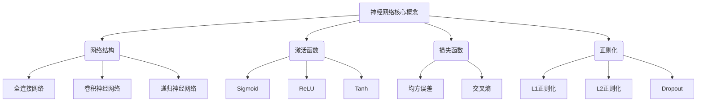

以下是关于《Neural Networks (NN) 原理与代码实战案例讲解》的技术博客文章正文内容：

# Neural Networks (NN) 原理与代码实战案例讲解

## 1. 背景介绍

### 1.1 问题的由来

在过去的几十年里，人工智能领域取得了长足的进步,尤其是机器学习和深度学习技术的兴起,极大推动了人工智能的发展。神经网络作为深度学习的核心模型,在计算机视觉、自然语言处理、推荐系统等诸多领域展现出了优秀的性能表现。

然而,神经网络模型往往被视为一个"黑箱",其内部工作机制并不十分透明,这给模型的可解释性和可信赖性带来了挑战。此外,神经网络在训练和推理过程中往往需要消耗大量的计算资源,对硬件设备的要求较高。因此,深入理解神经网络的原理,优化其算法和实现方式,对于提升模型的性能和可解释性,降低计算开销,具有重要意义。

### 1.2 研究现状

目前,神经网络在学术界和工业界都受到了广泛的关注和研究。学者们从不同角度对神经网络进行了深入探索,包括网络结构设计、训练算法优化、模型压缩与加速等方面。同时,一些知名科技公司也在积极推动神经网络技术的发展和应用,如谷歌的TensorFlow、Facebook的PyTorch等深度学习框架的推出,为研究者和开发者提供了强有力的工具支持。

### 1.3 研究意义

深入理解神经网络的原理和实现细节,对于提升模型的性能、可解释性和可靠性具有重要意义。通过掌握神经网络的核心算法和数学模型,我们可以更好地理解模型的内在工作机制,从而优化模型结构和训练过程,提高模型的泛化能力和鲁棒性。

此外,神经网络在实际应用中往往需要部署在资源受限的嵌入式设备或移动终端上,因此对模型的计算效率和内存占用也提出了更高的要求。通过研究神经网络的高效实现方式和模型压缩技术,我们可以降低模型的计算开销,使其更加适合于资源受限的环境。

### 1.4 本文结构

本文将从以下几个方面全面介绍神经网络的原理和实现:

1. 阐述神经网络的核心概念和基本原理,包括网络结构、激活函数、损失函数等。
2. 详细讲解神经网络的训练算法,如反向传播、优化器等,并给出具体的操作步骤。
3. 介绍神经网络的数学模型和公式推导过程,并通过案例进行详细说明。
4. 提供神经网络的代码实现示例,包括开发环境搭建、源代码解读和运行结果展示。
5. 探讨神经网络在实际应用中的场景,如计算机视觉、自然语言处理等领域。
6. 推荐相关的学习资源、开发工具和论文,为读者提供更多的参考。
7. 总结神经网络的研究现状和未来发展趋势,分析面临的挑战和展望。

## 2. 核心概念与联系

神经网络是一种受生物神经系统启发而设计的机器学习模型,具有并行分布式处理能力。它由大量互相连接的神经元组成,每个神经元接收来自其他神经元的输入,经过加权求和和非线性激活函数的处理后,产生自身的输出信号。神经网络的核心概念包括:

1. **网络结构**:根据神经元的连接方式和层次结构,神经网络可以分为全连接网络、卷积神经网络和递归神经网络等。
2. **激活函数**:激活函数引入了非线性,使神经网络能够拟合复杂的函数映射关系。常见的激活函数有Sigmoid、ReLU和Tanh等。
3. **损失函数**:损失函数用于衡量模型预测值与真实值之间的差异,是训练神经网络的驱动力。常见的损失函数有均方误差和交叉熵等。
4. **正则化**:正则化技术旨在减少过拟合,提高模型的泛化能力。常见的正则化方法包括L1正则化、L2正则化和Dropout等。

这些核心概念相互关联,共同构成了神经网络的基础框架。网络结构决定了模型的计算流程,激活函数和损失函数则影响着模型的非线性拟合能力和优化目标,而正则化技术则有助于提高模型的泛化性能。

## 3. 核心算法原理 & 具体操作步骤

### 3.1 算法原理概述

神经网络的训练过程可以概括为一个优化问题,目标是找到一组最优的权重参数,使得模型在训练数据上的损失函数值最小化。这个优化过程通常采用反向传播算法和梯度下降法来实现。

反向传播算法是一种高效的计算梯度的方法,它利用链式法则从输出层开始,逐层计算每个权重参数对损失函数的梯度。梯度下降法则根据计算得到的梯度,不断调整权重参数以最小化损失函数值。

具体来说,神经网络的训练过程包括以下几个主要步骤:

1. 前向传播:输入数据经过网络的各层计算,得到最终的输出。
2. 计算损失:将网络输出与真实标签进行比较,计算损失函数值。
3. 反向传播:根据链式法则,从输出层开始逐层计算每个权重参数对损失函数的梯度。
4. 权重更新:利用梯度下降法,根据计算得到的梯度调整权重参数,使损失函数值最小化。
5. 重复上述步骤,直到模型收敛或达到预设的训练轮数。

在实际操作中,还需要考虑一些优化策略,如学习率调度、动量优化和批量归一化等,以提高训练效率和模型性能。

### 3.2 算法步骤详解

以下是神经网络训练算法的具体步骤:

1. **初始化**:随机初始化神经网络的权重参数和偏置项。
2. **前向传播**:
   - 输入数据 $X$ 通过网络的第一层,计算第一层的输出 $H^{(1)} = \phi(W^{(1)}X + b^{(1)})$,其中 $\phi$ 为激活函数。
   - 将第一层的输出 $H^{(1)}$ 作为输入,重复上述过程计算后续每一层的输出,直到得到最终输出 $\hat{Y}$。
3. **计算损失**:将网络输出 $\hat{Y}$ 与真实标签 $Y$ 进行比较,计算损失函数值 $L(\hat{Y}, Y)$。
4. **反向传播**:
   - 计算输出层的误差项 $\delta^{(n_l)} = \nabla_{\hat{Y}} L(\hat{Y}, Y) \odot \phi'(Z^{(n_l)})$,其中 $\odot$ 表示元素wise乘积,$ \phi'$ 为激活函数的导数。
   - 从输出层开始,逐层计算每一层的误差项 $\delta^{(l)} = ((W^{(l+1)})^T \delta^{(l+1)}) \odot \phi'(Z^{(l)})$。
   - 计算每层权重参数的梯度 $\frac{\partial L}{\partial W^{(l)}} = \frac{1}{m} \delta^{(l)} (A^{(l-1)})^T$ 和偏置项的梯度 $\frac{\partial L}{\partial b^{(l)}} = \frac{1}{m} \sum_{i=1}^m \delta^{(l)}_i$,其中 $m$ 为批量大小。
5. **权重更新**:利用梯度下降法更新权重参数和偏置项,例如:
   $$W^{(l)} := W^{(l)} - \alpha \frac{\partial L}{\partial W^{(l)}}$$
   $$b^{(l)} := b^{(l)} - \alpha \frac{\partial L}{\partial b^{(l)}}$$
   其中 $\alpha$ 为学习率。
6. **重复步骤2-5**,直到模型收敛或达到预设的训练轮数。

在实际操作中,还可以引入一些优化策略,如动量优化、学习率调度和批量归一化等,以提高训练效率和模型性能。

### 3.3 算法优缺点

**优点**:

1. **强大的拟合能力**:神经网络具有强大的非线性拟合能力,可以近似任意连续函数,解决复杂的模式识别和回归问题。
2. **并行分布式处理**:神经网络的结构天生支持并行分布式计算,可以充分利用现代硬件(如GPU)的计算能力。
3. **端到端学习**:神经网络可以直接从原始数据中自动学习特征表示,无需人工设计特征提取器。
4. **泛化能力强**:通过正则化技术和大量训练数据,神经网络可以获得良好的泛化性能。

**缺点**:

1. **黑箱性质**:神经网络的内部工作机制往往难以解释,缺乏可解释性。
2. **训练数据需求大**:神经网络通常需要大量的训练数据才能获得良好的性能表现。
3. **计算资源消耗高**:训练深度神经网络往往需要消耗大量的计算资源和时间。
4. **过拟合风险**:如果训练数据不足或模型过于复杂,神经网络容易出现过拟合问题。

### 3.4 算法应用领域

神经网络在诸多领域展现出了优秀的性能表现,主要应用领域包括:

1. **计算机视觉**:图像分类、目标检测、语义分割、图像生成等。
2. **自然语言处理**:机器翻译、文本分类、情感分析、对话系统等。
3. **语音识别**:自动语音识别、语音合成等。
4. **推荐系统**:个性化推荐、内容推荐等。
5. **金融**:风险管理、欺诈检测、量化交易等。
6. **医疗健康**:医学影像分析、疾病诊断、药物发现等。
7. **游戏**:人工智能代理、游戏策略等。

随着神经网络技术的不断发展和应用领域的扩展,它将为更多行业带来革命性的变革。

## 4. 数学模型和公式 & 详细讲解 & 举例说明

### 4.1 数学模型构建

神经网络的数学模型可以表示为一个由多层组成的函数复合:

$$\hat{Y} = f(X; W, b) = f^{(n_l)}(f^{(n_l-1)}(...f^{(2)}(f^{(1)}(X; W^{(1)}, b^{(1)}); W^{(2)}, b^{(2)})...; W^{(n_l)}, b^{(n_l)}))$$

其中:

- $X$ 为输入数据
- $\hat{Y}$ 为网络输出
- $W^{(l)}$ 和 $b^{(l)}$ 分别表示第 $l$ 层的权重参数和偏置项
- $f^{(l)}$ 为第 $l$ 层的计算函数,通常包括线性变换和非线性激活函数两个步骤:
  $$f^{(l)}(Z^{(l-1)}; W^{(l)}, b^{(l)}) = \phi^{(l)}(W^{(l)}Z^{(l-1)} + b^{(l)})$$
  其中 $\phi^{(l)}$ 为第 $l$ 层的激活函数。

训练神经网络的目标是找到一组最优的权重参数 $W$ 和偏置项 $b$,使得在训练数据集上的损失函数 $L(\hat{Y}, Y)$ 最小