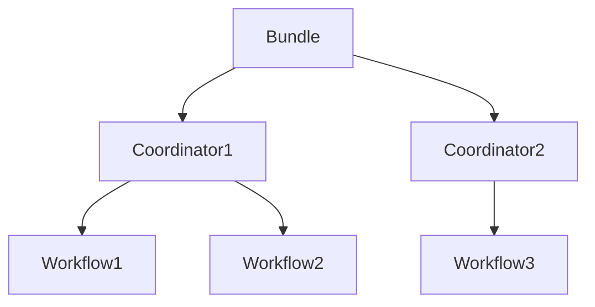

# Oozie Bundle原理与代码实例讲解

关键词：Oozie、Bundle、工作流调度、Hadoop

## 1. 背景介绍
### 1.1 问题的由来
随着大数据技术的发展，越来越多的企业开始使用Hadoop生态系统来处理海量数据。在Hadoop生态系统中，工作流调度是一个非常重要的组成部分，它可以帮助我们自动化和简化复杂的数据处理流程。而在众多的工作流调度框架中，Oozie就是一个优秀的代表。

### 1.2 研究现状
目前，已经有许多公司和组织在生产环境中使用Oozie来调度和管理Hadoop作业。Oozie支持多种类型的Hadoop作业，包括MapReduce、Pig、Hive等，可以通过XML配置文件来定义工作流和协调器，具有良好的扩展性和灵活性。

### 1.3 研究意义
深入研究Oozie Bundle的原理和使用方法，对于我们更好地使用Oozie进行工作流调度具有重要意义。通过学习Oozie Bundle，我们可以掌握如何在Oozie中定义和管理多个协调器，了解Bundle的执行原理，并学会在实际项目中应用Bundle来满足更加复杂的调度需求。

### 1.4 本文结构
本文将首先介绍Oozie Bundle的核心概念和工作原理，然后详细讲解Bundle的XML配置规范和参数含义，接着通过一个完整的代码实例来演示如何使用Oozie Bundle定义和运行多个协调器，最后总结Oozie Bundle的特点并展望其未来的发展趋势。

## 2. 核心概念与联系
在Oozie中，Bundle是用来管理多个协调器（Coordinator）的组件。协调器是Oozie的一个核心概念，它可以根据时间或数据的可用性来触发工作流（Workflow）的执行。一个Bundle里可以包含一个或多个协调器，通过Bundle我们可以同时启动、暂停、恢复或杀死多个协调器。

Bundle、Coordinator和Workflow之间的关系如下图所示：



从图中可以看出，一个Bundle中可以包含多个Coordinator，每个Coordinator中又可以包含多个Workflow。Bundle负责管理和调度Coordinator，Coordinator负责管理和调度Workflow，Workflow则是具体的数据处理逻辑。

## 3. 核心算法原理 & 具体操作步骤
### 3.1 算法原理概述
Oozie Bundle的核心算法可以分为两个部分：解析Bundle XML配置文件和调度Coordinator。

当用户提交一个Bundle作业时，Oozie会首先解析Bundle的XML配置文件，读取其中定义的各个Coordinator信息，包括Coordinator的名称、时间范围、频率、数据输入输出等参数。解析完成后，Oozie会在内存中构建一个Bundle作业的对象模型。

接下来，Oozie会根据Bundle中定义的时间范围和频率，为每个Coordinator生成一系列的运行实例（Coordinator Action），并将这些实例提交到Oozie的任务队列中等待调度。当某个Coordinator Action的时间条件满足时，Oozie就会触发该Action关联的Workflow进行执行。

### 3.2 算法步骤详解
1. 用户提交Bundle作业到Oozie
2. Oozie解析Bundle作业的XML配置文件
3. Oozie在内存中创建Bundle作业的对象模型
4. 解析Bundle中定义的各个Coordinator
5. 为每个Coordinator生成一系列的运行实例（Coordinator Action）
6. 将Coordinator Action提交到Oozie的任务队列
7. 当Coordinator Action的时间条件满足时，触发关联的Workflow执行
8. Workflow执行完成后，更新Coordinator Action的状态
9. 所有Coordinator的所有Action都执行完成后，更新Bundle作业的状态为SUCCEEDED或KILLED

### 3.3 算法优缺点
Oozie Bundle算法的优点包括：

1. 可以批量管理和调度多个Coordinator，简化了工作流的定义和维护。
2. 支持灵活的时间和数据依赖配置，可以适应各种复杂的调度需求。
3. 与Oozie的其他组件（如Workflow）能够无缝集成，共享Oozie的任务队列和资源管理功能。

Oozie Bundle算法的缺点包括：

1. XML配置文件比较复杂，学习成本较高。
2. 调度算法中的时间计算逻辑比较复杂，Debug和排查问题有一定难度。
3. Bundle作业一旦启动就不能修改，只能Kill掉重新提交。

### 3.4 算法应用领域
Oozie Bundle算法主要应用在以下几个领域：

1. 复杂的ETL工作流调度
2. 定期的数据分析和挖掘作业
3. 跨天/周/月的增量数据处理场景
4. 多个相关的数据处理流程的协同调度

## 4. 数学模型和公式 & 详细讲解 & 举例说明
### 4.1 数学模型构建
我们可以用一个三元组 $B=<C,T,F>$ 来表示一个Bundle，其中：

- $C=\{c_1,c_2,...,c_n\}$ 表示Bundle中包含的Coordinator集合
- $T=[t_s,t_e]$ 表示Bundle的总体时间范围，$t_s$ 为开始时间，$t_e$ 为结束时间
- $F=\{f_1,f_2,...,f_n\}$ 表示各个Coordinator的执行频率

对于每个Coordinator $c_i$，我们可以用另一个三元组 $c_i=<W,I,O>$ 来表示，其中：

- $W$ 表示Coordinator关联的Workflow
- $I$ 表示Workflow的输入数据集
- $O$ 表示Workflow的输出数据集

### 4.2 公式推导过程
根据Bundle的定义，我们可以推导出Bundle的执行时间范围和Coordinator的运行实例数量。

Bundle的执行时间范围为：

$$
T_{bundle}=[t_s,t_e]
$$

对于每个Coordinator $c_i$，假设其频率为 $f_i$，时间单位为 $u_i$（如MINUTE、HOUR、DAY等），则 $c_i$ 在 $T_{bundle}$ 内的运行实例数量为：

$$
N_{c_i}=\left\lfloor\frac{t_e-t_s}{f_i\cdot u_i}\right\rfloor+1
$$

其中 $\lfloor x \rfloor$ 表示对 $x$ 向下取整。

举个例子，假设一个Bundle的时间范围为 $[2023-01-01T00:00Z,2023-01-05T00:00Z]$，包含两个Coordinator：

- $c_1$ 的频率为1440 MINUTE（即1天），关联Workflow $W_1$
- $c_2$ 的频率为60 MINUTE（即1小时），关联Workflow $W_2$

则 $c_1$ 的运行实例数量为：

$$
N_{c_1}=\left\lfloor\frac{2023-01-05T00:00Z - 2023-01-01T00:00Z}{1440\cdot MINUTE}\right\rfloor+1=5
$$

$c_2$ 的运行实例数量为：

$$
N_{c_2}=\left\lfloor\frac{2023-01-05T00:00Z - 2023-01-01T00:00Z}{60\cdot MINUTE}\right\rfloor+1=97
$$

### 4.3 案例分析与讲解
下面我们通过一个具体的案例来说明Oozie Bundle的使用方法。

假设我们有一个每天定时执行的数据处理流程，包括以下几个步骤：

1. 从HDFS上读取当天的原始数据
2. 使用MapReduce对原始数据进行清洗和转换
3. 将转换后的数据导入Hive表中
4. 运行Hive SQL对数据进行聚合分析
5. 将分析结果写回HDFS

我们可以为这个数据处理流程创建一个Oozie Workflow，包含5个Action节点：

```xml
<workflow-app xmlns="uri:oozie:workflow:0.5" name="daily_processing">
    <start to="import_raw_data"/>
    <action name="import_raw_data">
        <fs>
            <mkdir path="${rawInputDir}/${yyyy}-${MM}-${dd}"/>
        </fs>
        <ok to="data_transform"/>
        <error to="kill"/>
    </action>
    <action name="data_transform">
        <map-reduce>
            <job-tracker>${jobTracker}</job-tracker>
            <name-node>${nameNode}</name-node>
            <configuration>
                <property>
                    <name>mapred.input.dir</name>
                    <value>${rawInputDir}/${yyyy}-${MM}-${dd}</value>
                </property>
                <property>
                    <name>mapred.output.dir</name>
                    <value>${transformOutputDir}/${yyyy}-${MM}-${dd}</value>
                </property>
            </configuration>
        </map-reduce>
        <ok to="hive_import"/>
        <error to="kill"/>
    </action>
    <action name="hive_import">
        <hive xmlns="uri:oozie:hive-action:0.5">
            <job-tracker>${jobTracker}</job-tracker>
            <name-node>${nameNode}</name-node>
            <configuration>
                <property>
                    <name>hive.import.export.bucket.count.enable</name>
                    <value>false</value>
                </property>
            </configuration>
            <script>import_data.hql</script>
            <param>INPUT=${transformOutputDir}/${yyyy}-${MM}-${dd}</param>
            <param>OUTPUT=${hiveTableName}</param>
        </hive>
        <ok to="hive_analysis"/>
        <error to="kill"/>
    </action>
    <action name="hive_analysis">
        <hive xmlns="uri:oozie:hive-action:0.5">
            <job-tracker>${jobTracker}</job-tracker>
            <name-node>${nameNode}</name-node>
            <script>analysis.hql</script>
            <param>INPUT=${hiveTableName}</param>
            <param>OUTPUT=${analysisOutputDir}/${yyyy}-${MM}-${dd}</param>
        </hive>
        <ok to="export_result"/>
        <error to="kill"/>
    </action>
    <action name="export_result">
        <fs>
            <mkdir path="${analysisOutputDir}/${yyyy}-${MM}-${dd}"/>
        </fs>
        <ok to="end"/>
        <error to="kill"/>
    </action>
    <kill name="kill">
        <message>Daily processing workflow failed, error message[${wf:errorMessage(wf:lastErrorNode())}]</message>
    </kill>
    <end name="end"/>
</workflow-app>
```

接下来，我们可以为这个Workflow创建一个每天定时运行的Coordinator：

```xml
<coordinator-app name="daily_processing_coordinator" frequency="${coord:days(1)}" start="${startTime}" end="${endTime}" timezone="UTC" xmlns="uri:oozie:coordinator:0.4">
    <action>
        <workflow>
            <app-path>${workflowPath}</app-path>
            <configuration>
                <property>
                    <name>jobTracker</name>
                    <value>${jobTrackerUri}</value>
                </property>
                <property>
                    <name>nameNode</name>
                    <value>${nameNodeUri}</value>
                </property>
                <property>
                    <name>rawInputDir</name>
                    <value>${rawDataDir}</value>
                </property>
                <property>
                    <name>transformOutputDir</name>
                    <value>${transformDataDir}</value>
                </property>
                <property>
                    <name>hiveTableName</name>
                    <value>${hiveTable}</value>
                </property>
                <property>
                    <name>analysisOutputDir</name>
                    <value>${analysisDataDir}</value>
                </property>
            </configuration>
        </workflow>
    </action>
</coordinator-app>
```

最后，我们可以创建一个Bundle，将多个Coordinator组合在一起运行：

```xml
<bundle-app name="daily_processing_bundle" xmlns="uri:oozie:bundle:0.2">
    <coordinator name="coordinator_app_1">
        <app-path>${coordinator1Path}</app-path>
        <configuration>
            <property>
                <name>startTime</name>
                <value>2023-01-01T00:00Z</value>
            </property>
            <property>
                <name>endTime</name>
                <value>2023-01-31T00:00Z</value>
            </property>
            <property>
                <name>jobTrackerUri</name>
                <value>http://localhost:8032</value>
            </property>
            <property>
                <name>nameNodeUri</name>
                <value>hdfs://localhost:8020</value>
            </property>
            <property>
                <name>rawDataDir</name>
                <value>/user/foo/raw/${YEAR}/${MONTH}</value>
            </property>
            <property>
                <name>transformDataDir</name>
                <value>/user/foo/transform/${YEAR}/${MONTH}</value>
            </property>
            <property>
                <name>hiveTable</name>
                <value>bar</value>
            </property>
            <property>
                <name>analysisDataDir</name>
                <value>/user/foo/analysis/${YEAR}