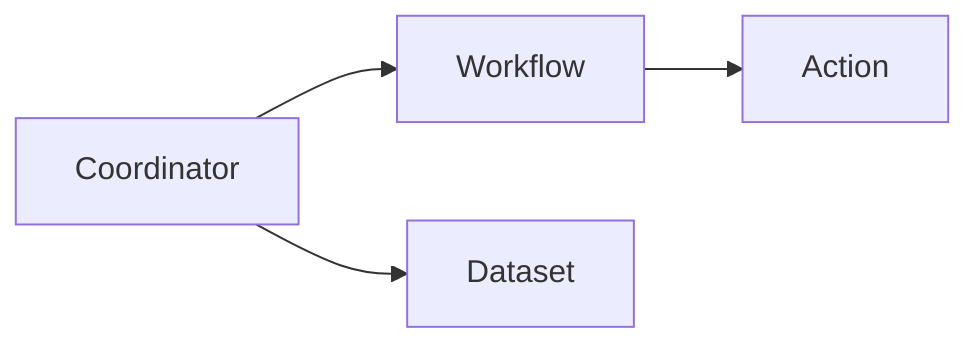

# Oozie Coordinator原理与代码实例讲解

作者：禅与计算机程序设计艺术 / Zen and the Art of Computer Programming

## 1. 背景介绍

### 1.1 问题的由来

随着大数据技术的快速发展,越来越多的企业开始构建自己的大数据平台。在大数据平台中,通常需要按照一定的时间规律周期性地执行一些任务,例如每天凌晨进行数据同步、每周生成报表等。这就需要一个调度系统来自动管理和执行这些任务。

### 1.2 研究现状

目前业界有多种任务调度系统,例如Linux crontab、Azkaban、Airflow等。而在Hadoop生态系统中,Oozie是一个功能强大且被广泛使用的工作流调度系统。Oozie不仅支持调度Hadoop MapReduce、Hive、Pig等任务,还提供了Coordinator功能,可以基于时间和数据的可用性来触发工作流。

### 1.3 研究意义

深入理解Oozie Coordinator的原理和使用方法,对于构建高效自动化的大数据平台具有重要意义。通过Oozie Coordinator,可以很方便地实现数据的周期性处理,提高任务调度的智能化水平。同时,Oozie与Hadoop生态系统的无缝集成,使得构建端到端的数据处理管道变得简单。

### 1.4 本文结构

本文将首先介绍Oozie Coordinator的核心概念,然后深入剖析其内部工作原理。接着,我们将通过一个具体的代码实例来演示如何使用Oozie Coordinator进行任务调度。最后,总结Oozie Coordinator的特点并展望其未来的发展方向。

## 2. 核心概念与联系

在详细讲解Oozie Coordinator原理之前,我们先来了解几个核心概念:

- Workflow(工作流):由一系列按照依赖关系组织起来的Action节点构成,用于定义一个完整的数据处理过程。
- Coordinator(协调器):基于时间或数据可用性来触发工作流的执行。
- Dataset(数据集):由一个URI和一些时间标识参数组成,代表一个时间分区的数据。
- SLA(Service Level Agreement,服务水平协议):定义工作流的执行时间范围,超出SLA的工作流会被标记为miss。

下图展示了Workflow、Coordinator、Dataset之间的关系:



可以看到,Coordinator定义了触发Workflow的条件,包括时间和输入的Dataset。当满足条件时,对应的Workflow就会被提交执行。Workflow中的各个Action节点会对数据进行处理,并产出结果数据。

## 3. 核心算法原理 & 具体操作步骤

### 3.1 算法原理概述

Oozie Coordinator的核心是时间事件驱动的调度引擎。Coordinator Job定义了一个频率(frequency)和一个开始时间(startTime),系统会根据这两个参数计算出未来一段时间内Workflow应该被调度的时间点。

当到达每个调度时间点时,Coordinator会创建一个Workflow Job,称为Action。多个Action之间可以存在依赖关系,后一个Action必须等前一个Action执行成功后才能开始。

### 3.2 算法步骤详解

1. 材料与方法：
Coordinator Job定义包含以下关键参数:
- startTime:调度开始时间
- endTime:调度结束时间
- frequency:调度频率
- timeUnit:调度时间单位(MINUTE、HOUR、DAY、WEEK、MONTH、YEAR)
- dataset:输入/输出数据集

2. 步骤:
(1) 解析Coordinator Job定义文件,提取出各个关键参数。
(2) 根据startTime、endTime、frequency、timeUnit计算出所有需要调度的时间点,生成Nominal Time列表。
(3) 对每个Nominal Time:
  a. 计算出输入数据集的时间范围,检查数据是否可用。
  b. 如果数据可用,创建一个Workflow Action,设置其输入参数。
  c. 将Workflow Action提交到Oozie执行引擎运行。
(4) 等待所有Workflow Action执行完成。

### 3.3 算法优缺点

优点:
- 时间驱动的调度方式简单直观,容易理解和使用。
- 可以方便地和数据可用性结合,实现数据驱动的任务调度。
- 基于时间的并发调度,可以提高任务执行效率。

缺点:
- 时间粒度受限于Coordinator定义的最小时间单位。
- 对于调度时间点之间存在复杂依赖关系的场景,Coordinator表达能力有限。

### 3.4 算法应用领域

Oozie Coordinator非常适合数据周期性处理的场景,例如:

- 每日凌晨进行数据同步、统计、汇总。
- 每周/每月生成报表。
- 定期进行数据清洗、归档、备份。

同时,Oozie Coordinator可以和Hadoop生态中的各种数据处理工具(如MapReduce、Hive、Sqoop等)无缝配合,是构建数据仓库ETL管道的利器。

## 4. 数学模型和公式 & 详细讲解 & 举例说明

### 4.1 数学模型构建

我们可以用一个数学模型来刻画Oozie Coordinator的调度过程:

令Coordinator Job的参数为:
- $startTime$:调度开始时间
- $endTime$:调度结束时间
- $frequency$:调度频率
- $timeUnit$:调度时间单位

定义时间点集合$T$为:

$$
T = \{t | startTime \leq t \leq endTime, t \equiv startTime \pmod{frequency * timeUnit} \}
$$

对任意时间点$t \in T$,如果满足数据可用条件,则创建一个Workflow Action并提交执行。

### 4.2 公式推导过程

从$startTime$开始,每经过$frequency * timeUnit$的时间就会到达一个调度时间点,直到$endTime$为止。

例如,若$startTime$为2023-01-01 00:00,$endTime$为2023-01-05 00:00,$frequency$为1,$timeUnit$为DAY,则时间点集合$T$为:

$$
T = \{2023-01-01 00:00, 2023-01-02 00:00, 2023-01-03 00:00, 2023-01-04 00:00\}
$$

### 4.3 案例分析与讲解

假设我们有一个每日凌晨进行数据同步的需求,数据源为HDFS上的文件,路径为:

```
/data/input/${YEAR}/${MONTH}/${DAY}
```

我们可以定义如下的Coordinator Job:

```xml
<coordinator-app name="DailyDataSync" frequency="1440" start="2023-01-01T00:00Z" end="2023-12-31T00:00Z" timezone="UTC" xmlns="uri:oozie:coordinator:0.4">
  <datasets>
    <dataset name="input" frequency="${coord:days(1)}" initial-instance="2023-01-01T00:00Z" timezone="UTC">
      <uri-template>/data/input/${YEAR}/${MONTH}/${DAY}</uri-template>
    </dataset>
  </datasets>
  <input-events>
    <data-in name="input" dataset="input">
      <instance>${coord:current(0)}</instance>
    </data-in>
  </input-events>
  <action>
    <workflow>
      <app-path>/user/admin/dataSyncWorkflow.xml</app-path>
      <configuration>
        <property>
          <name>inputDir</name>
          <value>${coord:dataIn('input')}</value>
        </property>
      </configuration>
    </workflow>
  </action>
</coordinator-app>
```

在这个Coordinator定义中:
- frequency="1440"表示每1440分钟(即1天)调度一次。
- start="2023-01-01T00:00Z"表示从2023年1月1日UTC 0点开始。
- end="2023-12-31T00:00Z"表示到2023年12月31日UTC 0点结束。
- dataset定义了数据集,使用uri-template参数化数据路径。
- input-events定义了触发条件:每次调度时,检查${coord:current(0)}对应的数据目录是否存在。
- action定义了具体的工作流,即dataSyncWorkflow.xml,并通过configuration传入输入数据目录参数。

### 4.4 常见问题解答

Q: Coordinator的时间参数是否支持Crontab语法?
A: 不直接支持Crontab语法,但可以通过组合frequency和timeUnit参数来实现类似的效果。例如,每周三凌晨1点调度,可以设置frequency="10080"(即7 * 24 * 60分钟),再配合startTime来控制具体的调度时间点。

Q: 如何实现多个数据集的协调?
A: 可以在datasets中定义多个dataset,然后在input-events中使用多个data-in,设置不同的dataset属性即可。Coordinator会检查所有dataset数据是否可用,只有全部可用时才会触发Workflow。

Q: 调度时间点之间是否可以有依赖关系?
A: Coordinator目前不直接支持时间点之间的依赖,但可以通过dataset的依赖关系来实现类似的效果。例如,将前一个时间点的输出dataset作为后一个时间点的输入dataset,就形成了时间点之间的依赖。

## 5. 项目实践：代码实例和详细解释说明

下面我们通过一个具体的代码实例来演示如何使用Oozie Coordinator进行任务调度。

### 5.1 开发环境搭建

首先需要搭建Oozie开发环境,主要包括:

- JDK:编译运行Oozie的基础环境。
- Hadoop:提供HDFS和YARN服务。
- Oozie:任务调度系统,可以下载安装包或者使用Hadoop发行版自带的Oozie。

### 5.2 源代码详细实现

1. 定义Workflow

我们首先定义一个简单的Workflow,模拟每日数据同步的过程:

```xml
<workflow-app xmlns="uri:oozie:workflow:0.4" name="dataSyncWorkflow">
    <start to="dataSync"/>
    <action name="dataSync">
        <shell xmlns="uri:oozie:shell-action:0.2">
            <job-tracker>${jobTracker}</job-tracker>
            <name-node>${nameNode}</name-node>
            <configuration>
                <property>
                    <name>mapred.job.queue.name</name>
                    <value>${queueName}</value>
                </property>
            </configuration>
            <exec>dataSyncJob.sh</exec>
            <argument>${inputDir}</argument>
            <file>dataSyncJob.sh</file>
        </shell>
        <ok to="end"/>
        <error to="kill"/>
    </action>
    <kill name="kill">
        <message>Data Sync failed: [${wf:errorMessage(wf:lastErrorNode())}]</message>
    </kill>
    <end name="end"/>
</workflow-app>
```

这个Workflow包含一个Shell Action,执行dataSyncJob.sh脚本进行数据同步,输入参数为${inputDir}。

2. 定义Coordinator

然后我们定义Coordinator:

```xml
<coordinator-app name="DailyDataSync" frequency="1440" start="2023-01-01T00:00Z" end="2023-12-31T00:00Z" timezone="UTC" xmlns="uri:oozie:coordinator:0.4">
  <datasets>
    <dataset name="input" frequency="${coord:days(1)}" initial-instance="2023-01-01T00:00Z" timezone="UTC">
      <uri-template>/data/input/${YEAR}/${MONTH}/${DAY}</uri-template>
    </dataset>
  </datasets>
  <input-events>
    <data-in name="input" dataset="input">
      <instance>${coord:current(0)}</instance>
    </data-in>
  </input-events>
  <action>
    <workflow>
      <app-path>hdfs://localhost:9000/user/admin/dataSyncWorkflow.xml</app-path>
      <configuration>
        <property>
          <name>jobTracker</name>
          <value>localhost:8032</value>
        </property>
        <property>
          <name>nameNode</name>
          <value>hdfs://localhost:9000</value>
        </property>
        <property>
          <name>queueName</name>
          <value>default</value>
        </property>
        <property>
          <name>inputDir</name>
          <value>${coord:dataIn('input')}</value>
        </property>
      </configuration>
    </workflow>
  </action>
</coordinator-app>
```

这里定义了每天调度一次,检查/data/input/${YEAR}/${MONTH}/${DAY}数据目录,如果存在则触发执行dataSyncWorkflow.xml。

### 5.3 代码解读与分析

Coordinator定义分为几个关键部分:

- start和end参数定义了调度的起止时间。 
- frequency参数定义了调度频率。
- datasets定义了数据集,包括数据目录模板和时间分区。
- input-events定义了输入事件,即触发执行的条件。
- action定义了具体执行的Workflow,以及传入的参数。

在action中,