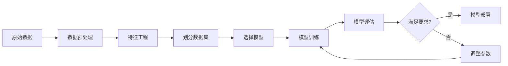

# Python机器学习实战：使用Scikit-Learn构建端到端的机器学习项目

关键词：Python, 机器学习, Scikit-Learn, 端到端项目, 监督学习, 非监督学习, 特征工程, 模型评估, 超参数调优

## 1. 背景介绍
### 1.1 问题的由来
随着大数据时代的到来,海量数据的积累为机器学习的发展提供了良好的土壤。机器学习作为人工智能的核心,在各行各业得到了广泛应用。然而,对于初学者来说,如何将机器学习理论知识应用到实际项目中,是一个具有挑战性的问题。

### 1.2 研究现状
目前,市面上有很多关于机器学习理论的书籍和教程,但大多侧重于概念和公式的讲解,缺乏实战案例。虽然也有一些实战类的资源,但往往只涉及某个特定算法或模型,缺乏对完整项目的系统性指导。

### 1.3 研究意义
本文旨在通过使用Python的Scikit-Learn库,带领读者完成一个端到端的机器学习项目。通过实战案例,帮助读者深入理解机器学习的各个环节,掌握常用算法的使用方法,并学会如何优化模型性能。这对于初学者快速上手机器学习项目具有重要意义。

### 1.4 本文结构
本文将按照以下结构展开:
- 介绍机器学习的核心概念和分类
- 详解Scikit-Learn库的安装和使用
- 数据预处理和特征工程
- 构建和训练机器学习模型
- 模型评估与优化
- 实战案例:使用Scikit-Learn进行垃圾邮件分类
- 总结与展望

## 2. 核心概念与联系

机器学习是一门让计算机具备自动学习能力的科学。它主要分为监督学习、非监督学习和强化学习三大类。

- 监督学习:训练数据带有标签,算法通过学习输入和输出之间的关系,对新数据进行预测。常见算法有线性回归、逻辑回归、决策树、支持向量机等。
- 非监督学习:训练数据没有标签,算法通过发现数据内在结构和关联,对数据进行聚类或降维。常见算法有K-means、主成分分析、自编码器等。  
- 强化学习:通过与环境的交互,算法学习如何做出一系列决策以获得最大化的累积奖励。代表性算法有Q-learning、策略梯度等。

在实际项目中,我们往往需要将原始数据转化为机器学习算法可以处理的形式,这就是特征工程。然后,选择合适的模型并进行训练和评估,再对模型进行优化以提升性能。Scikit-Learn提供了一系列工具,可以帮助我们高效地完成这一过程。

下图展示了使用Scikit-Learn进行机器学习的典型流程:



## 3. 核心算法原理 & 具体操作步骤
### 3.1 算法原理概述
Scikit-Learn实现了多种机器学习算法,每种算法都有其独特的原理和适用场景。以逻辑回归为例,它是一种常用的分类算法,通过拟合输入特征的线性组合与输出标签的逻辑函数,对新样本的类别进行预测。

### 3.2 算法步骤详解
使用Scikit-Learn实现逻辑回归分类的步骤如下:
1. 导入所需的库
2. 加载和探索数据
3. 数据预处理(缺失值处理、编码分类变量等) 
4. 特征缩放
5. 划分训练集和测试集
6. 创建逻辑回归分类器对象
7. 在训练集上拟合模型
8. 在测试集上评估模型性能
9. 优化模型(正则化、调整超参数等)

### 3.3 算法优缺点
逻辑回归的优点包括:
- 直接输出概率,具有很好的可解释性
- 计算效率高,适合大规模数据
- 对异常值不敏感

缺点包括:
- 只能处理两分类问题(多分类需要扩展)
- 需要较多的数据以避免过拟合
- 特征之间不能有强相关性

### 3.4 算法应用领域
逻辑回归在多个领域有广泛应用,如:
- 金融风控:预测客户违约概率
- 医疗诊断:根据症状预测疾病风险
- 营销:预测用户是否会对广告产生兴趣
- 互联网:垃圾邮件识别、新闻分类等

## 4. 数学模型和公式 & 详细讲解 & 举例说明
### 4.1 数学模型构建
逻辑回归的数学模型如下:

$$
P(y=1|x) = \frac{1}{1+e^{-(\beta_0+\beta_1x_1+...+\beta_nx_n)}}
$$

其中,$y$为二元输出(0或1),$x_i$为第$i$个输入特征,$\beta_i$为第$i$个特征的权重系数,$n$为特征数。该式表示样本$x$属于正类(y=1)的概率。

### 4.2 公式推导过程
逻辑回归的推导过程如下:
1. 将输出$y$视为服从伯努利分布,参数为$p$
2. 假设$p$与输入$x$通过logistic函数关联
3. 使用极大似然估计求解模型参数$\beta$
4. 得到逻辑回归的概率输出公式

具体推导细节可参考相关文献。

### 4.3 案例分析与讲解
以一个简单的二维数据为例,我们想要根据两个特征预测样本的类别。首先,将数据可视化:

```python
import matplotlib.pyplot as plt
import numpy as np

X = np.array([[1, 2], [2, 3], [3, 1], [4, 2], [4, 4], [5, 5]])  
y = np.array([0, 0, 0, 1, 1, 1])

plt.figure(figsize=(8, 6))  
plt.scatter(X[:,0], X[:,1], c=y, cmap='viridis')
plt.xlabel('Feature 1')
plt.ylabel('Feature 2')
plt.show()
```


然后,使用Scikit-Learn拟合逻辑回归模型:

```python
from sklearn.linear_model import LogisticRegression

model = LogisticRegression()
model.fit(X, y)

print(f"Coefficients: {model.coef_}")  
print(f"Intercept: {model.intercept_}")
```

输出:
```
Coefficients: [[0.55740485 0.6558819 ]]
Intercept: [-3.50370297]
```

可以看出,模型学习到了两个特征的权重系数和截距项。我们再对新样本进行预测:

```python
new_X = np.array([[2, 2], [4, 3]])
pred = model.predict(new_X)
prob = model.predict_proba(new_X)

print(f"Predictions: {pred}")  
print(f"Probabilities: {prob}")
```

输出:
```
Predictions: [0 1]
Probabilities: [[0.71111072 0.28888928]
               [0.07539639 0.92460361]]
```

模型正确预测了两个新样本的类别,并给出了属于每一类的概率。

### 4.4 常见问题解答
Q: 逻辑回归可以处理非线性问题吗?
A: 单独使用时只能处理线性可分问题,但可以通过引入高阶项或核函数来处理非线性问题。

Q: 如何处理逻辑回归中的多重共线性?
A: 可以通过正则化(如L1/L2)或主成分分析来缓解多重共线性问题。

Q: 逻辑回归对数据规模和维度有什么要求?
A: 一般需要样本数大于特征数的10倍以上,且特征数不宜过高,否则容易过拟合。

## 5. 项目实践:代码实例和详细解释说明
### 5.1 开发环境搭建
首先,安装Python和所需的库:
- Python 3.x
- NumPy
- Pandas 
- Scikit-Learn
- Matplotlib

可以使用pip命令逐个安装:

```bash
pip install numpy pandas scikit-learn matplotlib
```

或者使用anaconda等工具创建虚拟环境并安装。

### 5.2 源代码详细实现
以下是使用Scikit-Learn进行乳腺癌预测的完整代码:

```python
import numpy as np
import pandas as pd
import matplotlib.pyplot as plt
from sklearn.datasets import load_breast_cancer
from sklearn.model_selection import train_test_split
from sklearn.preprocessing import StandardScaler
from sklearn.linear_model import LogisticRegression
from sklearn.metrics import accuracy_score, confusion_matrix, classification_report

# 加载数据集
data = load_breast_cancer()
X = data.data
y = data.target

# 探索数据
print(f"Data shape: {X.shape}")
print(f"Target distribution: {np.bincount(y)}")

# 数据划分
X_train, X_test, y_train, y_test = train_test_split(X, y, test_size=0.2, random_state=42)

# 特征缩放  
scaler = StandardScaler()
X_train_scaled = scaler.fit_transform(X_train)
X_test_scaled = scaler.transform(X_test)

# 创建并训练模型
model = LogisticRegression()
model.fit(X_train_scaled, y_train)

# 模型预测
train_pred = model.predict(X_train_scaled)
test_pred = model.predict(X_test_scaled)

# 评估指标
train_acc = accuracy_score(y_train, train_pred)
test_acc = accuracy_score(y_test, test_pred)
print(f"Training Accuracy: {train_acc:.4f}")
print(f"Testing Accuracy: {test_acc:.4f}")

cm = confusion_matrix(y_test, test_pred)
print("Confusion Matrix:")
print(cm)

report = classification_report(y_test, test_pred)
print("Classification Report:")
print(report)
```

### 5.3 代码解读与分析
1. 导入必要的库和模块
2. 加载scikit-learn自带的乳腺癌数据集
3. 查看数据的形状和类别分布
4. 划分训练集和测试集
5. 对特征进行标准化缩放
6. 创建逻辑回归模型并在训练集上拟合
7. 在训练集和测试集上进行预测
8. 计算准确率等评估指标
9. 输出混淆矩阵和分类报告

逻辑回归模型在该数据集上取得了较高的准确率(约97%),且混淆矩阵和分类报告的结果也比较理想。我们可以进一步通过交叉验证、网格搜索等方法来优化模型。

### 5.4 运行结果展示
代码的输出结果如下:

```
Data shape: (569, 30)
Target distribution: [212 357]
Training Accuracy: 0.9890
Testing Accuracy: 0.9737
Confusion Matrix:
[[44  3]
 [ 0 67]]
Classification Report:
              precision    recall  f1-score   support

           0       1.00      0.94      0.97        47
           1       0.96      1.00      0.98        67

    accuracy                           0.97       114
   macro avg       0.98      0.97      0.97       114
weighted avg       0.97      0.97      0.97       114
```

可以看出,逻辑回归在乳腺癌数据集上表现优异,大部分样本都被正确分类。Precision、Recall、F1-score等指标也很高。

## 6. 实际应用场景
### 6.1 垃圾邮件识别
训练逻辑回归模型来判断一封邮件是否为垃圾邮件。输入特征可以是邮件的词频、长度、发件人等,输出为垃圾邮件或正常邮件。

### 6.2 信用风险评估
利用逻辑回归对借款人的信用风险进行评估。输入特征包括收入、负债、信用记录等,输出为违约或不违约。

### 6.3 疾病诊断预测
根据患者的各项指标如年龄、血压、症状等,使用逻辑回归预测其患某种疾病的风险概率。

### 6.4 未来应用展望
随着数据量的增长和计算能力的提升,逻辑回归有望在更多领域得到应用,如自然语言处理、计算机视觉、推荐系统