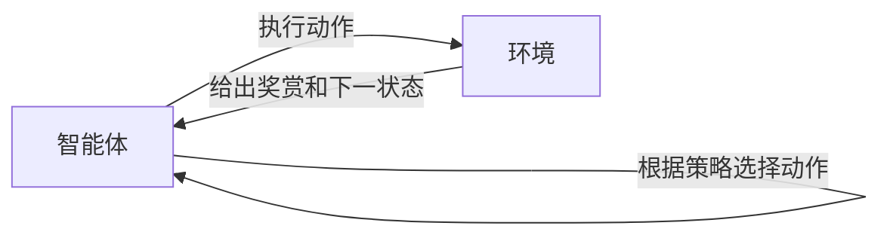
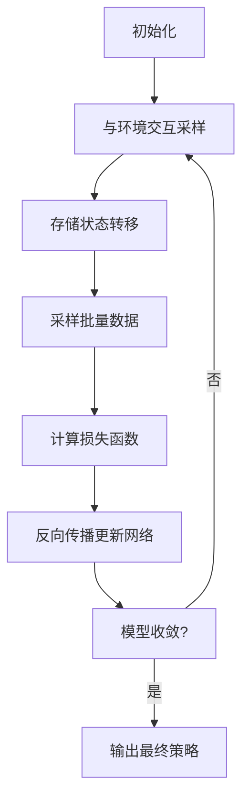

以下是根据您提供的要求和大纲撰写的文章正文部分：

# Python深度学习实践：使用强化学习玩转游戏

## 1. 背景介绍

### 1.1 问题的由来

游戏一直是人工智能领域的一个热门话题和应用场景。传统的游戏AI通常使用硬编码规则或有限的搜索算法,但这些方法在面对复杂游戏时表现不佳。近年来,随着深度学习和强化学习技术的发展,通过让AI自主学习游戏策略,成为解决复杂游戏AI的一种有前景的方法。

### 1.2 研究现状  

目前,已有多个研究团队尝试使用深度强化学习技术攻克经典游戏,取得了令人瞩目的成就。例如DeepMind的AlphaGo在围棋领域战胜了人类顶尖高手,AlphaZero则在国际象棋、围棋和日本将棋等多个领域展现出超人的实力。此外,OpenAI等机构也在Dota2等复杂视频游戏中取得突破。

### 1.3 研究意义

游戏作为一个理想的模拟环境,不仅可以验证强化学习算法的有效性,更重要的是游戏场景中蕴含的决策、规划、多智能体交互等问题,与真实世界的复杂场景有着内在的相似性。因此,游戏AI的研究可以为解决现实世界的复杂问题提供借鉴和方法论基础。

### 1.4 本文结构

本文将首先介绍强化学习的核心概念,然后深入探讨其核心算法原理、数学模型和关键技术,并通过实际代码实例讲解如何使用Python将强化学习应用到游戏AI中。最后,我们将分析强化学习在游戏及其他领域的应用现状,并展望其未来发展趋势和面临的挑战。

## 2. 核心概念与联系

强化学习(Reinforcement Learning)是机器学习的一个重要分支,它致力于让智能体(Agent)通过与环境(Environment)的交互作用来学习获取最大化累积奖赏的策略。

强化学习问题通常建模为**马尔可夫决策过程(Markov Decision Process, MDP)** ,其中包含以下核心要素:

- **状态(State)**: 环境的当前状态
- **动作(Action)**: 智能体可执行的动作
- **奖赏函数(Reward Function)**: 根据状态和动作给出对应的奖赏值
- **状态转移概率(State Transition Probability)**: 在执行某个动作后,从当前状态转移到下一状态的概率
- **策略(Policy)**: 智能体根据当前状态选择动作的策略

强化学习算法的目标是学习一个**最优策略**,使智能体在与环境交互时能获得最大的预期累积奖赏。



强化学习算法可分为**基于价值(Value-based)**和**基于策略(Policy-based)**两大类:

- **基于价值算法**:先估计每个状态或状态-动作对的价值函数,再根据价值函数导出最优策略。典型算法有Q-Learning、Sarsa等。
- **基于策略算法**:直接对策略函数进行参数化,通过策略梯度的方式优化参数以提高期望奖赏。典型算法有REINFORCE、Actor-Critic等。

近年来,结合**深度神经网络**的**深度强化学习(Deep Reinforcement Learning)**方法逐渐成为研究热点,能够有效应对高维状态空间和连续动作空间的挑战,展现出强大的泛化能力。其中,**深度Q网络(Deep Q-Network, DQN)** 和 **策略梯度(Policy Gradient)** 是两种最具代表性的深度强化学习算法框架。

## 3. 核心算法原理 & 具体操作步骤  

### 3.1 算法原理概述

**深度Q网络(DQN)** 是结合深度神经网络和Q-Learning的一种基于价值的深度强化学习算法,能够直接从原始像素输入中学习控制策略。其核心思想是使用一个深度卷积神经网络来拟合Q函数,即估计每个状态-动作对的期望累积奖赏值。

**策略梯度(Policy Gradient)** 则属于基于策略的深度强化学习算法范畴。它将策略函数用一个深度神经网络来表示和参数化,然后通过计算策略梯度,对神经网络的参数进行有针对性的更新,从而不断改进策略,使期望累积奖赏最大化。

两种算法各有优缺点,DQN相对简单,但只适用于离散动作空间;而策略梯度则能处理连续动作空间,但训练过程相对复杂。实践中常采用**Actor-Critic**架构,将两者有机结合,发挥各自的优势。

### 3.2 算法步骤详解

以DQN算法为例,其核心步骤如下:

1. **初始化回放记忆库(Replay Memory)和深度Q网络**
2. **执行epsilon-greedy策略与环境交互,存储状态转移对(s, a, r, s')到回放记忆库**
3. **从回放记忆库中随机采样出一个批量的状态转移对(s, a, r, s')**
4. **计算当前Q网络对(s, a)的Q值估计Q(s, a)和目标Q值估计 r + γ max_a' Q'(s', a')**
5. **计算损失函数Loss = (Q(s, a) - (r + γ max_a' Q'(s', a')))^2**  
6. **通过反向传播算法对Q网络的参数进行梯度更新,使损失函数最小化**
7. **重复步骤2-6,直到模型收敛**

其中,使用**经验回放(Experience Replay)** 和**目标网络(Target Network)** 这两种技巧可以大幅提高DQN的训练稳定性。



### 3.3 算法优缺点

**优点**:

- 直接从原始高维输入(如像素)中学习,无需手工设计特征
- 具有很强的泛化能力,能够应对复杂的状态和动作空间
- 通过经验回放和目标网络等技巧,可以有效提高训练稳定性

**缺点**:

- 需要大量的环境交互数据和计算资源进行训练
- 在解决连续控制问题时,DQN算法存在一定局限性
- 训练过程中可能出现不稳定的情况,如Q值过估计等

### 3.4 算法应用领域

深度强化学习算法展现出了强大的泛化能力和决策能力,可以应用于诸多领域:

- **游戏AI**: 通过与游戏环境交互来学习游戏策略,已在多个经典游戏中取得突破
- **机器人控制**: 可用于机器人在复杂环境中的运动规划和控制
- **自动驾驶**: 在仿真环境中训练无人驾驶系统,以获取高级驾驶策略
- **智能系统**: 应用于对话系统、自动化决策系统等各类智能系统
- **金融投资**: 用于量化投资交易策略的优化
- **计算机系统**: 例如对数据中心资源管理、编译器优化等进行自动化决策

## 4. 数学模型和公式 & 详细讲解 & 举例说明

### 4.1 数学模型构建

强化学习问题通常建模为**马尔可夫决策过程(Markov Decision Process, MDP)**,可以用一个五元组 $(S, A, P, R, \gamma)$ 来表示:

- $S$是所有可能状态的集合
- $A$是所有可能动作的集合  
- $P(s'|s, a)$是状态转移概率,表示在状态$s$执行动作$a$后,转移到状态$s'$的概率
- $R(s, a)$是奖赏函数,给出在状态$s$执行动作$a$后获得的即时奖赏值
- $\gamma \in [0, 1)$是折现因子,用于权衡未来奖赏的重要性

在MDP中,智能体的目标是学习一个最优策略$\pi^*(a|s)$,使其能获得最大化的预期累积奖赏:

$$J(\pi) = \mathbb{E}_\pi \left[ \sum_{t=0}^\infty \gamma^t R(s_t, a_t) \right]$$

其中,$\pi(a|s)$表示在状态$s$下执行动作$a$的概率,$R(s_t, a_t)$是在时刻$t$执行动作$a_t$获得的即时奖赏。

### 4.2 公式推导过程

**Q-Learning算法**是基于价值函数的强化学习算法,其核心思想是估计**动作价值函数(Action-Value Function)**:

$$Q^\pi(s, a) = \mathbb{E}_\pi \left[ \sum_{k=0}^\infty \gamma^k r_{t+k+1} | s_t=s, a_t=a \right]$$

$Q^\pi(s, a)$表示在策略$\pi$下,从状态$s$出发,执行动作$a$,之后能获得的预期累积奖赏。

Q-Learning通过不断更新迭代的方式来估计最优的Q函数$Q^*(s, a)$:

$$Q(s_t, a_t) \leftarrow Q(s_t, a_t) + \alpha \left[ r_t + \gamma \max_{a'} Q(s_{t+1}, a') - Q(s_t, a_t) \right]$$

其中,$\alpha$是学习率,$\gamma$是折现因子。

当Q函数收敛时,根据最优值函数的Bellman方程可得:

$$Q^*(s, a) = \mathbb{E}_{s'} \left[ r + \gamma \max_{a'} Q^*(s', a') | s, a \right]$$

因此,通过估计最优Q函数,就可以得到最优策略$\pi^*(s) = \arg\max_a Q^*(s, a)$。

### 4.3 案例分析与讲解

以经典的"悬崖行走(CliffWalking)"游戏为例,来解释Q-Learning算法的工作原理。

游戏场景是一个4x12的网格世界,其中有一条悬崖,如果智能体落入悬崖将获得-100的惩罚奖赏,到达目标位置将获得+100的奖赏,其他情况下每一步获得-1的奖赏。智能体可执行上下左右四个动作,目标是学习一条最优路径到达目标位置。

```python
import numpy as np

# 初始化Q表格
Q = np.zeros((4, 12, 4))  

# 设置参数
alpha = 0.5  # 学习率
gamma = 1.0  # 折现因子
epsilon = 0.1  # 探索率

# 训练Q-Learning算法
for episode in range(500):
    state = ... # 重置初始状态
    while not is_terminal(state):
        # epsilon-greedy策略选择动作
        if np.random.uniform() < epsilon:
            action = ... # 随机选择动作
        else:
            action = np.argmax(Q[state])  # 选择Q值最大的动作
        
        # 执行动作,获得下一状态和奖赏        
        next_state, reward = step(state, action)
        
        # 更新Q值
        Q[state][action] += alpha * (reward + gamma * np.max(Q[next_state]) - Q[state][action])
        
        state = next_state
        
    # 逐步降低探索率
    epsilon *= 0.99

# 根据最终Q表格得到最优策略
policy = np.argmax(Q, axis=2)
```

通过上述训练过程,Q表格将逐步收敛,最终可以得到一个近似最优的策略,指导智能体如何从起点安全到达目标位置。

### 4.4 常见问题解答

**Q: Q-Learning算法如何处理连续状态和动作空间?**

A: 对于连续的状态和动作空间,我们可以使用函数逼近的方式,例如利用深度神经网络来拟合Q函数,这就是深度Q网络(DQN)算法的核心思想。

**Q: Q-Learning算法如何避免样本相关性问题?**

A: 在训练过程中,由于