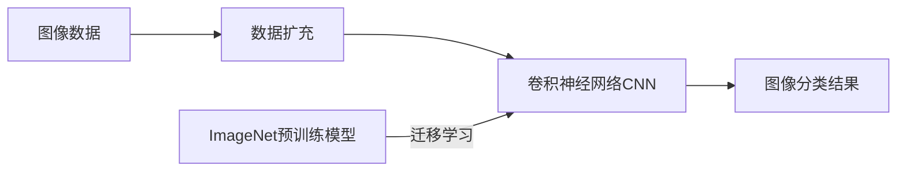

# Python深度学习实践：如何构建你的图像分类器

关键词：深度学习, 图像分类, Python, 卷积神经网络, TensorFlow, Keras

## 1. 背景介绍
### 1.1  问题的由来
在当今信息爆炸的时代,图像数据正以前所未有的速度增长。从社交媒体上用户分享的照片,到医疗领域的影像数据,再到无人驾驶汽车获取的海量视觉信息,图像无处不在。然而,如何从海量的图像数据中获取有价值的信息,是一个巨大的挑战。图像分类技术应运而生,其目标就是通过分析图像的视觉内容,自动将图像划分到预定义的类别中。

### 1.2  研究现状
近年来,深度学习技术的崛起为图像分类任务带来了革命性的变化。以卷积神经网络(Convolutional Neural Network, CNN)为代表的深度学习模型,在图像分类领域取得了惊人的成果,大大超越了传统的机器学习方法。从2012年AlexNet在ImageNet大规模视觉识别挑战赛(ILSVRC)上的历史性胜利,到后来层出不穷的CNN网络结构,如VGGNet、GoogLeNet、ResNet等,深度学习模型不断刷新着图像分类的性能记录。

### 1.3  研究意义
图像分类技术在许多领域都有着广泛的应用前景。在医疗领域,图像分类可以帮助医生进行疾病诊断,提高诊断的效率和准确性。在安防领域,图像分类可以用于人脸识别、行为分析等任务。在无人驾驶领域,图像分类是实现场景理解和目标检测的关键技术。此外,图像分类还可以应用于工业质检、遥感图像分析、内容审核等诸多方面。因此,研究图像分类技术具有重要的理论意义和实践价值。

### 1.4  本文结构
本文将全面介绍如何使用Python和深度学习框架TensorFlow/Keras,一步步构建自己的图像分类器。内容涵盖了图像分类的核心概念、经典的CNN网络结构、数据预处理和扩充技术、迁移学习方法、模型训练和评估等方方面面。通过本文的学习,读者将掌握图像分类的理论基础和实践技能,并能够运用这些知识解决实际问题。

## 2. 核心概念与联系
在深入探讨如何构建图像分类器之前,我们首先需要了解一些核心概念:

- 图像分类:图像分类是指将图像数据划分到预定义的类别(category)或标签(label)中的任务。给定一张输入图像,图像分类模型的目标是预测该图像属于哪个类别。常见的图像分类任务包括手写数字识别、物体识别、场景分类等。

- 卷积神经网络(CNN):CNN是一种专门用于处理网格拓扑结构数据(如图像)的神经网络。它的基本组件包括卷积层(convolutional layer)、池化层(pooling layer)和全连接层(fully-connected layer)。卷积层通过卷积操作提取图像的局部特征,池化层对特征图进行下采样,减小数据维度并提供平移不变性,全连接层对卷积和池化层提取的特征进行分类预测。CNN能够自动学习图像的层次化特征表示,是图像分类任务的首选模型。

- 数据扩充(Data Augmentation):数据扩充是一种常用的正则化技术,通过对训练图像进行随机转换(如平移、旋转、缩放、翻转等),从而生成更多的训练样本。数据扩充能够提高模型的泛化能力,减轻过拟合问题。

- 迁移学习(Transfer Learning):迁移学习是指利用在某个源任务上预训练的模型来初始化目标任务模型的方法。对于图像分类问题,通常采用在大规模数据集(如ImageNet)上预训练的CNN模型作为基础模型,然后在目标数据集上进行微调(fine-tuning)。迁移学习能够显著加速模型的训练过程,提高模型的性能。

下面是这些核心概念之间的联系:

## 3. 核心算法原理 & 具体操作步骤
### 3.1  算法原理概述
图像分类的核心算法是卷积神经网络(CNN)。CNN通过卷积、池化、非线性激活等一系列操作,提取图像的层次化特征表示,并用于最终的分类任务。一个典型的CNN网络包括以下几个关键组件:

- 卷积层(Convolutional Layer):卷积层通过卷积操作提取图像的局部特征。卷积操作使用一组可学习的卷积核(filter)在图像上滑动,计算卷积核与图像局部区域的内积,得到特征图(feature map)。卷积层能够自动学习图像的低层次特征,如边缘、纹理等。

- 池化层(Pooling Layer):池化层对卷积层输出的特征图进行下采样,减小数据维度。常用的池化操作包括最大池化(max pooling)和平均池化(average pooling)。池化层能够提供平移不变性,使得模型对物体的位置变化更加鲁棒。

- 激活函数(Activation Function):激活函数在卷积层和全连接层后面使用,为网络引入非线性变换。常用的激活函数包括ReLU、sigmoid、tanh等。

- 全连接层(Fully-Connected Layer):全连接层对卷积层和池化层提取的特征进行分类预测。它将输入特征与权重矩阵相乘,再加上偏置,最后通过softmax函数输出各个类别的概率。

- Softmax层:Softmax层将全连接层的输出转化为一个概率分布,表示输入图像属于各个类别的概率。

### 3.2  算法步骤详解
构建图像分类器的具体步骤如下:

1. 数据准备:
   - 收集和标注图像数据集,将图像划分为训练集、验证集和测试集。
   - 对图像进行预处理,如缩放到统一尺寸、归一化像素值到[0,1]范围等。
   - 使用数据扩充技术生成更多的训练样本,如随机旋转、平移、翻转等。

2. 选择CNN网络结构:
   - 根据任务的复杂度和数据集的大小,选择合适的CNN网络结构,如经典的LeNet、AlexNet、VGGNet、GoogLeNet、ResNet等。
   - 也可以设计自己的CNN网络结构,根据具体任务进行调整和优化。

3. 模型训练:
   - 将预处理后的图像数据输入到CNN网络中,前向传播计算预测输出。
   - 使用交叉熵损失函数比较预测输出与真实标签,计算损失值。
   - 通过反向传播算法计算梯度,更新网络权重参数。
   - 迭代进行多个epoch,直到模型收敛或达到预设的epoch数。

4. 模型评估:
   - 在验证集上评估模型的性能,计算准确率、精确率、召回率等指标。
   - 使用混淆矩阵分析模型在各个类别上的表现。
   - 对模型进行错误分析,查看分类错误的样本,分析原因。

5. 模型优化:
   - 根据评估结果,对模型进行优化和改进。
   - 可以尝试不同的超参数组合,如学习率、批量大小、正则化系数等。
   - 也可以尝试其他的CNN网络结构,或者在现有结构的基础上进行修改。

6. 模型部署:
   - 将训练好的模型保存为文件,如HDF5格式。
   - 将模型集成到实际应用系统中,接收新的图像输入,输出分类结果。
   - 对部署后的模型进行监控和维护,根据实际反馈不断迭代优化。

### 3.3  算法优缺点
CNN在图像分类任务上表现出色,主要有以下优点:

- 自动提取特征:CNN能够自动学习图像的层次化特征表示,从低层次的边缘、纹理,到高层次的物体部件和场景,无需人工设计特征。

- 平移不变性:卷积操作和池化操作提供了平移不变性,使得模型对物体的位置变化更加鲁棒。

- 参数共享:卷积核在图像上滑动,对不同位置共享参数,大大减少了模型的参数量,提高了训练效率。

- 端到端学习:CNN直接将原始图像作为输入,经过一系列卷积、池化、全连接等操作,直接输出分类结果,实现了端到端的学习过程。

但CNN也存在一些局限性:

- 需要大量标注数据:CNN的训练需要大量的标注图像数据,尤其是在数据集较小的情况下,容易出现过拟合问题。

- 对物体的旋转和尺度变化敏感:标准的CNN对物体的旋转和尺度变化比较敏感,需要进行数据扩充或设计特殊的网络结构来提高鲁棒性。

- 可解释性差:CNN学习到的特征表示是高度抽象的,缺乏可解释性,难以理解模型的决策过程。

### 3.4  算法应用领域
图像分类算法,尤其是CNN,在许多领域都有广泛的应用,包括:

- 医疗影像分析:如肿瘤识别、眼底图像分析、皮肤病诊断等。
- 人脸识别:如身份验证、情绪识别、性别和年龄估计等。
- 遥感图像分析:如土地利用分类、地物识别、灾害监测等。
- 工业质检:如瑕疵检测、产品分类等。
- 自动驾驶:如交通标志识别、行人检测、车道线检测等。
- 内容审核:如色情图像识别、暴恐图像识别等。

## 4. 数学模型和公式 & 详细讲解 & 举例说明
### 4.1  数学模型构建
图像分类可以看作是一个多分类问题,给定一个输入图像$x$,预测其属于$K$个类别中的哪一个。我们可以用条件概率$P(y|x)$来表示图像$x$属于类别$y$的概率。图像分类的目标是学习一个分类函数$f:X \rightarrow Y$,将输入图像空间$X$映射到类别标签空间$Y$。

CNN可以看作是一个复合函数,将输入图像$x$通过一系列卷积、池化、激活、全连接等操作,最终得到一个$K$维的输出向量$\hat{y}$,表示图像属于各个类别的预测概率。我们可以将CNN表示为:

$$\hat{y} = f(x; \theta) = f_L(...f_2(f_1(x; \theta_1); \theta_2)...; \theta_L)$$

其中,$f_l$表示第$l$层的操作,$\theta_l$表示第$l$层的参数,$L$表示网络的层数。

### 4.2  公式推导过程
以最简单的二层CNN为例,假设输入图像为$x \in R^{H \times W \times C}$,第一层卷积层有$K_1$个卷积核,卷积核大小为$F_1 \times F_1$,第二层全连接层有$K_2$个神经元,输出层有$K$个神经元,对应$K$个类别。我们可以将前向传播过程表示为:

1. 第一层卷积层:
$$z_1 = x * W_1 + b_1$$
$$a_1 = ReLU(z_1)$$
其中,$*$表示卷积操作,$W_1 \in R^{F_1 \times F_1 \times C \times K_1}$为卷积核权重,$b_1 \in R^{K_1}$为偏置,$ReLU$为激活函数。

2. 第二层全连接层:
$$z_2 = W_2a_1 + b_2$$
$$a_2 = ReLU(z_2)$$
其中,$W_2 \in R^{K_1 \times K_2}$为全连接层权重,$b_2 \in R^{K_2}$为偏置。

3. 输出层:
$$\hat{y} = softmax(W_3a_2 + b_