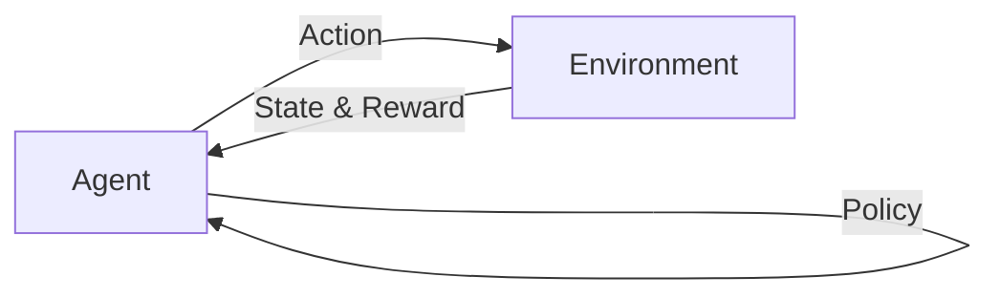

# Reinforcement Learning 原理与代码实战案例讲解

## 1. 背景介绍
### 1.1 问题的由来
在人工智能领域,强化学习(Reinforcement Learning,简称RL)是一个极具挑战性和吸引力的研究方向。它试图让智能体(Agent)通过与环境的交互,从错误中学习,不断调整和优化策略,最终学会完成特定的任务。这种学习范式源于心理学中的"强化"概念,即通过奖励来增强某种行为。强化学习为我们开启了通往通用人工智能(AGI)的大门,它为机器赋予了自主学习的能力。

### 1.2 研究现状
近年来,强化学习取得了令人瞩目的成就。DeepMind公司开发的AlphaGo系统,成功击败了世界顶尖围棋高手,这标志着强化学习开始在复杂领域崭露头角。此后,强化学习在机器人控制、自动驾驶、游戏AI等领域都取得了突破性进展。目前,主流的强化学习算法包括Q-learning、Sarsa、DQN、Policy Gradient、Actor-Critic等。研究者们正致力于提高算法的采样效率、泛化能力和稳定性。

### 1.3 研究意义 
强化学习具有广阔的应用前景。一方面,它为我们研究人类智能提供了新的视角,帮助我们理解大脑奖赏机制和决策过程。另一方面,强化学习可以让机器具备自主学习能力,这将极大拓展人工智能的应用范围。例如,在自动驾驶领域,强化学习可以让车辆通过自我探索学会驾驶策略。在工业控制领域,强化学习可以让机器人自主学习操作技能。总之,强化学习有望引领人工智能迈向更高的台阶。

### 1.4 本文结构
本文将全面讲解强化学习的原理和代码实战。第2部分介绍强化学习的核心概念。第3部分阐述主要算法原理和步骤。第4部分建立数学模型并推导公式。第5部分通过代码实例讲解如何实现算法。第6部分展望强化学习的应用场景。第7部分推荐相关工具和资源。第8部分总结全文并展望未来。第9部分列举常见问题。希望通过本文,读者能对强化学习有全面深入的认识,并掌握动手实践的能力。

## 2. 核心概念与联系
强化学习涉及几个核心概念:
- 智能体(Agent):可以感知环境状态并采取行动的实体,如机器人、软件程序等。
- 环境(Environment):智能体所处的世界,提供观测信息和奖励反馈。
- 状态(State):环境在某一时刻的完整描述,或者说智能体对环境的感知。
- 行动(Action):智能体作用于环境的动作或决策。
- 策略(Policy):智能体的行为准则,即在给定状态下应该采取的行动。
- 奖励(Reward):环境对智能体行动的即时反馈,引导智能体朝着目标优化。
- 价值(Value):对未来累积奖励的预期,体现了某状态或行动的长期价值。

这些概念环环相扣,构成了强化学习的基本框架。智能体根据策略采取行动,环境根据行动更新状态并提供奖励,智能体再根据新的状态和奖励调整策略,如此反复,不断提升策略的价值,直到最优。



## 3. 核心算法原理 & 具体操作步骤
### 3.1 算法原理概述
强化学习有多种经典算法,它们从不同角度解决智能体学习最优策略的问题。总体来说,可以分为基于价值(Value-based)和基于策略(Policy-based)两大类。前者通过学习价值函数来隐式地得到最优策略,如Q-learning系列算法;后者则直接学习最优策略函数,如Policy Gradient系列算法。此外还有一类结合了两种思路的Actor-Critic算法。

### 3.2 算法步骤详解

以Q-learning为例,其核心思想是学习动作-状态价值函数Q(s,a),表示在状态s下采取行动a的长期价值。具体步骤如下:
1. 初始化Q(s,a)函数,可以用表格或神经网络等结构存储。
2. 智能体根据当前策略(如ε-greedy)选择一个动作a与环境交互。 
3. 环境反馈下一个状态s'和奖励r。
4. 根据Q-learning的更新公式更新Q(s,a):
$$Q(s,a) \leftarrow Q(s,a) + \alpha [r + \gamma \max_{a'}Q(s',a') - Q(s,a)]$$
其中α是学习率,γ是折扣因子。
5. 更新当前状态 $s\leftarrow s'$,重复步骤2-5,直到终止。

可以证明,Q-learning算法最终会收敛到最优动作-状态价值函数Q*,从而得到最优策略π*。

### 3.3 算法优缺点
Q-learning的优点是简单易实现,且有理论保证收敛。但其缺点是难以处理连续状态空间,且采样效率较低。相比之下,基于策略的梯度算法能更好地处理连续状态,但方差较大。Actor-Critic算法则在两者之间取得了平衡。

### 3.4 算法应用领域
强化学习在很多领域有成功应用,如:
- 游戏AI:代表性工作有TD-Gammon、DQN玩Atari、AlphaGo等。
- 机器人控制:如PILCO让机器人学会平衡和行走,QT-Opt让机器人学会灵巧操作。
- 自动驾驶:如Deep Q-learning让车辆学会避障,A3C让车辆学会跟车等。
- 推荐系统:如基于强化学习的电影推荐,广告投放等。

## 4. 数学模型和公式 & 详细讲解 & 举例说明
### 4.1 数学模型构建
强化学习可以用马尔可夫决策过程(MDP)来建模。一个MDP由四元组(S,A,P,R)组成:
- 状态空间S:所有可能的状态s的集合。
- 行动空间A:所有可能的行动a的集合。
- 转移概率P(s'|s,a):在状态s下采取行动a转移到状态s'的概率。
- 奖励函数R(s,a):在状态s下采取行动a获得的即时奖励。

MDP的目标是寻找一个最优策略π*(s),使得智能体能获得最大的期望累积奖励。形式化地,最优策略应满足贝尔曼最优方程:
$$V^*(s) = \max_a \sum_{s'} P(s'|s,a) [R(s,a) + \gamma V^*(s')]$$
$$Q^*(s,a) = \sum_{s'} P(s'|s,a) [R(s,a) + \gamma \max_{a'} Q^*(s',a')]$$

其中V*(s)和Q*(s,a)分别为状态价值函数和动作-状态价值函数的最优值。

### 4.2 公式推导过程
以Q-learning的更新公式为例,我们来推导它为何能收敛到最优Q*函数。

Q-learning的更新公式可以写作:
$$Q(s,a) \leftarrow (1-\alpha)Q(s,a) + \alpha [r + \gamma \max_{a'}Q(s',a')]$$

这实际上是在最小化TD误差,即时间差分(Temporal Difference)误差:
$$L = \mathbb{E}_{s,a}[(r + \gamma \max_{a'}Q(s',a') - Q(s,a))^2]$$

根据随机梯度下降法,参数的更新方向为梯度的反方向:
$$\Delta Q(s,a) = -\alpha \frac{\partial L}{\partial Q(s,a)} = \alpha [r + \gamma \max_{a'}Q(s',a') - Q(s,a)]$$

可以证明,只要学习率$\alpha$满足一定条件(如$\sum_t \alpha_t = \infty, \sum_t \alpha_t^2 < \infty$),Q-learning就能以概率1收敛到Q*。直观地说,不断地将Q函数往TD目标($r + \gamma \max_{a'}Q(s',a')$)更新,最终就能逼近贝尔曼最优方程的不动点。

### 4.3 案例分析与讲解
我们用一个简单的迷宫例子来说明Q-learning的具体执行过程。考虑下图所示的一个3x4的网格迷宫,其中S为起点,G为终点,F为陷阱,R为奖励,每个格子表示一个状态。
```
+---+---+---+---+
| S |   |   | R |
+---+---+---+---+
|   | F |   |   |
+---+---+---+---+
|   |   |   | G |
+---+---+---+---+
```
智能体的目标是从起点S出发,尽量多地经过奖励格子R,最终到达终点G。可用的行动有上下左右四个方向,但撞墙或进入陷阱F会停留原地。

我们可以用一个Q表格来存储每个状态-行动对的价值估计,初始化为0。假设折扣因子$\gamma=0.9$,学习率$\alpha=0.1$,那么根据Q-learning算法,智能体在每一步会:
1. 根据ε-greedy策略选择一个行动,如ε=0.1,则有10%的概率随机探索。
2. 执行行动,观察下一个状态s'和奖励r。如走到奖励格R得到100点,走到终点G得到50点,其他为0。
3. 根据公式更新Q表格,例如:
$$Q(s_1, \text{右}) \leftarrow Q(s_1, \text{右}) + 0.1 [100 + 0.9 \max_{a'}Q(s_4,a') - Q(s_1, \text{右})]$$
4. 重复上述步骤,直到多次走到终点G。

随着训练的进行,Q表格中的值会不断更新,逐渐收敛到最优值函数Q*。最终得到的最优策略是:在每一个状态下选择Q值最大的行动。

### 4.4 常见问题解答
Q: Q-learning能否处理连续状态空间?
A: 传统的Q-learning使用表格存储Q值,难以处理连续状态。但结合函数逼近如DQN,就可以处理连续状态了。

Q: Q-learning的收敛性如何保证?异步更新可以吗?
A: Q-learning在一定条件下可以保证收敛到Q*。但要求每个状态-行动对要被无限次访问到,且学习率满足一定条件。实践中常用经验回放和固定Q目标等技巧提高稳定性。异步更新也是可行的,但收敛性证明更复杂。

Q: 如何权衡探索和利用?
A: 探索和利用是强化学习的核心矛盾。常用的平衡方法有ε-greedy、UCB、Thompson采样等。此外,引入内在好奇心驱动的奖励,鼓励探索新颖状态,也是一个思路。

## 5. 项目实践：代码实例和详细解释说明
下面我们用Python实现一个简单的Q-learning智能体,让它学会玩悬崖寻路(Cliff Walking)游戏。完整代码见附录。

### 5.1 开发环境搭建
需要安装Python 3和Gym库。可以用pip命令:
```
pip install gym
```
Gym库提供了多种标准强化学习测试环境,其中的CliffWalking-v0就是我们要玩的悬崖寻路游戏。

### 5.2 源代码详细实现
首先,导入需要的库,创建CliffWalking环境:
```python
import gym
import numpy as np

env = gym.make("CliffWalking-v0")
```

然后,初始化Q表格和相关参数:
```python
n_states = env.observation_space.n
n_actions = env.action_space.n

Q = np.zeros((n_states, n_actions))

alpha = 0.1  # 学习率
gamma = 0.9  # 折扣因子
epsilon = 0.1  # epsilon-greedy策略的参数
```

接下来,定义训练和测试函数。训练函数实现了Q-learning算法的主循环:
```python
def train(num_episodes):
    for i in range(num_episodes):
        state = env.reset()
        done = False
        
        while not done:
            if np.random.uniform() < epsilon:
                action = env.action_space.sample()  # 探