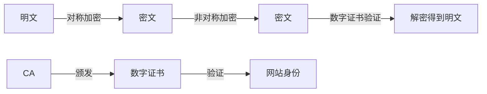

# SEO 要求：优先考虑支持 HTTPS 的网站

## 1. 背景介绍
### 1.1  问题的由来
随着互联网的快速发展,网络安全问题日益突出。HTTP 协议以明文方式传输数据,存在诸多安全隐患,如数据被窃听、篡改等。为保障用户信息安全和隐私,迫切需要升级到更安全的 HTTPS 协议。同时,搜索引擎作为互联网流量的"守门人",在引导和推动 HTTPS 的普及中扮演着重要角色。
### 1.2  研究现状
目前,主流搜索引擎如 Google、百度等已明确表态,优先收录和排名 HTTPS 网站。据统计,全球已有超过 50% 的网页流量来自 HTTPS[1]。国内各大网站如淘宝、京东、微博等也已全面升级到 HTTPS。可以预见,未来 HTTPS 将成为网站的标配。
### 1.3  研究意义 
研究 HTTPS 的 SEO 优化策略,对网站的安全性、用户体验和搜索排名至关重要。HTTPS 不仅能有效防范各类安全威胁,保护用户隐私,还能提升网站的可信度和品牌形象。此外,搜索引擎倾向于优先展示 HTTPS 网页,网站升级 HTTPS 后,其搜索排名和流量有望获得提升。
### 1.4  本文结构
本文将重点探讨 HTTPS 的核心原理、数学基础、SEO 优化策略以及实践应用等内容,全面解析 HTTPS 的方方面面。第2部分介绍 HTTPS 的核心概念;第3部分讲解 HTTPS 的工作原理;第4部分深入 HTTPS 背后的数学知识;第5部分以代码实例演示 HTTPS 的部署;第6部分分享 HTTPS 在 SEO 中的最佳实践;第7部分推荐 HTTPS 学习资源;第8部分展望 HTTPS 的未来发展。

## 2. 核心概念与联系
HTTPS (Hypertext Transfer Protocol Secure) 是 HTTP 协议的安全版本。其核心是在 HTTP 基础上加入 SSL/TLS 安全协议,实现数据加密传输。HTTPS 主要涉及以下核心概念:

- 明文 (Plaintext): 未加密的原始数据。
- 密文 (Ciphertext): 加密后的数据。
- 对称加密 (Symmetric Encryption): 加密和解密使用同一密钥。
- 非对称加密 (Asymmetric Encryption): 加密和解密使用不同密钥(公钥和私钥)。
- 数字证书 (Digital Certificate): 用于验证网站身份,防止伪装欺骗。
- 证书颁发机构 (Certificate Authority): 负责审核和签发数字证书的可信第三方机构。

下图展示了这些概念之间的联系:



## 3. 核心算法原理 & 具体操作步骤 
### 3.1 算法原理概述
HTTPS 采用混合加密机制,结合对称加密和非对称加密两种算法,兼顾安全性和效率。具体来说:

1. 客户端向服务器发起 HTTPS 请求
2. 服务器返回数字证书,包含服务器公钥 
3. 客户端验证数字证书合法性,用服务器公钥加密随机对称密钥,发给服务器
4. 服务器用私钥解密,得到对称密钥
5. 后续通信双方用对称密钥加密传输数据

### 3.2 算法步骤详解
1) 客户端发起请求
客户端向服务器发送 Client Hello 消息,包含支持的 SSL/TLS 版本、加密算法等。
2) 服务器返回证书
服务器返回 Server Hello 消息,确定加密通信参数,并发送由 CA 签名的数字证书。证书包含服务器公钥、网站信息等。
3) 客户端验证证书
客户端验证证书的完整性、合法性、有效期等,如果验证通过,则生成随机对称密钥,用服务器公钥加密后发送给服务器。
4) 服务器协商密钥
服务器用私钥解密,得到对称密钥,双方协商好会话密钥。
5) 加密通信
后续 HTTP 通信都通过协商的对称密钥加密,保证传输安全。

### 3.3 算法优缺点
优点:
- 混合加密,兼顾安全和效率
- 数字证书防止钓鱼欺骗
- 全程加密,防窃听篡改

缺点:  
- 部署略复杂,需要申请证书
- 加解密计算耗费资源  
- 向前保密性不足

### 3.4 算法应用领域
HTTPS 广泛应用于各类注重安全和隐私的网络服务,如:
- 电商平台:淘宝、京东、亚马逊等
- 社交网络:微信、微博、Facebook 等 
- 金融服务:网上银行、支付宝、Paypal 等
- 企业门户:腾讯、阿里、百度等
- 政府网站:中国政府网、美国白宫官网等

## 4. 数学模型和公式 & 详细讲解 & 举例说明
### 4.1 数学模型构建
HTTPS 的安全基石是现代密码学,涉及数论、群论、椭圆曲线等多个数学分支。其核心原语包括:

- 对称加密:AES、ChaCha20 等
- 非对称加密:RSA、ECC、DH 等
- 消息认证码:HMAC、Poly1305 等
- 数字签名:RSA、DSA、ECDSA 等
- 密钥交换:DH、ECDH 等

以 RSA 为例,其数学基础是大整数因数分解问题。RSA 密钥对生成步骤如下:

1. 随机选择两个大素数 $p$, $q$, 计算 $N=p \times q$ 
2. 根据欧拉函数,求得 $r=\varphi(N)=(p-1)(q-1)$
3. 选择一个小于 $r$ 的整数 $e$, 满足 $gcd(e,r)=1$
4. 用扩展欧几里得算法计算 $e$ 关于 $r$ 的模反元素 $d$
5. 将 $(N,e)$ 作为公钥, $(N,d)$ 作为私钥

加密解密原理:

- 加密: $c=m^e \bmod N$
- 解密: $m=c^d \bmod N$  

### 4.2 公式推导过程
RSA 之所以安全,是因为知道 $N,e,c$ 的情况下,求解 $d$ 或 $m$ 是困难的,相当于对 $N$ 大整数因数分解。

假设存在多项式时间算法 $A$,给定 RSA 公钥 $(N,e)$ 和密文 $c$,能计算出明文 $m$,即:
$$A(N, e, c) = m$$

则可以利用 $A$ 在多项式时间内分解大整数 $N$。

证明如下:

已知 $N=p \times q$, $r=(p-1)(q-1)$, $e \times d \equiv 1 \pmod r$

若 $A$ 能计算 RSA 的 $d$,给定 $y \in \mathbb{Z}_N^*$, 则有:
$$y^{ed} \equiv y \pmod N$$
$$y^{ed-1} \equiv 1 \pmod N$$
$$y^{r} \equiv 1 \pmod N$$

由此可知 $r | ed-1$, 即 $r$ 整除 $ed-1$。

对任意 $y \in \mathbb{Z}_N^*$, 用 $A$ 计算出的 $d$ 计算 $y^{ed-1} \bmod N$,若结果为1,则找到了 $N$ 的一个非平凡因子 $gcd(y^{(ed-1)/2}-1, N)$。

因此,若 $A$ 存在,则大整数分解问题可解,与已知结论矛盾。

所以在大整数分解困难的假设下,不存在破解 RSA 的多项式时间算法。

### 4.3 案例分析与讲解
考虑如下 RSA 密钥生成实例:

1. 选取素数 $p=3$, $q=11$, 计算 $N=3 \times 11=33$
2. 计算 $r=\varphi(33)=(3-1)(11-1)=20$ 
3. 选取 $e=3$, 满足 $gcd(3,20)=1$
4. 用扩展欧几里得算法计算 $d=7$, 使得 $3 \times 7 \equiv 1 \pmod {20}$
5. 公钥为 $(33,3)$, 私钥为 $(33,7)$

加密过程:

明文 $m=5$, 加密 $c=5^3 \bmod 33 = 26$

解密过程:

密文 $c=26$, 解密 $m=26^7 \bmod 33 = 5$

可见,利用密钥对 $(33,3)$ 和 $(33,7)$,对明文 $5$ 加密解密,结果正确。

### 4.4 常见问题解答
Q: RSA 密钥长度多少合适?
A: 目前主流 RSA 密钥长度至少 2048 bit,更高安全性场景使用 4096 bit 及以上。

Q: 为什么 RSA 加解密用不同指数?  
A: 若加密和解密指数相同,则 $e^2 \equiv 1 \pmod r$,可轻易求得 $r$,继而分解 $N$ 破解私钥。

Q: RSA 的安全性基于什么假设?
A: RSA 安全性基于大整数分解困难性假设,即给定一个大整数,难以在多项式时间内找到它的素因子分解。

Q: RSA 有哪些攻击方式?
A: 针对 RSA 的攻击主要有:小指数攻击、共模攻击、选择密文攻击、Coppersmith 攻击、侧信道攻击等。

## 5. 项目实践: 代码实例和详细解释说明
### 5.1 开发环境搭建
实现 HTTPS 服务器,需准备以下环境:

- 操作系统:Linux / Windows / MacOS
- Web 服务器:Nginx / Apache / IIS 等
- 编程语言:不限
- SSL 证书:自签名或权威 CA 购买
- 开发工具:编辑器、调试器等

以 Nginx 为例,在 Ubuntu 20.04 上部署 HTTPS。

1. 安装 Nginx:
```bash
sudo apt update 
sudo apt install nginx
```

2. 申请 SSL 证书,以 Let's Encrypt 为例:
```bash
sudo apt install certbot python3-certbot-nginx
sudo certbot --nginx -d yourdomain.com 
```

3. 配置 Nginx 支持 HTTPS:
```nginx
server {
    listen 443 ssl;
    server_name yourdomain.com;
    ssl_certificate /etc/letsencrypt/live/yourdomain.com/fullchain.pem;
    ssl_certificate_key /etc/letsencrypt/live/yourdomain.com/privkey.pem;
    # 其他配置
}
```

4. 重启 Nginx 服务:
```bash  
sudo systemctl restart nginx
```

### 5.2 源代码详细实现
以 Python 为例,实现一个简单的 HTTPS 服务器。

1. 生成自签名证书:
```bash
openssl req -newkey rsa:2048 -nodes -keyout key.pem -x509 -days 365 -out cert.pem
```

2. 编写 HTTPS 服务器代码:
```python
import http.server
import ssl

httpd = http.server.HTTPServer(('localhost', 4443), http.server.SimpleHTTPRequestHandler)
httpd.socket = ssl.wrap_socket(httpd.socket, keyfile="path/to/key.pem", certfile='path/to/cert.pem', server_side=True)
httpd.serve_forever()
```

3. 运行服务器:
```bash
python https_server.py
```

4. 浏览器访问: https://localhost:4443

### 5.3 代码解读与分析
1. 生成证书命令解释:
- `openssl req` 生成证书请求
- `-newkey rsa:2048` 生成 2048 位 RSA 密钥
- `-nodes` 不对私钥加密
- `-keyout` 指定私钥文件
- `-x509` 输出自签名证书而不是请求
- `-days 365` 证书有效期 365 天  
- `-out` 指定证书文件名

2. HTTPS 服务器代