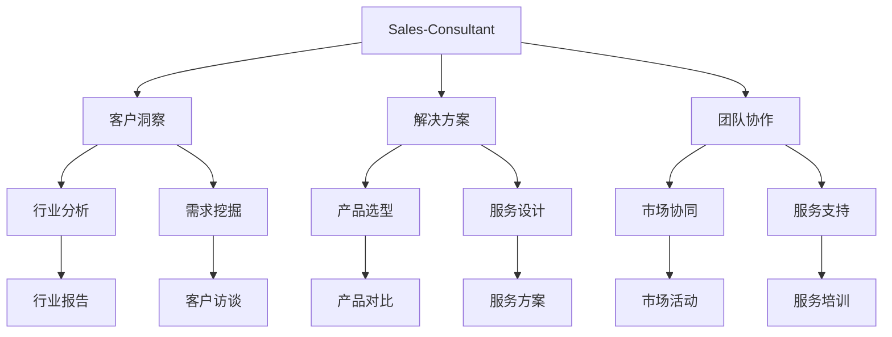

# Sales-Consultant 业务流程与价值分析

关键词：Sales-Consultant、业务流程、价值分析、CRM系统、销售漏斗、销售自动化

## 1. 背景介绍
### 1.1 问题的由来
在当今高度竞争的商业环境中,企业面临着巨大的挑战。销售作为企业的生命线,其效率和效果直接影响着企业的生存和发展。传统的销售模式已经无法满足快速变化的市场需求,亟需引入新的销售理念和方法。Sales-Consultant作为一种新兴的销售角色,通过为客户提供专业化、个性化的咨询服务,帮助企业实现销售目标,提升客户满意度和忠诚度。

### 1.2 研究现状
目前,国内外学者对Sales-Consultant的研究还处于起步阶段。国外的一些研究主要集中在Sales-Consultant的角色定位、能力要求、工作流程等方面。如Harvard Business Review的一篇文章指出,Sales-Consultant需要具备深厚的行业知识、出色的沟通能力和解决问题的能力。国内的研究则更多关注Sales-Consultant在具体行业中的应用,如房地产、汽车、金融等领域。

### 1.3 研究意义
深入研究Sales-Consultant的业务流程和价值,对企业的销售管理具有重要意义:

1. 有助于优化销售流程,提高销售效率。
2. 有助于提升客户体验,增强客户粘性。
3. 有助于挖掘客户需求,实现精准营销。
4. 有助于培养高素质的销售人才,打造专业化的销售团队。

### 1.4 本文结构
本文将从以下几个方面对Sales-Consultant的业务流程和价值进行分析:

1. Sales-Consultant的核心概念与业务关系
2. Sales-Consultant的业务流程与操作步骤
3. Sales-Consultant的数学模型与量化分析
4. Sales-Consultant的信息系统实践
5. Sales-Consultant在企业中的应用场景
6. Sales-Consultant相关的工具和资源推荐
7. Sales-Consultant未来的发展趋势与挑战
8. 常见问题解答

## 2. 核心概念与联系
Sales-Consultant是一个集销售、咨询、服务于一体的新型销售角色。其核心是通过为客户提供专业的咨询服务,帮助客户识别和满足需求,从而推动销售的达成。Sales-Consultant需要深入了解客户所在行业的特点、趋势、痛点,洞察客户的真实需求,提供有针对性的解决方案。同时,Sales-Consultant还需要协调企业内部的各个部门,如市场、产品、服务等,为客户提供全方位的支持。

Sales-Consultant与传统销售的区别主要体现在以下几个方面:

1. 销售理念:从"推销产品"到"提供解决方案"
2. 工作方式:从"单打独斗"到"团队协作"
3. 能力要求:从"口才好"到"专业强"
4. 客户关系:从"一次性交易"到"长期合作"

下图展示了Sales-Consultant业务的关键要素及其关系:

从图中可以看出,Sales-Consultant的核心是客户洞察、解决方案和团队协作。只有深入理解客户需求,提供匹配的解决方案,并协调内外部资源,才能真正实现销售目标和客户价值。

## 3. 核心算法原理 & 具体操作步骤
### 3.1 算法原理概述
Sales-Consultant的业务流程可以用销售漏斗(Sales Funnel)模型来描述。销售漏斗把销售过程分为几个阶段:认知、兴趣、意愿、行动、成交、维系。每个阶段的客户数量呈现漏斗状,从上到下依次减少。Sales-Consultant需要采取不同的策略和技巧,帮助客户从漏斗顶端移动到底端,最终实现成交。

### 3.2 算法步骤详解
1. 认知阶段:通过市场营销活动,让潜在客户了解公司和产品,引起注意。
   - 市场调研:分析客户特征,确定目标受众。
   - 品牌推广:通过广告、公关等方式提升品牌知名度。
   - 内容营销:制作和传播有价值的内容,吸引潜在客户。

2. 兴趣阶段:通过教育和互动,引导潜在客户产生求知欲,了解更多信息。
   - 信息提供:提供白皮书、案例、视频等深度内容。
   - 在线交互:通过网站、社交媒体、在线客服等渠道与客户互动。
   - 需求挖掘:通过提问、调查等方式了解客户需求。

3. 意愿阶段:通过价值演示和试用,让潜在客户认可产品价值,产生购买意愿。
   - 案例分享:展示成功案例,证明产品价值。
   - 试用体验:提供产品试用,让客户亲身感受。
   - 疑虑解答:解答客户疑虑,消除购买障碍。

4. 行动阶段:通过个性化报价和谈判,说服潜在客户采取购买行动。
   - 需求确认:再次确认客户需求,提供定制化方案。
   - 报价谈判:根据客户预算和竞争对手,提供有竞争力的报价。
   - 购买决策:分析决策流程和关键人物,争取多方支持。

5. 成交阶段:通过合同签订和交付实施,完成交易,实现销售收入。
   - 合同签订:准备合同文本,与客户确认条款,完成签署。
   - 交付实施:与交付团队对接,制定实施计划,监督进度。
   - 验收确认:组织验收测试,获得客户确认,完成项目收款。

6. 维系阶段:通过客户成功和追加销售,维护客户关系,挖掘持续价值。
   - 客户培训:提供产品使用培训,帮助客户掌握功能。
   - 客户服务:提供售后服务支持,响应客户反馈。
   - 追加销售:挖掘客户新需求,提供升级和扩展服务。

### 3.3 算法优缺点
销售漏斗模型的优点包括:
1. 直观展示销售进程,便于分析和预测。
2. 量化不同阶段的转化率,优化资源投入。
3. 针对性地采取策略,提高销售效率。

缺点包括:
1. 简化了销售过程的复杂性,忽略了一些影响因素。
2. 过于关注短期成交,忽视长期客户关系。
3. 缺乏灵活性,无法适应快速变化的市场环境。

### 3.4 算法应用领域
销售漏斗模型广泛应用于各个行业的销售管理,包括IT、制造、金融、房地产等。一些常见的应用场景包括:
1. 销售预测:根据漏斗各阶段的客户数量和转化率,预测未来的销售收入。
2. 资源分配:根据漏斗各阶段的客户特征和需求,合理分配销售资源。
3. 过程优化:通过分析漏斗的卡点和断点,优化销售流程和策略。
4. 目标管理:根据漏斗的目标转化率,制定阶段性销售目标。

## 4. 数学模型和公式 & 详细讲解 & 举例说明
### 4.1 数学模型构建
我们可以用一个简化的数学模型来描述销售漏斗:

$$ S_i = C_i \times R_i $$

其中,$S_i$表示第$i$阶段的销售收入,$C_i$表示第$i$阶段的客户数量,$R_i$表示第$i$阶段的平均客单价。假设漏斗共有$n$个阶段,则总销售收入$S$为:

$$ S = \sum_{i=1}^n S_i = \sum_{i=1}^n C_i \times R_i $$

### 4.2 公式推导过程
为了预测未来的销售收入,我们需要估算每个阶段的客户数量和平均客单价。假设第$i$阶段的客户转化率为$T_i$,即有$T_i$的客户会进入下一阶段,则第$i+1$阶段的客户数量为:

$$ C_{i+1} = C_i \times T_i $$

假设漏斗的初始客户数量为$C_0$,则第$i$阶段的客户数量为:

$$ C_i = C_0 \times \prod_{j=0}^{i-1} T_j $$

将其代入总销售收入公式,得到:

$$ S = \sum_{i=1}^n C_0 \times \prod_{j=0}^{i-1} T_j \times R_i $$

### 4.3 案例分析与讲解
我们以一个简单的案例来说明如何应用上述公式。假设一个销售漏斗有3个阶段:潜在客户、意向客户、成交客户。初始潜在客户数量为1000,各阶段的转化率和平均客单价如下:

| 阶段 | 转化率 | 平均客单价 |
|------|--------|------------|
| 潜在客户 | 20% | ¥0   |
| 意向客户 | 50% | ¥1000 |
| 成交客户 | 80% | ¥5000 |

根据公式,我们可以计算出每个阶段的客户数量和销售收入:

| 阶段 | 客户数量 | 销售收入 |
|------|----------|----------|
| 潜在客户 | 1000 | ¥0 |
| 意向客户 | 1000 × 20% = 200 | 200 × ¥1000 = ¥200000 |
| 成交客户 | 200 × 50% = 100 | 100 × ¥5000 = ¥500000 |

因此,总销售收入为:

$$ S = ¥0 + ¥200000 + ¥500000 = ¥700000 $$

### 4.4 常见问题解答
1. 问:如何提高销售漏斗的转化率?
   答:可以采取以下措施:
   - 优化营销策略,吸引更多合格的潜在客户
   - 加强销售培训,提高销售人员的专业能力
   - 完善产品和服务,满足客户的真实需求
   - 简化购买流程,降低客户的决策门槛

2. 问:销售漏斗的阶段划分有什么标准?
   答:销售漏斗的阶段划分需要考虑以下因素:
   - 客户需求:不同阶段的客户有不同的需求和心理状态
   - 销售行为:不同阶段的销售行为和目标不同
   - 决策过程:客户的决策过程包括多个环节,如认知、评估、选择等
   - 数据支撑:每个阶段应该有可衡量的指标,如客户数量、转化率等

3. 问:销售漏斗模型有哪些局限性?
   答:销售漏斗模型的局限性包括:
   - 假设客户按照固定流程决策,忽略了客户的个体差异
   - 假设每个客户的价值相同,忽略了客户的战略重要性
   - 关注新客户的开发,忽略了老客户的维护和增值
   - 关注销售收入的短期波动,忽略了客户关系的长期经营

## 5. 项目实践：代码实例和详细解释说明
### 5.1 开发环境搭建
Sales-Consultant的信息系统开发可以使用以下技术栈:
- 前端:Vue.js + Element UI
- 后端:Spring Boot + MySQL
- 工具:Git、Maven、Jenkins

开发环境搭建步骤如下:
1. 安装Node.js和Vue CLI,创建Vue项目。
2. 安装Java和Maven,创建Spring Boot项目。
3. 安装MySQL,创建数据库和表。
4. 安装Git,创建代码仓库,管理版本。
5. 安装Jenkins,创建CI/CD