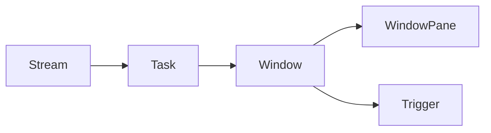

# Samza Window原理与代码实例讲解

## 1. 背景介绍
### 1.1 问题的由来
在大数据实时计算领域,数据流的窗口化处理是一个非常重要且常见的需求。许多实时计算框架如Storm、Spark Streaming等都提供了窗口操作的API。而作为LinkedIn开源的分布式流处理框架,Samza同样支持灵活的窗口操作。
### 1.2 研究现状
目前业界对于流式数据的窗口化处理,主要有以下几种实现方式:
1. 滚动窗口(Tumbling Window):将数据流按照固定的窗口长度划分成不重叠的窗口。
2. 滑动窗口(Sliding Window):以固定的时间间隔将数据流划分成固定长度的窗口,窗口之间可以有重叠。  
3. 会话窗口(Session Window):将某段时间内活跃度较高的数据划分到同一个窗口中,窗口的长度不固定。

不同的流计算框架对窗口的实现机制各有不同。如Storm采用窗口元组的方式,Spark Streaming利用RDD的特性来实现窗口。而Samza的窗口实现更加灵活,可以支持多种窗口类型。
### 1.3 研究意义
深入研究Samza的窗口实现原理,对于我们理解流计算框架窗口化处理的内部机制有重要意义。通过Samza窗口的代码实例讲解,可以帮助我们更好地使用Samza进行流式数据的窗口操作,为解决实际问题提供参考。
### 1.4 本文结构
本文将重点介绍Samza框架的窗口实现原理,详细讲解窗口的核心概念和数学模型,并通过代码实例来演示Samza窗口的具体用法。内容安排如下:

1. Samza窗口的核心概念与设计原理
2. Samza窗口的时间模型与数学公式 
3. Samza窗口的代码实现与案例讲解
4. Samza窗口的实际应用场景与局限性
5. 总结与展望

## 2. 核心概念与联系
在Samza的流处理中,有几个核心概念:

- Stream(流):数据流,由一系列的消息事件组成。
- TASK(任务):流处理的基本单位,每个任务负责处理一个分区的数据。
- Window(窗口):一段时间范围内的数据集合,Samza支持多种窗口类型。
- WindowPane(窗格):窗口计算的结果输出,每个窗格包含窗口内的聚合结果。
- Trigger(触发器):窗口触发计算的时机,如时间触发、数量触发、自定义触发等。

它们的关系如下图所示:



可以看出,数据流被划分到不同Task中处理,每个Task可以定义窗口。窗口根据Trigger的规则,周期性地将窗口内的数据聚合输出到WindowPane中。

## 3. 核心算法原理 & 具体操作步骤
### 3.1 算法原理概述
Samza窗口的核心算法可以概括为:

1. 数据按Key分区,每个Task负责一个分区的数据处理 
2. 每条数据根据时间戳判断属于哪个窗口,更新窗口状态
3. 根据Trigger规则判断窗口是否需要输出结果
4. 执行窗口计算逻辑,输出WindowPane结果

下面我们来详细看看每个步骤的实现原理。
### 3.2 算法步骤详解
#### 1) 数据分区与任务处理
Samza采用Kafka作为流数据的存储,数据会按照Key进行分区。每个Samza任务实例负责处理一个分区的数据,这样可以实现任务级别的并行处理。

#### 2) 窗口划分与状态更新
当一条消息到达时,Samza根据消息的时间戳和窗口参数(如窗口长度、滑动步长等)判断该消息属于哪个窗口,并将消息分配到对应窗口中。

每个窗口都维护自己的状态,用于存储窗口内的消息数据。当有新消息到达时,窗口状态会进行更新。常见的窗口状态有:

- Count Window:保存窗口内消息的数量
- Sum Window:保存窗口内消息的累加值
- Reduce Window:根据自定义的reduce函数更新状态

#### 3) 窗口触发与结果输出
窗口计算结果的输出需要由Trigger决定。Samza支持不同的触发机制:

- 事件时间触发:根据消息的事件时间判断是否触发
- 处理时间触发:根据系统的本地时间判断是否触发  
- 水位线触发:根据Watermark的推进判断是否触发
- 自定义触发:用户可以实现自定义的触发器

当触发条件满足时,窗口会将聚合结果输出到下游,即发送到WindowPane中。

#### 4) 执行计算逻辑
窗口触发后,就需要执行真正的计算逻辑,如Sum、Reduce等。Samza提供了灵活的API让用户自定义窗口计算函数。

计算完成后输出的WindowPane包含窗口的聚合结果,以及窗口的元信息如起止时间、Watermark等。

### 3.3 算法优缺点
Samza窗口算法的优点有:
- 支持多种窗口类型与丰富的API
- 采用分区并行处理,计算效率高  
- 支持事件时间、Watermark等流处理语义
- 容错性好,任务失败可以从Kafka中恢复状态

当然它也有一些局限性:
- 窗口状态存储在内存中,可能会有内存压力
- 窗口的并行度受Kafka分区数的限制
- 对比Storm、Flink等框架,API功能不够强大

### 3.4 算法应用领域
Samza窗口算法可以应用于多种实时计算场景,如:
- 广告点击流量统计,如每小时的点击量、点击率等
- 传感器数据分析,如每分钟的温度平均值、最大值等  
- 电商实时大屏统计,如当天的销售额、订单量等
- 服务质量监控,如接口每5分钟的响应时间、错误率等

## 4. 数学模型和公式 & 详细讲解 & 举例说明
### 4.1 数学模型构建
我们先来定义一下Samza窗口的数学模型:
- 设数据流为$ S=\{e_1,e_2,...,e_n\} $,每个元素$ e_i $是一个二元组$ <t_i,v_i> $,表示在时间$ t_i $到达的数据值$ v_i $。
- 设窗口长度为$ L $,滑动步长为$ W $。则第$ k $个窗口的时间区间为:
$$ Window_k=[k*W, k*W+L) $$  
- 设$ S_k=\{e_i | e_i \in S, t_i \in Window_k\} $表示落入第$ k $个窗口内的数据子集。
- 设窗口聚合函数为$ f $,则第$ k $个窗口的计算结果为:
$$ Result_k=f(S_k) $$

### 4.2 公式推导过程
下面我们以一个具体的例子来推导窗口计算的公式。假设我们要统计每个窗口内的数据总和。

设$ Window_k $内的数据集合为$ S_k=\{e_{k1},e_{k2},...,e_{km}\} $,每个数据的值为$ v_{ki} $,则窗口的Sum值为:

$$
\begin{aligned}
Sum_k &= \sum_{e_i \in S_k} v_i \\
&= v_{k1} + v_{k2} + ... + v_{km} \\
&= \sum_{i=1}^{m} v_{ki}
\end{aligned}
$$

如果我们把$ Window_k $的Sum值记为$ Sum_k $,则有如下的递推公式:

$$
Sum_k = 
\begin{cases}
\sum_{i=1}^{m} v_{ki} & k=0 \\
Sum_{k-1} + \sum_{t_i \in [kW, kW+W)}v_i - \sum_{t_i \in [(k-1)W, (k-1)W+W)}v_i & k>0
\end{cases}
$$

即当$ k>0 $时,第$ k $个窗口的Sum值等于上一个窗口的Sum值,加上新进入窗口的数据值,减去离开窗口的数据值。

这种递推公式可以大大减少重复计算,提高计算效率。Samza的窗口算法就是利用类似的递推公式来实现增量聚合的。

### 4.3 案例分析与讲解
下面我们用一个具体的例子来说明窗口的计算过程。假设有如下的数据流:

```
<1, 10>
<2, 20>
<3, 30>
<4, 40> 
<5, 50>
<6, 60>
<7, 70>
```

设窗口长度$ L=4 $,滑动步长$ W=2 $,则窗口划分如下:

```
Window_0: [0, 4)
Window_1: [2, 6)
Window_2: [4, 8)
```

每个窗口的Sum值计算如下:

$$
\begin{aligned}
Sum_0 &= 10 + 20 + 30 + 40 = 100 \\
Sum_1 &= Sum_0 + 50 + 60 - 10 - 20 = 180 \\
Sum_2 &= Sum_1 + 70 - 30 - 40 = 180
\end{aligned}
$$

可以看出,$ Sum_1 $和$ Sum_2 $的计算利用了前一个窗口的结果,避免了重复计算。

### 4.4 常见问题解答
1. Samza窗口支持哪些聚合操作?
   - Samza提供了常见的聚合操作如Sum、Count、Reduce、Aggregate等,也支持自定义的聚合函数。

2. Samza窗口的时间语义是怎样的?
   - Samza支持事件时间语义,可以基于消息的事件时间戳来划分窗口。同时也支持Watermark机制来处理乱序数据。  

3. Samza窗口的并行度如何设置?
   - Samza窗口的并行度由输入流的分区数决定,每个任务实例处理一个分区的数据。所以可以通过调整输入流的分区数来改变并行度。

4. Samza窗口的状态存储在哪里?
   - Samza任务的状态默认存储在内存中,如果开启了Changelog机制,也会备份一份到Kafka中。当任务失败重启时,可以从Kafka中恢复状态。

## 5. 项目实践：代码实例和详细解释说明
### 5.1 开发环境搭建
要运行Samza应用,需要搭建以下开发环境:
- JDK 1.8+
- Apache Kafka 
- Apache Zookeeper
- Samza

可以参考Samza官网的[Quick Start](https://samza.apache.org/startup/quick-start/latest/samza.html)来搭建一个本地的开发环境。

### 5.2 源代码详细实现
下面我们通过一个具体的代码实例来展示如何用Samza实现窗口计算。该示例的需求是:统计每5秒钟的单词数量。

首先定义一个Samza任务类:

```java
public class WordCountWindow implements StreamTask, InitableTask, WindowableTask {

  private static final Logger LOG = LoggerFactory.getLogger(WordCountWindow.class);

  private int windowDurationMs = 5000; // 窗口长度5秒
  
  private KeyValueStore<String, Integer> store; // 存储单词计数

  @Override
  public void init(Config config, TaskContext context) {
    this.store = (KeyValueStore<String, Integer>) context.getStore("word-count");
  }

  @Override
  public void process(IncomingMessageEnvelope envelope, MessageCollector collector, TaskCoordinator coordinator) {
    String word = (String) envelope.getMessage();
    Integer count = store.get(word);
    if (count == null) {
      count = 0;
    }
    count++;
    store.put(word, count);
  }

  @Override
  public Collection<MessageEnvelope> window(MessageCollector collector, TaskCoordinator coordinator) {
    List<MessageEnvelope> envelopes = new ArrayList<>();
    KeyValueIterator<String, Integer> iter = store.all();
    while (iter.hasNext()) {
      Entry<String, Integer> entry = iter.next();
      String word = entry.getKey();
      Integer count = entry.getValue();
      envelopes.add(new OutgoingMessageEnvelope(new SystemStream("kafka", "word-count-output"), word, count));
      LOG.info("Window result - word: {}, count: {}", word, count);
    }
    store.flush();