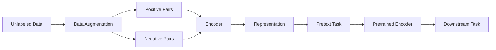

# Self-Supervised Learning原理与代码实例讲解

## 1. 背景介绍
### 1.1 问题的由来
在机器学习领域,标注数据的获取一直是一个难题。传统的监督学习需要大量的人工标注数据,这不仅耗时耗力,而且对于某些任务来说,人工标注本身也存在一定的主观性和不确定性。如何利用大量的无标注数据,从而减少对人工标注数据的依赖,成为了机器学习领域亟待解决的问题。
### 1.2 研究现状 
近年来,自监督学习(Self-Supervised Learning,简称SSL)作为一种新兴的机器学习范式受到了广泛关注。SSL旨在从无标注数据中自动学习出有用的表征,从而在下游任务上取得良好的性能。目前,SSL已经在计算机视觉、自然语言处理等领域取得了显著的进展,许多SSL方法的性能已经接近甚至超过了监督学习的水平。
### 1.3 研究意义
SSL的研究意义主要体现在以下几个方面:

1. 减少对标注数据的依赖,节省人力物力成本。
2. 挖掘无标注数据中蕴含的有用信息,提高模型的泛化能力。
3. 为迁移学习、终身学习等提供更好的预训练模型。
4. 探索机器学习的本质,为通用人工智能的实现提供新的思路。

### 1.4 本文结构
本文将重点介绍SSL的基本原理、主要方法以及在实践中的应用。全文分为以下几个部分:

- 第2部分介绍SSL的核心概念与基本思想。 
- 第3部分重点讲解SSL的主要算法,包括对比学习、生成式方法等。
- 第4部分给出了SSL算法所涉及的数学模型与公式推导。
- 第5部分通过代码实例演示了如何使用PyTorch实现SSL算法。
- 第6部分讨论了SSL在计算机视觉、自然语言处理等领域的应用场景。
- 第7部分推荐了一些学习SSL的资源,包括论文、教程、开源代码等。
- 第8部分对全文进行了总结,并对SSL未来的发展趋势与挑战进行了展望。

## 2. 核心概念与联系
自监督学习的核心思想是利用数据本身的结构信息,构建一个预测任务,从而让模型从无标注数据中学到有用的表征。具体来说,SSL通常包含以下几个关键概念:

- 预测任务(Pretext Task):人为构建的一个代理任务,旨在利用数据的结构信息,引导模型学习到有意义的表征。常见的预测任务包括图像补全、上下文预测、对比学习等。 
- 表征学习(Representation Learning):通过预测任务学习到的中间表征,可以捕捉数据的高层语义信息,从而在下游任务上取得良好的性能。
- 正负样本(Positive/Negative Samples):在对比学习中,正样本通常是语义上相似的样本对,负样本则是不相似的样本对。模型通过最小化正样本对之间的距离,最大化负样本对之间的距离来学习到判别性的表征。
- 数据增强(Data Augmentation):通过对原始数据进行变换(如裁剪、旋转、颜色变换等)生成新的样本,增加训练数据的多样性,提高模型的鲁棒性。

下图给出了SSL的一个总体框架。无标注数据经过数据增强后,生成不同视角的样本对,送入编码器提取特征。然后通过一个对比学习的预测任务,让编码器学习到判别性的表征。最后,将预训练好的编码器迁移到下游任务上进行微调。

## 3. 核心算法原理 & 具体操作步骤
### 3.1 算法原理概述
SSL的主要算法可以分为三大类:基于重建的方法、基于对比学习的方法和基于生成式方法。

- 基于重建的方法,如Auto-Encoder,通过重建输入数据来学习到其中的高层特征。
- 基于对比学习的方法,如SimCLR,通过最小化正样本对的距离,最大化负样本对的距离来学习到判别性的表征。
- 基于生成式方法,如BiGAN,通过生成与真实样本尽可能相似的样本来学习到数据的分布信息。

### 3.2 算法步骤详解
以SimCLR为例,其算法步骤如下:

1. 数据增强:对每个无标注样本$x$,通过随机数据增强生成两个不同视角的样本$x^{i}$和$x^{j}$,构成正样本对。
2. 特征提取:将增强后的样本对分别送入编码器$f$提取特征,$h^{i}=f(x^{i})$,$h^{j}=f(x^{j})$。
3. 投影头:将提取到的特征向量通过一个非线性投影头$g$映射到另一个空间,$z^{i}=g(h^{i})$,$z^{j}=g(h^{j})$。
4. 对比学习损失:对于一个batch内的$N$个正样本对,定义对比学习损失为:

$$
\mathcal{L}_{i,j} = -\log \frac{\exp(\mathrm{sim}(z^{i},z^{j})/\tau)}{\sum_{k=1}^{2N}\mathbf{1}_{[k\neq i]} \exp(\mathrm{sim}(z^{i},z^{k})/\tau)}
$$

其中$\mathrm{sim}(u,v)=u^{\top}v/(\|u\|\|v\|)$表示余弦相似度,$\tau$是一个温度超参数。这个损失函数的目标是最大化正样本对的相似度,最小化负样本对的相似度。

5. 梯度下降:计算损失函数对编码器$f$和投影头$g$参数的梯度,并通过梯度下降算法更新参数,优化模型。

### 3.3 算法优缺点
SimCLR的优点在于:

- 无需专门构建负样本对,在batch内随机选取其他样本作为负样本,简化了训练流程。
- 引入投影头,将表征映射到另一个空间,增强了模型学习到判别性表征的能力。
- 在多个数据集上取得了SOTA的性能,证明了算法的有效性。

SimCLR的缺点在于:  

- batch size需要足够大(如4096),才能提供足够多的负样本,这对计算资源要求较高。
- 数据增强的设计需要针对不同任务进行调整,没有一个通用的标准。
- 目前主要应用于视觉领域,在NLP等领域的应用还有待进一步探索。

### 3.4 算法应用领域
SSL算法主要应用于以下领域:

- 计算机视觉:如图像分类、目标检测、语义分割等。
- 自然语言处理:如语言模型预训练、文本分类、机器翻译等。
- 语音识别:如声音分类、说话人识别、语音合成等。
- 图学习:如节点分类、链接预测、图生成等。

## 4. 数学模型和公式 & 详细讲解 & 举例说明
### 4.1 数学模型构建
以SimCLR为例,其数学模型可以表示为:

给定一个batch的无标注样本$\{x_{k}\}_{k=1}^{N}$,通过数据增强生成两个视角的样本$x^{i}$和$x^{j}$,其中$i,j\in \{1,2,...,2N\}$。定义编码器为$f$,投影头为$g$,则样本的表征为:

$$
h^{i} = f(x^{i}),\ h^{j} = f(x^{j})
$$
$$
z^{i} = g(h^{i}),\ z^{j} = g(h^{j})
$$

对比学习的目标是最大化正样本对$(i,j)$的相似度,最小化负样本对$(i,k)$的相似度。定义对比学习损失为:

$$
\mathcal{L}_{i,j} = -\log \frac{\exp(\mathrm{sim}(z^{i},z^{j})/\tau)}{\sum_{k=1}^{2N}\mathbf{1}_{[k\neq i]} \exp(\mathrm{sim}(z^{i},z^{k})/\tau)}
$$

其中$\mathrm{sim}(u,v)=u^{\top}v/(\|u\|\|v\|)$表示余弦相似度,$\tau$是一个温度超参数。

最终,SimCLR的目标是最小化整个batch的对比学习损失:

$$
\mathcal{L}_{\mathrm{SimCLR}} = \frac{1}{2N} \sum_{i=1}^{2N} \mathcal{L}_{i,j(i)}
$$

其中$j(i)$表示与$i$构成正样本对的另一个样本。

### 4.2 公式推导过程
对于对比学习损失$\mathcal{L}_{i,j}$,我们可以将其展开为:

$$
\begin{aligned}
\mathcal{L}_{i,j} &= -\log \frac{\exp(\mathrm{sim}(z^{i},z^{j})/\tau)}{\sum_{k=1}^{2N}\mathbf{1}_{[k\neq i]} \exp(\mathrm{sim}(z^{i},z^{k})/\tau)} \\
&= -\log \frac{\exp(\mathrm{sim}(z^{i},z^{j})/\tau)}{\exp(\mathrm{sim}(z^{i},z^{j})/\tau) + \sum_{k\neq i,j}\exp(\mathrm{sim}(z^{i},z^{k})/\tau)} \\  
&= -\mathrm{sim}(z^{i},z^{j})/\tau + \log\left(1 + \sum_{k\neq i,j}\exp((\mathrm{sim}(z^{i},z^{k})-\mathrm{sim}(z^{i},z^{j}))/\tau)\right)
\end{aligned}
$$

可以看出,对比学习损失由两部分组成:

- $-\mathrm{sim}(z^{i},z^{j})/\tau$:最小化正样本对$(i,j)$的距离。
- $\log\left(1 + \sum_{k\neq i,j}\exp((\mathrm{sim}(z^{i},z^{k})-\mathrm{sim}(z^{i},z^{j}))/\tau)\right)$:最大化正样本对$(i,j)$与其他负样本对$(i,k)$的距离差。

温度参数$\tau$控制了softmax分布的平滑程度。$\tau$越大,则分布越平滑,对比学习任务越简单;$\tau$越小,则分布越尖锐,对比学习任务越困难。

### 4.3 案例分析与讲解
下面我们以一个简单的例子来说明SimCLR的训练过程。

假设我们有一个batch的无标注图像$\{x_{1},x_{2},x_{3},x_{4}\}$,通过数据增强生成8个样本:

$$
\{(x^{1},x^{2}),(x^{3},x^{4}),(x^{5},x^{6}),(x^{7},x^{8})\}
$$

其中$(x^{1},x^{2})$表示由$x_{1}$生成的正样本对,以此类推。

对于样本$x^{1}$,其对比学习损失为:

$$
\mathcal{L}_{1,2} = -\log \frac{\exp(\mathrm{sim}(z^{1},z^{2})/\tau)}{\sum_{k=1,k\neq 1}^{8} \exp(\mathrm{sim}(z^{1},z^{k})/\tau)}
$$

其中$z^{1}=g(f(x^{1}))$表示$x^{1}$的表征。这个损失函数的目标是最大化$x^{1}$与$x^{2}$的相似度,最小化$x^{1}$与其他样本的相似度。

假设编码器$f$和投影头$g$的参数初始化为随机值,通过梯度下降算法不断更新参数,最小化整个batch的对比学习损失:

$$
\mathcal{L}_{\mathrm{SimCLR}} = \frac{1}{8} \sum_{i=1}^{8} \mathcal{L}_{i,j(i)}
$$

经过足够多次迭代后,编码器$f$将学习到一个判别