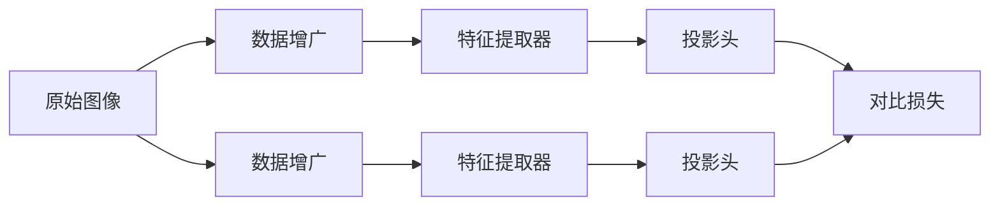

# SimCLR原理与代码实例讲解

## 1. 背景介绍
### 1.1 问题的由来
在深度学习领域,无监督学习一直是一个具有挑战性的问题。传统的无监督学习方法如自编码器和生成对抗网络(GAN)虽然取得了一定的进展,但在学习高质量的特征表示方面仍然存在局限性。近年来,对比学习(Contrastive Learning)作为一种新兴的无监督学习范式,引起了研究者们的广泛关注。其中,SimCLR(A Simple Framework for Contrastive Learning of Visual Representations)是一种简单yet有效的对比学习框架,在图像表示学习任务上取得了state-of-the-art的性能。

### 1.2 研究现状
目前,对比学习已经成为无监督学习领域的研究热点。各种对比学习方法如SimCLR、MoCo、BYOL等不断涌现,并在下游任务如图像分类、目标检测等方面取得了优异的表现,甚至逼近有监督学习的性能。这些研究工作极大地推动了无监督学习的发展。

### 1.3 研究意义 
研究SimCLR对于理解对比学习的原理和应用具有重要意义。一方面,SimCLR提供了一个简洁优雅的对比学习框架,有助于我们深入剖析对比学习的内在机制。另一方面,掌握SimCLR的原理和实现,可以帮助我们更好地应用对比学习解决实际问题,如医学图像分析、遥感图像解译等。此外,SimCLR也为无监督学习的进一步发展提供了新的思路和启发。

### 1.4 本文结构
本文将全面介绍SimCLR的原理与代码实现。第2部分阐述SimCLR的核心概念;第3部分详细讲解SimCLR算法原理和步骤;第4部分介绍SimCLR的数学模型和公式推导;第5部分通过代码实例演示SimCLR的具体实现;第6部分探讨SimCLR的实际应用场景;第7部分推荐SimCLR相关的学习资源和工具;第8部分总结全文并展望SimCLR的未来发展。

## 2. 核心概念与联系

SimCLR的核心思想是通过最大化同一图像的不同增广视图之间的一致性,来学习图像的特征表示。其主要涉及以下几个核心概念:

- 数据增广(Data Augmentation):对原始图像进行随机裁剪、翻转、颜色变换等操作,生成不同的增广视图。
- 特征提取器(Feature Extractor):通常采用卷积神经网络如ResNet来提取图像特征。 
- 投影头(Projection Head):将特征映射到对比学习的表示空间。
- 对比损失(Contrastive Loss):度量不同视图特征表示之间的相似性,并最大化相似性。

下图展示了SimCLR的整体架构和各部分的联系:



## 3. 核心算法原理 & 具体操作步骤

### 3.1 算法原理概述
SimCLR通过最小化对比损失来训练模型。具体而言,对于每个原始图像,SimCLR生成两个增广视图,并将它们输入特征提取器和投影头,得到它们的特征表示。然后计算两个视图特征之间的相似度,并构建对比损失,使得相同图像的不同视图之间的相似度最大化,不同图像之间的相似度最小化。通过优化该损失函数,模型可以学习到有效的图像表示。

### 3.2 算法步骤详解
SimCLR的训练过程可分为以下几个步骤:

1. 数据增广:对每个batch的原始图像进行随机裁剪、翻转、颜色变换等数据增广操作,生成两个不同的视图。

2. 特征提取:将增广后的图像输入特征提取器(如ResNet),得到图像的特征表示。

3. 特征投影:将提取到的特征通过投影头映射到对比学习的表示空间。投影头通常由一个或多个MLP层组成。

4. 计算对比损失:对于每个图像的两个视图,计算它们与其他图像视图之间的相似度,构建对比损失。常用的对比损失函数有NT-Xent loss和InfoNCE loss。

5. 优化模型:使用梯度下降法优化对比损失函数,更新特征提取器和投影头的参数。

6. 重复步骤1-5,直到模型收敛或达到预设的训练轮数。

### 3.3 算法优缺点

SimCLR的优点包括:

- 简单有效:SimCLR只需要数据增广和对比损失,即可学习到高质量的特征表示,避免了复杂的训练技巧。
- 通用性强:SimCLR可以应用于各种视觉任务,如分类、检测、分割等,具有很好的通用性。
- 可扩展性好:SimCLR可以方便地扩展到大规模数据集和模型,且计算效率较高。

SimCLR的缺点包括:

- 需要大批量:SimCLR需要较大的批量大小(如4096)来获得最佳性能,这对计算资源提出了较高要求。
- 对数据增广敏感:SimCLR的性能很大程度上取决于数据增广的质量,需要仔细设计增广策略。

### 3.4 算法应用领域
SimCLR作为一种强大的无监督学习算法,可以应用于多种计算机视觉任务:

- 图像分类:将SimCLR学到的特征用于图像分类任务,可以大幅提升分类精度。
- 目标检测:将SimCLR预训练的特征提取器迁移到目标检测任务,可以加速检测模型的收敛和提高检测性能。  
- 语义分割:SimCLR可以作为语义分割模型的预训练方法,提供更好的初始化。
- 医学图像分析:SimCLR可应用于医学图像的表示学习,辅助疾病诊断和病变检测等。

此外,SimCLR还可以应用于视频理解、3D点云分类、人脸识别等领域,具有广阔的应用前景。

## 4. 数学模型和公式 & 详细讲解 & 举例说明

### 4.1 数学模型构建
SimCLR的数学模型可以用如下符号表示:

- $x$:原始图像
- $\tilde{x}_i,\tilde{x}_j$:图像$x$的两个增广视图 
- $f(\cdot)$:特征提取器
- $g(\cdot)$:投影头
- $h_i,h_j$:$\tilde{x}_i,\tilde{x}_j$的特征表示
- $z_i,z_j$:$h_i,h_j$的投影表示
- $s(z_i,z_j)$:$z_i$和$z_j$的相似度度量
- $\ell(i,j)$:第$i$个样本和第$j$个样本的对比损失

SimCLR的目标是最小化对比损失:

$$\mathcal{L}=\sum_{i=1}^N \ell(i,j(i))$$

其中$N$为batch size,$j(i)$为$i$的正样本索引。

### 4.2 公式推导过程
对于第$i$个样本,其对比损失定义为:

$$\ell(i,j)=-\log \frac{\exp(s(z_i,z_j)/\tau)}{\sum_{k=1}^{2N} \mathbf{1}_{[k \neq i]} \exp(s(z_i,z_k)/\tau)}$$

其中$\tau$为温度超参数,$\mathbf{1}_{[k \neq i]} \in \{0,1\}$为指示函数,当$k \neq i$时为1,否则为0。

上式可以理解为,对于第$i$个样本,其正样本为$j$,其余$2N-1$个样本均为负样本。SimCLR希望最大化正样本对的相似度$s(z_i,z_j)$,最小化负样本对的相似度$s(z_i,z_k)$。

相似度度量$s(z_i,z_j)$通常采用余弦相似度:

$$s(z_i,z_j)=\frac{z_i^\top z_j}{\Vert z_i \Vert \Vert z_j \Vert}$$

### 4.3 案例分析与讲解
下面以一个简单的例子说明SimCLR的工作原理。假设我们有一个batch的图像数据,包含4张图片$\{x_1,x_2,x_3,x_4\}$。

首先对每张图像进行数据增广,得到增广视图$\{\tilde{x}_{11},\tilde{x}_{12},\tilde{x}_{21},\tilde{x}_{22},\tilde{x}_{31},\tilde{x}_{32},\tilde{x}_{41},\tilde{x}_{42}\}$。

然后将增广视图输入特征提取器和投影头,得到它们的投影表示$\{z_{11},z_{12},z_{21},z_{22},z_{31},z_{32},z_{41},z_{42}\}$。

接下来计算对比损失。以$\tilde{x}_{11}$为例,其正样本为$\tilde{x}_{12}$,负样本为其余6个视图。对比损失为:

$$\ell(1,2)=-\log \frac{\exp(s(z_{11},z_{12})/\tau)}{\sum_{k \neq 1} \exp(s(z_{11},z_{k2})/\tau)}$$

最小化该损失函数,可以使$z_{11}$和$z_{12}$的相似度最大化,而与其他视图的相似度最小化。

对所有样本的对比损失求和,得到最终的损失函数:

$$\mathcal{L}=\sum_{i=1}^4 [\ell(i,i+1)+\ell(i+1,i)]$$

优化该损失函数,可以得到高质量的图像表示。

### 4.4 常见问题解答

Q: SimCLR需要多大的批量大小?
A: SimCLR论文中发现,较大的批量大小(如4096)有助于提升性能。但在实践中,批量大小需要根据具体任务和计算资源进行权衡。

Q: SimCLR对数据增广有哪些要求?
A: SimCLR需要构建正负样本对,因此数据增广要能产生不同但相关的视图。常用的增广方法包括随机裁剪、水平翻转、颜色变换(亮度、对比度、饱和度、色调)等。数据增广的选择需要根据任务和数据特点进行设计。

Q: SimCLR的投影头有什么作用?
A: 投影头将特征映射到对比学习的表示空间,可以提高对比学习的性能。在下游任务中,通常移除投影头,直接使用特征提取器的输出。

Q: SimCLR能否用于监督学习?
A: SimCLR主要用于无监督学习,但其学到的特征表示可以迁移到监督学习任务。在一些半监督学习场景中,SimCLR也可以与监督损失联合优化,提升性能。

## 5. 项目实践：代码实例和详细解释说明

### 5.1 开发环境搭建
首先需要安装必要的依赖库,包括:

- Python 3.6+
- PyTorch 1.6+
- torchvision 0.7+
- CUDA 10.1+ (如果使用GPU)

可以使用如下命令安装:

```bash
pip install torch torchvision
```

### 5.2 源代码详细实现
下面给出SimCLR的PyTorch实现代码:

```python
import torch
import torch.nn as nn
import torchvision.transforms as transforms

# 数据增广
transform = transforms.Compose([
    transforms.RandomResizedCrop(32),
    transforms.RandomHorizontalFlip(p=0.5),
    transforms.RandomApply([transforms.ColorJitter(0.4, 0.4, 0.4, 0.1)], p=0.8),
    transforms.RandomGrayscale(p=0.2),
    transforms.ToTensor(),
    transforms.Normalize([0.4914, 0.4822, 0.4465], [0.2023, 0.1994, 0.2010])])

# 特征提取器
class ResNet18(nn.Module):
    def __init__(self):
        super().__init__()
        self.encoder = torchvision.models.resnet18(pretrained=False)
        self