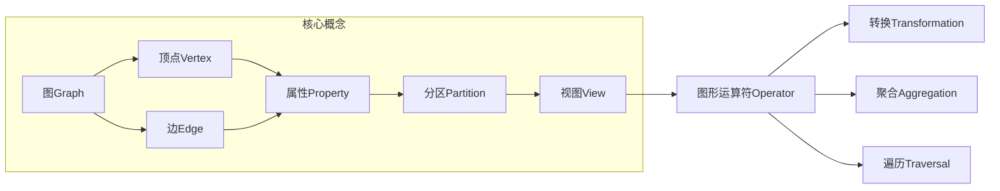
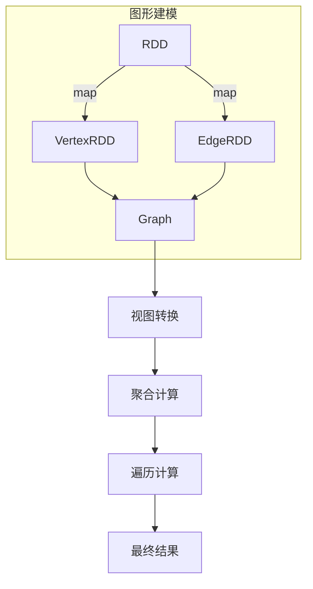

这是一篇关于Spark GraphX图计算引擎的深度技术文章。我会尽最大努力遵循你提供的大纲和要求，使用专业的技术语言，结合理论原理和实践案例，为读者提供一份内容丰富、条理清晰的技术分享。请耐心等待，我需要一些时间来完成这篇高质量的长篇技术博文。

# Spark GraphX图计算引擎原理与代码实例讲解

## 1. 背景介绍

### 1.1 问题的由来

在当今大数据时代，图形数据无处不在。从社交网络、推荐系统到生物信息学和交通网络，图形数据广泛应用于各个领域。然而,由于图形数据的复杂拓扑结构和大规模性质,对其进行高效处理和分析是一个巨大的挑战。

传统的图形处理系统通常采用单机架构,难以应对大规模图形数据的计算需求。因此,基于分布式计算框架(如Apache Spark)构建高性能的图形计算引擎,成为解决这一难题的关键途径。

### 1.2 研究现状

近年来,随着大数据技术的快速发展,越来越多的分布式图形计算系统应运而生,如Apache Giraph、Pregel、GraphX等。其中,GraphX作为Apache Spark生态系统中的图形计算引擎,因其与Spark紧密集成、能够高效利用内存等优势,受到了广泛关注。

GraphX在设计上采用了数据并行的思想,将图形数据划分为多个分区(Partition),并行执行图形计算任务。同时,它还提供了丰富的图形运算符(Operator),支持对图形数据进行转换、聚合、遍历等操作。

### 1.3 研究意义

深入研究GraphX的原理和实现,有助于我们更好地理解和应用这一强大的图形计算引擎。具体来说,本文的研究意义包括:

1. 帮助读者掌握图形计算的核心概念和算法原理,为将来从事相关工作打下坚实基础。
2. 通过代码实例,向读者展示如何使用GraphX进行图形建模、转换和分析,提升实践能力。
3. 探讨GraphX的优缺点、应用场景和未来发展趋势,为读者选择合适的图形计算工具提供参考。

### 1.4 本文结构  

本文共分为9个部分:

1. 背景介绍
2. 核心概念与联系
3. 核心算法原理与具体操作步骤
4. 数学模型和公式详细讲解与举例说明
5. 项目实践:代码实例和详细解释说明
6. 实际应用场景
7. 工具和资源推荐
8. 总结:未来发展趋势与挑战
9. 附录:常见问题与解答

接下来,我们将从GraphX的核心概念和原理出发,层层递进,最终实现从理论到实践的完整讲解。

## 2. 核心概念与联系

在深入探讨GraphX的细节之前,我们有必要先了解一些图形计算的核心概念,为后续内容打下基础。



### 2.1 图(Graph)

在GraphX中,一个图Graph由一组顶点(Vertex)和边(Edge)组成,用于表示实体(如人、地点等)及它们之间的关系。图可以是无向的(Undirected),也可以是有向的(Directed)。

### 2.2 顶点(Vertex)

顶点表示图中的实体,每个顶点都有一个唯一的ID(如长整型)和可选的属性值(Property)。属性可以是任意类型,如字符串、数值等,用于存储顶点的元数据信息。

### 2.3 边(Edge)

边表示顶点之间的关系或连接。每条边都有一个唯一的ID,以及关联的源顶点(srcId)和目标顶点(dstId)。与顶点类似,边也可以携带属性值。

### 2.4 分区(Partition)

为了实现数据并行,GraphX将图形数据划分为多个分区(Partition)。每个分区包含一部分顶点和边,可以在集群的不同节点上并行执行计算任务。

### 2.5 视图(View) 

视图是GraphX中的一个逻辑概念,用于表示对图形数据的不同"视角"。例如,可以构建一个仅包含特定类型顶点和边的子图视图,以满足特定的计算需求。

### 2.6 图形运算符(Operator)

GraphX提供了丰富的图形运算符,支持对图形数据进行转换(Transformation)、聚合(Aggregation)和遍历(Traversal)等操作。这些运算符可以链式组合,构建复杂的图形分析工作流。

接下来,我们将详细探讨GraphX的核心算法原理,揭示它在幕后是如何高效处理大规模图形数据的。

## 3. 核心算法原理与具体操作步骤  

GraphX的核心算法主要包括图形建模、图形视图转换、图形聚合和图形遍历等部分。下面我们将逐一进行深入讲解。

### 3.1 算法原理概述



GraphX的核心算法原理可以概括为以下四个步骤:

1. **图形建模**: 将原始数据转换为GraphX能够识别的VertexRDD和EdgeRDD,并构建Graph对象。
2. **视图转换**: 根据需求,对Graph应用不同的转换操作,生成新的视图。
3. **聚合计算**: 在视图上执行结构化的聚合操作,如连通分量、三角形计数等。
4. **遍历计算**: 在视图上执行遍历操作,如最短路径、PageRank等。

接下来,我们将详细介绍每个步骤的具体算法和操作流程。

### 3.2 算法步骤详解

#### 3.2.1 图形建模

图形建模的目标是将原始数据转换为GraphX能够理解的VertexRDD和EdgeRDD格式。

1. **VertexRDD**

VertexRDD是一种RDD[scala.Tuple2[VertexId, VD]]的特殊形式,其中:
- VertexId是顶点的唯一标识符,通常为Long型。
- VD是顶点的属性值,可以是任意类型。

我们可以从外部数据源(如文本文件、数据库等)读取顶点信息,并使用map转换函数构建VertexRDD。

示例:
```scala
val vertexRDD: RDD[(Long, String)] = sc.parallelize(Seq((1L, "A"), (2L, "B"), (3L, "C")))
```

2. **EdgeRDD**

EdgeRDD是一种RDD[scala.Tuple2[EdgeTriplet[VD,ED]]]的特殊形式,其中:
- EdgeTriplet包含了边的源顶点ID(srcId)、目标顶点ID(dstId)以及边的属性值(attr)。
- VD和ED分别表示顶点属性值和边属性值的类型。

我们可以从外部数据源读取边信息,并使用map转换函数构建EdgeRDD。

示例:
```scala
val edgeRDD: RDD[Edge[Int]] = sc.parallelize(Seq(Edge(1L, 2L, 7), Edge(2L, 3L, 8), Edge(1L, 3L, 9)))
```

3. **构建Graph**

有了VertexRDD和EdgeRDD,我们就可以调用GraphX的Graph.apply构造函数创建Graph对象了。

```scala
val graph: Graph[String, Int] = Graph(vertexRDD, edgeRDD)
```

通过这一步,我们已经成功将原始数据转换为GraphX能够识别的图形结构,为后续的视图转换、聚合计算和遍历计算奠定了基础。

#### 3.2.2 视图转换

视图转换允许我们从不同的角度观察和操作图形数据。GraphX提供了多种转换操作符,例如subgraph、mapVertices、mapTriplets等。

1. **subgraph**

subgraph运算符根据给定的顶点和边的条件,从原图中提取出一个子图视图。

```scala
val subGraph: Graph[VD, ED] = graph.subgraph(vpredicate, epredicate)
```

其中,vpredicate和epredicate分别是判断顶点和边是否应该包含在子图中的函数。

2. **mapVertices**

mapVertices运算符对图中的每个顶点应用一个转换函数,生成一个新的顶点RDD。

```scala
val newGraph: Graph[VertexData, ED] = graph.mapVertices((id, data) => newVertexData)
```

这种转换常用于更新顶点的属性值或执行一些基于顶点的计算。

3. **mapTriplets**

mapTriplets运算符对图中的每个三元组(triplet)应用一个转换函数,生成一个新的边RDD。

```scala
val newGraph: Graph[VD, EdgeData] = graph.mapTriplets(triplet => newEdgeData)
```

triplet包含了边的源顶点、目标顶点以及它们的属性值,因此我们可以基于这些信息执行一些基于边的计算或转换。

通过这些转换操作符,我们可以根据具体需求,从原始图形数据中构建出满足特定条件的视图,为后续的聚合和遍历计算做好准备。

#### 3.2.3 聚合计算

聚合计算是GraphX中一类重要的图形算法,用于计算图形的全局性质或统计信息。常见的聚合算法包括连通分量、三角形计数等。

1. **连通分量**

连通分量算法用于找出图中的连通子图。GraphX提供了connectedComponents运算符来实现这一功能。

```scala
val componentRDD: VertexRDD[VertexId] = graph.connectedComponents()
```

返回的VertexRDD中,每个顶点的值表示它所属的连通分量ID。

2. **三角形计数**

三角形计数算法统计图中存在的三角形(完全连通的三个顶点)的数量。

```scala
val triangleCount: Double = graph.triangleCount().vertices
```

triangleCount返回一个估计值,表示图中三角形的数量。

3. **度数分布**

度数分布统计了图中每个顶点的入度(inDegree)和出度(outDegree)的分布情况。

```scala
val inDegrees: VertexRDD[Int] = graph.inDegrees
val outDegrees: VertexRDD[Int] = graph.outDegrees
```

通过这些聚合算法,我们可以深入了解图形数据的全局性质,为后续的分析和建模工作提供重要参考。

#### 3.2.4 遍历计算

遍历计算是另一类重要的图形算法,用于在图形结构上执行各种探索和计算任务。常见的遍历算法包括最短路径、PageRank等。

1. **最短路径**

最短路径算法用于计算图中任意两个顶点之间的最短距离。GraphX提供了shortestPaths运算符来实现这一功能。

```scala
val shortestPathsRDD: VertexRDD[Map[VertexId, Int]] = graph.shortestPaths.vertices
```

返回的VertexRDD中,每个顶点的值是一个Map,存储了从该顶点到其他顶点的最短距离。

2. **PageRank**

PageRank是一种著名的链接分析算法,常用于评估网页的重要性和排名。GraphX实现了该算法的并行版本。

```scala
val pageRankRDD: VertexRDD[Double] = graph.pageRank(0.001).vertices
```

返回的VertexRDD中,每个顶点的值表示其PageRank值。

3. **三角形列举**

三角形列举算法用于列出图中所有的三角形。

```scala
val triangles: RDD[Array[VertexId]] = graph.triangles.entries.map(f._2)
```

返回的RDD中,每个元素是一个长度为3的顶点ID数组,表示一个三角形。

通过这些遍历算法,我们可以深入探索图形数据的局部结构和拓扑特征,为各种图形分析任务提供