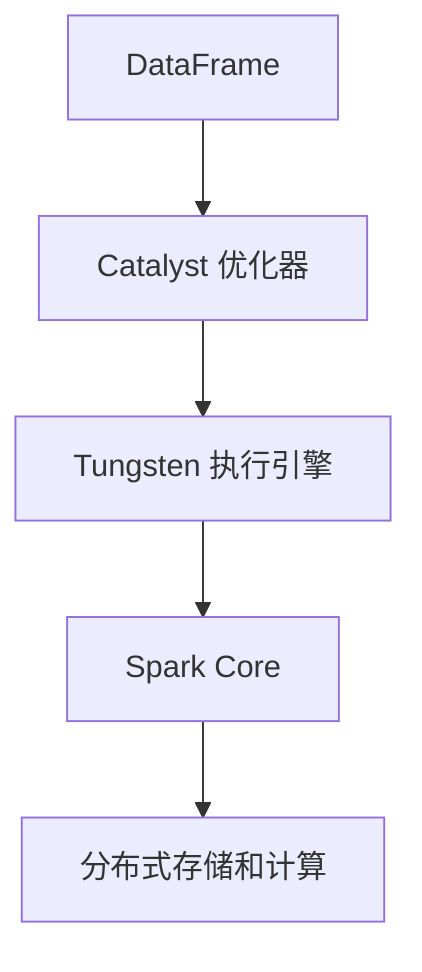

# Spark SQL 原理与代码实例讲解

## 1. 背景介绍

### 1.1 问题的由来

在大数据时代,海量的结构化和非结构化数据不断产生,如何高效地处理和分析这些数据成为了一个巨大的挑战。传统的数据库系统在处理大规模数据集时往往会遇到性能瓶颈,无法满足实时分析的需求。因此,需要一种新的大数据处理框架来解决这个问题。

Apache Spark 作为一个开源的大数据处理引擎,凭借其高度的可扩展性、容错性和实时计算能力,成为了大数据处理领域的重要工具。Spark SQL 作为 Spark 的一个重要模块,提供了结构化数据处理的能力,使得用户可以使用类似于传统数据库的 SQL 语言来查询和处理大规模数据集。

### 1.2 研究现状

目前,Spark SQL 已经被广泛应用于各种大数据场景,如交互式数据分析、机器学习、实时流处理等。它提供了高度优化的查询执行引擎,能够自动优化查询计划,并利用多种优化技术(如代码生成、内存列存储等)来加速查询执行。

然而,Spark SQL 的内部原理和实现细节对于大多数用户来说仍然是一个黑盒子。了解 Spark SQL 的工作原理和核心算法,不仅有助于更好地利用它的强大功能,还可以帮助开发人员进一步优化和扩展 Spark SQL,以满足特定的应用场景需求。

### 1.3 研究意义

深入探讨 Spark SQL 的原理和实现细节,对于以下几个方面具有重要意义:

1. **性能优化**:了解 Spark SQL 的查询优化和执行策略,可以帮助开发人员更好地调优查询性能,提高数据处理效率。

2. **功能扩展**:掌握 Spark SQL 的核心架构和算法,有助于开发人员根据特定需求扩展和定制 Spark SQL 的功能。

3. **故障排查**:理解 Spark SQL 的内部工作机制,可以更容易地定位和解决在实际应用中遇到的问题。

4. **知识传播**:通过深入探讨 Spark SQL 的原理和实现细节,可以帮助更多的开发人员和数据工程师掌握这一重要的大数据处理工具。

### 1.4 本文结构

本文将从以下几个方面深入探讨 Spark SQL 的原理和实现:

1. 核心概念与架构
2. 查询优化和执行策略
3. 代码实现细节
4. 性能优化技术
5. 实际应用场景
6. 未来发展趋势和挑战

通过对这些关键方面的深入剖析,读者将能够全面了解 Spark SQL 的工作原理,掌握其核心算法和实现细节,并学习如何更好地利用和扩展这一强大的大数据处理工具。

## 2. 核心概念与联系

在深入探讨 Spark SQL 的原理和实现之前,我们需要先了解一些核心概念和它们之间的联系。这些概念构成了 Spark SQL 的基础,对于理解后续内容至关重要。

### 2.1 DataFrame

DataFrame 是 Spark SQL 中最重要的抽象概念之一。它可以被视为一个分布式的关系数据表,具有行和列的结构。DataFrame 提供了一种高效的方式来处理大规模的结构化和半结构化数据。

DataFrame 的设计受到了 Pandas 和 R 中的 DataFrame 概念的启发,但是在分布式环境下进行了扩展和优化。它支持多种数据格式(如 JSON、Parquet、CSV 等),并提供了丰富的 API 和优化器,使得数据处理和分析变得更加高效。

### 2.2 Catalyst 优化器

Catalyst 优化器是 Spark SQL 中的查询优化和执行引擎。它负责将用户的查询转换为高效的物理执行计划,并利用多种优化技术(如谓词下推、列剪裁、代码生成等)来加速查询执行。

Catalyst 优化器采用了基于规则的查询优化策略,通过一系列优化规则对逻辑查询计划进行转换和优化,最终生成高效的物理执行计划。这种基于规则的优化方式使得 Catalyst 具有很好的可扩展性和灵活性,能够轻松地添加新的优化规则。

### 2.3 Tungsten 执行引擎

Tungsten 执行引擎是 Spark SQL 中负责实际执行查询计划的组件。它采用了多种技术来提高查询执行的效率,如内存列存储、代码生成、缓存管理等。

Tungsten 执行引擎的核心思想是尽可能地利用现代硬件的特性(如 CPU 向量化指令、缓存局部性等)来加速数据处理。它通过生成高度优化的字节码来执行查询计划,避免了解释器的开销,从而大幅提高了查询执行的性能。

### 2.4 Spark SQL 与 Spark Core 的关系

Spark SQL 是构建在 Spark Core 之上的一个模块,它利用了 Spark Core 提供的分布式计算框架和容错机制。Spark SQL 将用户的查询转换为 Spark Core 中的 RDD 或 DataFrame 操作,从而实现了分布式执行和容错。

同时,Spark SQL 也为 Spark Core 提供了结构化数据处理的能力,使得开发人员可以使用熟悉的 SQL 语言来处理大规模数据集,而不必直接编写复杂的分布式代码。

### 2.5 核心概念关系图

为了更好地理解这些核心概念之间的关系,我们可以使用 Mermaid 流程图进行可视化:

在这个流程图中,我们可以看到:

1. DataFrame 是用户与 Spark SQL 交互的入口,它将用户的查询或数据操作转换为内部表示。
2. Catalyst 优化器负责将 DataFrame 上的操作转换为高效的逻辑执行计划。
3. Tungsten 执行引擎将优化后的逻辑执行计划转换为高度优化的物理执行计划,并利用多种技术加速执行。
4. Spark Core 提供了底层的分布式存储和计算能力,支持 Spark SQL 的分布式执行和容错。

通过这些核心概念及其关系,我们可以初步了解 Spark SQL 的整体架构和工作流程。在后续章节中,我们将深入探讨每个组件的原理和实现细节。

## 3. 核心算法原理 & 具体操作步骤

在前一章节中,我们介绍了 Spark SQL 的核心概念和整体架构。本章将重点探讨 Spark SQL 中的核心算法原理和具体操作步骤,包括查询优化、执行计划生成和查询执行等方面。

### 3.1 算法原理概述

Spark SQL 的核心算法可以概括为以下几个主要步骤:

1. **查询解析**: 将用户输入的 SQL 查询解析为抽象语法树 (Abstract Syntax Tree, AST)。

2. **逻辑计划生成**: 基于 AST,生成初始的逻辑执行计划。

3. **查询优化**: 通过一系列优化规则对逻辑执行计划进行转换和优化,生成优化后的逻辑执行计划。

4. **物理计划生成**: 将优化后的逻辑执行计划转换为物理执行计划。

5. **代码生成**: 为物理执行计划中的每个操作符生成高度优化的字节码。

6. **查询执行**: 执行生成的字节码,完成查询计算并返回结果。

在这个过程中,查询优化和执行计划生成是最为关键的两个步骤,它们直接影响着查询的执行效率。下面我们将详细探讨这两个步骤的原理和具体操作步骤。

### 3.2 算法步骤详解

#### 3.2.1 查询优化

查询优化是 Spark SQL 中最为复杂和关键的一个步骤。它的主要目标是通过一系列优化规则,将初始的逻辑执行计划转换为更加高效的执行计划。

Spark SQL 采用了基于规则的查询优化策略,这种策略具有良好的可扩展性和灵活性。优化过程可以概括为以下几个步骤:

1. **规则匹配**: 在当前的逻辑执行计划中匹配可应用的优化规则。

2. **规则应用**: 对匹配到的规则进行应用,生成新的逻辑执行计划。

3. **规则迭代**: 重复步骤 1 和 2,直到不再有可应用的优化规则为止。

Spark SQL 中实现了多种优化规则,包括但不限于:

- **谓词下推**: 将过滤条件尽可能下推到数据源,减少不必要的数据传输。
- **投影剪裁**: 只读取查询所需的列,避免读取整行数据。
- **常量折叠**: 将常量表达式预计算,减少运行时计算开销。
- **连接重排**: 根据数据大小和选择性调整连接顺序,减少中间结果的大小。
- **子查询展开**: 将子查询转换为连接操作,提高执行效率。

这些优化规则的应用顺序和策略对查询性能也有很大影响。Spark SQL 采用了一种基于成本模型的优化策略,通过估算每个候选执行计划的代价,选择最优的执行计划。

#### 3.2.2 物理计划生成

经过查询优化后,Spark SQL 将得到一个优化后的逻辑执行计划。接下来,需要将这个逻辑执行计划转换为物理执行计划,以便后续的执行。

物理执行计划由一系列物理操作符 (Physical Operator) 组成,每个物理操作符对应着一个或多个 RDD 或 DataFrame 操作。物理操作符的生成过程可以概括为以下几个步骤:

1. **操作符选择**: 根据逻辑执行计划中的每个逻辑操作符,选择合适的物理操作符实现。

2. **操作符链接**: 将选择的物理操作符按照执行顺序链接起来,形成物理执行计划。

3. **代价估算**: 估算物理执行计划的执行代价,用于后续的优化和调度。

在生成物理执行计划的过程中,Spark SQL 还会应用一些特定的优化技术,如代码生成、内存列存储等,以进一步提高查询执行的效率。我们将在后续章节中详细介绍这些优化技术。

### 3.3 算法优缺点

Spark SQL 的核心算法具有以下优点:

1. **高度优化**: 通过查询优化和执行计划优化,Spark SQL 能够生成高效的执行计划,充分利用现代硬件的特性。

2. **可扩展性**: 基于规则的查询优化策略使得 Spark SQL 具有良好的可扩展性,可以方便地添加新的优化规则。

3. **容错性**: 基于 Spark Core 的分布式计算框架,Spark SQL 具有良好的容错性,能够自动处理节点故障。

4. **统一的数据处理框架**: Spark SQL 与 Spark Core 紧密集成,为用户提供了统一的数据处理框架,支持结构化和非结构化数据的处理。

同时,Spark SQL 的核心算法也存在一些缺点和局限性:

1. **优化复杂度**: 查询优化涉及大量规则和代价模型,优化过程的复杂度较高,对系统资源的消耗也较大。

2. **优化效果依赖于数据统计信息**: 查询优化的效果在很大程度上依赖于数据统计信息的准确性,如果统计信息不准确,可能导致生成的执行计划不是最优的。

3. **代码生成开销**: 虽然代码生成可以提高查询执行的效率,但是生成字节码的过程也会带来一定的开销,对于简单的查询可能不会带来性能提升。

4. **内存消耗**: Spark SQL 采用了内存列存储等优化技术,对内存的消耗较大,可能会导致内存不足的问题。

总的来说,Spark SQL 的核心算法在查询优化和执行效率方面表现出色,但也存在一些需要进一