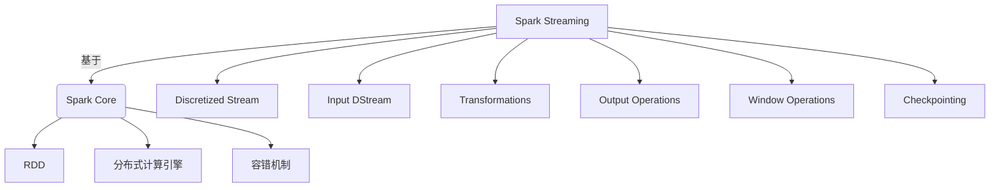
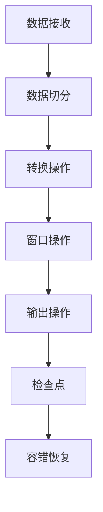

# Spark Streaming 原理与代码实例讲解

## 1. 背景介绍

### 1.1 问题的由来

在当今的大数据时代，实时数据处理已经成为了一个非常重要的课题。从社交媒体上的用户活动、网络日志、物联网设备传感器数据到金融交易记录,海量的数据源源不断地产生着新的数据。对这些实时数据进行及时处理和分析,可以为企业带来巨大的价值,例如实时监控系统状态、检测欺诈行为、个性化推荐等。然而,传统的批处理系统无法满足实时数据处理的需求,因为它们需要先将数据存储到磁盘,然后再进行处理,这种延迟是无法接受的。

### 1.2 研究现状

为了解决实时数据处理的问题,近年来出现了多种流式计算框架,如 Apache Storm、Apache Spark Streaming、Apache Flink 等。其中,Apache Spark Streaming 作为 Apache Spark 生态系统中的一个重要组件,凭借其与 Spark 核心引擎的无缝集成、高容错性、高吞吐量等优势,已经成为了流式计算领域的主流选择之一。

### 1.3 研究意义

深入理解 Spark Streaming 的原理和实现细节,对于构建高效、可靠的实时数据处理系统至关重要。本文将全面剖析 Spark Streaming 的核心概念、算法原理、数学模型,并通过代码实例详细解释其实现细节,旨在帮助读者掌握 Spark Streaming 的本质,为实际应用提供理论和实践指导。

### 1.4 本文结构

本文首先介绍 Spark Streaming 的核心概念和与 Spark 核心引擎的关系,然后深入探讨其算法原理和数学模型,接着通过代码实例详细解释其实现细节。最后,本文将讨论 Spark Streaming 在实际应用中的场景,并分享相关的学习资源和工具推荐,同时对未来的发展趋势和挑战进行展望。

## 2. 核心概念与联系

Apache Spark Streaming 是 Apache Spark 的一个扩展库,用于构建可扩展、高吞吐量、容错的流式应用程序。它基于 Spark 核心引擎构建,将实时数据流视为一系列持续到达的小批量数据,并利用 Spark 的分布式计算能力对这些小批量数据进行处理。

Spark Streaming 的核心概念包括:

1. **Discretized Stream (离散化流)**: Spark Streaming 将实时数据流视为一系列持续到达的小批量数据,称为 DStream。每个 DStream 由一系列连续的 RDD 组成,这些 RDD 包含了特定时间段内的数据。

2. **Input DStream**: 从外部数据源(如 Kafka、Flume、Kinesis 等)接收实时数据,创建 Input DStream。

3. **Transformations**: 与 Spark 的 RDD 转换类似,DStream 也支持丰富的转换操作,如 map、flatMap、filter、reduceByKey 等,用于构建流式计算管道。

4. **Output Operations**: 将处理后的 DStream 推送到外部系统(如 HDFS、数据库等)进行存储或进一步处理。

5. **Window Operations**: 对源 DStream 进行窗口化操作,根据事件时间而不是处理时间对数据进行分组。

6. **Checkpointing**: 为了实现故障恢复,Spark Streaming 将 DStream 操作的元数据信息保存到可靠的存储系统中,如 HDFS。

Spark Streaming 紧密集成到 Spark 生态系统中,可以无缝利用 Spark 的分布式计算引擎、内存计算优化、容错机制等特性,从而实现高吞吐量、低延迟和高容错性的流式计算。

## 3. 核心算法原理 & 具体操作步骤

### 3.1 算法原理概述

Spark Streaming 的核心算法原理是将实时数据流离散化为一系列小批量数据,然后利用 Spark 的分布式计算引擎对这些小批量数据进行处理。具体来说,Spark Streaming 会定期从数据源(如 Kafka、Flume 等)获取一个数据批次,并将其转换为 Spark 的 RDD,然后对这个 RDD 应用所需的转换操作。处理完成后,结果数据可以被推送到外部系统(如 HDFS、数据库等)进行存储或进一步处理。

这种基于小批量处理的方式,使 Spark Streaming 能够充分利用 Spark 的分布式计算优势,同时也提供了一定程度的容错能力。如果在处理过程中发生故障,Spark Streaming 可以从最近一次的检查点(Checkpoint)恢复计算,而不会丢失所有数据。

### 3.2 算法步骤详解

Spark Streaming 的算法步骤可以概括为以下几个关键步骤:

1. **数据接收**: 从外部数据源(如 Kafka、Flume 等)接收实时数据,创建 Input DStream。

2. **数据切分**: 将 Input DStream 按照指定的批次间隔(如 1 秒)切分为一系列小批量数据,每个小批量数据对应一个 RDD。

3. **转换操作**: 对每个 RDD 应用所需的转换操作,如 map、flatMap、filter、reduceByKey 等,构建流式计算管道。

4. **窗口操作(可选)**: 对源 DStream 进行窗口化操作,根据事件时间而不是处理时间对数据进行分组。

5. **输出操作**: 将处理后的 RDD 推送到外部系统(如 HDFS、数据库等)进行存储或进一步处理。

6. **检查点**: 为了实现故障恢复,Spark Streaming 将 DStream 操作的元数据信息保存到可靠的存储系统中,如 HDFS。

7. **容错恢复**: 如果在处理过程中发生故障,Spark Streaming 可以从最近一次的检查点恢复计算。

### 3.3 算法优缺点

Spark Streaming 算法的优点包括:

1. **高吞吐量**: 由于基于 Spark 的分布式计算引擎,Spark Streaming 能够在大规模数据集上实现高吞吐量的流式计算。

2. **容错性**: 通过检查点机制,Spark Streaming 能够从故障中恢复,保证计算的可靠性。

3. **与 Spark 生态系统集成**: Spark Streaming 与 Spark 核心引擎无缝集成,可以充分利用 Spark 的各种优化和扩展功能。

4. **编程模型简单**: Spark Streaming 提供了类似于 Spark 的编程模型,使得开发人员可以轻松地构建流式应用程序。

然而,Spark Streaming 算法也存在一些缺点:

1. **延迟**: 由于基于小批量处理,Spark Streaming 无法实现真正的流式处理,存在一定的延迟。

2. **内存开销**: 为了实现容错,Spark Streaming 需要在内存中维护一定量的数据,这可能会导致较高的内存开销。

3. **事件时间处理复杂**: 对于基于事件时间的窗口操作,Spark Streaming 的实现相对较为复杂。

### 3.4 算法应用领域

Spark Streaming 算法广泛应用于各种实时数据处理场景,包括但不限于:

1. **实时日志分析**: 从Web服务器、应用程序等实时收集日志数据,进行实时分析和监控。

2. **实时流式数据处理**: 处理来自社交媒体、物联网设备等的实时数据流,进行实时分析和响应。

3. **实时机器学习**: 利用流式数据训练和更新机器学习模型,实现实时预测和决策。

4. **实时fraud检测**: 实时监控金融交易数据,检测潜在的欺诈行为。

5. **实时推荐系统**: 基于用户的实时行为数据,提供个性化的实时推荐。

## 4. 数学模型和公式 & 详细讲解 & 举例说明

### 4.1 数学模型构建

为了更好地理解 Spark Streaming 的核心算法原理,我们可以构建一个数学模型来描述其工作流程。

假设我们有一个实时数据流 $S$,它是一个无限序列,可以表示为:

$$S = \{s_1, s_2, s_3, \ldots\}$$

其中,每个 $s_i$ 表示一个数据元素。

Spark Streaming 将这个无限序列离散化为一系列小批量数据,每个小批量数据包含一定时间段内的数据元素。我们可以将这个过程表示为一个函数 $D$,它将无限序列 $S$ 映射到一个由有限序列组成的序列 $D(S)$:

$$D(S) = \{D_1, D_2, D_3, \ldots\}$$

其中,每个 $D_i$ 是一个有限序列,表示第 $i$ 个小批量数据,包含了特定时间段内的数据元素。

对于每个小批量数据 $D_i$,Spark Streaming 将其转换为一个 RDD,并对该 RDD 应用所需的转换操作,如 map、flatMap、filter、reduceByKey 等。我们可以将这个过程表示为一个函数 $T$,它将一个小批量数据 $D_i$ 映射到一个处理后的 RDD $T(D_i)$。

最后,Spark Streaming 将处理后的 RDD 推送到外部系统进行存储或进一步处理。我们可以将这个过程表示为一个函数 $O$,它将一个处理后的 RDD $T(D_i)$ 映射到一个输出结果 $O(T(D_i))$。

综合起来,Spark Streaming 的整个工作流程可以表示为:

$$O(T(D_i)), \text{ where } D_i \in D(S)$$

这个数学模型清晰地描述了 Spark Streaming 的核心算法原理:将实时数据流离散化为一系列小批量数据,对每个小批量数据进行转换操作,最后将处理后的结果输出到外部系统。

### 4.2 公式推导过程

在上一节中,我们构建了一个数学模型来描述 Spark Streaming 的工作流程。现在,我们将详细推导这个模型中涉及的公式。

首先,我们定义一个实时数据流 $S$,它是一个无限序列:

$$S = \{s_1, s_2, s_3, \ldots\}$$

其中,每个 $s_i$ 表示一个数据元素。

Spark Streaming 将这个无限序列离散化为一系列小批量数据,每个小批量数据包含一定时间段内的数据元素。我们可以将这个过程表示为一个函数 $D$,它将无限序列 $S$ 映射到一个由有限序列组成的序列 $D(S)$:

$$D(S) = \{D_1, D_2, D_3, \ldots\}$$

其中,每个 $D_i$ 是一个有限序列,表示第 $i$ 个小批量数据。

我们可以进一步定义 $D_i$ 的构成方式。假设我们将实时数据流 $S$ 按照时间间隔 $\Delta t$ 进行切分,那么第 $i$ 个小批量数据 $D_i$ 包含了从时间 $(i-1)\Delta t$ 到 $i\Delta t$ 之间的所有数据元素,即:

$$D_i = \{s_j \in S \mid (i-1)\Delta t < t(s_j) \leq i\Delta t\}$$

其中,$t(s_j)$ 表示数据元素 $s_j$ 的时间戳。

对于每个小批量数据 $D_i$,Spark Streaming 将其转换为一个 RDD,并对该 RDD 应用所需的转换操作,如 map、flatMap、filter、reduceByKey 等。我们可以将这个过程表示为一个函数 $T$