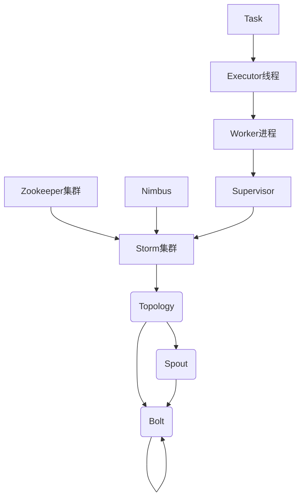

# Storm原理与代码实例讲解

## 1. 背景介绍

### 1.1 问题的由来

在当今大数据时代，海量数据的实时处理已经成为各行业的迫切需求。传统的批处理系统无法满足对实时性和低延迟的要求。因此，需要一种新的分布式实时计算模型来解决这一问题。Apache Storm作为一个分布式实时计算系统应运而生。

### 1.2 研究现状

Apache Storm自2011年开源以来,已经被众多公司和组织广泛使用,如Twitter、Spotify、Yahoo!等。它的核心设计理念是提供一种可靠、容错、高性能的分布式实时计算模型,能够实时处理大规模数据流。

### 1.3 研究意义

深入研究Storm的原理和实现,有助于我们更好地理解和掌握分布式实时计算的核心概念和关键技术,为构建高性能、高可用的实时数据处理系统奠定基础。同时,通过代码实例的讲解,能够帮助开发者更好地掌握Storm的使用方法和最佳实践。

### 1.4 本文结构

本文首先介绍Storm的核心概念和设计理念,然后详细阐述其核心算法原理和数学模型,接着通过代码实例讲解Storm的使用方法,最后探讨Storm在实际应用场景中的应用,并对其未来发展趋势和面临的挑战进行展望。

## 2. 核心概念与联系



Storm集群由以下核心组件组成:

1. **Topology(拓扑)**: 是一个数据流处理单元,由Spout和Bolt组成,定义了数据流转发路径。

2. **Spout**: 是数据流的源头,从外部系统(如Kafka、文件等)获取数据,并将数据注入到Topology中。

3. **Bolt**: 对从Spout或上游Bolt发送过来的数据流进行处理,如过滤、函数操作、持久化等。

4. **Task**: 是Spout或Bolt的实际执行单元,由Executor线程启动和运行。

5. **Worker进程**: 运行在工作节点上的JVM进程,用于执行Task。

6. **Executor线程**: 在Worker进程中创建的线程,用于执行Task。

7. **Nimbus**: 是Storm集群的主控节点,负责分发代码、分配任务、监控故障等。

8. **Supervisor**: 运行在工作节点上,负责启动和监控Worker进程。

9. **Zookeeper集群**: 提供集群协调和状态存储服务。

Storm通过将Topology划分为多个Task,并将这些Task分布在集群中的多个Worker进程上并行执行,从而实现了流数据的分布式实时处理。

## 3. 核心算法原理 & 具体操作步骤

### 3.1 算法原理概述

Storm的核心算法是**流分组(Stream Grouping)**,用于确定如何将一个Bolt的输出数据流分发到下游Bolt的Task中。主要有以下几种分组策略:

1. **Shuffle Grouping**: 随机分组,将输出数据随机分发到下游Bolt的Task中。

2. **Fields Grouping**: 按字段分组,根据Tuple中的某些字段值将相同值的Tuple分发到同一个Task中。

3. **Global Grouping**: 全局分组,将所有输出数据流分发到下游Bolt的一个Task中。

4. **Direct Grouping**: 直接分组,根据输出Task的索引直接分发到下游Bolt的对应Task中。

5. **Local or Shuffle Grouping**: 本地或随机分组,如果目标Bolt与当前Bolt在同一个Worker进程中,则采用直接分组,否则采用随机分组。

### 3.2 算法步骤详解

以Fields Grouping为例,其核心算法步骤如下:

1. 确定分组字段: 指定Tuple中用于分组的字段列表。

2. 计算分组键: 对分组字段值进行哈希运算,得到一个分组键。

$$
groupKey = hash(fieldValues)
$$

3. 计算目标Task索引: 根据分组键和目标Bolt的Task数量,计算出目标Task的索引。

$$
targetTaskIndex = groupKey \% numTasks
$$

4. 发送Tuple: 将Tuple发送到目标Task对应的队列中。

通过这种方式,具有相同分组字段值的Tuple将被分发到同一个Task中,从而实现了数据的局部性,提高了处理效率。

### 3.3 算法优缺点

**优点**:

- 支持多种灵活的分组策略,满足不同场景的需求。
- 通过数据局部性提高了处理效率。
- 具有良好的容错和恢复能力。

**缺点**:

- 随机分组可能导致数据倾斜,影响整体性能。
- 全局分组存在单点瓶颈问题。
- 分组策略的选择需要根据具体场景权衡利弊。

### 3.4 算法应用领域

流分组算法广泛应用于Storm的各种场景,如实时数据处理、实时分析、实时监控等。它为构建分布式实时计算系统提供了关键支持。

## 4. 数学模型和公式 & 详细讲解 & 举例说明

### 4.1 数学模型构建

为了评估Storm集群的性能,我们可以构建一个简化的数学模型。假设集群中有N个Worker进程,每个Worker进程运行M个Task,则集群总的Task数量为:

$$
TotalTasks = N \times M
$$

假设每个Task的平均处理速率为R(tuples/秒),则集群的总处理能力为:

$$
TotalCapacity = TotalTasks \times R = N \times M \times R
$$

### 4.2 公式推导过程

现在,我们考虑数据流的吞吐量。假设数据流的输入速率为I(tuples/秒),经过一系列Bolt的处理后,输出速率为O(tuples/秒)。由于每个Bolt可能会执行过滤、投影等操作,因此输出速率通常小于等于输入速率,即:

$$
O \leq I
$$

为了保证系统的稳定性,需要满足:

$$
O \leq TotalCapacity
$$

将上面两个不等式合并,我们可以得到:

$$
I \leq TotalCapacity = N \times M \times R
$$

这个不等式给出了Storm集群处理数据流的理论上限。只有当输入速率I小于等于集群的总处理能力时,系统才能保持稳定运行。

### 4.3 案例分析与讲解

假设我们有一个Storm集群,包含10个Worker进程,每个Worker进程运行4个Task,每个Task的平均处理速率为10000 tuples/秒。现在有一个实时数据流的输入速率为200000 tuples/秒,请问这个集群是否能够稳定处理这个数据流?

根据前面的公式,我们可以计算出:

$$
\begin{aligned}
TotalTasks &= 10 \times 4 = 40 \\
TotalCapacity &= 40 \times 10000 = 400000 \\
I &= 200000 \\
\end{aligned}
$$

由于I < TotalCapacity,因此这个Storm集群有足够的处理能力来稳定处理这个实时数据流。

### 4.4 常见问题解答

**Q: 如何确定Task的数量?**

A: Task的数量取决于数据流的处理复杂度和集群的硬件资源。通常情况下,Task的数量应该设置为CPU核心数的2-4倍,以充分利用CPU资源。同时,也需要考虑内存和网络带宽等其他资源的限制。

**Q: 如何优化Storm集群的性能?**

A: 可以从以下几个方面进行优化:

1. 优化分组策略,避免数据倾斜。
2. 合理配置Worker进程和Task的数量。
3. 优化Bolt的处理逻辑,减少不必要的操作。
4. 使用更高性能的硬件资源。
5. 优化数据源和数据sink的性能。

## 5. 项目实践:代码实例和详细解释说明

### 5.1 开发环境搭建

1. 安装Java 8或更高版本
2. 下载并解压Storm发行版
3. 配置环境变量
4. 启动Storm集群

```bash
# 启动Zookeeper
bin/zookeeper.sh start

# 启动Nimbus
bin/storm nimbus &

# 启动Supervisor
bin/storm supervisor &
```

### 5.2 源代码详细实现

以下是一个简单的WordCount示例,用于统计实时数据流中单词的出现次数。

**Spout实现**:

```java
public class WordSpout extends BaseRichSpout {
    private SpoutOutputCollector collector;
    private String[] sentences = {
        "Hello Storm Hello",
        "Hello World",
        "Storm is a distributed realtime computation system"
    };
    private int index = 0;

    @Override
    public void open(Map conf, TopologyContext context, SpoutOutputCollector collector) {
        this.collector = collector;
    }

    @Override
    public void nextTuple() {
        String sentence = sentences[index];
        String[] words = sentence.split(" ");
        for (String word : words) {
            collector.emit(new Values(word));
        }
        index = (index + 1) % sentences.length;
        Thread.sleep(1000); // 每秒发送一个句子
    }

    @Override
    public void declareOutputFields(OutputFieldsDeclarer declarer) {
        declarer.declare(new Fields("word"));
    }
}
```

**Bolt实现**:

```java
public class WordCountBolt extends BaseRichBolt {
    private OutputCollector collector;
    private Map<String, Integer> counts = new HashMap<>();

    @Override
    public void prepare(Map conf, TopologyContext context, OutputCollector collector) {
        this.collector = collector;
    }

    @Override
    public void execute(Tuple tuple) {
        String word = tuple.getString(0);
        Integer count = counts.get(word);
        if (count == null) {
            count = 0;
        }
        count++;
        counts.put(word, count);
        collector.emit(new Values(word, count));
    }

    @Override
    public void declareOutputFields(OutputFieldsDeclarer declarer) {
        declarer.declare(new Fields("word", "count"));
    }
}
```

**Topology定义**:

```java
TopologyBuilder builder = new TopologyBuilder();
builder.setSpout("word-spout", new WordSpout(), 2);
builder.setBolt("word-count", new WordCountBolt(), 4)
    .fieldsGrouping("word-spout", new Fields("word"));

Config conf = new Config();
conf.setDebug(true);

if (args != null && args.length > 0) {
    conf.setNumWorkers(3);

    StormSubmitter.submitTopologyWithProgressBar(args[0], conf, builder.createTopology());
} else {
    LocalCluster cluster = new LocalCluster();
    cluster.submitTopology("word-count", conf, builder.createTopology());
}
```

### 5.3 代码解读与分析

1. `WordSpout`是一个简单的Spout实现,它每秒发送一个句子,将句子拆分为单词,并将每个单词作为一个Tuple发送出去。

2. `WordCountBolt`是一个Bolt实现,它接收从Spout发送过来的单词Tuple,统计每个单词出现的次数,并将结果作为新的Tuple发送出去。

3. Topology定义中,首先创建一个`TopologyBuilder`对象,然后添加Spout和Bolt组件。Spout的并行度设置为2,即启动2个Task;Bolt的并行度设置为4,即启动4个Task。

4. 使用`fieldsGrouping`策略,根据Tuple中的"word"字段进行分组,确保具有相同单词的Tuple被发送到同一个Bolt Task中,以实现数据局部性。

5. 最后,根据命令行参数,either在本地模式下运行Topology,或者将Topology提交到Storm集群中运行。

### 5.4 运行结果展示

在本地模式下运行Topology,输出结果如下:

```
...
word-count [375, 5]
word-count [Storm, 2]
word-count [Hello, 3]
word-count [a, 1]
word-count [realtime, 1]
word-count [World, 1]
word-count [computation, 1]
word-count [is, 1]
word-count [distributed, 1]
word-count [system, 1]
```

可以看到,单词及其出现次数被正确统计和输出。

## 6. 实际应用场景

### 6.1 实时数据处理

Storm最典型的应用场景是实时数据处理,如实时日志处理、实时网络监控、实时推荐系统等。通过构建合适的Topology,可以对实时数据流进行过滤、转换、聚合等操作,并将处理结果持久化或发送到下游系统。

### 6.2