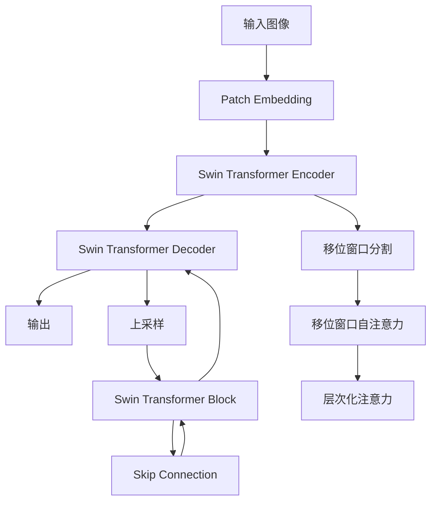

# SwinTransformer原理与代码实例讲解

## 1. 背景介绍

### 1.1 问题的由来

在计算机视觉领域,卷积神经网络(CNN)长期占据主导地位,在图像分类、目标检测和语义分割等任务上表现出色。然而,传统CNN在处理大尺度变化和长程依赖关系时存在局限性。CNN的感受野随着网络深度的增加而增大,但增长速率较慢,导致难以有效捕获图像中的全局信息。

为了解决这个问题,Vision Transformer(ViT)被提出,它完全放弃了CNN,而是采用了自注意力机制来建模长程依赖关系。ViT在大量数据集上进行预训练后,在多个视觉任务上取得了出色的性能。但是,ViT在处理高分辨率图像时,计算和内存消耗非常大,这限制了其在实际应用中的使用。

### 1.2 研究现状

为了缓解ViT的计算瓶颈,研究人员提出了层次化的Vision Transformer,如Swin Transformer。这种新型Transformer架构采用了层次化的注意力机制,将图像分割为多个子窗口,在子窗口内计算自注意力,然后在子窗口之间计算交叉窗口自注意力。这种分层计算方式大大降低了计算复杂度,同时保留了捕获长程依赖关系的能力。

### 1.3 研究意义

Swin Transformer通过巧妙地设计注意力计算方式,实现了在保持高精度的同时大幅降低计算量,使得Transformer在密集预测任务(如目标检测和语义分割)中具有更好的应用前景。本文将深入探讨Swin Transformer的核心原理和实现细节,为读者提供全面的理解和实践指导。

### 1.4 本文结构

本文首先介绍Swin Transformer的核心概念和与其他Transformer模型的联系,然后详细阐述其算法原理和具体操作步骤。接下来,我们将构建数学模型并推导公式,辅以案例分析加深理解。在此基础上,我们将通过代码实例展示Swin Transformer的实现细节,并分析运行结果。最后,我们将探讨Swin Transformer的实际应用场景、未来发展趋势和面临的挑战。

## 2. 核心概念与联系

Swin Transformer继承了标准Transformer的自注意力机制,同时借鉴了CNN中的层次化特征。它将输入图像划分为多个非重叠的子窗口,在子窗口内计算自注意力,捕获局部特征;然后在子窗口之间计算交叉窗口自注意力,建模长程依赖关系。

Swin Transformer的核心思想是通过移位窗口分割(Shifted Window Partitioning)和移位窗口自注意力(Shifted Window Self-Attention)实现高效的自注意力计算。具体来说:

1. **移位窗口分割**: 将输入特征图划分为多个子窗口,相邻子窗口之间存在重叠区域。这种划分方式确保了每个位置都能与其他位置建立直接的连接,从而捕获全局信息。

2. **移位窗口自注意力**: 在每个子窗口内计算自注意力,捕获局部特征;然后在子窗口之间计算交叉窗口自注意力,建模长程依赖关系。通过移位窗口机制,可以实现跨窗口的自注意力计算,而无需计算整个特征图的自注意力,从而大幅降低计算复杂度。

3. **层次化注意力**: Swin Transformer采用了层次化的注意力机制,在不同尺度下计算自注意力,捕获多尺度特征。这种设计灵感来自于CNN中的多尺度特征金字塔。

下面是Swin Transformer的架构示意图:

Swin Transformer在保留了Transformer的优势(捕获长程依赖关系)的同时,通过移位窗口分割和移位窗口自注意力机制,大幅降低了计算复杂度,使其在密集预测任务中具有更好的应用前景。

## 3. 核心算法原理 & 具体操作步骤

### 3.1 算法原理概述

Swin Transformer的核心算法原理可以概括为以下几个方面:

1. **移位窗口分割**: 将输入特征图划分为多个非重叠的子窗口,相邻子窗口之间存在重叠区域。这种划分方式确保了每个位置都能与其他位置建立直接的连接,从而捕获全局信息。

2. **移位窗口自注意力**: 在每个子窗口内计算自注意力,捕获局部特征;然后在子窗口之间计算交叉窗口自注意力,建模长程依赖关系。通过移位窗口机制,可以实现跨窗口的自注意力计算,而无需计算整个特征图的自注意力,从而大幅降低计算复杂度。

3. **层次化注意力**: Swin Transformer采用了层次化的注意力机制,在不同尺度下计算自注意力,捕获多尺度特征。这种设计灵感来自于CNN中的多尺度特征金字塔。

4. **相对位置编码**: 为了保留位置信息,Swin Transformer引入了相对位置编码,将相对位置信息编码到注意力权重中。这种方式比绝对位置编码更加高效和灵活。

5. **Swin Transformer Block**: Swin Transformer的基本构建模块是Swin Transformer Block,它由移位窗口自注意力、窗口内FFN(Feed-Forward Network)和跨窗口FFN组成。

6. **Swin Transformer Encoder和Decoder**: Swin Transformer的编码器和解码器分别由多个Swin Transformer Block堆叠而成,用于特征编码和解码。

下面将详细介绍Swin Transformer的具体操作步骤。

### 3.2 算法步骤详解

Swin Transformer的算法步骤可以分为以下几个部分:

#### 1. 划分子窗口

首先,将输入特征图$X \in \mathbb{R}^{H \times W \times C}$划分为多个非重叠的子窗口,每个子窗口大小为$M \times M$。具体做法是:

- 将特征图$X$展平为$\hat{X} \in \mathbb{R}^{N \times C}$,其中$N = HW/M^2$
- 将$\hat{X}$分割为$\lfloor H/M \rfloor \times \lfloor W/M \rfloor$个子窗口,每个子窗口大小为$M \times M \times C$

#### 2. 移位窗口自注意力

对于每个子窗口,计算自注意力以捕获局部特征:

$$
\mathrm{Attn}(Q_w, K_w, V_w) = \mathrm{Softmax}\left(\frac{Q_wK_w^T}{\sqrt{d}} + B\right)V_w
$$

其中$Q_w, K_w, V_w$分别是子窗口内的查询(Query)、键(Key)和值(Value),$B$是相对位置编码,用于保留位置信息。

然后,在子窗口之间计算交叉窗口自注意力,以建模长程依赖关系:

$$
\mathrm{Attn}(Q_s, K_s, V_s) = \mathrm{Softmax}\left(\frac{Q_sK_s^T}{\sqrt{d}} + B\right)V_s
$$

其中$Q_s, K_s, V_s$分别是所有子窗口的查询、键和值,通过移位窗口机制实现跨窗口的自注意力计算。

#### 3. 层次化注意力

为了捕获多尺度特征,Swin Transformer在不同尺度下计算自注意力。具体做法是:

- 在较高分辨率的特征图上,使用较小的窗口大小$M$进行移位窗口自注意力计算
- 在较低分辨率的特征图上,使用较大的窗口大小$M$进行移位窗口自注意力计算

这种层次化的注意力机制类似于CNN中的多尺度特征金字塔,能够有效捕获不同尺度下的特征信息。

#### 4. Swin Transformer Block

Swin Transformer的基本构建模块是Swin Transformer Block,它由移位窗口自注意力、窗口内FFN和跨窗口FFN组成。具体计算过程如下:

1. 对输入特征$X$进行LayerNorm归一化,得到$\hat{X}$
2. 计算移位窗口自注意力:$X' = X + \mathrm{Attn}(\mathrm{LN}(\hat{X}))$
3. 对$X'$进行LayerNorm归一化,得到$\hat{X}'$
4. 计算窗口内FFN:$X'' = X' + \mathrm{FFN}(\mathrm{LN}(\hat{X}'))$
5. 对$X''$进行LayerNorm归一化,得到$\hat{X}''$
6. 计算跨窗口FFN:$Y = X'' + \mathrm{FFN}(\mathrm{LN}(\hat{X}''))$

其中,FFN是标准的前馈网络,包含两个全连接层和一个非线性激活函数(如ReLU或GELU)。

#### 5. Swin Transformer Encoder和Decoder

Swin Transformer的编码器和解码器分别由多个Swin Transformer Block堆叠而成。

- 编码器输入是图像patch embedding,通过多个Swin Transformer Block进行特征编码,得到高级语义特征表示。
- 解码器则将编码器的输出进行上采样和解码,生成密集预测结果(如语义分割掩码)。解码器中的每个Swin Transformer Block都会接收来自编码器对应层的特征,通过skip connection融合不同尺度的特征信息。

### 3.3 算法优缺点

Swin Transformer算法的主要优点包括:

1. **高效计算**: 通过移位窗口分割和移位窗口自注意力机制,大幅降低了计算复杂度,使得Transformer能够高效地处理高分辨率图像。
2. **长程依赖建模**: 保留了Transformer的自注意力机制,能够有效捕获图像中的长程依赖关系。
3. **多尺度特征融合**: 层次化的注意力机制能够在不同尺度下捕获特征信息,提高了模型的表现能力。
4. **位置信息保留**: 引入了相对位置编码,能够有效地保留位置信息,提高了模型的位置感知能力。

但是,Swin Transformer也存在一些缺点和局限性:

1. **内存消耗较大**: 虽然计算复杂度降低了,但是Swin Transformer在训练和推理时仍然需要较大的内存空间,限制了其在资源受限设备上的应用。
2. **训练数据需求量大**: 像大多数Transformer模型一样,Swin Transformer需要在大规模数据集上进行预训练,才能发挥出最佳性能。
3. **推理速度较慢**: 尽管计算复杂度降低了,但是Swin Transformer的推理速度仍然较慢,无法满足一些实时应用的需求。

### 3.4 算法应用领域

Swin Transformer主要应用于计算机视觉领域的密集预测任务,如语义分割、实例分割、目标检测等。由于其能够高效地处理高分辨率图像,并捕获长程依赖关系,因此在这些任务上表现出色。

除了计算机视觉领域,Swin Transformer的思想也可以推广到其他领域,如自然语言处理、时序数据处理等,为高效建模长程依赖关系提供了一种新的解决方案。

## 4. 数学模型和公式 & 详细讲解 & 举例说明

### 4.1 数学模型构建

为了更好地理解Swin Transformer的原理,我们需要构建数学模型并推导相关公式。首先,我们定义以下符号:

- $X \in \mathbb{R}^{H \times W \times C}$: 输入特征图
- $M$: 子窗口大小
- $N = HW/M^2$: 子窗口数量
- $Q, K, V