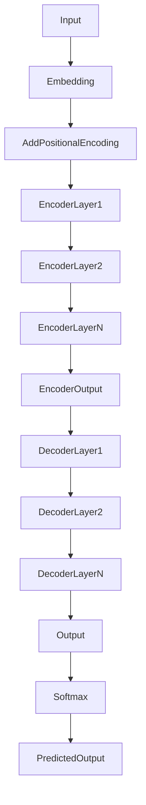

# Transformer 原理与代码实战案例讲解

## 1. 背景介绍
### 1.1 问题的由来
自然语言处理(Natural Language Processing, NLP)是人工智能领域的一个重要分支,旨在让计算机能够理解、生成和处理人类语言。传统的NLP模型如循环神经网络(RNN)和长短期记忆网络(LSTM)虽然在许多任务上取得了不错的效果,但仍然存在着难以并行化、难以捕捉长距离依赖等问题。2017年,Google提出了Transformer模型,该模型完全基于注意力机制(Attention Mechanism),抛弃了传统的RNN和CNN等结构,在机器翻译任务上取得了当时最好的效果。Transformer的出现掀起了NLP领域的一场革命,极大地推动了预训练语言模型的发展。

### 1.2 研究现状
近年来,基于Transformer的预训练语言模型如雨后春笋般涌现,如BERT、GPT、XLNet、RoBERTa等,在多个NLP任务上刷新了当前最好成绩。这些模型通过在大规模无标注语料上进行预训练,学习到了丰富的语言知识,再通过在下游任务上进行微调,就能在特定任务上取得优异的表现。目前,Transformer已经成为NLP领域的标配模型,广泛应用于机器翻译、文本分类、命名实体识别、问答系统、对话系统等任务中。同时,Transformer的思想也被引入到计算机视觉、语音识别等其他领域,展现出了广阔的应用前景。

### 1.3 研究意义
深入理解Transformer的原理,对于我们掌握现代NLP技术具有重要意义:
1. 理解Transformer的内部工作机制,有助于我们设计出更加高效、鲁棒的模型结构。
2. 掌握Transformer的训练方法,可以让我们在特定任务上快速训练出高质量的模型。 
3. 了解Transformer在不同任务上的应用,可以启发我们将其拓展到更多的场景中。
4. 研究Transformer面临的问题与挑战,有利于我们推动NLP技术的进一步发展。

### 1.4 本文结构
本文将从以下几个方面对Transformer进行深入讲解:
- 第2部分介绍Transformer的核心概念与模块之间的联系
- 第3部分详细讲解Transformer的内部算法原理与具体操作步骤
- 第4部分给出Transformer用到的关键数学公式,并配以详细的讲解与举例说明
- 第5部分提供Transformer的代码实现,并对关键代码进行注释讲解
- 第6部分总结Transformer在实际任务中的应用情况
- 第7部分推荐Transformer相关的学习资源与开发工具
- 第8部分对Transformer的研究现状与未来发展进行展望
- 第9部分列举Transformer常见的问题与解答

## 2. 核心概念与联系
Transformer的核心是自注意力机制(Self-Attention)和前馈神经网络(Feed-Forward Network),通过堆叠自注意力和前馈网络构建编码器和解码器。其主要概念如下:

- 自注意力机制:通过计算序列中不同位置之间的相关性,让模型能够捕捉到序列的内部结构与长距离依赖。自注意力分为三个步骤:计算Query/Key/Value向量、计算注意力权重、加权求和。
- 多头注意力:将输入进行多次线性变换得到多组Q/K/V向量,分别进行自注意力计算,再拼接所有结果。多头机制增强了模型的表示能力。
- 残差连接与Layer Normalization:在子层之间添加残差连接,使信息能够直接传递;Layer Norm归一化有助于稳定训练。
- 位置编码:为每个位置的词向量叠加一个位置向量,使模型能够捕捉序列的顺序信息。
- 前馈网络:由两个线性变换和一个ReLU激活组成,用于对特征进行非线性变换。
- Encoder-Decoder结构:编码器负责对输入序列进行特征提取,解码器根据编码器的输出和之前的生成结果,预测下一个目标词。

下图展示了Transformer的整体架构:

## 3. 核心算法原理 & 具体操作步骤
### 3.1 算法原理概述
Transformer的核心是自注意力机制,通过计算序列中不同位置之间的相关性,让模型能够捕捉到全局的依赖关系。以下是Transformer的关键算法原理:

1. 自注意力机制(Self-Attention):
   - 将输入序列的每个位置映射为Query/Key/Value向量
   - 计算每个Query与所有Key的点积,得到注意力权重
   - 将Value与注意力权重加权求和,得到该位置的输出表示
2. 多头注意力(Multi-Head Attention):
   - 将输入进行多次线性变换,得到多组Q/K/V向量
   - 每组Q/K/V分别进行自注意力计算
   - 将所有结果拼接后再经过一个线性变换,得到多头注意力的输出
3. 前馈神经网络(Feed-Forward Network):
   - 由两个线性变换和ReLU激活函数组成
   - 对多头注意力的输出进行非线性变换,提取高级特征
4. 残差连接(Residual Connection)和Layer Normalization:
   - 在每个子层之间添加残差连接,使信息能够直接传递
   - 对每个子层的输出进行Layer Normalization,加快收敛并提高泛化能力
5. 位置编码(Positional Encoding):
   - 为每个位置生成一个位置向量
   - 将位置向量与词向量相加,引入位置信息
   
### 3.2 算法步骤详解
下面我们对Transformer的算法步骤进行详细讲解:

**编码器(Encoder):**
1. 输入编码:将输入序列中的每个词映射为词向量,并加上位置编码。
2. 自注意力子层:
   1. 将输入编码分别乘以三个权重矩阵,得到Q/K/V向量。
   2. 计算Q与K的点积,除以$\sqrt{d_k}$,然后经过Softmax得到注意力权重。
   3. 将注意力权重与V相乘,得到加权求和向量。
   4. 将多头注意力的结果拼接,再经过一个线性变换。
3. 前馈子层:
   1. 将自注意力子层的输出经过两个线性变换和ReLU激活。
   2. 将前馈子层的输出与输入进行残差连接,再做Layer Normalization。
4. 重复第2、3步N次,得到编码器的最终输出。

**解码器(Decoder):**  
1. 输出编码:类似编码器的输入编码,但是引入了Masked Multi-Head Attention。
2. 自注意力子层:与编码器类似,但在计算注意力权重时,对未来的位置进行掩码。
3. 交互注意力子层:以编码器的输出为K和V,解码器的自注意力输出为Q,计算注意力。
4. 前馈子层:与编码器的前馈子层完全一致。
5. 重复第2、3、4步N次,得到解码器的最终输出。
6. 将解码器的输出经过线性变换和Softmax,得到下一个词的概率分布。

### 3.3 算法优缺点
Transformer相比传统的RNN/CNN等模型,具有以下优点:
- 并行计算能力强,训练速度快。
- 能够捕捉长距离依赖关系。
- 不受序列长度的限制。
- 可以处理任意长度的序列。
- 模型结构简单,易于实现和优化。

但Transformer也存在一些缺点:
- 计算复杂度随序列长度平方增长,难以处理很长的序列。
- 位置编码是固定的,难以建模相对位置信息。
- 解码时是自回归的,生成速度慢。
- 需要大量的训练数据和计算资源。

### 3.4 算法应用领域
得益于其强大的特征提取和建模能力,Transformer已在多个NLP任务上取得了state-of-the-art的表现,主要应用领域包括:
- 机器翻译:Transformer最初就是在机器翻译任务上提出的,极大地提升了翻译质量。
- 文本分类:利用预训练的Transformer可以在多个文本分类数据集上取得领先效果。
- 命名实体识别:Transformer能够很好地建模实体与上下文的关系。
- 问答系统:基于Transformer的预训练模型在阅读理解型问答中表现出色。
- 对话系统:Transformer可以生成流畅、连贯的对话响应。
- 文本生成:GPT等基于Transformer的语言模型展示了强大的文本生成能力。

除了NLP领域,Transformer的思想也被引入到了其他领域:
- 计算机视觉:Vision Transformer将图像分块后输入Transformer,在图像分类等任务上超越了CNN。
- 语音识别:Transformer可以建模语音的时序特征,用于声学模型和语言模型。
- 图神经网络:图注意力网络利用Transformer建模节点之间的关系。
- 推荐系统:利用Transformer捕捉用户与物品之间的交互行为,提高推荐精度。

可以预见,Transformer未来将在更多领域得到广泛应用。

## 4. 数学模型和公式 & 详细讲解 & 举例说明
### 4.1 数学模型构建
Transformer的核心是自注意力机制,其数学模型可以表示为:

$$
\text{Attention}(Q,K,V) = \text{softmax}(\frac{QK^T}{\sqrt{d_k}})V
$$

其中,$Q$,$K$,$V$分别表示Query,Key,Value向量,$d_k$为Key向量的维度。

多头注意力可以看作是$h$个自注意力的集成,其数学模型为:

$$
\begin{aligned}
\text{MultiHead}(Q,K,V) &= \text{Concat}(\text{head}_1,...,\text{head}_h)W^O \\
\text{head}_i &= \text{Attention}(QW_i^Q,KW_i^K,VW_i^V)
\end{aligned}
$$

其中,$W_i^Q \in \mathbb{R}^{d_{\text{model}} \times d_k}$,$W_i^K \in \mathbb{R}^{d_{\text{model}} \times d_k}$,$W_i^V \in \mathbb{R}^{d_{\text{model}} \times d_v}$,$W^O \in \mathbb{R}^{hd_v \times d_{\text{model}}}$为学习的权重矩阵。

前馈网络由两个线性变换和ReLU激活组成:

$$
\text{FFN}(x) = \max(0,xW_1+b_1)W_2+b_2
$$

其中$W_1 \in \mathbb{R}^{d_{\text{model}} \times d_{ff}}$,$W_2 \in \mathbb{R}^{d_{ff} \times d_{\text{model}}}$,$b_1 \in \mathbb{R}^{d_{ff}}$,$b_2 \in \mathbb{R}^{d_{\text{model}}}$为前馈网络的参数。

### 4.2 公式推导过程
下面我们对Transformer中的关键公式进行推导。

**自注意力的计算过程:**
1. 将输入$X \in \mathbb{R}^{n \times d_{\text{model}}}$分别乘以三个权重矩阵$W^Q,W^K,W^V$,得到$Q,K,V$向量:
$$
Q = XW^Q, K = XW^K, V = XW^V
$$
2. 计算$Q$与$K$的点积,除以$\sqrt{d_k}$,然后经过Softmax得到注意力权重:
$$
\alpha = \text{softmax}(\frac{QK^T}{\sqrt{d_k}})
$$
3. 将注意力权重$\alpha$与$V$相乘,得到加权求和向量:
$$
\text{Attention}(Q,K,V) = \alpha V
$$

**多头注意力的计算过程:**
1. 将$Q,K