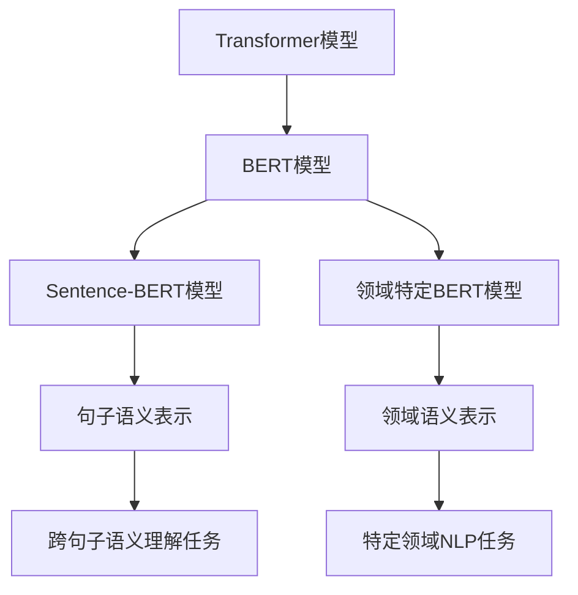

# Transformer大模型实战 Sentence-BERT模型和特定领域的BERT 模型

## 1. 背景介绍

### 1.1 问题的由来

在自然语言处理(NLP)领域中,表示文本语义的方法一直是研究的重点和难点。传统的词袋(Bag of Words)模型和 N-gram 模型等方法虽然简单有效,但由于没有考虑词与词之间的序列关系和语义关联,因此难以很好地表征语义。而词向量(Word Embedding)模型如Word2Vec、GloVe等通过将单词映射到低维连续向量空间中来表示语义,从而在一定程度上解决了这个问题,但它们仍然是以单词为基本单位,难以捕捉跨越多个单词的语义信息。

### 1.2 研究现状

近年来,随着深度学习技术的不断发展,基于注意力机制(Attention Mechanism)的Transformer模型逐渐成为NLP领域的主流模型。Transformer模型通过自注意力(Self-Attention)机制直接对输入序列中的元素进行建模,能够有效地捕捉长距离依赖关系,从而更好地表示语义信息。

在Transformer模型的基础上,进一步发展出了BERT(Bidirectional Encoder Representations from Transformers)等预训练语言模型,它们通过在大规模无标注语料库上进行自监督预训练,学习到了丰富的语义知识,然后可以通过微调(Fine-tuning)的方式将这些知识迁移到下游的NLP任务中,取得了非常优异的效果。

### 1.3 研究意义

尽管BERT模型在各种NLP任务上表现出色,但它主要关注的是单句子或者两个句子之间的关系建模,对于需要对多个句子或段落进行语义理解的任务,BERT的效果并不理想。为了解决这个问题,研究人员提出了Sentence-BERT模型,它能够生成对整个句子或段落的语义表示,从而更好地支持跨句子和跨段落的语义理解任务。

另一方面,虽然BERT模型是一种通用的预训练语言模型,但由于它是在通用语料库上训练的,因此在一些特定领域(如医疗、法律等)的语料上,它的效果可能不太理想。为了解决这个问题,研究人员提出了基于BERT的领域特定语言模型,通过在特定领域的语料库上进行预训练或继续预训练,来获得更适合该领域的语义表示。

### 1.4 本文结构

本文将首先介绍Sentence-BERT模型的核心概念和原理,包括它是如何生成句子级别的语义表示的。然后,我们将详细讲解Sentence-BERT模型的训练过程和具体实现步骤。接下来,我们将介绍如何基于BERT构建特定领域的语言模型,包括数据准备、预训练过程等。最后,我们将分享一些实际应用场景和未来发展趋势,以及相关的工具和资源推荐。

## 2. 核心概念与联系

上图展示了Transformer模型、BERT模型、Sentence-BERT模型和领域特定BERT模型之间的关系。

- **Transformer模型**是基于自注意力机制的序列建模模型,能够有效捕捉长距离依赖关系,为后续的BERT等模型奠定了基础。
- **BERT模型**是一种基于Transformer的双向预训练语言模型,通过自监督学习在大规模语料库上获取了丰富的语义知识,可以通过微调的方式应用到各种下游NLP任务中。
- **Sentence-BERT模型**是在BERT模型的基础上进一步发展而来的,它能够生成对整个句子或段落的语义表示,从而支持跨句子和跨段落的语义理解任务。
- **领域特定BERT模型**则是通过在特定领域的语料库上进行预训练或继续预训练,获得了更适合该领域的语义表示,可以应用到该领域的NLP任务中。

## 3. 核心算法原理 & 具体操作步骤

### 3.1 算法原理概述

Sentence-BERT模型的核心思想是通过对句子对(Sentence Pair)进行监督式训练,学习到一个能够生成句子级别语义表示的编码器(Encoder)模型。具体来说,给定一对句子,我们希望通过训练,使得语义相似的句子对的表示向量在向量空间中距离更近,而语义不相似的句子对的表示向量在向量空间中距离更远。

为了实现这一目标,Sentence-BERT采用了下面的训练目标函数:

$$J = \sum_{i=1}^{N}\sum_{j=1}^{N'}\left[\max\left(0, \cos\left(u_{i}^{a}, u_{j}^{b}\right)-\cos\left(u_{i}^{a}, u_{i}^{p}\right)+\epsilon\right)\right]$$

其中:

- $N$和$N'$分别表示两个小批量(mini-batch)的大小
- $u_i^a$表示第$i$个句子对中的第一个句子的语义表示向量
- $u_j^b$表示第$j$个句子对中的第二个句子的语义表示向量
- $u_i^p$表示与$u_i^a$语义相似的句子的语义表示向量
- $\epsilon$是一个小的常数,用于推动不相似句子对的表示向量远离彼此
- $\cos$表示计算两个向量之间的余弦相似度

通过最小化这个目标函数,我们可以使得语义相似的句子对的表示向量尽可能接近,而语义不相似的句子对的表示向量则尽可能远离。

在具体实现上,Sentence-BERT使用了BERT模型作为编码器的基础,并在BERT的输出上添加了一个简单的平均池化层,将每个子词(Subword)的表示向量平均成一个固定长度的句子级别表示向量。

### 3.2 算法步骤详解

Sentence-BERT模型的训练过程可以分为以下几个主要步骤:

1. **数据准备**:首先需要准备一个包含大量句子对及其语义相似度标注的数据集。这些数据集可以来自于现有的数据集,如Stanford Natural Language Inference (SNLI)数据集、Multi-Genre NLI (MNLI)数据集等,也可以是自行构建的数据集。

2. **数据预处理**:对原始数据进行预处理,包括分词、词典构建、填充等操作,将数据转换为BERT模型可以接受的输入格式。

3. **模型初始化**:初始化一个BERT模型作为编码器的基础,并在其输出上添加一个简单的平均池化层,用于生成句子级别的语义表示向量。

4. **模型训练**:使用上述的目标函数对模型进行训练。在每个训练步骤中,我们从数据集中采样一个小批量的句子对,将它们输入到模型中,计算目标函数的值,然后使用梯度下降法更新模型参数。

5. **模型评估**:在训练过程中,定期在开发集(Development Set)或验证集(Validation Set)上评估模型的性能,以监控训练过程并避免过拟合。

6. **模型微调**:对于特定的下游任务,可以进一步对Sentence-BERT模型进行微调,使其更好地适应该任务的特点。

7. **模型应用**:使用训练好的Sentence-BERT模型生成句子或段落的语义表示向量,并将这些向量应用到各种跨句子或跨段落的语义理解任务中,如文本相似度计算、聚类、检索等。

### 3.3 算法优缺点

**优点**:

- 能够生成对整个句子或段落的语义表示,支持跨句子和跨段落的语义理解任务。
- 基于BERT模型,能够利用BERT在大规模语料库上学习到的丰富语义知识。
- 通过监督式训练,能够更好地捕捉句子级别的语义信息。
- 模型结构相对简单,训练和应用都比较高效。

**缺点**:

- 需要大量的句子对数据集进行监督式训练,数据准备工作量较大。
- 虽然基于BERT模型,但仍然无法完全解决BERT在长序列建模方面的不足。
- 生成的句子表示向量维度固定,可能无法完全捕捉复杂句子的所有语义信息。
- 对于一些特定领域的语料,模型的效果可能不太理想。

### 3.4 算法应用领域

Sentence-BERT模型及其变体可以应用到各种需要对句子或段落进行语义理解的NLP任务中,包括但不限于:

- **文本相似度计算**:通过计算两个句子或段落的语义表示向量之间的相似度,来判断它们在语义上的相似程度。
- **文本聚类**:将具有相似语义的句子或段落聚集到同一个簇中,用于文本主题发现、文本浏览等应用。
- **文本检索**:根据查询句子的语义表示向量,在文本库中快速检索到与之语义相似的句子或段落。
- **自动问答系统**:通过计算问题和候选答案之间的语义相似度,来选择最佳的答案。
- **机器翻译**:将源语言句子的语义表示向量映射到目标语言句子的语义空间中,用于改进机器翻译的质量。
- **文本摘要**:根据句子或段落的语义表示向量,选择最能概括文本主旨的句子作为摘要。

## 4. 数学模型和公式 & 详细讲解 & 举例说明

### 4.1 数学模型构建

在Sentence-BERT模型中,我们需要构建一个能够生成句子级别语义表示向量的编码器模型。为此,我们首先需要定义一个基于BERT模型的编码器函数$f_{\theta}$,其中$\theta$表示模型参数。给定一个句子$S$,编码器函数$f_{\theta}$将输出一个固定长度的向量$\vec{u}$,即:

$$\vec{u} = f_{\theta}(S)$$

其中$\vec{u} \in \mathbb{R}^d$,是一个$d$维的实数向量,用于表示句子$S$的语义信息。

为了训练这个编码器模型,我们需要定义一个目标函数$J$,使得语义相似的句子对的表示向量在向量空间中距离更近,而语义不相似的句子对的表示向量在向量空间中距离更远。具体来说,我们采用的目标函数为:

$$J = \sum_{i=1}^{N}\sum_{j=1}^{N'}\left[\max\left(0, \cos\left(\vec{u}_{i}^{a}, \vec{u}_{j}^{b}\right)-\cos\left(\vec{u}_{i}^{a}, \vec{u}_{i}^{p}\right)+\epsilon\right)\right]$$

其中:

- $N$和$N'$分别表示两个小批量(mini-batch)的大小
- $\vec{u}_i^a$表示第$i$个句子对中的第一个句子的语义表示向量
- $\vec{u}_j^b$表示第$j$个句子对中的第二个句子的语义表示向量
- $\vec{u}_i^p$表示与$\vec{u}_i^a$语义相似的句子的语义表示向量
- $\epsilon$是一个小的常数,用于推动不相似句子对的表示向量远离彼此
- $\cos$表示计算两个向量之间的余弦相似度

通过最小化这个目标函数,我们可以使得语义相似的句子对的表示向量尽可能接近,而语义不相似的句子对的表示向量则尽可能远离。

在具体实现上,Sentence-BERT使用了BERT模型作为编码器$f_{\theta}$的基础,并在BERT的输出上添加了一个简单的平均池化层,将每个子词(Subword)的表示向量平均成一个固定长度的句子级别表示向量$\vec{u}$。

### 4.2 公式推导过程

我们将详细推导一下Sentence-BERT模型的目标函数是如何得到的。

首先,我们定义一个基于BERT模型的编码器函数$f_{\theta}$,它将一个句子