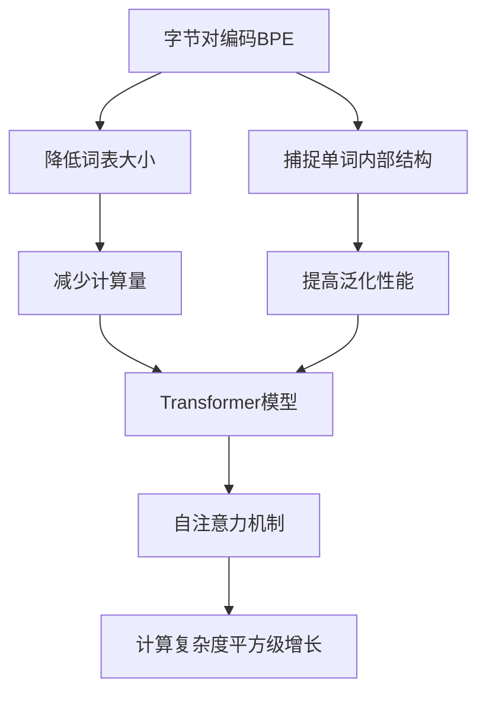

# Transformer大模型实战 字节对编码

## 1. 背景介绍

### 1.1 问题的由来

在自然语言处理(NLP)领域,传统的序列模型如RNN和LSTM存在着一些固有的缺陷,例如梯度消失/爆炸问题、难以并行化计算等。为了解决这些问题,Transformer模型应运而生。Transformer完全基于注意力机制,摒弃了RNN的递归结构,使其能够高效地并行计算,同时有效地捕捉长距离依赖关系。

然而,Transformer模型在处理长序列时仍然存在一些挑战。由于自注意力机制需要计算每个单词与其他单词的关系,计算复杂度呈现平方级别增长,这在处理大规模语料时会带来巨大的计算开销。为了解决这一问题,研究人员提出了字节对编码(Byte Pair Encoding, BPE)技术,将单词拆分为子词单元,从而降低词表大小,减少计算量。

### 1.2 研究现状

字节对编码技术最初由Sennrich等人在2015年提出,用于神经机器翻译任务。之后,它被广泛应用于各种NLP任务,包括语言模型、文本生成、机器翻译等。在Transformer模型中,BPE技术发挥了重要作用,使得模型能够高效地处理长序列,同时保持良好的性能。

目前,BPE技术在NLP领域已经成为一种标准做法,被广泛采用。不同的模型和任务可能会采用不同的BPE词表,但核心思想是相同的。随着Transformer大模型的不断发展,BPE技术也在不断优化和改进,以满足更高的要求。

### 1.3 研究意义

字节对编码技术在Transformer大模型中具有重要意义:

1. **降低计算复杂度**: 通过将单词拆分为子词单元,BPE可以有效降低词表大小,从而减少自注意力机制的计算量,使模型能够处理更长的序列。

2. **提高模型性能**: BPE可以捕捉单词内部的结构信息,从而提高模型对未见词的处理能力,提升模型的泛化性能。

3. **支持多语种处理**: BPE可以为不同语种构建统一的子词词表,支持多语种的联合建模,促进跨语言迁移学习。

4. **简化模型训练**: BPE可以减少词表大小,从而降低模型参数量,简化训练过程,提高训练效率。

通过深入研究BPE技术在Transformer大模型中的应用,我们可以更好地理解和优化这一关键技术,推动NLP领域的发展。

### 1.4 本文结构

本文将全面介绍字节对编码技术在Transformer大模型中的应用。首先,我们将介绍BPE的核心概念和原理,包括算法流程、数学模型等。然后,我们将详细讲解BPE在Transformer模型中的具体实现,包括代码示例和性能分析。接下来,我们将探讨BPE在不同NLP任务中的应用场景,如机器翻译、语言模型等。最后,我们将总结BPE技术的发展趋势和面临的挑战,并提供相关资源推荐。

## 2. 核心概念与联系

字节对编码(Byte Pair Encoding, BPE)是一种基于数据驱动的子词分词算法,旨在解决传统词表方法存在的问题。BPE算法的核心思想是从字符级别开始,通过迭代合并最频繁的连续字节对,逐步构建出子词词表。

BPE算法与Transformer模型的关系密切。Transformer模型基于自注意力机制,需要计算序列中每个单词与其他单词的关系,计算复杂度呈平方级别增长。通过将单词拆分为子词单元,BPE可以有效降低词表大小,从而减少计算量,使Transformer模型能够高效地处理长序列。

此外,BPE还可以捕捉单词内部的结构信息,提高模型对未见词的处理能力,从而提升Transformer模型的泛化性能。BPE技术在Transformer模型中发挥着关键作用,是实现高效、高性能NLP任务的重要基础。

## 3. 核心算法原理 & 具体操作步骤

### 3.1 算法原理概述

字节对编码(BPE)算法的核心思想是从字符级别开始,通过迭代合并最频繁的连续字节对,逐步构建出子词词表。算法的具体步骤如下:

1. 初始化: 将所有单词拆分为字符序列,构建初始词表,其中只包含单个字符。
2. 计算字节对频率: 统计语料库中所有连续字节对的出现频率。
3. 合并字节对: 将频率最高的字节对合并为新的子词单元,并将其添加到词表中。
4. 更新语料库: 用新的子词单元替换原始语料库中对应的字节对。
5. 重复步骤2-4: 重复执行步骤2-4,直到达到预设的词表大小或满足其他终止条件。

通过这种迭代合并的方式,BPE算法可以从数据中学习出高频子词单元,从而构建出一个紧凑且具有良好覆盖率的子词词表。

### 3.2 算法步骤详解

1. **初始化**

将所有单词拆分为字符序列,构建初始词表,其中只包含单个字符及其对应的编码。例如,对于英文语料,初始词表可能包含26个字母和一些特殊字符。

2. **计算字节对频率**

遍历整个语料库,统计所有连续字节对的出现频率。例如,对于单词"low",它包含两个字节对:"lo"和"ow",我们分别统计它们的频率。

3. **合并字节对**

选择频率最高的字节对,将其合并为一个新的子词单元,并将其添加到词表中。例如,如果"er"是最频繁的字节对,我们可以将其合并为新的子词单元"er",并将其添加到词表中。

4. **更新语料库**

在原始语料库中,用新的子词单元替换对应的字节对。例如,将"lover"替换为"lov er"。

5. **重复步骤2-4**

重复执行步骤2-4,直到达到预设的词表大小或满足其他终止条件。通常,我们会设置一个合理的词表大小,以平衡模型性能和计算效率。

通过上述迭代过程,BPE算法可以从数据中学习出高频子词单元,从而构建出一个紧凑且具有良好覆盖率的子词词表。

### 3.3 算法优缺点

**优点**:

1. **数据驱动**: BPE算法是基于数据的无监督学习方法,可以自动从语料库中学习出高频子词单元,无需人工干预。
2. **高效编码**: BPE可以将单词拆分为子词单元,从而降低词表大小,提高编码效率。
3. **捕捉单词内部结构**: BPE可以捕捉单词内部的结构信息,如词根、词缀等,从而提高模型对未见词的处理能力。
4. **支持多语种处理**: BPE可以为不同语种构建统一的子词词表,支持多语种的联合建模。

**缺点**:

1. **子词边界模糊**: BPE算法生成的子词单元可能会跨越单词边界,导致一些子词单元缺乏语义意义。
2. **参数选择敏感**: BPE算法的性能受到词表大小等参数的影响,需要进行调优以获得最佳性能。
3. **计算开销**: 虽然BPE可以降低计算复杂度,但在训练和推理阶段仍需要进行子词拆分和编码,会带来一定的计算开销。

### 3.4 算法应用领域

字节对编码(BPE)算法广泛应用于自然语言处理(NLP)领域,尤其是在基于Transformer的模型中发挥着重要作用。以下是BPE算法的一些典型应用场景:

1. **机器翻译**: BPE可以有效降低词表大小,提高机器翻译模型的性能和效率,尤其是在处理低资源语言或包含大量未见词的语料时。

2. **语言模型**: BPE可以捕捉单词内部的结构信息,提高语言模型对未见词的处理能力,从而提升模型的泛化性能。

3. **文本生成**: BPE可以帮助文本生成模型处理长序列,生成更流畅、连贯的文本。

4. **序列标注任务**: BPE在序列标注任务中也有应用,如命名实体识别、关系抽取等。

5. **多语种建模**: BPE可以为不同语种构建统一的子词词表,支持多语种的联合建模,促进跨语言迁移学习。

6. **其他NLP任务**: BPE还可以应用于文本分类、情感分析、问答系统等其他NLP任务中,提高模型的性能和效率。

总的来说,BPE算法在NLP领域发挥着重要作用,是实现高效、高性能NLP任务的关键技术之一。

## 4. 数学模型和公式 & 详细讲解 & 举例说明

### 4.1 数学模型构建

为了更好地理解字节对编码(BPE)算法的原理,我们可以将其形式化为一个数学模型。假设我们有一个语料库 $C$,包含 $N$ 个单词 $w_1, w_2, \dots, w_N$。我们的目标是从 $C$ 中学习一个子词词表 $V$,使得每个单词 $w_i$ 可以被表示为一系列子词单元的序列 $s_i = (v_1, v_2, \dots, v_m)$,其中 $v_j \in V$。

我们定义一个合并操作 $\oplus$,用于将两个子词单元合并为一个新的子词单元。例如,对于子词单元 $v_1$ 和 $v_2$,我们可以将它们合并为新的子词单元 $v_3 = v_1 \oplus v_2$。

BPE算法的目标是找到一系列合并操作 $\phi = (\oplus_1, \oplus_2, \dots, \oplus_k)$,使得应用这些操作后得到的子词词表 $V_k$ 可以最小化一个目标函数 $L(V_k, C)$,该函数衡量了使用子词词表 $V_k$ 对语料库 $C$ 进行编码的代价。

常见的目标函数包括:

1. **词表大小**: $L(V_k, C) = |V_k|$,即最小化子词词表的大小。
2. **编码长度**: $L(V_k, C) = \sum_{i=1}^N \sum_{j=1}^{m_i} \log P(v_j^{(i)})$,即最小化使用子词词表对语料库进行编码所需的总编码长度。

在实际应用中,我们通常会设置一个预定义的词表大小 $M$,并寻找一个子词词表 $V_k$,使得 $|V_k| = M$ 且 $L(V_k, C)$ 最小。

### 4.2 公式推导过程

我们可以将BPE算法的迭代过程形式化为一个动态规划问题。假设在第 $k$ 次迭代中,我们有一个子词词表 $V_k$,我们需要找到最佳的合并操作 $\oplus_{k+1}$,使得 $V_{k+1} = V_k \cup \{v_i \oplus v_j\}$ 可以最小化目标函数 $L(V_{k+1}, C)$。

我们定义一个函数 $f(v_i, v_j)$ 表示将子词单元 $v_i$ 和 $v_j$ 合并所带来的代价变化。根据不同的目标函数,这个函数的具体形式会有所不同。例如,如果我们的目标是最小化编码长度,那么:

$$f(v_i, v_j) = \log P(v_i \oplus v_j) - \log P(v_i) - \log P(v_j)