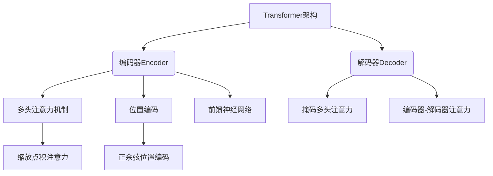

好的,我明白了您的要求。以下是文章的正文内容:

# Transformer架构原理详解:编码器(Encoder)和解码器(Decoder)

## 1. 背景介绍

### 1.1 问题的由来

在自然语言处理(NLP)和机器翻译等领域,循环神经网络(RNN)曾长期占据主导地位。然而,RNN存在一些固有缺陷,如不能完全并行化计算、对长期依赖捕捉能力较差等。为了解决这些问题,Transformer架构应运而生,并在2017年被提出。

### 1.2 研究现状  

Transformer是一种全新的基于注意力机制(Attention Mechanism)的神经网络架构,已被广泛应用于机器翻译、文本生成、语音识别等多个领域,取得了非常优异的表现。目前,Transformer已成为NLP领域的主流模型之一,引领了该领域的新潮流。

### 1.3 研究意义

深入理解Transformer的原理对于NLP研究人员和开发人员来说至关重要。Transformer架构思想独特,性能卓越,是NLP领域一个里程碑式的创新。掌握Transformer不仅能帮助我们更好地应用它,还能启发我们设计出更加先进的模型。

### 1.4 本文结构

本文将全面介绍Transformer架构的核心概念、关键原理和实现细节。我们将重点剖析编码器(Encoder)和解码器(Decoder)两个核心组件的工作原理,并探讨多头注意力机制、位置编码、残差连接等关键技术。

## 2. 核心概念与联系



Transformer架构主要由编码器(Encoder)和解码器(Decoder)两个核心部分组成。

- **编码器(Encoder)**: 用于处理输入序列,构建其内部表示。主要包括多头注意力机制、位置编码和前馈神经网络等关键组件。
- **解码器(Decoder)**: 基于编码器输出和输入序列,生成目标输出序列。包括掩码多头注意力、编码器-解码器注意力等机制。

其中,多头注意力机制是Transformer的核心创新,使用缩放点积注意力来捕捉输入和输出之间的长程依赖关系。位置编码采用正余弦函数对序列位置进行编码,使Transformer能够处理序列数据。

## 3. 核心算法原理及具体操作步骤

### 3.1 算法原理概述

Transformer的核心思想是完全利用注意力机制来计算输入和输出之间的映射关系,摒弃了RNN和CNN等传统架构。它的主要创新包括:

1. **Multi-Head Attention**: 使用多头注意力机制来捕捉不同表示子空间的信息。
2. **Positional Encoding**: 通过位置编码赋予序列顺序信息。
3. **Residual Connection & Layer Norm**: 残差连接和层归一化保证梯度稳定传播。

Transformer的计算过程可概括为编码器映射输入到中间表示,解码器基于中间表示和输出映射生成目标序列。

### 3.2 算法步骤详解

#### 3.2.1 编码器(Encoder)

编码器的主要任务是将输入序列映射到一个中间连续表示序列,供解码器使用。编码器由N个相同的层组成,每层包括两个子层:

1. **Multi-Head Attention Layer**

   $$\begin{aligned}
   \text{MultiHead}(Q,K,V) &= \text{Concat}(\text{head}_1, \dots, \text{head}_h)W^O\\
   \text{where\ head}_i &= \text{Attention}(QW_i^Q, KW_i^K, VW_i^V)
   \end{aligned}$$

   多头注意力层通过将查询Q、键K和值V线性映射到不同的表示子空间,并行运行缩放点积注意力函数,最后将结果拼接并映射回原始空间。

2. **Position-wise Feed-Forward Layer**

   $$\text{FFN}(x)=\max(0,xW_1+b_1)W_2+b_2$$
   
   前馈全连接层对每个位置的表示进行相同的操作,包括两次线性变换和一个ReLU激活函数。

每个子层周围还包裹有残差连接和层归一化,以帮助梯度稳定传播。

#### 3.2.2 解码器(Decoder) 

解码器的任务是生成目标序列,同时关注编码器的输出。解码器由N个相同的层组成,每层包括三个子层:

1. **Masked Multi-Head Attention Layer**

   与编码器类似,但使用了掩码机制,确保每个位置的单词只能关注之前的单词。

2. **Multi-Head Attention Layer over Encoder Output**

   对编码器输出序列执行多头注意力,获取来自输入序列的信息。
   
3. **Position-wise Feed-Forward Layer**

   与编码器相同的前馈全连接层。

同样,每个子层都有残差连接和层归一化。

#### 3.2.3 位置编码

由于Transformer不再使用RNN或CNN来提取序列顺序信息,因此引入了位置编码。位置编码是一个将单词在序列中的位置映射到实数向量的函数,并将其加到词嵌入上。

$$\begin{aligned}
\text{PE}_{(pos,2i)}&=\sin\left(pos/10000^{2i/d_{\text{model}}}\right)\\
\text{PE}_{(pos,2i+1)}&=\cos\left(pos/10000^{2i/d_{\text{model}}}\right)
\end{aligned}$$

其中$pos$是位置,而$i$是维度。这种正弦和余弦函数让模型可以从相对位置推断出绝对位置。

### 3.3 算法优缺点

**优点**:

- 并行计算能力强,速度快
- 长期依赖建模能力强
- 可解释性好,注意力权重可视化
- 适用于多种序列任务

**缺点**:

- 计算复杂度高,需要大量计算资源  
- 对长序列建模能力依旧有限
- 缺乏序列内部结构建模能力

### 3.4 算法应用领域

- 机器翻译
- 文本生成(新闻、故事等)
- 问答系统
- 文本摘要
- 图像/视频描述
- 语音识别
- 蛋白质二级结构预测

## 4. 数学模型和公式详细讲解及举例说明

### 4.1 数学模型构建

Transformer的核心是注意力机制,特别是缩放点积注意力(Scaled Dot-Product Attention)。给定查询Q、键K和值V,缩放点积注意力计算如下:

$$\begin{aligned}
\text{Attention}(Q,K,V) &= \text{softmax}\left(\frac{QK^T}{\sqrt{d_k}}\right)V\\
\end{aligned}$$

其中$\sqrt{d_k}$是缩放因子,用于防止内积过大导致软最大化函数梯度较小(梯度消失)。

多头注意力机制则将注意力分成多个并行计算的"头",每个头关注输入序列的不同部分:

$$\begin{aligned}
\text{MultiHead}(Q,K,V) &= \text{Concat}(\text{head}_1, \dots, \text{head}_h)W^O\\
\text{where\ head}_i &= \text{Attention}(QW_i^Q, KW_i^K, VW_i^V)
\end{aligned}$$

其中$W_i^Q\in\mathbb{R}^{d_{\text{model}}\times d_k}, W_i^K\in\mathbb{R}^{d_{\text{model}}\times d_k}, W_i^V\in\mathbb{R}^{d_{\text{model}}\times d_v}$是可训练的线性映射,而$W^O\in\mathbb{R}^{hd_v\times d_{\text{model}}}$是最终映射。

### 4.2 公式推导过程

我们来推导一下多头注意力的计算过程:

1. 首先对查询Q、键K和值V进行线性变换:

$$\begin{aligned}
Q' &= QW^Q\\
K' &= KW^K\\
V' &= VW^V
\end{aligned}$$

2. 计算缩放点积注意力:

$$\begin{aligned}
\text{head}_i &= \text{Attention}(Q'W_i^Q, K'W_i^K, V'W_i^V)\\
&= \text{softmax}\left(\frac{Q'W_i^Q(K'W_i^K)^T}{\sqrt{d_k}}\right)V'W_i^V
\end{aligned}$$

3. 将所有头拼接并映射回模型维度:

$$\begin{aligned}
\text{MultiHead}(Q,K,V) &= \text{Concat}(\text{head}_1, \dots, \text{head}_h)W^O\\
&= \left[\begin{array}{c}
\text{head}_1\\
\vdots\\
\text{head}_h
\end{array}\right]W^O
\end{aligned}$$

通过多头机制,模型可以关注序列中不同的位置,并从不同的子空间建模长期依赖关系。

### 4.3 案例分析与讲解

以机器翻译任务为例,我们来分析Transformer是如何工作的:

1. 输入源语言句子"Je suis étudiant"被分割为词元序列,并映射为词嵌入向量。
2. 编码器对输入序列进行处理,生成中间连续表示序列。
3. 解码器开始生成目标序列"I am a student."。对于第一个位置:
    - 掩码多头注意力只关注之前的输出(没有输出,所以是空)
    - 编码器-解码器注意力关注输入序列,捕捉"Je suis étudiant"与"I"之间的对应关系
    - 前馈网络对注意力输出进行变换,生成"I"这个单词
4. 对于第二个位置,掩码多头注意力现在可以关注第一个位置"I"的信息,生成"am"。
5. 重复上述过程直到生成完整序列"I am a student."

通过可视化注意力权重,我们可以看到Transformer学会了单词对齐、长距离依赖等翻译中的关键信息。

### 4.4 常见问题解答

**Q: Transformer是如何处理变长序列的?**

A: Transformer使用了位置编码来赋予序列顺序信息,从而能够处理变长序列。不过对于过长序列,注意力计算开销仍然很大,因此通常会对输入序列设置最大长度。

**Q: 多头注意力为什么比单头注意力效果更好?**

A: 单头注意力只关注序列的一个子空间表示,而多头注意力可以同时关注不同的子空间,并从不同角度建模序列,因此具有更强的表达能力。

**Q: 为什么要使用残差连接和层归一化?**

A: 残差连接有助于梯度传播,防止信息在层与层之间传递时丢失。层归一化则有助于加速收敛和稳定训练过程。这两种技术在深度神经网络中被广泛使用。

## 5. 项目实践:代码实例和详细解释说明  

### 5.1 开发环境搭建

我们将使用PyTorch框架实现Transformer模型。首先需要安装PyTorch和相关依赖库:

```bash
pip install torch torchvision torchaudio
```

接下来,我们导入所需的包:

```python
import torch
import torch.nn as nn
import math
```

### 5.2 源代码详细实现

#### 5.2.1 缩放点积注意力

```python
class ScaledDotProductAttention(nn.Module):
    def __init__(self, d_k):
        super().__init__()
        self.d_k = d_k

    def forward(self, Q, K, V):
        scores = torch.matmul(Q, K.transpose(-2, -1)) / math.sqrt(self.d_k)
        attention = torch.softmax(scores, dim=-1)
        values = torch.matmul(attention, V)
        return values, attention
```

这里我们实现了缩放点积注意力的核心计算过程。首先计算注意力分数,然后通过softmax函数得到注意力权重,最后将权重与值V相乘得到注意力输出。

#### 5.2.2 多头注意力

```python
class MultiHeadAttention(nn.Module):
    def __init__(self, d_model, n_heads):
        super().__