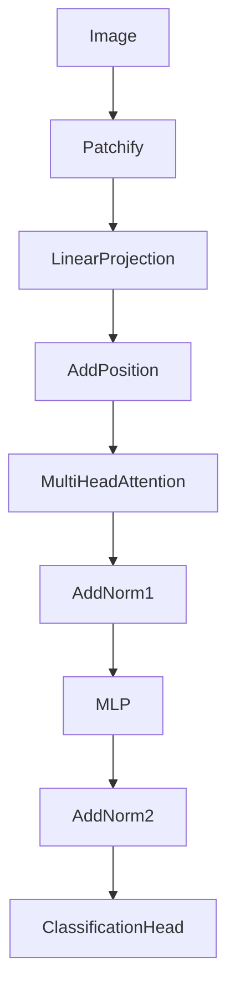

# ViT原理与代码实例讲解

## 1. 背景介绍
### 1.1 问题的由来
近年来，深度学习在计算机视觉领域取得了巨大的成功，卷积神经网络(CNN)成为了图像分类、目标检测等任务的标准解决方案。然而，CNN存在一些固有的局限性，如局部感受野、位置不变性等，限制了其在更广泛场景下的应用。为了克服这些局限性，研究者们开始探索将Transformer这一强大的序列建模工具引入视觉领域。

### 1.2 研究现状
2020年，谷歌研究团队提出了Vision Transformer(ViT)[1]，首次将纯Transformer结构应用于图像分类任务，在ImageNet数据集上达到了与当时最先进的CNN模型相媲美的性能。此后，大量的研究工作开始涌现，ViT及其变体被广泛应用于图像分类[2]、目标检测[3]、语义分割[4]等各种视觉任务中，展现出了巨大的潜力。

### 1.3 研究意义
ViT的提出打破了CNN在视觉领域的垄断地位，为图像理解开辟了一条全新的道路。与CNN相比，ViT具有更强的建模能力和灵活性，能够更好地捕捉图像中的长程依赖关系，对遮挡、旋转等变化也更加鲁棒。深入理解ViT的原理，对于推动视觉技术的发展具有重要意义。

### 1.4 本文结构
本文将全面介绍ViT的原理与实现。第2节介绍ViT的核心概念；第3节详细讲解ViT的算法原理；第4节给出ViT的数学模型和公式推导；第5节通过代码实例演示ViT的具体实现；第6节讨论ViT的应用场景；第7节推荐相关工具和资源；第8节总结全文并展望未来；第9节列出常见问题解答。

## 2. 核心概念与联系
ViT的核心思想是将图像分割成一系列固定大小的图像块(patch)，然后将这些图像块看作一个序列输入到Transformer中进行建模。其关键概念包括：

- 图像块(Image Patch)：将图像分割成固定大小(如16x16)的小块，每个小块称为一个图像块。
- 线性投影(Linear Projection)：通过线性变换将图像块映射为特征向量。
- 位置编码(Positional Encoding)：为每个图像块添加位置信息，使Transformer能够区分不同位置的图像块。
- Multi-Head Attention：Transformer的核心组件，通过注意力机制建模图像块之间的相互作用。
- MLP：用于对Multi-Head Attention的输出进行非线性变换。
- 分类头(Classification Head)：在Transformer输出的基础上进行分类预测。

图1展示了ViT的整体架构。


<p align="center">图1 ViT架构图</p>

## 3. 核心算法原理 & 具体操作步骤
### 3.1 算法原理概述
ViT的核心是使用Transformer对图像块序列进行建模。与NLP中的Transformer不同，ViT没有使用位置编码，而是在每个图像块对应的特征向量中显式地添加了位置信息。ViT的训练过程与标准的Transformer类似，通过最小化分类损失函数来优化模型参数。

### 3.2 算法步骤详解
1. 图像块划分：将输入图像均匀划分为大小为$P\times P$的图像块，得到$N$个图像块。
2. 线性投影：对每个图像块进行flatten操作，将其转换为一个$P^2C$维的向量，其中$C$为图像的通道数。然后使用线性变换将其映射为$D$维的特征向量。
3. 添加位置编码：为每个图像块的特征向量添加可学习的位置编码向量，得到最终的输入序列$\mathbf{z}_0 \in \mathbb{R}^{N\times D}$。
4. Transformer编码：将输入序列$\mathbf{z}_0$传入Transformer的$L$个编码块，每个编码块包含Multi-Head Attention和MLP两个子层。Multi-Head Attention用于建模图像块之间的相互作用，MLP用于对特征进行非线性变换。两个子层之间使用残差连接和Layer Normalization。
5. 分类输出：将Transformer的输出$\mathbf{z}_L^0$（第一个图像块对应的特征向量）传入分类头，经过线性变换和softmax函数得到最终的分类概率分布。
6. 损失计算：使用交叉熵损失函数计算预测分类概率分布与真实标签之间的差异，作为优化目标。
7. 参数更新：使用梯度下降法（如Adam优化器）更新模型参数，最小化损失函数。

算法1给出了ViT的前向传播过程。

**算法1** ViT前向传播
```
输入：图像$\mathbf{x} \in \mathbb{R}^{H\times W\times C}$
输出：分类概率$\mathbf{p} \in \mathbb{R}^K$
参数：线性投影矩阵$\mathbf{E} \in \mathbb{R}^{(P^2C)\times D}$，位置编码$\mathbf{E}_{pos} \in \mathbb{R}^{N\times D}$，Transformer参数$\mathbf{\Theta}$，分类头参数$\mathbf{W}_{head} \in \mathbb{R}^{D\times K}$

1. 图像块划分：$\mathbf{x}_p = \texttt{Patchify}(\mathbf{x})$，得到$N$个$P\times P\times C$的图像块
2. 线性投影：$\mathbf{z}_0 = [\mathbf{x}_{p}^1\mathbf{E}; \cdots; \mathbf{x}_{p}^N\mathbf{E}] + \mathbf{E}_{pos}$
3. for $l=1$ to $L$ do
4.   $\mathbf{z}'_l = \texttt{MultiHeadAttention}(\mathbf{z}_{l-1}, \mathbf{z}_{l-1}, \mathbf{z}_{l-1})$
5.   $\mathbf{z}_l = \texttt{LayerNorm}(\mathbf{z}_{l-1} + \mathbf{z}'_l)$
6.   $\mathbf{z}'_l = \texttt{MLP}(\mathbf{z}_l)$
7.   $\mathbf{z}_l = \texttt{LayerNorm}(\mathbf{z}_l + \mathbf{z}'_l)$
8. end for
9. $\mathbf{y} = \mathbf{z}_L^0 \mathbf{W}_{head}$
10. $\mathbf{p} = \texttt{Softmax}(\mathbf{y})$
11. return $\mathbf{p}$
```

### 3.3 算法优缺点
ViT的优点包括：
- 具有强大的建模能力，能够捕捉图像中的长程依赖关系。
- 对遮挡、旋转等变化更加鲁棒。
- 可以处理任意大小的图像，具有更好的灵活性。
- 模型结构简单，易于理解和实现。

ViT的缺点包括：
- 计算复杂度高，训练和推理速度慢。
- 需要大量的训练数据和计算资源。
- 在小数据集上的表现不如CNN。
- 缺乏CNN中的归纳偏置，如平移不变性。

### 3.4 算法应用领域
ViT及其变体已经被广泛应用于各种视觉任务，如：
- 图像分类：如ImageNet分类、细粒度分类等。
- 目标检测：如DETR、Swin Transformer等。
- 语义分割：如SETR、Trans2Seg等。
- 人体姿态估计：如TransPose等。
- 行为识别：如TimeSformer等。
- 视频理解：如ViViT、VideoSwin等。

此外，ViT还被用于多模态学习、迁移学习等领域，展现出了广阔的应用前景。

## 4. 数学模型和公式 & 详细讲解 & 举例说明
### 4.1 数学模型构建
设输入图像为$\mathbf{x} \in \mathbb{R}^{H\times W\times C}$，其中$H$、$W$、$C$分别为图像的高、宽、通道数。将图像划分为$N$个大小为$P\times P$的图像块，每个图像块可以表示为$\mathbf{x}_p^i \in \mathbb{R}^{P\times P\times C}, i=1,\cdots,N$。

对每个图像块进行flatten和线性投影，得到对应的$D$维特征向量$\mathbf{z}_0^i \in \mathbb{R}^D$：

$$\mathbf{z}_0^i = \texttt{Flatten}(\mathbf{x}_p^i)\mathbf{E}, i=1,\cdots,N$$

其中$\mathbf{E} \in \mathbb{R}^{(P^2C)\times D}$为可学习的线性投影矩阵。

然后，将位置编码$\mathbf{E}_{pos} \in \mathbb{R}^{N\times D}$加到每个特征向量上，得到最终的输入序列$\mathbf{z}_0 \in \mathbb{R}^{N\times D}$：

$$\mathbf{z}_0 = [\mathbf{z}_0^1; \cdots; \mathbf{z}_0^N] + \mathbf{E}_{pos}$$

接下来，将$\mathbf{z}_0$输入Transformer的$L$个编码块进行特征提取。第$l$个编码块的计算过程如下：

$$
\begin{aligned}
\mathbf{z}'_l &= \texttt{MultiHeadAttention}(\mathbf{z}_{l-1}, \mathbf{z}_{l-1}, \mathbf{z}_{l-1}) \\
\mathbf{z}_l &= \texttt{LayerNorm}(\mathbf{z}_{l-1} + \mathbf{z}'_l) \\
\mathbf{z}'_l &= \texttt{MLP}(\mathbf{z}_l) \\
\mathbf{z}_l &= \texttt{LayerNorm}(\mathbf{z}_l + \mathbf{z}'_l)
\end{aligned}
$$

其中$\mathbf{z}_l \in \mathbb{R}^{N\times D}$为第$l$个编码块的输出，$\texttt{MultiHeadAttention}$和$\texttt{MLP}$分别表示Multi-Head Attention和多层感知机，$\texttt{LayerNorm}$表示Layer Normalization。

最后，将Transformer的输出$\mathbf{z}_L^0$（第一个图像块对应的特征向量）传入分类头，得到分类概率分布$\mathbf{p} \in \mathbb{R}^K$：

$$
\begin{aligned}
\mathbf{y} &= \mathbf{z}_L^0 \mathbf{W}_{head} \\
\mathbf{p} &= \texttt{Softmax}(\mathbf{y})
\end{aligned}
$$

其中$\mathbf{W}_{head} \in \mathbb{R}^{D\times K}$为分类头的权重矩阵，$K$为类别数。

### 4.2 公式推导过程
下面以Multi-Head Attention为例，推导其前向传播公式。

设$\mathbf{Q}, \mathbf{K}, \mathbf{V} \in \mathbb{R}^{N\times D}$分别为查询矩阵、键矩阵和值矩阵，Multi-Head Attention的计算过程如下：

首先，将$\mathbf{Q}, \mathbf{K}, \mathbf{V}$通过线性变换得到$H$个头：

$$
\begin{aligned}
\mathbf{Q}_h &= \mathbf{Q}\mathbf{W}_h^Q \\
\mathbf{K}_h &= \mathbf{K}\mathbf{W}_h^K \\
\mathbf{V}_h &= \mathbf{V}\mathbf{W}_h^V
\end{aligned}
$$

其中$\mathbf{W}_h^Q, \mathbf{W}_h^K, \mathbf{W}_h^V \in \mathbb{R}^{D\times D_h}$为可学习的权重矩阵，$D_h=D/H$为每个头的维度。

然后，对每个头进行Scaled Dot-Product Attention：

$$\texttt{Attention}(\mathbf{Q}_h, \mathbf{K}_h, \mathbf{V}_h) = \texttt{Softmax}\left(\frac{\mathbf{Q}_h\mathb