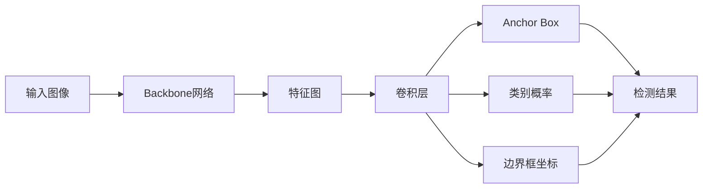

# YOLOv2原理与代码实例讲解

## 1. 背景介绍

### 1.1 问题的由来

目标检测是计算机视觉领域的一个基础性问题，旨在从图像或视频中定位并识别感兴趣的目标对象。传统的目标检测方法主要基于手工设计的特征和分类器，存在泛化能力差、检测速度慢等问题。近年来，深度学习技术的兴起为目标检测带来了新的突破，其中YOLO (You Only Look Once)系列算法以其实时性和高精度受到广泛关注。

### 1.2 研究现状

YOLO算法自2016年提出以来，经历了多个版本的迭代优化。其中，YOLOv2是在YOLOv1基础上的重要改进，通过引入Anchor Box、多尺度训练、Batch Normalization等技术，在保持实时性的同时大幅提升了检测精度。YOLOv2的成功推动了目标检测技术的发展，为后续的YOLOv3、YOLOv4等版本奠定了基础。

### 1.3 研究意义

深入理解YOLOv2的原理和实现细节，对于掌握目标检测的核心技术和算法思想具有重要意义。通过剖析YOLOv2的网络结构、损失函数设计、训练优化策略等，可以加深对深度学习目标检测的认知，为进一步改进和应用YOLO系列算法提供有益启示。同时，YOLOv2优秀的实时性能，使其在自动驾驶、智能监控、机器人等领域具有广阔的应用前景。

### 1.4 本文结构

本文将全面介绍YOLOv2的原理和代码实现，内容组织如下：第2节介绍YOLOv2的核心概念；第3节重点阐述YOLOv2的算法原理和关键步骤；第4节给出YOLOv2涉及的数学模型和公式推导；第5节通过代码实例讲解YOLOv2的具体实现；第6节讨论YOLOv2的应用场景；第7节推荐YOLOv2的学习资源；第8节总结全文并展望未来研究方向；第9节附录常见问题解答。

## 2. 核心概念与联系

YOLOv2是一种基于深度卷积神经网络的端到端目标检测算法，可以实现对图像中目标的实时定位与分类。它的核心思想是将整张图像划分为S×S个网格，每个网格负责预测其所属区域内的目标。相比于YOLOv1，YOLOv2主要引入了以下改进：

- **Anchor Box**: 使用预先聚类得到的先验框，取代YOLOv1中的全连接层预测边界框，提高了小目标的检测精度。
- **Batch Normalization**: 在卷积层之后添加BN层，加速网络收敛，提高模型泛化能力。
- **High Resolution Classifier**: 先在高分辨率(448x448)下对分类网络进行预训练，再用于初始化检测网络，提高检测精度。
- **Multi-Scale Training**: 在训练过程中随机调整输入图像尺寸，使得网络适应不同大小的目标。
- **Dimension Clusters**: 使用k-means聚类得到更适合数据集的Anchor Box尺寸，提高检测框的匹配度。
- **Direct location prediction**: 直接预测边界框的位置坐标，而非offsets，加快收敛速度。

通过以上改进，YOLOv2在PASCAL VOC和COCO等数据集上取得了当时state-of-the-art的检测性能，同时保持了较高的检测速度。

## 3. 核心算法原理 & 具体操作步骤

### 3.1 算法原理概述

YOLOv2采用一个单阶段的检测流程，即输入图像经过一个卷积神经网络后，直接同时输出目标的类别概率和位置坐标。具体来说，输入图像首先通过一个基于Darknet-19的特征提取网络，得到一个7x7x1024的特征图。然后使用卷积层将特征图划分为S×S个网格(默认S=13)，每个网格预测B个边界框(默认B=5)。对于每个预测框，网络输出5个坐标值(tx, ty, tw, th, to)和C个类别概率值。最后通过阈值筛选和非极大值抑制(NMS)处理，得到最终的检测结果。

### 3.2 算法步骤详解

1. **图像预处理**：将输入图像缩放到固定尺寸(416x416)，并进行归一化。

2. **特征提取**：使用Darknet-19网络提取图像特征，得到一个7x7x1024的特征图。

3. **网格划分**：将特征图划分为S×S个网格(S=13)，每个网格负责检测其所属区域内的目标。

4. **Anchor Box预测**：每个网格预测B个Anchor Box(B=5)，每个Box包括5个坐标值(tx, ty, tw, th, to)和C个类别概率值。其中，(tx, ty)表示Box中心相对于网格的偏移量，(tw, th)表示Box的宽高相对于整张图像的比例，to表示Box内包含目标的置信度。

5. **边界框解码**：将预测的Box坐标值(tx, ty, tw, th)解码为真实的像素坐标(bx, by, bw, bh)。解码公式为：

$$
\begin{aligned}
b_x &= \sigma(t_x) + c_x \\
b_y &= \sigma(t_y) + c_y \\
b_w &= p_w e^{t_w} \\
b_h &= p_h e^{t_h}
\end{aligned}
$$

其中，$c_x$和$c_y$分别表示网格的左上角坐标，$p_w$和$p_h$表示Anchor Box的先验宽高，$\sigma$表示Sigmoid函数。

6. **置信度阈值筛选**：根据预测的置信度to，过滤掉置信度低于阈值(如0.5)的Box。

7. **非极大值抑制**：对于每个类别，分别对预测框进行非极大值抑制，去除重叠度高的冗余检测框。

8. **后处理**：将筛选后的检测框与对应的类别标签和置信度得分组合，输出最终的检测结果。

### 3.3 算法优缺点

- 优点：
  - 检测速度快，能够实现实时检测。
  - 检测精度高，引入Anchor Box和多尺度训练策略后，在PASCAL VOC数据集上mAP达到78.6%。
  - 网络结构简洁，易于实现和部署。
- 缺点：  
  - 对小目标和密集目标的检测效果欠佳。
  - 检测结果对物体的形变和遮挡敏感。
  - 预测框的位置和大小受到网格大小的限制。

### 3.4 算法应用领域

YOLOv2 凭借其出色的实时性能和较高的检测精度，在智能监控、无人驾驶、机器人、视频分析等领域得到了广泛应用。一些具体的应用场景包括：

- 智能交通：实时检测和跟踪车辆、行人，辅助交通管控和事故预警。
- 智慧安防：检测异常行为、危险物品，及时预警和处置安全隐患。  
- 无人零售：识别和统计商品，实现自动结算和货架管理。
- 工业质检：快速定位和识别产品缺陷，提高生产效率和品质。
- 无人机航拍：实时检测和跟踪地面目标，应用于搜救、巡检等任务。

## 4. 数学模型和公式 & 详细讲解 & 举例说明

### 4.1 数学模型构建

YOLOv2的数学模型主要包括两部分：目标检测模型和损失函数。

**目标检测模型**：将输入图像 $I$ 映射为一组检测结果 $\hat{y}$，即：

$$\hat{y} = f(I; \theta)$$

其中，$f$ 表示YOLOv2的网络结构，$\theta$ 表示网络参数。$\hat{y}$ 是一个 $S \times S \times (B \times 5 + C)$ 的张量，包含每个网格的B个预测框和C个类别概率。

**损失函数**：YOLOv2的损失函数由三部分组成，分别是坐标损失 $L_{coord}$、置信度损失 $L_{conf}$ 和分类损失 $L_{class}$。

$$L = \lambda_{coord} L_{coord} + L_{conf} + L_{class}$$

其中，$\lambda_{coord}$ 是坐标损失的权重系数，用于平衡不同损失项的重要性。

坐标损失 $L_{coord}$ 计算预测框和真实框中心坐标及宽高的差异，采用平方误差损失：

$$L_{coord} = \sum_{i=0}^{S^2} \sum_{j=0}^{B} \mathbb{1}_{ij}^{obj} \left[ (x_i - \hat{x}_i)^2 + (y_i - \hat{y}_i)^2 + (\sqrt{w_i} - \sqrt{\hat{w}_i})^2 + (\sqrt{h_i} - \sqrt{\hat{h}_i})^2 \right]$$

其中，$\mathbb{1}_{ij}^{obj}$ 表示第 $i$ 个网格的第 $j$ 个预测框是否负责检测目标，$x_i, y_i, w_i, h_i$ 分别表示真实框的中心坐标和宽高，$\hat{x}_i, \hat{y}_i, \hat{w}_i, \hat{h}_i$ 表示预测框的中心坐标和宽高。

置信度损失 $L_{conf}$ 计算预测框是否包含目标的置信度误差，同样采用平方误差损失：

$$
\begin{aligned}
L_{conf} &= \sum_{i=0}^{S^2} \sum_{j=0}^{B} \mathbb{1}_{ij}^{obj} (C_i - \hat{C}_i)^2 + \lambda_{noobj} \sum_{i=0}^{S^2} \sum_{j=0}^{B} \mathbb{1}_{ij}^{noobj} (C_i - \hat{C}_i)^2 \\
\mathbb{1}_{ij}^{noobj} &= 1 - \mathbb{1}_{ij}^{obj}
\end{aligned}
$$

其中，$C_i$ 表示真实框的置信度(0或1)，$\hat{C}_i$ 表示预测框的置信度，$\lambda_{noobj}$ 是不包含目标的预测框的损失权重，用于平衡正负样本。

分类损失 $L_{class}$ 计算预测框所属类别的概率误差，采用交叉熵损失：

$$L_{class} = -\sum_{i=0}^{S^2} \mathbb{1}_i^{obj} \sum_{c \in classes} p_i(c) \log(\hat{p}_i(c))$$

其中，$p_i(c)$ 表示第 $i$ 个网格真实框所属类别 $c$ 的概率(0或1)，$\hat{p}_i(c)$ 表示预测框所属类别 $c$ 的概率。

### 4.2 公式推导过程

**坐标损失**：对于第 $i$ 个网格的第 $j$ 个预测框，如果它负责检测目标($\mathbb{1}_{ij}^{obj}=1$)，则计算其坐标损失：

$$\begin{aligned}
L_{coord}^{ij} &= (x_i - \hat{x}_i)^2 + (y_i - \hat{y}_i)^2 + (\sqrt{w_i} - \sqrt{\hat{w}_i})^2 + (\sqrt{h_i} - \sqrt{\hat{h}_i})^2 \\
&= (\frac{gt_x}{S} - \sigma(t_x))^2 + (\frac{gt_y}{S} - \sigma(t_y))^2 + (\sqrt{\frac{gt_w}{S}} - \sqrt{p_w e^{t_w}})^2 + (\sqrt{\frac{gt_h}{S}} - \sqrt{p_h e^{t_h}})^2
\end{aligned}$$

其中，$gt_x, gt_y, gt_w, gt_h$ 分别表示真实框相对于整张图像的中心坐标和宽高，$\sigma$ 表示Sigmoid函数。

**置信度损失**：对于第 $i$ 个网格的第 $