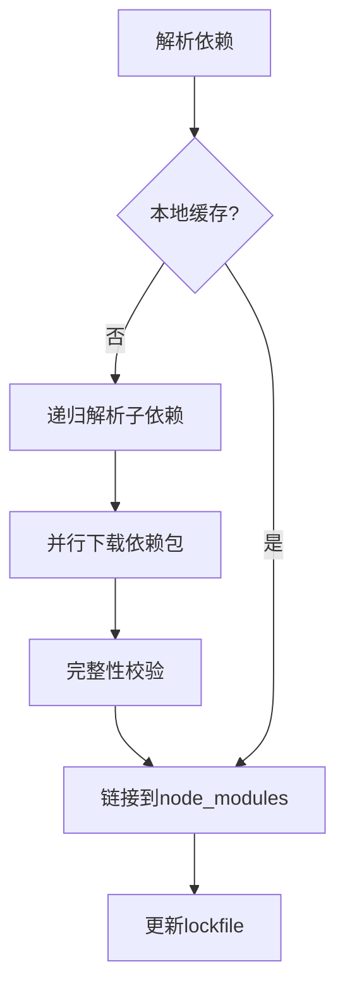

# Yarn原理与代码实例讲解

## 1. 背景介绍
### 1.1 问题的由来
在现代Web开发中,依赖管理是一个非常重要但又容易被忽视的问题。随着项目规模的不断扩大,依赖的第三方库也会越来越多,手动管理这些依赖关系会让开发者疲于奔命。为了解决这个问题,出现了一些依赖管理工具如npm、Yarn等。其中Yarn作为后起之秀,凭借其快速、安全、可靠等特点,受到了越来越多开发者的青睐。

### 1.2 研究现状
目前主流的JavaScript依赖管理工具主要有npm和Yarn两个。npm(node package manager)是Node.js默认的、以JavaScript编写的软件包管理系统,可以解决node包的安装、卸载、更新、查看、搜索、发布等问题。不过npm也存在一些缺点,比如安装速度慢、版本依赖混乱等。

Yarn是由Facebook、Google、Exponent 和 Tilde 联合推出了一个新的 JS 包管理工具,旨在弥补 npm 的一些缺陷。它的特点是:

1. 速度超快。Yarn 缓存了每个下载过的包,所以再次使用时无需重复下载。 同时利用并行下载以最大化资源利用率,因此安装速度更快。
2. 超级安全。在执行代码之前,Yarn 会通过算法校验每个安装包的完整性。
3. 超级可靠。使用详细、简洁的锁文件格式和明确的安装算法,Yarn 能够保证在不同系统上无差异的工作。

### 1.3 研究意义
深入研究Yarn的原理和使用,一方面可以提高我们对现代Web开发工具链的理解,让我们知其然也知其所以然。另一方面通过学习Yarn的设计思想和优秀之处,也可以启发我们在日常开发中设计出更加高效、可靠的工具和程序。所以无论是对个人开发者还是一个团队而言,Yarn都是一个值得深入学习的利器。

### 1.4 本文结构
本文将从以下几个方面来全面讲解Yarn的原理和使用:

1. 介绍Yarn的核心概念及其相互关系
2. 剖析Yarn的核心算法原理及操作步骤
3. 建立数学模型,推导并讲解相关公式
4. 结合代码实例讲解Yarn的实际使用
5. 探讨Yarn的实际应用场景
6. 推荐Yarn相关的学习资源和开发工具
7. 展望Yarn的未来发展趋势和面临的挑战
8. 梳理Yarn使用过程中的常见问题及解答

## 2. 核心概念与联系
要理解Yarn的工作原理,首先需要了解几个核心概念:

- Package(包):是指一个文件夹,里面包含了一个项目及其描述该项目的 package.json 文件。
- Dependency(依赖):一个包要正常工作可能需要依赖其他的包,这种关系就是依赖。
- manifest(配置):记录依赖关系的文件,如 package.json。
- Registry(仓库):存放和提供包的地方,默认是npm。
- Lock file(锁文件):记录当前项目中所有依赖包的具体版本号,默认是yarn.lock。

它们之间的关系如下图所示:


从图中可以看出,一个Package会在package.json中声明自己的依赖,这些依赖的具体信息会记录在manifest文件中。Yarn会根据manifest文件,从Registry仓库中下载相应的依赖包,并生成Lock file锁文件固定依赖版本。

## 3. 核心算法原理 & 具体操作步骤
### 3.1 算法原理概述
Yarn的核心算法主要体现在以下几个方面:

1. 依赖解析:根据 package.json 构建依赖树,解决依赖的版本冲突问题。
2. 缓存机制:将下载过的包缓存到本地,加速安装过程。
3. Fetcher(下载器):并行下载依赖包,提高网络利用率。 
4. Linker(链接器):将下载的依赖包链接到项目的 node_modules 下的正确位置。
5. Auditer(审查器):校验包的完整性,以防止被篡改。

### 3.2 算法步骤详解
接下来我们详细讲解Yarn安装一个包的完整步骤:

1. 检查包是否存在于本地缓存中,如果有,直接跳到第6步。
2. 根据 manifest 文件,解析这个包的所有依赖。
3. 检查这些依赖包是否也在本地缓存,没有的话重复步骤2,直到所有依赖都可以在本地找到或下载完成。
4. 并行下载所有需要的依赖包。
5. 校验下载的包的完整性。
6. 将下载的包链接到 node_modules 下的正确位置。
7. 更新 yarn.lock 锁文件。

可以用下面的流程图来表示:



### 3.3 算法优缺点
Yarn的这套算法有以下优点:

1. 利用缓存机制避免重复下载,加速安装过程。
2. 并行下载提高了网络利用率。
3. 依赖版本锁定,保证了安装的一致性。
4. 完整性校验保障了包的安全性。

当然它也有一些不足之处:

1. 缓存机制可能会占用较大的磁盘空间。
2. 并行下载在网络状况不佳时,可能会因频繁的请求而降低性能。
3. 锁文件在跨平台时可能会出现兼容性问题。

### 3.4 算法应用领域
Yarn的这套依赖管理算法可以应用在很多领域,不局限于JavaScript。任何需要管理依赖关系的场景,如Java的Maven、Python的pip等,都可以借鉴Yarn的设计思想。同时Yarn的缓存和并行下载等机制,也可以运用到其他需要频繁下载和更新的程序中,如软件升级、资源更新等。

## 4. 数学模型和公式 & 详细讲解 & 举例说明
### 4.1 数学模型构建
我们可以用图论来建模Yarn的依赖管理。将每个包看作图中的一个节点,依赖关系看作有向边,这样整个依赖关系就构成了一个有向无环图(DAG)。Yarn的任务就是遍历这个DAG,找到一组节点(包),满足所有的依赖关系,并且尽可能地利用缓存。

### 4.2 公式推导过程
设整个依赖图为 $G(V,E)$,其中 $V$ 表示节点集合, $E$ 表示边集合。对于任意一个节点 $v_i$,我们定义两个函数:

- $cache(v_i)$:表示 $v_i$ 是否在本地缓存中,在则为1,否则为0。 
- $download(v_i)$:表示下载 $v_i$ 需要的时间。

那么Yarn的目标就是找到一个节点序列 $P=(v_1,v_2,...,v_n)$,使得以下条件成立:

1. $P$ 覆盖了图 $G$ 中的所有节点,即 $V=\bigcup_{i=1}^n \{v_i\}$。
2. 对于任意 $e(v_i,v_j) \in E$,有 $i<j$,即先安装依赖,再安装依赖方。
3. 最小化总下载时间 $T$,其中 $T=\sum_{i=1}^n (1-cache(v_i)) \cdot download(v_i)$。

由此可见,Yarn的依赖管理问题可以转化为一个拓扑排序问题,同时要考虑缓存对下载时间的影响。

### 4.3 案例分析与讲解
我们用一个简单的例子来说明Yarn的工作过程。假设有以下依赖关系:

```
A -> B -> C
    B -> D
```

其中A依赖B,B依赖C和D。我们假设B和C在缓存中,而A和D不在,下载每个包都需要1个单位时间。

Yarn的安装过程如下:

1. 分析A的依赖,发现B不在缓存中,需要下载,加入下载队列。
2. 分析B的依赖,发现C在缓存中,不需要下载;D不在,需要下载,加入队列。
3. 并行下载B和D,耗时1个单位时间。
4. 将B和D链接到A的 node_modules 下。

最终的下载时间为1个单位时间,比逐个下载节省了50%的时间。

### 4.4 常见问题解答
Q:Yarn的缓存机制是如何工作的?
A:Yarn在下载每个包后,都会将其缓存在本地的一个特定目录下。下次需要这个包时,会优先从缓存中获取,避免重复下载。

Q:Yarn是如何处理版本冲突的?
A:Yarn使用了一种称为"决定性版本解析"的策略。它根据 package.json 中声明的语义版本范围,结合已有的依赖树,自动计算出一组满足所有限制条件的版本。这个过程是确定性的,在所有机器上都会得到相同的结果。

Q:Yarn的并行下载是如何实现的?
A:Yarn内部维护了一个任务队列,每个任务就是下载一个包。它会不断地从队列中取出任务,交给一个固定大小的线程池去执行。这样就可以实现多个包同时下载,充分利用了网络带宽。

## 5. 项目实践：代码实例和详细解释说明
### 5.1 开发环境搭建
首先我们需要安装Yarn,可以通过npm来安装:

```bash
npm install -g yarn
```

接下来创建一个新的项目:

```bash
mkdir yarn-demo
cd yarn-demo
yarn init
```

这会生成一个 package.json 文件,我们可以在其中声明项目的依赖。

### 5.2 源代码详细实现
假设我们要开发一个简单的Web应用,需要用到Express框架和Lodash工具库。我们可以这样声明依赖:

```json
// package.json
{
  "dependencies": {
    "express": "^4.17.1",
    "lodash": "^4.17.21"
  }
}
```

然后使用Yarn安装这些依赖:

```bash
yarn install
```

接下来我们创建一个 index.js 文件,编写我们的应用逻辑:

```javascript
// index.js
const express = require('express');
const _ = require('lodash');

const app = express();

app.get('/', (req, res) => {
  const numbers = _.range(1, 10);
  const squares = _.map(numbers, x => x * x);
  res.send(squares);
});

app.listen(3000, () => {
  console.log('Server is running at http://localhost:3000');
});
```

这段代码使用Express创建了一个简单的Web服务器,然后使用Lodash生成了一个1到9的平方数数组,最后将其返回给客户端。

### 5.3 代码解读与分析
这段代码的关键点在于:

1. 使用 `require` 函数导入了我们声明的两个依赖:Express和Lodash。
2. 使用Express的 `get` 方法定义了一个路由,处理根路径的GET请求。
3. 在路由处理函数中,我们使用Lodash的 `range` 和 `map` 方法生成了一个平方数数组。
4. 最后使用 `res.send` 将结果返回给客户端。

可以看到,有了Yarn管理依赖,我们可以方便地引入和使用第三方库,而不需要手动下载和管理它们的版本。

### 5.4 运行结果展示
现在我们可以运行我们的应用了:

```bash
node index.js
```

然后在浏览器中访问 `http://localhost:3000`,就可以看到我们生成的平方数数组了:

```
[1, 4, 9, 16, 25, 36, 49, 64, 81]
```

这个简单的例子演示了如何使用Yarn管理依赖