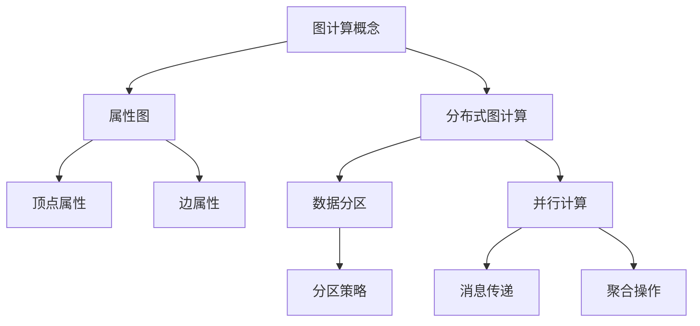
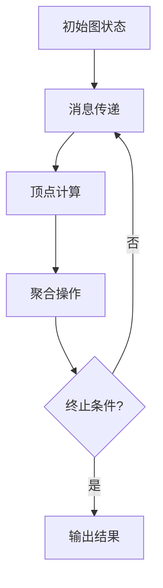
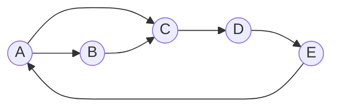

# 【AI大数据计算原理与代码实例讲解】GraphX

## 1. 背景介绍

### 1.1 问题的由来

在当今大数据时代,海量数据的处理与分析成为了一个巨大的挑战。传统的数据处理方式很难满足现有需求,因此出现了一系列新兴的大数据计算框架和模型。其中,图计算(Graph Computing)作为一种新兴的大数据计算模型,在处理复杂关系型数据方面展现出了巨大的潜力。

### 1.2 研究现状

Apache Spark作为当前最流行的大数据处理框架之一,提供了GraphX作为图计算的编程抽象。GraphX是Spark内置的图计算系统,支持对海量图数据进行并行计算和分析。它基于Spark RDD(Resilient Distributed Dataset)构建,提供了丰富的图算法库和优化策略,可以高效地处理大规模图数据。

### 1.3 研究意义

图计算在许多领域都有着广泛的应用,如社交网络分析、推荐系统、交通路线规划、知识图谱构建等。随着数据量的不断增长,高效的图计算框架变得越来越重要。研究GraphX的原理和实践,有助于我们更好地理解和运用这一强大的图计算工具,解决实际问题。

### 1.4 本文结构

本文将全面介绍GraphX的核心概念、算法原理、数学模型、代码实现和实际应用。首先阐述图计算的基本概念和GraphX的架构设计,然后深入探讨其核心算法原理和数学模型,并通过代码示例讲解具体的实现细节。最后,介绍GraphX在不同领域的应用场景,并对其未来发展趋势进行展望。

## 2. 核心概念与联系

图计算(Graph Computing)是一种处理关系型数据的计算模型。它将数据抽象为一个由顶点(Vertex)和边(Edge)组成的图结构,顶点表示实体,边表示实体之间的关系。在图计算中,常见的操作包括遍历、聚合、模式匹配等。

GraphX将图数据抽象为属性图(Property Graph),即每个顶点和边都可以携带属性信息。这种灵活的数据模型适用于多种复杂的图结构,如社交网络、知识图谱等。

分布式图计算(Distributed Graph Computing)是GraphX的核心特性之一。它将大规模图数据分区存储在多个节点上,并通过并行计算和消息传递实现高效的图处理。数据分区策略和并行计算模型对GraphX的性能至关重要。

## 3. 核心算法原理 & 具体操作步骤  

### 3.1 算法原理概述

GraphX的核心算法主要基于图的迭代计算模型(Iterative Graph Computing Model)。该模型将图算法抽象为一系列超步(Superstep)的迭代过程,每个超步包含以下三个阶段:

1. **消息传递(Message Passing)**: 顶点根据当前状态生成消息,并将消息发送给相邻顶点。
2. **顶点计算(Vertex Computing)**: 顶点接收来自其他顶点的消息,并根据消息更新自身状态。
3. **聚合操作(Aggregation)**: 对所有顶点的状态进行全局聚合,生成新的全局状态。

通过不断迭代上述三个阶段,直到满足终止条件,即可得到图算法的最终结果。

### 3.2 算法步骤详解

1. **消息传递(Message Passing)**

   在每个超步中,每个顶点根据当前状态生成消息,并将消息发送给相邻顶点。消息可以携带任意类型的数据,如更新信息、权重等。GraphX使用Spark RDD的转换操作(Transformation)实现消息传递。

2. **顶点计算(Vertex Computing)**

   顶点接收来自其他顶点的消息,并根据消息更新自身状态。这个过程通常涉及到聚合操作,如求和、求最大值等。GraphX使用Spark RDD的行动操作(Action)实现顶点计算。

3. **聚合操作(Aggregation)**

   对所有顶点的状态进行全局聚合,生成新的全局状态。这个过程通常涉及到归约操作(Reduction),如计算总和、最大值等。GraphX使用Spark的聚合操作实现全局聚合。

4. **终止条件检查**

   检查是否满足算法的终止条件,如收敛性条件、迭代次数上限等。如果满足,则输出最终结果;否则,进入下一个超步,重复上述三个阶段。

### 3.3 算法优缺点

**优点:**

- 并行性强,可以高效处理大规模图数据。
- 基于Spark,可以与Spark生态系统无缝集成。
- 提供了丰富的图算法库,如PageRank、连通分量、最短路径等。
- 支持属性图,可以处理复杂的图结构。

**缺点:**

- 由于基于数据并行模型,对于某些算法可能存在性能瓶颈。
- 消息传递和聚合操作可能会产生大量的网络通信开销。
- 对于动态图的支持相对有限。

### 3.4 算法应用领域

GraphX的图计算模型可以应用于多个领域,包括但不限于:

- **社交网络分析**: 分析用户之间的关系、影响力传播等。
- **推荐系统**: 基于用户之间的相似性进行个性化推荐。
- **知识图谱**: 构建和查询知识图谱,发现实体之间的关系。
- **交通路线规划**: 计算最短路径、交通流量预测等。
- **金融风险分析**: 分析金融实体之间的风险传播路径。
- **生物信息学**: 分析蛋白质互作网络、基因调控网络等。

## 4. 数学模型和公式 & 详细讲解 & 举例说明

### 4.1 数学模型构建

GraphX将图数据建模为一个由顶点集合V和边集合E组成的无向图$G=(V,E)$。每个顶点$v \in V$都有一个唯一的ID标识,并可以携带属性信息$\Gamma(v)$。每条边$e \in E$由一对顶点$(u,v)$构成,也可以携带属性信息$\Phi(e)$。

$$
G=(V,E) \\
V=\{v_1,v_2,\dots,v_n\} \\
E=\{(u,v) | u,v \in V\}
$$

基于这一数学模型,GraphX实现了多种图算法,如PageRank、连通分量、最短路径等。下面将详细介绍PageRank算法的数学模型和公式推导。

### 4.2 公式推导过程

PageRank是一种用于计算网页重要性的算法,它基于网页之间的链接结构进行计算。在GraphX中,PageRank算法可以应用于任何图结构,用于计算顶点的重要性分数。

PageRank算法的基本思想是,一个顶点的重要性取决于指向它的顶点的重要性以及指向它的边的数量。具体来说,PageRank值$PR(v)$定义为:

$$
PR(v) = \frac{1-d}{N} + d \sum_{u \in M(v)} \frac{PR(u)}{L(u)}
$$

其中:

- $d$是一个阻尼系数(damping factor),通常取值0.85
- $N$是图中顶点的总数
- $M(v)$是所有指向顶点$v$的顶点集合
- $L(u)$是顶点$u$的出边数量

上式的直观解释是:一个顶点的PageRank值由两部分组成。第一部分$(1-d)/N$是所有顶点的初始PageRank值。第二部分是所有指向该顶点的顶点的PageRank值的加权和,权重为$1/L(u)$,即指向该顶点的边的数量的倒数。

PageRank算法通过迭代的方式计算每个顶点的PageRank值,直到收敛或达到最大迭代次数。在GraphX中,PageRank算法的实现基于图的迭代计算模型,包括消息传递、顶点计算和聚合操作三个阶段。

### 4.3 案例分析与讲解

为了更好地理解PageRank算法,我们以一个简单的示例图进行分析和讲解。

上图包含5个顶点和5条边。我们将计算每个顶点的PageRank值,阻尼系数$d$取0.85,初始PageRank值为$1/5=0.2$。

**第一次迭代:**

1. 消息传递阶段:每个顶点将自己的PageRank值除以出边数,作为消息发送给相邻顶点。
2. 顶点计算阶段:每个顶点收集来自相邻顶点的消息,并根据公式计算新的PageRank值。
3. 聚合操作阶段:无需进行全局聚合。

经过第一次迭代后,每个顶点的PageRank值如下:

- $PR(A) = 0.2 + 0.85 \times 0.2 = 0.37$
- $PR(B) = 0.2 + 0.85 \times 0.185 = 0.357$
- $PR(C) = 0.2 + 0.85 \times 0.37 = 0.515$
- $PR(D) = 0.2 + 0.85 \times 0.515 = 0.638$
- $PR(E) = 0.2 + 0.85 \times 0.638 = 0.742$

**第二次迭代:**

重复上述三个阶段,直到PageRank值收敛或达到最大迭代次数。

通过这个示例,我们可以看到PageRank算法如何通过迭代的方式计算每个顶点的重要性分数。在实际应用中,PageRank算法可以用于网页排名、社交网络影响力分析等场景。

### 4.4 常见问题解答

**1. 为什么需要引入阻尼系数$d$?**

引入阻尼系数$d$是为了避免PageRank值在迭代过程中发散。当$d=1$时,PageRank值会无限增长,因此需要一个小于1的阻尼系数来保证收敛性。通常取值0.85是一个经验值,可以在大多数情况下保证算法的收敛性和合理性。

**2. 如何处理无出边的顶点?**

对于无出边的顶点,它们的PageRank值将无法通过迭代进行更新。为了解决这个问题,GraphX采用了一种技术,将无出边顶点的PageRank值均匀分配给所有其他顶点,从而保证了算法的收敛性。

**3. PageRank算法的时间复杂度是多少?**

PageRank算法的时间复杂度取决于具体的实现方式和图的结构。在GraphX中,由于采用了分布式计算和并行化策略,因此时间复杂度主要取决于迭代次数和网络通信开销。在大多数情况下,PageRank算法可以在合理的时间内收敛。

**4. PageRank算法适用于动态图吗?**

原始的PageRank算法是设计用于静态图的。对于动态图,需要在每次图结构发生变化时重新计算PageRank值,这可能会带来较大的计算开销。GraphX目前对动态图的支持相对有限,但是可以通过定期重新计算PageRank值来适应动态图的情况。

## 5. 项目实践:代码实例和详细解释说明

### 5.1 开发环境搭建

要在本地运行GraphX,需要先搭建Spark开发环境。以下是搭建步骤:

1. 安装Java 8或更高版本。
2. 从Apache Spark官网下载最新版本的Spark发行包,并解压缩。
3. 配