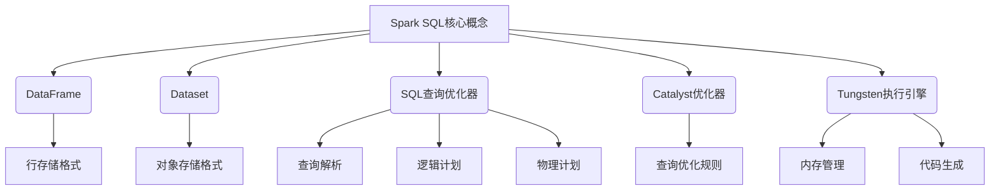

以下是根据您提供的要求和大纲撰写的技术博客文章正文部分：

# 【AI大数据计算原理与代码实例讲解】Spark SQL

## 1. 背景介绍

### 1.1 问题的由来

在大数据时代,海量结构化和非结构化数据的存储和处理成为了一个巨大的挑战。传统的数据库系统在处理大规模数据集时往往会遇到性能瓶颈和可扩展性问题。为了解决这一难题,Apache Spark作为一种新兴的大数据处理框架应运而生。

Spark SQL作为Spark项目的一个重要模块,为结构化数据处理提供了高效、统一的解决方案。它支持SQL查询,并且能够与Spark其他模块(如Spark Streaming、MLlib等)无缝集成,构建出强大的大数据分析应用程序。

### 1.2 研究现状  

目前,Spark SQL已经成为大数据领域最受欢迎的SQL查询引擎之一。越来越多的公司和组织开始采用Spark SQL来处理他们的结构化数据,比如日志数据、交易数据、物联网数据等。

与传统数据库相比,Spark SQL具有天然的分布式计算能力、内存计算优势以及与Spark生态圈的紧密集成等优点。这使得它在处理大规模数据集时表现出色,并且能够支持各种复杂的分析需求。

### 1.3 研究意义

深入理解Spark SQL的原理和实现细节,对于构建高效、可扩展的大数据分析应用程序至关重要。本文将全面解析Spark SQL的核心概念、算法原理、数学模型,并通过大量实例代码讲解其内部实现细节,旨在帮助读者掌握Spark SQL的使用技巧,提升大数据处理能力。

### 1.4 本文结构

本文将从以下几个方面全面介绍Spark SQL:

1. 核心概念与联系
2. 核心算法原理与具体操作步骤  
3. 数学模型和公式详细讲解与案例分析
4. 项目实践:代码实例和详细解释
5. 实际应用场景分析
6. 相关工具和学习资源推荐
7. 总结未来发展趋势与挑战
8. 常见问题解答

## 2. 核心概念与联系



Spark SQL引入了几个核心概念,它们之间存在密切的联系:

1. **DataFrame**: 这是Spark SQL中处理结构化数据的核心数据结构,以行存储格式组织数据。
2. **Dataset**: 与DataFrame类似,但采用对象存储格式,可以直接操作对象。
3. **SQL查询优化器**: 负责将SQL查询转换为高效的执行计划,包括查询解析、逻辑计划生成和物理计划生成等步骤。
4. **Catalyst优化器**: Spark SQL的查询优化框架,提供了一组优化规则用于优化逻辑计划。
5. **Tungsten执行引擎**: Spark SQL的执行引擎,负责高效执行查询计划,包括内存管理和代码生成等功能。

这些核心概念相互协作,共同实现了Spark SQL对结构化数据的高效处理。

## 3. 核心算法原理与具体操作步骤

### 3.1 算法原理概述

Spark SQL在处理结构化数据时,采用了一种基于规则的查询优化算法。该算法的核心思想是将SQL查询转换为一系列规则应用的过程,以生成高效的执行计划。

整个算法可以分为以下几个主要步骤:

1. **查询解析**: 将SQL查询解析为抽象语法树(AST)。
2. **逻辑计划生成**: 基于AST生成逻辑计划,表示查询的高级执行策略。
3. **逻辑计划优化**: 应用一系列优化规则对逻辑计划进行等价变换,以提高查询效率。
4. **物理计划生成**: 将优化后的逻辑计划转换为物理计划,描述了具体的执行步骤。
5. **物理计划优化**: 继续应用一些基于代价模型的优化规则,进一步优化物理计划。
6. **代码生成和执行**: 根据优化后的物理计划生成高效的本地代码,并在Spark集群上并行执行。

### 3.2 算法步骤详解

1. **查询解析**

   Spark SQL使用ANTLR解析器将SQL查询解析为抽象语法树(AST)。AST是一种树状数据结构,描述了查询的语法结构。

2. **逻辑计划生成**

   基于AST,Spark SQL构建了一个逻辑计划,表示查询的高级执行策略。逻辑计划由一系列逻辑操作符(如Project、Filter、Join等)组成,描述了数据的转换过程。

3. **逻辑计划优化**

   Catalyst优化器应用一系列规则对逻辑计划进行等价变换,以提高查询效率。这些规则包括常量折叠、谓词下推、投影剪裁等。优化后的逻辑计划在语义上等价于原始计划,但具有更高的执行效率。

4. **物理计划生成**

   将优化后的逻辑计划转换为物理计划,描述了具体的执行步骤。物理计划由一系列物理操作符(如FilesScan、HashJoin、SortMergeJoin等)组成,考虑了数据分布、分区等因素。

5. **物理计划优化**

   Spark SQL继续应用一些基于代价模型的优化规则,进一步优化物理计划。这些规则包括连接重排序、数据分区调整等,旨在减少数据洗牌和网络传输开销。

6. **代码生成和执行**

   Tungsten执行引擎根据优化后的物理计划,使用Scala内联的方式生成高效的本地代码。生成的代码通过JIT编译,并在Spark集群上并行执行,充分利用现代CPU的SIMD指令集和缓存局部性,实现高性能计算。

### 3.3 算法优缺点

**优点**:

- 通过查询优化,可以显著提高SQL查询的执行效率。
- 算法具有良好的可扩展性和容错性,适合大规模数据处理场景。
- 与Spark生态圈紧密集成,支持各种高级分析需求。

**缺点**:

- 查询优化过程较为复杂,需要大量的规则和代价模型。
- 对于某些特殊查询模式,优化效果可能不佳。
- 代码生成和JIT编译会带来一定的启动开销。

### 3.4 算法应用领域

Spark SQL的查询优化算法可以广泛应用于以下领域:

- 大数据分析: 处理来自各种来源的海量结构化数据,如日志数据、交易数据等。
- 数据仓库: 构建企业级数据仓库,支持复杂的OLAP查询。
- 机器学习: 与Spark MLlib集成,支持大规模机器学习任务。
- 实时数据处理: 与Spark Streaming集成,支持对实时数据流进行SQL查询。

## 4. 数学模型和公式详细讲解与举例说明

### 4.1 数学模型构建

在Spark SQL的查询优化过程中,需要构建代价模型来估算不同执行计划的代价,从而选择最优计划。代价模型通常基于以下几个主要因素:

- 数据统计信息: 包括表的行数、列的基数等统计信息。
- 硬件资源: 包括CPU、内存、网络带宽等硬件资源。
- 操作代价: 不同操作符(如扫描、连接、聚合等)的代价估算函数。

基于上述因素,Spark SQL构建了一个代价模型,用于估算查询执行计划的代价。该模型可以表示为:

$$
Cost(P) = \sum_{i=1}^{n} C_i(S_i, H, O_i)
$$

其中:

- $P$ 表示查询执行计划
- $n$ 表示执行计划中操作符的数量
- $C_i$ 表示第 $i$ 个操作符的代价估算函数
- $S_i$ 表示第 $i$ 个操作符的输入数据统计信息
- $H$ 表示硬件资源信息
- $O_i$ 表示第 $i$ 个操作符的类型和属性

通过minimizing该代价模型,Spark SQL可以选择代价最小的执行计划作为最优计划。

### 4.2 公式推导过程

我们以Join操作符的代价估算为例,推导其代价公式。

假设有两个表 $R$ 和 $S$,它们分别有 $n_R$ 和 $n_S$ 行。我们要对它们执行Hash Join操作。

首先,需要构建两个表的Hash表,代价为:

$$
C_{build}(n_R, n_S) = n_R + n_S
$$

然后,对于每一行 $r \in R$,需要在 $S$ 的Hash表中查找匹配的行,代价为:

$$
C_{probe}(n_R, n_S) = n_R \times \frac{n_S}{N}
$$

其中 $N$ 是Hash表的大小,通常取 $n_S$ 的近似值。

综合以上两个部分,Hash Join的总代价估算为:

$$
C_{HashJoin}(n_R, n_S) = n_R + n_S + n_R \times \frac{n_S}{n_S} = n_R + n_S + n_R
$$

通过类似的推导过程,Spark SQL为不同的操作符构建了相应的代价估算公式,并将它们集成到整体代价模型中。

### 4.3 案例分析与讲解

考虑以下SQL查询:

```sql
SELECT c.name, sum(o.quantity) as total_qty
FROM customers c
JOIN orders o ON c.id = o.cust_id
GROUP BY c.name;
```

这个查询需要执行以下几个主要步骤:

1. 扫描customers表
2. 扫描orders表
3. 执行Hash Join操作,将orders表中的每一行与对应的customer行连接
4. 按照customer名称进行聚合,计算每个客户的总订单数量

我们来估算这个查询的执行代价:

假设customers表有 $n_c$ 行,orders表有 $n_o$ 行。

1. 扫描customers表的代价为 $C_{scan}(n_c)$,通常为 $n_c$。
2. 扫描orders表的代价为 $C_{scan}(n_o)$,通常为 $n_o$。
3. 执行Hash Join的代价为 $C_{HashJoin}(n_c, n_o) = n_c + n_o + n_c$,根据前面推导的公式。
4. 执行聚合操作的代价为 $C_{agg}(n_c)$,通常为 $n_c \times \log(n_c)$。

综合以上各个部分,该查询的总代价估算为:

$$
C_{total} = C_{scan}(n_c) + C_{scan}(n_o) + C_{HashJoin}(n_c, n_o) + C_{agg}(n_c) \\
= n_c + n_o + (n_c + n_o + n_c) + n_c \times \log(n_c) \\
= 2n_c + 2n_o + n_c \times \log(n_c)
$$

通过这种代价估算,Spark SQL可以评估不同的执行计划,并选择代价最小的作为最优计划。

### 4.4 常见问题解答

**Q: 为什么Spark SQL需要查询优化?**

A: 查询优化是为了生成高效的执行计划,从而提高SQL查询的性能。由于SQL语句通常有多种等价的执行方式,查询优化器的目标就是选择代价最小的执行计划。

**Q: Spark SQL的查询优化过程是如何工作的?**

A: Spark SQL的查询优化过程包括以下几个主要步骤:查询解析、逻辑计划生成、逻辑计划优化、物理计划生成、物理计划优化、代码生成和执行。在这个过程中,Catalyst优化器应用了一系列优化规则对查询计划进行等价变换和优化。

**Q: 代价模型是如何估算执行计划的代价