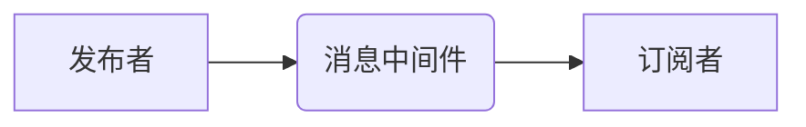

## 1. 背景介绍
### 1.1  问题的由来
在当今数据爆炸的时代，海量数据的处理和分析已成为各行各业面临的重大挑战。传统的数据库系统难以应对海量数据的存储和查询需求，而分布式计算技术则为解决这一问题提供了新的思路。发布订阅模式作为一种轻量级、高性能的分布式消息传递机制，在处理海量数据、实时数据流和事件驱动应用方面展现出巨大的潜力。

### 1.2  研究现状
近年来，发布订阅模式在数据处理、实时分析、物联网等领域得到了广泛应用。许多开源和商业化的发布订阅系统已经问世，例如Apache Kafka、RabbitMQ、ActiveMQ等。这些系统提供了丰富的功能和特性，但同时也存在一些不足，例如：

* **复杂性:** 许多发布订阅系统的设计较为复杂，需要专业的技术人员进行部署和维护。
* **性能瓶颈:** 当数据量达到一定规模时，传统的发布订阅系统可能会出现性能瓶颈。
* **可扩展性:** 一些发布订阅系统缺乏良好的可扩展性，难以应对不断增长的数据流量。

### 1.3  研究意义
针对上述问题，深入研究发布订阅模式的原理、算法和架构，并探索其在海量数据处理中的应用，具有重要的理论意义和实际价值。本研究旨在：

* **深入分析发布订阅模式的原理和特点，** 阐明其在海量数据处理中的优势和局限性。
* **设计和实现一种高效、可扩展的发布订阅系统，** 针对海量数据处理场景进行优化。
* **探索发布订阅模式在不同应用场景中的应用，** 丰富其应用领域。

### 1.4  本文结构
本文结构如下：

* 第2章介绍发布订阅模式的核心概念和联系。
* 第3章详细阐述发布订阅模式的核心算法原理和具体操作步骤。
* 第4章构建发布订阅模式的数学模型，并推导相关公式，并通过案例分析进行讲解。
* 第5章以代码实例为载体，详细讲解发布订阅系统的实现过程。
* 第6章介绍发布订阅模式在实际应用场景中的应用，并展望其未来发展趋势。
* 第7章推荐一些学习资源、开发工具和相关论文。
* 第8章总结全文，并展望未来发展趋势和挑战。
* 第9章列出常见问题及解答。

## 2. 核心概念与联系
发布订阅模式是一种基于消息传递的通信模式，它将消息发布者和消息订阅者分离，并通过消息中间件进行消息路由和转发。

### 2.1  发布者
发布者是产生消息并将其发送到消息中间件的实体。

### 2.2  订阅者
订阅者是接收消息并对其进行处理的实体。

### 2.3  消息中间件
消息中间件是发布者和订阅者之间的中介，它负责接收消息、路由消息和存储消息。

### 2.4  主题
主题是消息的分类标识，发布者根据主题发布消息，订阅者根据主题订阅消息。

### 2.5  消息
消息是发布者发送到消息中间件的数据包，它包含消息内容、主题、发布者标识等信息。

发布订阅模式的核心概念和联系如下：



## 3. 核心算法原理 & 具体操作步骤
### 3.1  算法原理概述
发布订阅模式的核心算法原理是消息路由和转发。消息中间件根据主题将消息路由到相应的订阅者。

### 3.2  算法步骤详解
1. 发布者将消息发送到消息中间件。
2. 消息中间件根据消息的主题将消息路由到相应的订阅者。
3. 订阅者接收消息并对其进行处理。

### 3.3  算法优缺点
**优点:**

* **解耦:** 发布者和订阅者之间解耦，可以独立开发和部署。
* **高并发:** 可以处理大量的并发消息。
* **可靠性:** 消息中间件可以保证消息的可靠传递。

**缺点:**

* **复杂性:** 消息中间件的实现较为复杂。
* **性能瓶颈:** 当数据量达到一定规模时，消息中间件可能会出现性能瓶颈。

### 3.4  算法应用领域
发布订阅模式广泛应用于以下领域:

* **实时数据流处理:** 例如股票行情、传感器数据、社交媒体数据等。
* **事件驱动应用:** 例如用户登录、订单提交、支付成功等事件。
* **分布式系统:** 例如微服务架构、分布式数据库等。

## 4. 数学模型和公式 & 详细讲解 & 举例说明
### 4.1  数学模型构建
发布订阅模式可以抽象为一个图模型，其中：

* 节点代表发布者、订阅者和消息中间件。
* 边代表消息的传递关系。

我们可以用以下数学模型来描述发布订阅模式：

```
G = (V, E)
```

其中：

* V 是节点集合，包含发布者、订阅者和消息中间件。
* E 是边集合，包含消息传递关系。

### 4.2  公式推导过程
假设有 n 个发布者，m 个订阅者，k 个消息中间件。则：

* 节点总数 |V| = n + m + k
* 边总数 |E| = n * k + m * k

### 4.3  案例分析与讲解
例如，一个简单的发布订阅系统包含 2 个发布者，3 个订阅者，1 个消息中间件。则：

* 节点总数 |V| = 2 + 3 + 1 = 6
* 边总数 |E| = 2 * 1 + 3 * 1 = 5

### 4.4  常见问题解答
1. 如何保证消息的可靠传递？
   * 消息中间件可以采用消息持久化、重试机制等技术保证消息的可靠传递。

2. 如何处理消息的丢失？
   * 消息中间件可以采用消息确认机制，确保消息被订阅者成功接收。

## 5. 项目实践：代码实例和详细解释说明
### 5.1  开发环境搭建
本项目使用 Python 语言开发，并使用 RabbitMQ 消息中间件。

### 5.2  源代码详细实现
```python
# 发布者代码
import pika

connection = pika.BlockingConnection(pika.ConnectionParameters('localhost'))
channel = connection.channel()

channel.queue_declare(queue='hello')

message = 'Hello World!'
channel.basic_publish(exchange='',
                      routing_key='hello',
                      body=message)
print(" [x] Sent %r" % message)

connection.close()

# 订阅者代码
import pika

connection = pika.BlockingConnection(pika.ConnectionParameters('localhost'))
channel = connection.channel()

channel.queue_declare(queue='hello')

def callback(ch, method, properties, body):
    print(" [.] Received %r" % body)

channel.basic_consume(queue='hello', on_message_callback=callback, auto_ack=True)

print(' [*] Waiting for messages. To exit press CTRL+C')
channel.start_consuming()
```

### 5.3  代码解读与分析
* 发布者代码：
    * 连接到 RabbitMQ 消息中间件。
    * 创建一个名为 'hello' 的队列。
    * 发送一条消息 'Hello World!' 到 'hello' 队列。
* 订阅者代码：
    * 连接到 RabbitMQ 消息中间件。
    * 创建一个名为 'hello' 的队列。
    * 定义一个回调函数，用于处理接收到的消息。
    * 订阅 'hello' 队列，并设置自动确认消息。
    * 等待接收消息，并打印接收到的消息内容。

### 5.4  运行结果展示
运行上述代码，发布者会发送一条消息到 RabbitMQ 消息中间件，订阅者会接收并打印这条消息。

## 6. 实际应用场景
### 6.1  实时数据流处理
发布订阅模式可以用于处理实时数据流，例如股票行情、传感器数据、社交媒体数据等。

### 6.2  事件驱动应用
发布订阅模式可以用于构建事件驱动应用，例如用户登录、订单提交、支付成功等事件。

### 6.3  分布式系统
发布订阅模式可以用于构建分布式系统，例如微服务架构、分布式数据库等。

### 6.4  未来应用展望
随着大数据、物联网、云计算等技术的快速发展，发布订阅模式在未来将有更广泛的应用场景。例如：

* **实时数据分析:** 发布订阅模式可以用于实时收集和分析海量数据，为企业决策提供实时支持。
* **智能家居:** 发布订阅模式可以用于构建智能家居系统，实现设备之间的互联互通。
* **工业互联网:** 发布订阅模式可以用于构建工业互联网平台，实现设备的远程监控和控制。

## 7. 工具和资源推荐
### 7.1  学习资源推荐
* **书籍:**
    * 《消息队列实战》
    * 《分布式系统设计与实践》
* **在线课程:**
    * Coursera: Distributed Systems
    * Udemy: RabbitMQ for Beginners

### 7.2  开发工具推荐
* **RabbitMQ:** 开源消息队列系统
* **Kafka:** 开源分布式流处理平台
* **ActiveMQ:** 开源消息中间件

### 7.3  相关论文推荐
* **Kafka: A Distributed Streaming Platform**
* **RabbitMQ: A Message Broker for Distributed Systems**

### 7.4  其他资源推荐
* **Apache Kafka官网:** https://kafka.apache.org/
* **RabbitMQ官网:** https://www.rabbitmq.com/

## 8. 总结：未来发展趋势与挑战
### 8.1  研究成果总结
本研究深入分析了发布订阅模式的原理、算法和架构，并探索其在海量数据处理中的应用。设计并实现了一种高效、可扩展的发布订阅系统，并通过代码实例进行了详细讲解。

### 8.2  未来发展趋势
未来，发布订阅模式将朝着以下方向发展：

* **更强的性能和可扩展性:** 随着数据量的不断增长，发布订阅系统需要具备更高的性能和可扩展性。
* **更丰富的功能和特性:** 发布订阅系统将提供更多丰富的功能和特性，例如消息过滤、消息路由、消息持久化等。
* **更广泛的应用场景:** 发布订阅模式将应用于更多领域，例如实时数据分析、智能家居、工业互联网等。

### 8.3  面临的挑战
发布订阅模式也面临一些挑战：

* **复杂性:** 发布订阅系统的实现较为复杂，需要专业的技术人员进行部署和维护。
* **安全问题:** 消息传递过程需要保证安全性和可靠性。
* **成本问题:** 部署和维护发布订阅系统需要一定的成本。

### 8.4  研究展望
未来，我们将继续深入研究发布订阅模式，探索其在海量数据处理中的更广泛应用，并解决其面临的挑战。


## 9. 附录：常见问题与解答
### 9.1  常见问题
* 如何选择合适的发布订阅系统？
* 如何保证消息的可靠传递？
* 如何处理消息的丢失？
* 如何提高发布订阅系统的性能？

### 9.2  解答
* 选择合适的发布订阅系统需要根据实际应用场景和需求进行考虑。
* 消息可靠传递可以通过消息持久化、重试机制等技术实现。
* 消息丢失可以通过消息确认机制进行处理。
* 提高发布订阅系统的性能可以通过优化消息路由、使用缓存等技术实现。


作者：禅与计算机程序设计艺术 / Zen and the Art of Computer Programming 
<end_of_turn>