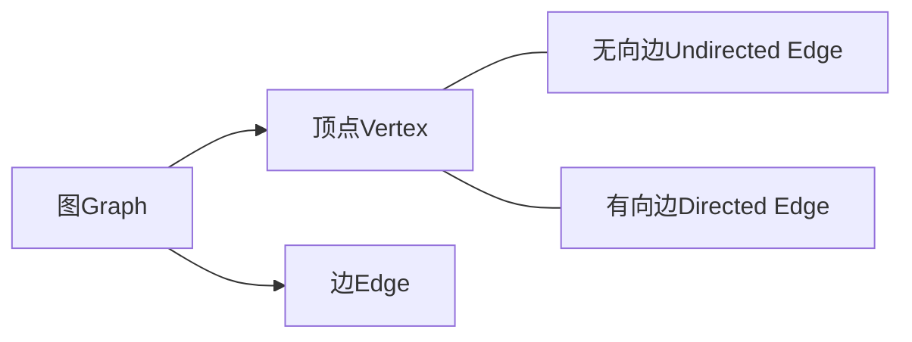
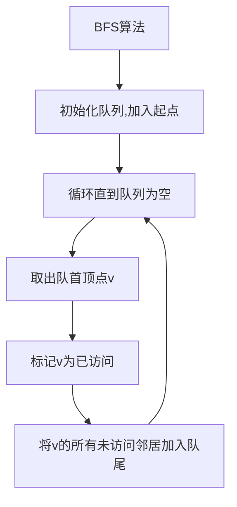
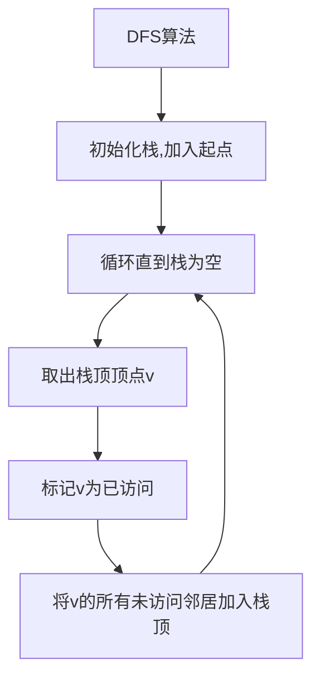
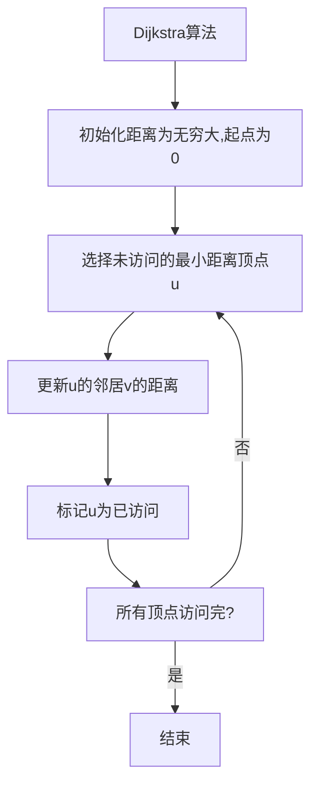
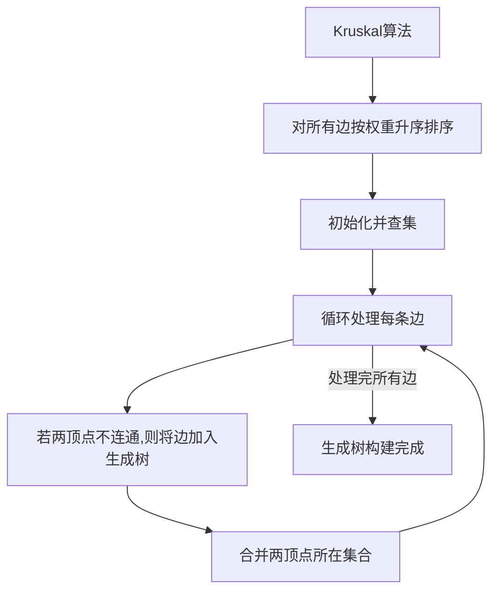

好的,我会按照您的要求,以"【AI大数据计算原理与代码实例讲解】图算法"为主题,撰写一篇专业的技术博客文章。文章将遵循您提供的目录结构,包含背景介绍、核心概念、算法原理、数学模型、代码实例、应用场景、资源推荐、总结和附录等内容。我会努力使用清晰的语言,深入探讨相关理论,并结合实例对知识点进行详细讲解,确保文章内容专业、深入且实用。同时也会尽最大努力插入 Mermaid 流程图来展示核心原理和架构。请稍等,我需要一些时间来准备和撰写这篇高质量的技术文章。

# 【AI大数据计算原理与代码实例讲解】图算法

## 1. 背景介绍

### 1.1 问题的由来

在当今大数据时代,海量的数据被广泛应用于各个领域,数据的处理、分析和可视化成为了重中之重。图是一种非常强大的数据结构,能够有效地表示和处理具有复杂关系的数据。无论是社交网络、交通网络、知识图谱还是基因组学等,都可以使用图来建模和分析。因此,高效的图算法对于挖掘大数据中蕴含的价值至关重要。

### 1.2 研究现状  

图算法是一个经典且活跃的研究领域,已经产生了诸多著名的算法,如广度优先搜索(BFS)、深度优先搜索(DFS)、最短路径算法(Dijkstra)、最小生成树算法(Kruskal、Prim)、图着色算法等。这些算法已被广泛应用于网络路由、网络爬虫、推荐系统、计算机视觉等诸多领域。

随着数据规模的不断扩大,传统的图算法在处理大规模图数据时面临着巨大的计算和存储压力。因此,针对大型图的高效算法设计成为了当前的研究热点,例如基于内存的并行图算法、基于磁盘的外部存储图算法、基于GPU的加速图算法等。

### 1.3 研究意义

设计高效的大规模图算法,对于充分挖掘大数据中蕴含的价值具有重要意义。高效的图算法不仅能够加速数据处理速度,而且能够帮助我们更好地理解和分析复杂的数据关系,从而为科学研究、商业决策等提供有力支持。

本文将系统地介绍图算法的基本概念、核心原理、数学模型,并通过实例代码对算法实现进行详细讲解。我们将重点关注大规模图数据场景下的高效图算法设计,探讨如何利用现代硬件(CPU、GPU等)和分布式计算框架(Spark、Hadoop等)来加速图算法的执行。

### 1.4 本文结构

本文共分为9个部分:

1. 背景介绍
2. 核心概念与联系
3. 核心算法原理与具体操作步骤  
4. 数学模型和公式详细讲解与举例说明
5. 项目实践:代码实例和详细解释说明
6. 实际应用场景
7. 工具和资源推荐
8. 总结:未来发展趋势与挑战
9. 附录:常见问题与解答

## 2. 核心概念与联系

在正式讨论图算法之前,我们需要先了解一些基本的图论概念。图(Graph)是一种非线性的数据结构,由一组顶点(Vertex)和连接这些顶点的边(Edge)组成。根据边是否带有方向,图可分为无向图和有向图。



图的一些核心概念包括:

- 路径(Path):顶点序列,其中任意两个相邻顶点之间有边相连。
- 环(Cycle):起点和终点相同的路径。
- 连通(Connected):对于无向图,任意两个顶点之间存在路径相连;对于有向图,则需要考虑强连通和弱连通。
- 权重(Weight):边可以携带数值权重,表示两个顶点之间的"距离"或"代价"。

根据图的性质不同,我们可以将图算法分为以下几类:

- 遍历算法:如BFS、DFS,用于系统地访问图中所有顶点和边。
- 最短路径算法:如Dijkstra、Bellman-Ford,用于在加权图中寻找最短路径。
- 生成树算法:如Kruskal、Prim,用于在加权无向图中寻找最小生成树。
- 网络流算法:如Ford-Fulkerson算法,用于解决网络流量最大化问题。
- 匹配算法:如匈牙利算法,用于在二分图中寻找最大匹配。

这些算法在不同的应用场景下发挥着重要作用,为解决实际问题提供了有力工具。接下来,我们将重点介绍几种核心的图算法。

## 3. 核心算法原理与具体操作步骤

### 3.1 算法原理概述  

#### 3.1.1 广度优先搜索(BFS)

BFS是图的一种基础遍历算法,它从一个起始顶点开始,先访问该顶点的所有邻居,然后访问邻居的邻居,以此类推,直到遍历完整个图。BFS使用队列来存储待访问的顶点,遍历过程中先进先出。



BFS可以保证首次访问到的顶点距离起点的路径是最短的,因此常用于计算最短路径、遍历连通分量等。时间复杂度为O(V+E),其中V和E分别为顶点数和边数。

#### 3.1.2 深度优先搜索(DFS)

DFS也是图的基础遍历算法,与BFS不同的是,它沿着一条路径一直遍历下去,直到无法继续前进,然后回溯到上一个分叉点,尝试另一条路径。DFS使用栈来存储待访问的顶点,遍历过程中后进先出。



DFS可用于检测图中是否存在环、求解拓扑排序等。时间复杂度也为O(V+E)。

#### 3.1.3 Dijkstra算法

Dijkstra算法是求解单源最短路径的经典算法,适用于有向加权图。它从一个起点出发,每次选择离起点最近的顶点,并更新经过该顶点到其他顶点的最短距离,直到所有顶点的最短距离都被确定。



Dijkstra算法的时间复杂度为O((V+E)logV),其中V和E分别为顶点数和边数。它可以应用于路由选择、网络流量工程等领域。

#### 3.1.4 Kruskal算法

Kruskal算法是一种求解加权无向连通图的最小生成树的贪心算法。它从权重最小的边开始,依次选择不构成环的边,直到所有顶点被连通为止。



Kruskal算法的时间复杂度为O(ElogE),适用于设计最小花费的网络覆盖、电路布线等问题。

### 3.2 算法步骤详解

接下来,我们将详细解释上述几种核心算法的具体实现步骤。

#### 3.2.1 广度优先搜索(BFS)

1. 初始化一个队列,将起点顶点加入队列。
2. 创建一个集合,用于记录已访问过的顶点。
3. 当队列不为空时,执行以下操作:
   a) 从队列首部取出一个顶点v。
   b) 如果v未被访问过,则标记v为已访问,并将v的所有未访问过的邻居顶点加入队列尾部。
4. 重复步骤3,直到队列为空。

以下是BFS的Python实现:

```python
from collections import deque

def bfs(graph, start):
    visited = set()
    queue = deque([start])
    visited.add(start)

    while queue:
        vertex = queue.popleft()
        print(vertex, end=' ')

        for neighbor in graph[vertex]:
            if neighbor not in visited:
                visited.add(neighbor)
                queue.append(neighbor)
```

#### 3.2.2 深度优先搜索(DFS)

1. 初始化一个栈,将起点顶点加入栈。
2. 创建一个集合,用于记录已访问过的顶点。
3. 当栈不为空时,执行以下操作:
   a) 从栈顶取出一个顶点v。
   b) 如果v未被访问过,则标记v为已访问,并将v的所有未访问过的邻居顶点依次加入栈顶。
4. 重复步骤3,直到栈为空。

以下是DFS的Python实现:

```python
def dfs(graph, start):
    visited = set()
    stack = [start]
    visited.add(start)

    while stack:
        vertex = stack.pop()
        print(vertex, end=' ')

        for neighbor in graph[vertex]:
            if neighbor not in visited:
                visited.add(neighbor)
                stack.append(neighbor)
```

#### 3.2.3 Dijkstra算法

1. 初始化一个距离字典dist,所有顶点的距离初始化为无穷大,起点距离为0。
2. 创建一个集合visited,用于记录已确定最短距离的顶点。
3. 从未访问的顶点中,选择距离最小的顶点u。
4. 对u的每个未访问过的邻居v,更新dist[v]的值为min(dist[v], dist[u] + weight(u, v))。
5. 将u加入visited集合。
6. 重复步骤3-5,直到所有顶点的最短距离都被确定。

以下是Dijkstra算法的Python实现:

```python
import heapq

def dijkstra(graph, start):
    dist = {vertex: float('infinity') for vertex in graph}
    dist[start] = 0
    pq = [(0, start)]

    while pq:
        current_dist, current_vertex = heapq.heappop(pq)

        if current_dist > dist[current_vertex]:
            continue

        for neighbor, weight in graph[current_vertex].items():
            new_dist = current_dist + weight
            if new_dist < dist[neighbor]:
                dist[neighbor] = new_dist
                heapq.heappush(pq, (new_dist, neighbor))

    return dist
```

#### 3.2.4 Kruskal算法

1. 对所有边按权重升序排序。
2. 初始化一个并查集,每个顶点自成一个集合。
3. 遍历每条边(u, v),执行以下操作:
   a) 如果u和v不在同一个集合中,则将(u, v)加入最小生成树。
   b) 合并u和v所在的集合。
4. 重复步骤3,直到处理完所有边。

以下是Kruskal算法的Python实现:

```python
class DisjointSet:
    def __init__(self, n):
        self.parent = list(range(n))
        self.rank = [0] * n

    def find(self, x):
        if self.parent[x] != x:
            self.parent[x] = self.find(self.parent[x])
        return self.parent[x]

    def union(self, x, y):
        x_root = self.find(x)
        y_root = self.find(y)

        if x_root == y_root:
            return

        if self.rank[x_root] < self.rank[y_root