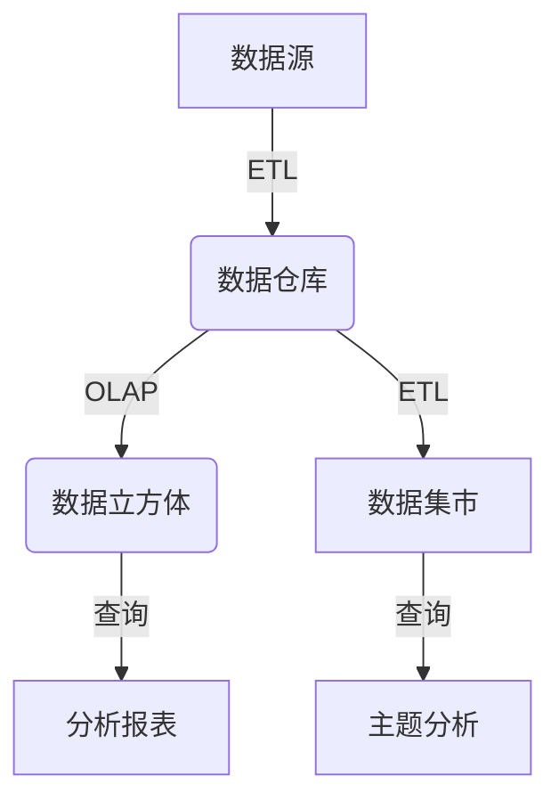

# 【AI大数据计算原理与代码实例讲解】数据仓库

## 1. 背景介绍

### 1.1 问题的由来

在当今的商业环境中，数据被视为企业的关键资产。随着数据量的快速增长和多样化,有效管理和利用这些数据已经成为企业保持竞争力的关键因素。然而,传统的运营数据存储系统(如关系数据库)通常针对特定应用程序进行了优化,难以满足跨部门、跨功能的数据分析需求。为了解决这一问题,数据仓库(Data Warehouse)应运而生。

### 1.2 研究现状

数据仓库的概念最早可以追溯到20世纪80年代,当时它被提出作为集成企业数据的解决方案。随着大数据时代的到来,数据仓库技术也在不断发展和演进。现代数据仓库不仅支持结构化数据,还能够处理半结构化和非结构化数据,如文本、图像和视频等。此外,数据仓库还与大数据技术(如Hadoop、Spark等)紧密集成,以提高数据处理能力和分析效率。

### 1.3 研究意义

数据仓库为企业提供了一个集中式的数据存储和管理平台,使得跨部门、跨功能的数据分析成为可能。它可以帮助企业发现隐藏的商业洞察力,优化业务流程,并支持更好的决策制定。此外,数据仓库还为数据科学家和分析师提供了一个强大的工具,用于探索数据、构建模型和进行预测分析。

### 1.4 本文结构

本文将全面介绍数据仓库的核心概念、架构、设计原则和实现技术。我们将探讨数据仓库的数学模型和算法原理,并通过代码示例和实际应用场景,帮助读者深入理解数据仓库的工作原理和实践应用。此外,本文还将分享相关工具和学习资源,并对数据仓库的未来发展趋势和挑战进行展望。

## 2. 核心概念与联系

数据仓库是一种面向主题的(Subject-Oriented)、集成的(Integrated)、相对稳定的(Non-Volatile)、反映历史数据(Time-Variant)的数据集合,用于支持管理决策过程。它由以下几个核心概念组成:

1. **数据集市(Data Mart)**: 数据仓库的一个子集,专门针对特定主题或业务领域进行优化。

2. **元数据(Metadata)**: 描述数据仓库中数据的信息,包括数据的结构、来源、转换规则等。

3. **ETL(Extract, Transform, Load)**: 从各种数据源提取数据、转换数据格式,并将其加载到数据仓库的过程。

4. **OLAP(Online Analytical Processing)**: 一种面向分析的数据处理技术,支持多维数据分析和复杂查询。

5. **数据立方体(Data Cube)**: OLAP中的一种多维数据模型,用于高效存储和查询大量聚合数据。

6. **维度建模(Dimensional Modeling)**: 一种数据建模技术,将数据组织为事实表(Fact Table)和维度表(Dimension Table)。

这些核心概念相互关联,共同构建了数据仓库的整体架构和功能。下面是一个简化的数据仓库架构流程图:



## 3. 核心算法原理 & 具体操作步骤

### 3.1 算法原理概述

数据仓库的核心算法主要包括以下几个方面:

1. **ETL处理**: 从各种数据源提取、转换和加载数据到数据仓库的过程。常见的ETL算法包括数据提取算法、数据清洗算法、数据转换算法和数据加载算法等。

2. **OLAP处理**: 支持多维数据分析和复杂查询的算法,如数据立方体构建算法、聚合计算算法、滚动计算算法等。

3. **查询优化**: 提高查询性能的算法,如查询重写算法、索引选择算法、查询计划优化算法等。

4. **数据压缩**: 减小数据存储空间的算法,如字典编码算法、位映射算法、行列存储算法等。

5. **数据分区**: 提高数据处理效率的算法,如哈希分区算法、范围分区算法、列表分区算法等。

这些算法共同构建了数据仓库的核心功能,确保了数据的高效存储、处理和分析。

### 3.2 算法步骤详解

以ETL处理为例,我们将详细介绍其算法步骤:

1. **数据提取**:
   - 识别并连接数据源
   - 根据预定义的规则,从数据源中提取所需数据
   - 处理增量数据和历史数据

2. **数据转换**:
   - 数据清洗:处理缺失值、异常值和重复数据
   - 数据转换:执行数据类型转换、编码转换和数据格式化
   - 数据合并:将来自多个数据源的数据进行合并

3. **数据加载**:
   - 确定加载策略(全量加载或增量加载)
   - 根据目标数据仓库的模式,将转换后的数据加载到相应的表或分区中
   - 处理加载错误和异常情况

在整个ETL过程中,元数据起着关键作用,记录了数据的来源、转换规则和目标模式等信息,确保了数据的一致性和可追溯性。

### 3.3 算法优缺点

ETL算法的优点包括:

- 支持从多种异构数据源提取数据
- 提供了数据清洗和转换的功能,确保数据质量
- 支持增量加载,提高了数据处理效率
- 具有良好的可扩展性和可配置性

缺点包括:

- ETL过程可能会导致数据延迟,影响实时性
- 需要定期维护和优化ETL作业,以确保性能
- 对于非结构化数据(如文本、图像等),ETL处理可能会更加复杂

### 3.4 算法应用领域

ETL算法广泛应用于以下领域:

- 商业智能(BI)和数据分析
- 客户关系管理(CRM)
- 供应链管理(SCM)
- 金融风险管理
- 医疗保健数据集成
- 电子商务数据处理

## 4. 数学模型和公式 & 详细讲解 & 举例说明

### 4.1 数学模型构建

在数据仓库中,我们通常使用多维数据模型来表示和存储数据。这种模型将数据组织为事实表(Fact Table)和维度表(Dimension Table)。

事实表存储度量值(Measures),如销售额、成本等。维度表则描述了这些度量值的上下文信息,如时间、地点、产品等。

我们可以使用以下数学模型来表示多维数据:

$$
F = \{M_1, M_2, \ldots, M_n\}
$$

其中,F是事实表,包含n个度量值$M_1, M_2, \ldots, M_n$。

$$
D_i = \{A_{i1}, A_{i2}, \ldots, A_{im}\}
$$

其中,$D_i$是第i个维度表,包含m个属性$A_{i1}, A_{i2}, \ldots, A_{im}$。

事实表和维度表之间的关系可以表示为:

$$
F \rightarrow D_1 \times D_2 \times \ldots \times D_k
$$

这表示事实表F与k个维度表$D_1, D_2, \ldots, D_k$相关联。

基于这个数学模型,我们可以构建数据立方体(Data Cube),用于高效存储和查询多维数据。

### 4.2 公式推导过程

在OLAP处理中,我们经常需要计算聚合值,如求和、计数、平均值等。下面我们将推导一个用于计算加权平均值的公式。

设有n个值$x_1, x_2, \ldots, x_n$,对应的权重分别为$w_1, w_2, \ldots, w_n$,我们需要计算加权平均值$\overline{x}$。

首先,我们计算总权重W:

$$
W = \sum_{i=1}^{n} w_i
$$

然后,计算加权和S:

$$
S = \sum_{i=1}^{n} w_i x_i
$$

最后,加权平均值$\overline{x}$可以表示为:

$$
\overline{x} = \frac{S}{W} = \frac{\sum_{i=1}^{n} w_i x_i}{\sum_{i=1}^{n} w_i}
$$

这个公式可以用于计算各种加权平均值,如加权移动平均值、指数加权移动平均值等。

### 4.3 案例分析与讲解

假设我们有一个销售数据集,包含以下字段:

- 销售日期(Date)
- 产品类别(Product Category)
- 销售金额(Sales Amount)
- 销售数量(Sales Quantity)

我们希望构建一个数据立方体,用于分析每个产品类别在不同日期的销售情况。

首先,我们将数据集划分为事实表和维度表:

**事实表(Fact_Sales)**:
- 销售金额(Sales Amount)
- 销售数量(Sales Quantity)

**维度表1(Dim_Date)**:
- 销售日期(Date)
- 年(Year)
- 月(Month)
- 日(Day)

**维度表2(Dim_Product)**:
- 产品类别(Product Category)
- 产品描述(Product Description)

然后,我们可以构建一个三维数据立方体,其中每个单元格包含了特定产品类别、日期的销售金额和销售数量。

为了计算每个产品类别在一段时间内的总销售额,我们可以使用以下SQL查询:

```sql
SELECT
    Dim_Product.Product_Category,
    SUM(Fact_Sales.Sales_Amount) AS Total_Sales
FROM
    Fact_Sales
    JOIN Dim_Date ON Fact_Sales.Date_Key = Dim_Date.Date_Key
    JOIN Dim_Product ON Fact_Sales.Product_Key = Dim_Product.Product_Key
WHERE
    Dim_Date.Year = 2022 AND Dim_Date.Month BETWEEN 1 AND 3
GROUP BY
    Dim_Product.Product_Category;
```

这个查询将计算2022年第一季度每个产品类别的总销售额。

### 4.4 常见问题解答

1. **数据仓库和数据湖有什么区别?**

数据仓库和数据湖都是用于存储和管理大量数据的系统,但它们有一些关键区别:

- 数据结构:数据仓库通常存储结构化数据,而数据湖可以存储结构化、半结构化和非结构化数据。
- 数据模式:数据仓库使用预定义的模式,而数据湖采用schema-on-read模式,允许在查询时定义数据模式。
- 数据处理:数据仓库主要用于OLAP分析,而数据湖更适合于批处理和实时数据处理。
- 用户群体:数据仓库主要面向业务分析师和决策者,而数据湖面向数据科学家和数据工程师。

2. **如何确保数据仓库的性能?**

优化数据仓库性能的关键策略包括:

- 数据分区:根据查询模式对数据进行分区,提高查询效率。
- 索引优化:合理设计和维护索引,加速数据访问。
- 查询优化:使用查询重写、查询计划优化等技术,优化查询执行。
- 数据压缩:采用适当的压缩算法,减小数据存储空间。
- 硬件优化:升级CPU、内存、存储等硬件资源,提高系统吞吐量。

3. **如何处理数据仓库中的历史数据?**

处理历史数据的常见策略包括:

- 数据归档:将过期或不常用的数据移动到更便宜的存储介质中,以节省空间。
- 数据分区:根据时间维度对数据进行分区,方便管理和访问历史数据。
- 滚动窗口:只保留最近一段时间内的数据,定期删除过期数据。
- 数据快照:定期创建数据快照,保留历史数据的副本。

## 5. 项目实践:代码实例和详细解释说明

### 5.1 开发环境搭建

在本节中,我们将使用Python和Apache Spark构建一个简单的数据