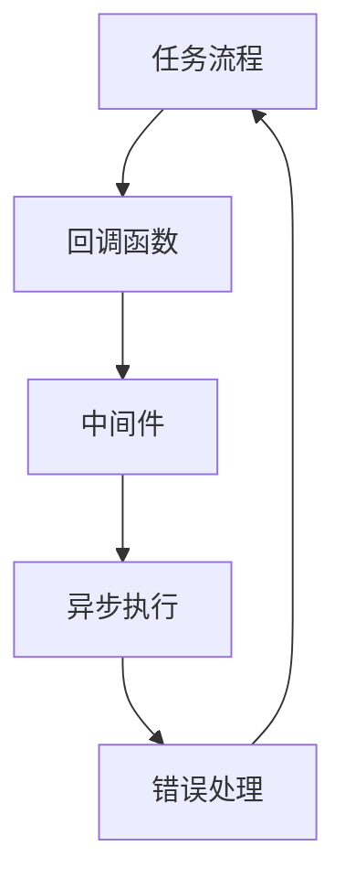

# 【LangChain编程：从入门到实践】使用回调的两种方式

## 1. 背景介绍

### 1.1 问题的由来

在现代软件开发中,我们经常需要处理各种复杂的任务,这些任务往往涉及多个步骤,每个步骤都可能需要不同的数据和操作。为了更好地管理和组织这些步骤,我们需要一种灵活且可扩展的方式来编排和控制任务流程。这就是回调(Callbacks)发挥作用的地方。

回调是一种编程模式,它允许我们将一个函数作为参数传递给另一个函数,并在特定的时间点或条件满足时执行该函数。这种模式在异步编程、事件驱动编程和函数式编程中广泛应用。然而,传统的回调模式存在一些问题,例如回调地狱(Callback Hell)和可维护性差等。为了解决这些问题,LangChain引入了一种新的回调机制,提供了更清晰、更易维护的方式来处理复杂的任务流程。

### 1.2 研究现状

在传统的回调模式中,我们通常会将一个函数作为参数传递给另一个函数,当特定的条件满足时,该函数就会被执行。这种模式虽然灵活,但是当任务变得复杂时,代码可能会变得难以阅读和维护。为了解决这个问题,一些库和框架(如Promise、async/await等)提供了更好的异步编程模型。

然而,这些解决方案主要关注于异步编程,而对于更广泛的任务编排和控制场景,它们可能不够灵活和通用。LangChain的回调机制旨在提供一种更通用的方式来处理复杂的任务流程,不仅适用于异步编程,还可以应用于其他场景,如数据处理、机器学习等。

### 1.3 研究意义

LangChain的回调机制为我们提供了一种新的思维模式和编程范式,可以帮助我们更好地组织和控制复杂的任务流程。通过使用回调,我们可以将任务拆分为多个步骤,并在每个步骤完成时执行相应的操作。这种模式不仅提高了代码的可读性和可维护性,还增强了代码的灵活性和可扩展性。

此外,LangChain的回调机制还提供了一些高级特性,如异步执行、错误处理和中间件支持等,这些特性可以帮助我们更好地管理和控制任务流程。

### 1.4 本文结构

本文将从LangChain的回调机制入手,详细介绍如何使用回调来编排和控制复杂的任务流程。我们将探讨回调的两种使用方式:基于函数的回调和基于对象的回调。对于每种方式,我们都将提供详细的代码示例和解释,帮助读者更好地理解和掌握这种编程模式。

此外,我们还将讨论回调的一些高级特性,如异步执行、错误处理和中间件支持等。最后,我们将总结LangChain回调机制的优势和局限性,并展望未来的发展方向。

## 2. 核心概念与联系

在深入探讨LangChain的回调机制之前,让我们先了解一些核心概念和它们之间的联系。

### 2.1 任务流程(Task Flow)

任务流程是指一系列需要按照特定顺序执行的步骤或操作。在软件开发中,我们经常需要处理各种复杂的任务流程,如数据处理、机器学习模型训练、自动化测试等。每个任务流程都可以被拆分为多个步骤,每个步骤可能需要不同的数据和操作。

### 2.2 回调(Callback)

回调是一种编程模式,它允许我们将一个函数作为参数传递给另一个函数,并在特定的时间点或条件满足时执行该函数。回调可以用于各种场景,如异步编程、事件驱动编程和函数式编程等。

在LangChain中,回调被用于编排和控制任务流程。我们可以将每个步骤定义为一个回调函数,然后将这些回调函数组合在一起,形成一个完整的任务流程。

### 2.3 中间件(Middleware)

中间件是一种软件设计模式,它提供了一种灵活的方式来插入和执行特定的逻辑。在LangChain的回调机制中,中间件可以用于在执行回调函数之前或之后执行特定的操作,如日志记录、错误处理、性能监控等。

中间件可以帮助我们更好地管理和控制任务流程,提高代码的可维护性和可扩展性。

### 2.4 异步执行(Asynchronous Execution)

在许多场景下,我们需要处理一些耗时的操作,如网络请求、文件读写等。如果我们在主线程中同步执行这些操作,可能会导致应用程序阻塞,影响用户体验。

为了解决这个问题,LangChain的回调机制支持异步执行。我们可以将耗时的操作定义为一个异步回调函数,并将其与其他回调函数组合在一起,形成一个异步任务流程。这样可以提高应用程序的响应性和性能。

### 2.5 错误处理(Error Handling)

在任何软件系统中,错误处理都是一个重要的环节。在处理复杂的任务流程时,我们需要一种有效的方式来捕获和处理各种错误,以确保系统的稳定性和可靠性。

LangChain的回调机制提供了一种内置的错误处理机制,可以帮助我们更好地管理和处理任务流程中的错误。我们可以定义一个错误处理回调函数,并将其与其他回调函数组合在一起,形成一个完整的错误处理策略。

### 2.6 Mermaid 流程图

为了更好地理解这些核心概念之间的关系,我们使用 Mermaid 流程图进行可视化表示:

在这个流程图中,我们可以看到:

1. 任务流程由多个回调函数组成。
2. 回调函数可以被中间件包装,以执行特定的逻辑。
3. 回调函数可以异步执行,提高应用程序的响应性和性能。
4. 错误处理机制可以捕获和处理任务流程中的错误。

这些核心概念相互关联,共同构成了LangChain回调机制的基础。理解它们之间的关系对于掌握回调机制至关重要。

## 3. 核心算法原理 & 具体操作步骤

### 3.1 算法原理概述

LangChain的回调机制基于一种称为"责任链模式"(Chain of Responsibility Pattern)的设计模式。这种模式允许我们将多个对象链接在一起,形成一个链式结构。当一个请求到来时,它会沿着这个链式结构传递,直到有一个对象能够处理该请求为止。

在LangChain的回调机制中,每个回调函数都可以被视为一个"处理者"(Handler)。当一个任务流程被触发时,它会依次执行每个回调函数,直到整个流程完成。每个回调函数都可以决定是否继续执行下一个回调函数,或者终止整个流程。

这种算法原理提供了一种灵活且可扩展的方式来编排和控制任务流程。我们可以根据需求动态地添加、删除或重新排序回调函数,而不需要修改整个系统的核心逻辑。

### 3.2 算法步骤详解

LangChain的回调机制算法可以分为以下几个步骤:

1. **初始化回调链**: 创建一个空的回调链,用于存储所有的回调函数。

2. **添加回调函数**: 将需要执行的回调函数添加到回调链中。回调函数可以是同步的或异步的,也可以包含中间件逻辑。

3. **执行回调链**: 依次执行回调链中的每个回调函数。对于每个回调函数,执行以下步骤:
   a. 执行回调函数前的中间件逻辑(如果有)。
   b. 执行回调函数本身。
   c. 执行回调函数后的中间件逻辑(如果有)。
   d. 根据回调函数的返回值或异常情况,决定是否继续执行下一个回调函数或终止整个流程。

4. **错误处理**: 如果在执行回调链的过程中发生了异常,则执行预定义的错误处理逻辑。错误处理逻辑可以是一个单独的回调函数,也可以是一个中间件。

5. **清理资源**: 在整个任务流程执行完毕后,执行必要的资源清理操作,如关闭文件、断开数据库连接等。

这种算法步骤可以确保任务流程被正确地执行,同时提供了灵活的扩展性和可维护性。我们可以根据需求轻松地添加、修改或删除回调函数,而不会影响整个系统的核心逻辑。

### 3.3 算法优缺点

LangChain的回调机制算法具有以下优点:

1. **灵活性**: 我们可以根据需求动态地添加、删除或重新排序回调函数,而不需要修改整个系统的核心逻辑。

2. **可扩展性**: 通过添加中间件和异步支持,我们可以轻松地扩展回调机制的功能,以满足不同的需求。

3. **可维护性**: 将任务流程拆分为多个回调函数,可以提高代码的可读性和可维护性。

4. **错误处理**: 内置的错误处理机制可以帮助我们更好地管理和处理任务流程中的错误。

5. **解耦**: 回调机制将任务流程的执行逻辑与具体的业务逻辑分离,提高了代码的可重用性和可测试性。

然而,LangChain的回调机制算法也存在一些缺点:

1. **学习曲线**: 对于初学者来说,理解回调机制的概念和使用方式可能需要一些时间。

2. **性能开销**: 在执行回调链时,需要进行一些额外的操作,如函数调用和上下文切换,这可能会带来一定的性能开销。

3. **调试困难**: 由于回调函数可能会在不同的时间点和上下文中执行,因此调试可能会变得更加困难。

4. **控制流复杂性**: 当任务流程变得非常复杂时,控制流可能会变得难以理解和维护。

5. **异步编程挑战**: 虽然LangChain的回调机制支持异步执行,但异步编程本身仍然是一个具有挑战性的领域,需要开发人员具备一定的经验和技能。

总的来说,LangChain的回调机制算法为我们提供了一种灵活且可扩展的方式来编排和控制复杂的任务流程。但同时,我们也需要权衡其优缺点,并根据具体的场景和需求来选择是否使用这种机制。

### 3.4 算法应用领域

LangChain的回调机制算法可以应用于各种场景,特别是那些需要处理复杂任务流程的场景。以下是一些常见的应用领域:

1. **数据处理**: 在处理大规模数据时,我们经常需要将数据流程拆分为多个步骤,如数据提取、转换、加载等。回调机制可以帮助我们更好地组织和控制这些步骤。

2. **机器学习**: 在训练机器学习模型时,我们需要执行一系列操作,如数据预处理、模型训练、模型评估等。回调机制可以用于编排和控制这些操作。

3. **自动化测试**: 在进行自动化测试时,我们需要执行多个测试用例,并根据测试结果执行相应的操作,如生成报告、发送通知等。回调机制可以帮助我们更好地管理和控制这些流程。

4. **事件驱动系统**: 在事件驱动系统中,我们需要响应各种事件,并执行相应的操作。回调机制可以用于定义和执行这些操作。

5. **工作流管理**: 在许多企业应用中,我们需要处理复杂的工作流,如审批流程、订单处理流程等。回调机制可以用于编排和控制这些工作流。

6. **中间件系