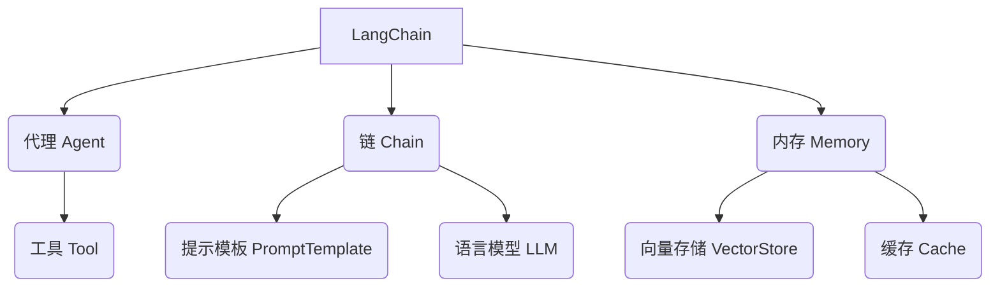

# 【LangChain编程：从入门到实践】大模型技术浪潮

## 1. 背景介绍

### 1.1 问题的由来

在过去几年中,人工智能领域取得了令人瞩目的进展,其中大模型(Large Language Model,LLM)的出现无疑是最具革命性的突破之一。大模型是一种基于深度学习的语言模型,能够通过消化海量文本数据,学习理解和生成人类语言。随着计算能力的不断提高和训练数据的持续增长,大模型的性能也在不断提升,展现出令人惊叹的语言理解和生成能力。

然而,尽管大模型展现出了巨大的潜力,但如何将其应用于实际场景并充分发挥其功效,仍然是一个亟待解决的问题。毕竟,大模型只是一种通用的语言模型,要将其投入实际应用,还需要进行大量的定制化开发和集成工作。这不仅需要开发人员具备深厚的人工智能和自然语言处理知识,还需要熟练掌握各种编程语言和框架。

### 1.2 研究现状

为了降低大模型应用开发的门槛,简化开发流程,近年来出现了一些专注于大模型应用开发的框架和工具,其中最著名的当属LangChain。LangChain是一个由Anthropic公司开源的Python库,旨在为开发人员提供一种标准化、模块化的方式来构建大模型应用。它将大模型的各种功能封装为可组合的链(Chain),开发人员只需按照特定的逻辑将这些链组合在一起,就能快速构建出强大的大模型应用。

LangChain的出现极大地降低了大模型应用开发的复杂性,使得开发人员能够更加专注于应用逻辑的设计,而不必过多关注底层细节。然而,由于LangChain本身是一个相对新兴的框架,目前仍缺乏系统性的教程和实践指南,这在一定程度上限制了其在开发者中的普及和推广。

### 1.3 研究意义

鉴于此,本文将全面介绍LangChain的核心概念、原理和实践技巧,旨在为读者提供一个完整的LangChain编程学习路径。无论你是一名对大模型应用开发感兴趣的开发者,还是一名希望提升人工智能开发能力的研究人员,相信本文都能为你提供有价值的指导和启发。

### 1.4 本文结构

本文将从以下几个方面全面介绍LangChain:

1. **核心概念与联系**:介绍LangChain的核心概念,如代理(Agent)、链(Chain)、内存(Memory)等,并阐述它们之间的关系。

2. **核心算法原理与具体操作步骤**:深入探讨LangChain中的关键算法原理,如语义分割(Semantic Segmentation)、思维链(Thought Chain)等,并详细讲解它们的具体实现步骤。

3. **数学模型和公式详细讲解与举例说明**:对LangChain中所采用的数学模型和公式进行深入剖析,包括模型构建、公式推导等,并结合具体案例进行讲解和说明。

4. **项目实践:代码实例和详细解释说明**:提供一个完整的LangChain项目实践案例,包括开发环境搭建、源代码实现、代码解读分析和运行结果展示等。

5. **实际应用场景**:介绍LangChain在问答系统、自动化任务、文本摘要等多个领域的实际应用场景,并对其未来应用前景进行展望。

6. **工具和资源推荐**:为读者推荐一系列LangChain学习资源、开发工具、相关论文等,以帮助读者进一步深入学习和实践。

7. **总结:未来发展趋势与挑战**:总结LangChain的研究成果,并对其未来发展趋势和面临的挑战进行前瞻性分析和展望。

8. **附录:常见问题与解答**:针对LangChain学习和实践中的常见问题,提供解答和指导。

通过本文的学习,读者将能够全面掌握LangChain的核心知识和实践技能,为将大模型技术应用于实际场景奠定坚实的基础。

## 2. 核心概念与联系

在深入探讨LangChain的核心算法和实践之前,我们有必要先了解一下LangChain中的几个核心概念,以及它们之间的关系。这将有助于我们更好地理解LangChain的整体架构和工作原理。



### 2.1 代理 (Agent)

代理(Agent)是LangChain中的核心概念之一,它充当了人工智能系统的大脑和控制中心。代理负责协调和管理整个系统的运行,包括接收用户输入、调用适当的链(Chain)进行处理、维护系统状态等。

代理的工作流程通常如下:

1. 接收用户输入或任务
2. 根据输入内容和任务目标,选择合适的链(Chain)进行处理
3. 将处理结果存储在内存(Memory)中,维护系统状态
4. 根据需要调用工具(Tool)执行特定操作
5. 综合所有信息,生成最终输出

代理的核心在于其决策能力,它需要根据当前的输入和系统状态,做出合理的判断和选择,以确保整个系统能够高效、准确地完成预期任务。

### 2.2 链 (Chain)

链(Chain)是LangChain中另一个关键概念,它代表了一系列按特定逻辑组合在一起的操作步骤。每个链都是为了完成特定的任务而设计,例如问答、文本摘要、代码生成等。

链的工作原理是将多个较小的操作单元(如提示模板、语言模型调用等)按照一定的逻辑顺序串联起来,形成一个完整的处理流程。这种模块化的设计使得链具有很强的灵活性和可扩展性,开发人员可以根据需求自由组合不同的操作单元,构建出满足特定需求的定制化链。

常见的链类型包括:

- 序列链(Sequential Chain):按顺序执行一系列操作
- 转换链(Transformation Chain):对输入数据进行一系列转换操作
- 反馈链(Feedback Chain):根据中间结果动态调整后续操作

通过灵活组合不同类型的链,开发人员可以构建出各种复杂的大模型应用。

### 2.3 内存 (Memory)

内存(Memory)是LangChain中用于存储和管理系统状态的组件。在处理复杂任务时,系统往往需要记住先前的输入、中间结果等信息,以便进行后续的处理和决策。内存就是用来存储和检索这些信息的。

LangChain支持多种内存实现,包括:

- 向量存储(VectorStore):将文本数据转换为向量形式存储,支持语义相似性搜索
- 缓存(Cache):简单的键值对形式存储,用于临时存储中间结果
- 对话历史(Conversation History):存储代理与用户之间的对话记录

根据应用场景的不同,开发人员可以选择合适的内存实现,以确保系统能够高效地存储和检索所需的信息。

### 2.4 工具 (Tool)

工具(Tool)是LangChain中用于执行特定操作的组件。工具可以是各种外部API、本地函数或其他服务,它们为代理提供了执行特定任务所需的功能。

例如,在构建一个问答系统时,代理可能需要调用Wikipedia API来查找相关信息、调用文本摘要工具来生成摘要、调用代码执行工具来运行示例代码等。通过集成这些工具,代理就能够完成更加复杂和多样化的任务。

LangChain提供了一个标准的工具接口,使得开发人员可以方便地集成各种自定义工具。同时,LangChain还内置了一些常用的工具,如网络搜索、文件操作、计算器等,可以直接调用使用。

### 2.5 提示模板 (PromptTemplate)

提示模板(PromptTemplate)是LangChain中用于构建语言模型输入的组件。由于大模型需要以特定格式的文本作为输入,因此提示模板的作用就是根据开发人员提供的模板,生成符合大模型输入要求的文本提示。

提示模板通常包含一些占位符,开发人员可以在运行时将实际的输入数据插入到这些占位符中,从而动态生成最终的提示文本。例如,对于一个问答系统,提示模板可能如下所示:

```
问题: {question}

答案:
```

在运行时,LangChain会将实际的问题文本替换到`{question}`占位符处,然后将生成的提示文本传递给语言模型,以获取相应的答案。

提示模板的设计直接影响着语言模型的输出质量,因此开发人员需要根据具体任务,精心设计提示模板的内容和格式,以获得最佳的模型表现。

### 2.6 语言模型 (LLM)

语言模型(LLM,Language Model)是LangChain中的核心组件之一,它指的是用于自然语言生成和理解的大模型。LangChain支持集成各种流行的语言模型,如GPT、BERT、T5等。

语言模型的作用是根据提供的文本输入(即提示模板生成的提示文本),生成相应的自然语言输出。例如,在问答系统中,语言模型会根据问题的提示文本,生成相应的答案文本。

LangChain提供了统一的语言模型接口,使得开发人员可以方便地集成和切换不同的语言模型。同时,LangChain还支持对语言模型进行微调(Fine-tuning),以进一步提高其在特定任务上的表现。

通过上述核心概念的介绍,我们可以看到它们之间存在着紧密的联系和相互作用。代理作为控制中心,协调着链、内存、工具等组件的工作,而这些组件又为代理提供了执行任务所需的各种功能和支持。只有当所有组件协同工作时,LangChain系统才能高效、准确地完成复杂的自然语言处理任务。

## 3. 核心算法原理与具体操作步骤

在了解了LangChain的核心概念之后,我们接下来将深入探讨其中的一些关键算法原理,并详细讲解它们的具体实现步骤。这些算法不仅体现了LangChain的核心创新,也是构建高质量大模型应用的关键所在。

### 3.1 算法原理概述

#### 3.1.1 语义分割 (Semantic Segmentation)

语义分割是LangChain中一种核心算法,它的作用是将长文本按照语义边界进行分割,生成多个相对独立的文本段落。这一步骤对于处理大规模文本数据至关重要,因为大多数语言模型都有输入长度的限制,无法直接处理过长的文本。

语义分割算法的工作原理是:首先,它会将原始长文本分割成多个候选段落;然后,对每个候选段落进行语义相似度评估,合并相似度较高的相邻段落;最后,根据语言模型的输入长度限制,将合并后的段落进一步分割成多个最终输出段落。

通过这种分割方式,语义分割算法能够确保每个输出段落都是语义上相对完整和连贯的,从而为后续的语言模型处理奠定基础。

#### 3.1.2 思维链 (Thought Chain)

思维链是LangChain中另一种创新性的算法,它模拟了人类在解决复杂问题时的思维过程。思维链的核心思想是将问题分解为多个子任务,然后逐步完成这些子任务,最终得到问题的解决方案。

在思维链中,代理会根据当前的问题和上下文信息,生成一系列"思维"(Thought),每个思维都代表了解决问题的一个中间步骤或子任务。例如,对于一个复杂的问答问题,代理可能会先思考"我需要查找哪些