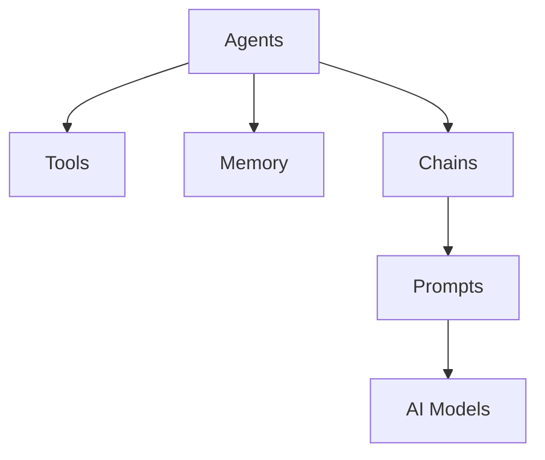
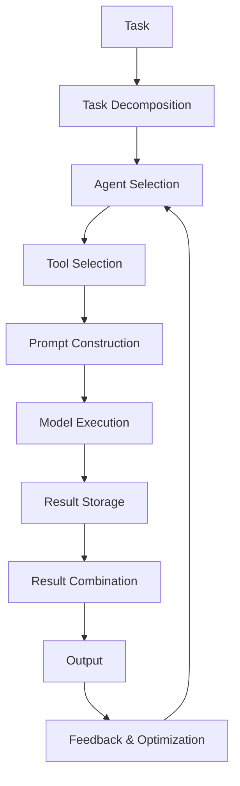

# 【LangChain编程：从入门到实践】应用设计

## 1. 背景介绍

### 1.1 问题的由来

在当今数据时代,我们面临着海量的结构化和非结构化数据。如何高效地处理和利用这些数据,已经成为各行业的一大挑战。传统的数据处理方式往往需要大量的人工劳动,效率低下且容易出错。因此,我们迫切需要一种新的解决方案来应对这一挑战。

### 1.2 研究现状

近年来,人工智能(AI)和自然语言处理(NLP)技术的飞速发展为解决这一问题提供了新的思路。许多公司和研究机构都在探索如何将AI和NLP技术应用于数据处理和分析领域。其中,LangChain就是一个备受关注的开源项目,它旨在将人工智能与传统编程相结合,为开发人员提供一种全新的编程范式。

### 1.3 研究意义

LangChain的出现为我们提供了一种新颖且高效的方式来处理各种类型的数据。通过将人工智能模型与传统编程语言无缝集成,LangChain使开发人员能够更轻松地构建智能应用程序。这不仅可以提高数据处理的效率和准确性,还能促进人工智能技术在各个领域的应用和发展。

### 1.4 本文结构

本文将全面介绍LangChain的核心概念、算法原理、数学模型、项目实践、应用场景、工具资源等内容。我们将从基础知识出发,逐步深入探讨LangChain的各个方面,帮助读者全面掌握这一强大的工具。同时,本文也将分享一些实用的技巧和经验,为读者在实际项目中应用LangChain提供指导。

## 2. 核心概念与联系

LangChain是一个Python库,旨在帮助开发人员构建基于人工智能的应用程序。它将人工智能模型(如GPT、BERT等)与传统编程语言(如Python)无缝集成,使开发人员能够更轻松地利用人工智能的强大功能。

LangChain的核心概念包括:

1. **Agents**: 代理是LangChain中的核心组件,它们负责执行特定的任务,如问答、文本生成、数据分析等。每个代理都由一个或多个人工智能模型驱动,并可以根据需要进行链式调用。

2. **Tools**: 工具是代理可以使用的各种功能模块,如搜索引擎、数据库、API等。代理可以根据任务需求选择合适的工具进行交互。

3. **Memory**: 内存用于存储代理在执行任务过程中的中间状态和上下文信息,以保持任务的连续性和一致性。

4. **Chains**: 链是将多个代理和工具组合在一起的方式,用于构建更复杂的应用程序。链可以是顺序执行的,也可以是并行执行的。

5. **Prompts**: 提示是与人工智能模型进行交互的方式。LangChain提供了多种方法来构建和优化提示,以获得更好的模型输出。

这些核心概念相互关联,共同构成了LangChain的整体架构。下面是一个简单的Mermaid流程图,展示了它们之间的关系:

在这个流程图中,代理(Agents)可以与工具(Tools)、内存(Memory)和链(Chains)进行交互。链(Chains)则通过提示(Prompts)与人工智能模型(AI Models)进行交互,完成特定的任务。

## 3. 核心算法原理 & 具体操作步骤

### 3.1 算法原理概述

LangChain的核心算法原理是基于**构成性语言模型(Constitutive Language Model, CLM)**。CLM是一种新型的语言模型,它不仅可以生成自然语言文本,还可以执行各种任务,如问答、文本摘要、代码生成等。

CLM的工作原理是将任务分解为一系列的步骤,每个步骤都由一个代理(Agent)来执行。代理可以利用各种工具(Tools)来完成特定的子任务,如查询数据库、调用API等。在执行过程中,代理会将中间结果存储在内存(Memory)中,以保持任务的连续性和一致性。

最终,CLM会将所有代理的输出结果组合起来,生成最终的任务输出。这种分步执行的方式不仅提高了任务的可解释性和可控性,还使得CLM能够处理更加复杂的任务。

### 3.2 算法步骤详解

LangChain中的CLM算法可以概括为以下几个步骤:

1. **任务分解**: 将原始任务分解为一系列的子任务,每个子任务由一个代理(Agent)来执行。

2. **代理选择**: 根据子任务的性质,选择合适的代理来执行。每个代理都由一个或多个人工智能模型驱动。

3. **工具选择**: 代理根据任务需求选择合适的工具,如搜索引擎、数据库、API等。

4. **提示构建**: 为每个代理构建合适的提示(Prompt),以指导人工智能模型生成所需的输出。

5. **模型执行**: 人工智能模型根据提示执行相应的任务,如问答、文本生成、代码生成等。

6. **结果存储**: 将每个代理的输出结果存储在内存(Memory)中,以保持任务的连续性和一致性。

7. **结果组合**: 将所有代理的输出结果组合起来,生成最终的任务输出。

8. **反馈与优化**: 根据任务输出的质量,对提示、代理和工具进行优化,以提高后续任务的性能。

这个过程可以通过以下Mermaid流程图进行直观展示:

### 3.3 算法优缺点

LangChain的CLM算法具有以下优点:

1. **可解释性**: 由于任务被分解为多个步骤,每个步骤都由一个代理执行,因此整个过程具有很好的可解释性。

2. **可控性**: 开发人员可以根据需求选择合适的代理、工具和提示,从而对任务执行过程进行精细控制。

3. **可扩展性**: 由于代理和工具是解耦的,新的代理和工具可以被轻松地添加到系统中,从而扩展系统的功能。

4. **鲁棒性**: 由于任务被分解为多个步骤,即使某个步骤出现错误,也不会影响整个任务的执行。

然而,CLM算法也存在一些缺点:

1. **复杂性**: 任务分解、代理选择、工具选择和提示构建都需要一定的领域知识和经验,对开发人员的要求较高。

2. **性能开销**: 由于需要执行多个步骤,CLM算法的性能开销可能会比直接使用语言模型高一些。

3. **上下文依赖**: CLM算法依赖于内存中存储的上下文信息,如果上下文信息不完整或不准确,可能会影响任务的执行结果。

4. **提示质量**: CLM算法的性能在很大程度上依赖于提示的质量。构建高质量的提示需要一定的技巧和经验。

### 3.4 算法应用领域

CLM算法可以应用于各种领域,尤其是那些需要处理大量结构化和非结构化数据的领域。以下是一些典型的应用场景:

1. **问答系统**: 利用CLM算法构建智能问答系统,可以从各种数据源(如文档、知识库、网页等)中提取相关信息,回答用户的问题。

2. **文本生成**: 利用CLM算法生成各种类型的文本内容,如新闻报道、故事、营销文案等。

3. **代码生成**: 利用CLM算法根据自然语言描述生成相应的代码,可以极大提高程序员的工作效率。

4. **数据分析**: 利用CLM算法从海量数据中提取有价值的信息和见解,为决策提供支持。

5. **自动化流程**: 利用CLM算法自动执行一系列任务,如数据采集、数据清洗、报告生成等,减轻人工工作负担。

6. **个性化推荐**: 利用CLM算法分析用户的偏好和行为,为其提供个性化的推荐服务。

7. **智能助手**: 利用CLM算法构建智能助手,可以与用户进行自然语言交互,执行各种任务。

总的来说,CLM算法为我们提供了一种全新的编程范式,使得人工智能技术可以更加广泛地应用于各个领域,解决实际问题。

## 4. 数学模型和公式 & 详细讲解 & 举例说明

### 4.1 数学模型构建

LangChain中的CLM算法是基于**序列到序列(Sequence-to-Sequence, Seq2Seq)**模型构建的。Seq2Seq模型是一种广泛应用于自然语言处理任务的模型,它可以将一个序列(如自然语言文本)映射为另一个序列(如目标输出)。

在CLM算法中,Seq2Seq模型的输入是任务描述和上下文信息,输出是执行该任务所需的一系列操作。这些操作可以是调用工具、执行代理、存储中间结果等。

Seq2Seq模型的基本结构包括两个主要组件:**编码器(Encoder)**和**解码器(Decoder)**。编码器负责将输入序列编码为一个向量表示,而解码器则根据这个向量表示生成目标输出序列。

在LangChain中,Seq2Seq模型的数学表示如下:

$$
P(y_1, y_2, \dots, y_T | x_1, x_2, \dots, x_N) = \prod_{t=1}^T P(y_t | y_1, \dots, y_{t-1}, x_1, \dots, x_N)
$$

其中:

- $x_1, x_2, \dots, x_N$表示输入序列,即任务描述和上下文信息。
- $y_1, y_2, \dots, y_T$表示输出序列,即执行任务所需的一系列操作。
- $P(y_t | y_1, \dots, y_{t-1}, x_1, \dots, x_N)$表示在给定输入序列和已生成的操作序列的情况下,生成下一个操作$y_t$的条件概率。

在训练过程中,Seq2Seq模型的目标是最大化上述条件概率的对数似然函数:

$$
\mathcal{L}(\theta) = \sum_{i=1}^N \log P(y_1^{(i)}, y_2^{(i)}, \dots, y_T^{(i)} | x_1^{(i)}, x_2^{(i)}, \dots, x_N^{(i)}; \theta)
$$

其中$\theta$表示模型参数,目标是找到能够最大化对数似然函数的最优参数值。

### 4.2 公式推导过程

我们可以将Seq2Seq模型的条件概率公式进一步展开:

$$
\begin{aligned}
P(y_1, y_2, \dots, y_T | x_1, x_2, \dots, x_N) &= \prod_{t=1}^T P(y_t | y_1, \dots, y_{t-1}, x_1, \dots, x_N) \\
&= P(y_1 | x_1, \dots, x_N) \prod_{t=2}^T P(y_t | y_1, \dots, y_{t-1}, x_1, \dots, x_N)
\end{aligned}
$$

根据链式法则,我们可以将条件概率进一步分解:

$$
\begin{aligned}
P(y_t | y_1, \dots, y_{t-1}, x_1, \dots, x_N) &= P(y_t | y_{t-1}, h_t) \\
h_t &= f(y_1, \dots, y_{t-1}, x_1, \dots, x_N)
\end{aligned}
$$

其中$h_t$是一个隐藏状态向量,它编码了输入序列和已生成的操作序列的信息。函数$f$是编码器和解码器的组合,用于计算隐藏状态向量。

在实际应用中,编码器和解码器通常使