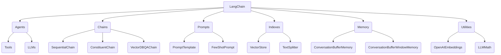

# 【LangChain编程：从入门到实践】开发环境准备

## 1. 背景介绍

### 1.1 问题的由来

在当今的数字时代，海量的数据和信息无时无刻不在被产生和传播。如何高效地处理这些数据,并从中提取有价值的见解和知识,成为了一个亟待解决的问题。传统的数据处理方式已经无法满足现代应用的需求,因此需要一种新的范式来应对这一挑战。

### 1.2 研究现状

近年来,人工智能(AI)和自然语言处理(NLP)技术的飞速发展为解决这一问题提供了新的思路。越来越多的企业和组织开始探索将AI和NLP技术应用于数据处理和知识提取领域。其中,LangChain项目作为一个开源的AI和NLP框架,受到了广泛关注和应用。

### 1.3 研究意义

LangChain提供了一种统一的方式来构建AI应用程序,使开发人员能够更轻松地集成各种AI模型和数据源。通过LangChain,我们可以构建智能代理、问答系统、知识库等应用,从而提高数据处理和知识提取的效率和质量。本文旨在为读者提供一个全面的指南,介绍如何使用LangChain进行开发,从而助力他们在这一领域取得成功。

### 1.4 本文结构

本文将分为以下几个部分:

1. 背景介绍
2. 核心概念与联系
3. 核心算法原理与具体操作步骤
4. 数学模型和公式详细讲解与举例说明
5. 项目实践:代码实例和详细解释说明
6. 实际应用场景
7. 工具和资源推荐
8. 总结:未来发展趋势与挑战
9. 附录:常见问题与解答

## 2. 核心概念与联系

LangChain是一个Python库,旨在构建应用程序来与大型语言模型(LLMs)进行交互。它提供了一系列模块和工具,使开发人员能够轻松地集成LLMs、数据源和其他组件,构建智能应用程序。LangChain的核心概念包括:

1. **Agents**: 代理是LangChain中的一个关键概念,它封装了LLM和一组工具,使其能够执行复杂的任务。代理可以根据给定的指令,选择合适的工具并与之交互,从而完成特定的任务。

2. **Chains**: 链是一种将多个组件(如LLMs、数据源等)连接在一起的方式,形成一个流程化的管道。LangChain提供了多种预定义的链,如SequentialChain、ConstituentChain和VectorDBQAChain等。

3. **Prompts**: 提示是与LLM交互的关键,它指定了LLM应该执行的任务和提供的上下文信息。LangChain提供了PromptTemplate和FewShotPrompt等工具,用于构建和管理提示。

4. **Indexes**: 索引是LangChain用于存储和检索数据的组件。它支持多种数据源,如文本文件、PDF、网页等。IndexVectorStore用于存储向量化的数据,而TextSplitter则用于将大型文本分割成多个文档块。

5. **Memory**: 内存是LangChain用于跟踪对话状态和上下文信息的组件。它可以帮助LLM更好地理解和响应对话。常用的内存类型包括ConversationBufferMemory和ConversationBufferWindowMemory。

6. **Utilities**: LangChain还提供了一些实用工具,如OpenAIEmbeddings用于计算文本的向量表示,以及LLMMath用于处理数学表达式等。

这些核心概念相互关联,共同构建了LangChain的功能和灵活性。开发人员可以根据需求,组合和定制这些组件,从而构建出各种智能应用程序。

## 3. 核心算法原理与具体操作步骤

### 3.1 算法原理概述

LangChain的核心算法原理是基于**Constituional AI**的思想,即将复杂的任务分解为多个子任务,并将每个子任务委派给专门的代理或工具来处理。这种方式可以更好地利用LLM的能力,同时也提高了系统的灵活性和可扩展性。

LangChain的主要算法流程如下:

1. **任务分解**: 将原始任务分解为一系列子任务。
2. **代理选择**: 根据子任务的性质,选择合适的代理或工具来处理。
3. **执行子任务**: 代理或工具执行分配的子任务,可能需要与LLM或其他数据源进行交互。
4. **结果整合**: 将各个子任务的结果整合成最终的输出。
5. **反馈与优化**: 根据输出的质量和用户反馈,优化算法参数和流程。

这种分而治之的方式使得LangChain能够更好地处理复杂的任务,同时也提高了系统的灵活性和可扩展性。开发人员可以根据需求,定制和扩展代理、工具和数据源,从而构建出各种智能应用程序。

### 3.2 算法步骤详解

LangChain的核心算法步骤可以进一步细分为以下几个部分:

1. **任务分解**

   在这一步骤中,LangChain会将原始任务分解为一系列子任务。这可以通过手动定义或使用自动分解算法来实现。自动分解算法通常会基于任务的性质和复杂程度,将其分解为更小的子任务。

2. **代理选择**

   一旦任务被分解,LangChain就需要选择合适的代理或工具来处理每个子任务。这个过程通常是基于子任务的性质和所需的能力来进行的。例如,如果子任务需要进行数学计算,那么LangChain可能会选择一个专门的数学代理或工具来处理。

3. **执行子任务**

   在这一步骤中,选定的代理或工具会执行分配的子任务。这可能需要与LLM或其他数据源进行交互。例如,如果子任务是回答一个问题,代理可能会将问题提交给LLM,并基于LLM的输出生成最终的答案。

4. **结果整合**

   一旦所有子任务都被执行完毕,LangChain就需要将各个子任务的结果整合成最终的输出。这可能需要进行一些后处理,如格式化、排序或过滤等。

5. **反馈与优化**

   最后,LangChain会根据输出的质量和用户反馈,优化算法参数和流程。这可能包括调整任务分解策略、更新代理选择规则或优化LLM的提示等。这个过程旨在不断改进系统的性能和输出质量。

通过这些步骤,LangChain能够有效地处理复杂的任务,同时也提高了系统的灵活性和可扩展性。开发人员可以根据需求,定制和扩展每个步骤的实现,从而构建出各种智能应用程序。

### 3.3 算法优缺点

LangChain的核心算法具有以下优点:

1. **模块化设计**: LangChain采用了模块化的设计,使得各个组件可以独立开发和集成。这提高了系统的灵活性和可扩展性。

2. **利用LLM能力**: LangChain充分利用了LLM的强大能力,如自然语言理解、知识推理和生成等。这使得系统能够处理更加复杂的任务。

3. **易于集成**: LangChain提供了丰富的API和工具,使得开发人员可以轻松地集成各种LLM、数据源和其他组件。

4. **开源社区支持**: LangChain是一个开源项目,拥有活跃的社区支持。这意味着用户可以获得持续的更新和改进,以及来自社区的贡献和支持。

然而,LangChain的核心算法也存在一些缺点和挑战:

1. **性能瓶颈**: 由于需要与LLM进行频繁的交互,LangChain的性能可能会受到限制,特别是在处理大规模数据或高并发请求时。

2. **成本问题**: 使用LLM可能会产生较高的成本,特别是对于商业应用程序。开发人员需要权衡成本和性能之间的平衡。

3. **可解释性挑战**: LLM的输出可能难以解释和理解,这可能会影响系统的可靠性和可信度。

4. **数据质量依赖**: LangChain的性能在很大程度上依赖于输入数据的质量和LLM的训练数据。低质量的数据可能会导致系统输出不准确或不相关的结果。

5. **安全和隐私风险**: 由于LLM可能会记录和学习输入的数据,因此存在潜在的安全和隐私风险。开发人员需要采取适当的措施来保护敏感数据。

尽管存在这些挑战,但LangChain仍然是一个强大和灵活的框架,为构建智能应用程序提供了良好的基础。通过不断的改进和优化,这些挑战可以得到有效的缓解和解决。

### 3.4 算法应用领域

由于其灵活性和可扩展性,LangChain的核心算法可以应用于各种领域,包括但不限于:

1. **问答系统**: LangChain可以用于构建智能问答系统,从各种数据源(如文档、知识库等)中检索相关信息并生成自然语言回答。

2. **智能助手**: LangChain可以用于开发智能助手,帮助用户完成各种任务,如日程安排、信息查找、任务自动化等。

3. **知识管理**: LangChain可以用于构建知识管理系统,从各种数据源中提取和组织知识,并提供智能检索和推理功能。

4. **内容生成**: LangChain可以用于生成各种形式的内容,如文章、报告、营销材料等,并根据用户需求进行个性化定制。

5. **数据分析**: LangChain可以与数据分析工具集成,提供自然语言接口和智能分析功能,帮助用户更好地理解和探索数据。

6. **客户服务**: LangChain可以用于构建智能客户服务系统,自动响应客户查询并提供个性化的解决方案。

7. **教育和培训**: LangChain可以用于开发智能教育和培训系统,根据学习者的需求和水平提供个性化的学习资源和指导。

8. **科研和发现**: LangChain可以用于支持科研和发现过程,通过智能文献检索、数据分析和知识推理,帮助研究人员获得新的见解和发现。

总的来说,LangChain的核心算法为构建各种智能应用程序提供了坚实的基础。随着AI和NLP技术的不断进步,LangChain的应用领域将会越来越广泛。

## 4. 数学模型和公式详细讲解与举例说明

在LangChain中,数学模型和公式主要应用于以下几个方面:

1. **文本向量化**: 将文本转换为向量表示,以便进行相似性计算和其他数据处理任务。
2. **相似性计算**: 计算文本或向量之间的相似度,用于信息检索、聚类和推荐等任务。
3. **数学推理**: 使用LLM进行数学推理和计算,解决各种数学问题。

### 4.1 数学模型构建

#### 4.1.1 文本向量化

在LangChain中,文本向量化通常使用预训练的语言模型来计算文本的向量表示。常用的方法包括:

1. **Word Embeddings**: 将每个单词映射到一个固定长度的向量,例如Word2Vec或GloVe等。
2. **Sentence Embeddings**: 将整个句子或段落映射到一个固定长度的向量,例如通过平均单词