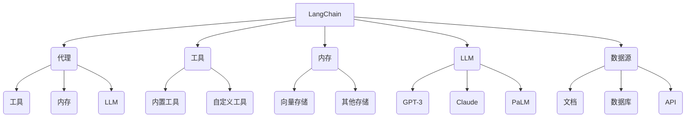

# 【LangChain编程：从入门到实践】语言模型

## 1. 背景介绍

### 1.1 问题的由来

在当今的数字时代,人工智能(AI)已经渗透到我们生活和工作的方方面面。作为AI的一个重要分支,自然语言处理(NLP)技术正在引领着人机交互的革命性变革。随着大型语言模型(LLM)的不断进化,它们展现出了令人惊叹的能力,可以理解和生成人类语言,为各种应用程序提供强大的语言智能支持。

然而,仅仅拥有一个LLM还远远不够。我们需要一种方式来轻松地将这些语言模型集成到我们的应用程序中,并与其他系统和数据源无缝协作。这就是LangChain的用武之地。

LangChain是一个用于构建应用程序的框架,旨在帮助开发人员快速构建基于LLM的应用程序。它提供了一种抽象和模块化的方式来组合不同的组件,如LLM、数据源、工具和代理,从而创建复杂的工作流和智能系统。

### 1.2 研究现状

虽然LangChain是一个相对较新的框架,但它已经在开发者社区中引起了广泛关注。越来越多的公司和个人开发者开始探索LangChain的潜力,并将其应用于各种场景,如自动化任务、知识管理、聊天机器人、代码生成等。

目前,LangChain已经支持多种流行的LLM,如OpenAI的GPT-3、Anthropic的Claude、Google的PaLM等。此外,它还提供了丰富的内置工具和代理,可用于执行各种任务,如数学计算、代码执行、Web搜索等。

然而,由于LangChain的灵活性和可扩展性,开发人员在使用过程中仍然面临着一些挑战,如如何有效地组合不同的组件、如何管理复杂的工作流、如何确保系统的安全性和可靠性等。

### 1.3 研究意义

LangChain为开发人员提供了一种全新的方式来构建基于LLM的应用程序,它具有广阔的应用前景。通过深入研究LangChain的原理和实践,我们可以更好地利用这一强大框架,推动人工智能在各个领域的创新应用。

本文将全面探讨LangChain的核心概念、算法原理、数学模型、代码实现、实际应用场景等,旨在为读者提供一个深入的理解和实践指南。无论您是一名AI开发者、研究人员还是对LangChain感兴趣的个人,相信这篇文章都能为您带来有价值的见解和实用技巧。

### 1.4 本文结构

本文将按照以下结构进行阐述:

1. **背景介绍**: 介绍LangChain的由来、研究现状和意义。
2. **核心概念与联系**: 阐释LangChain的核心概念,如代理、工具、内存等,并探讨它们之间的关系。
3. **核心算法原理与具体操作步骤**: 深入剖析LangChain的核心算法原理,并详细讲解算法的具体操作步骤。
4. **数学模型和公式详细讲解与举例说明**: 介绍LangChain中所使用的数学模型和公式,并通过实例对其进行详细讲解和说明。
5. **项目实践:代码实例和详细解释说明**: 提供LangChain的实际代码实例,并对其进行详细的解释和分析。
6. **实际应用场景**: 探讨LangChain在各个领域的实际应用场景,如自动化任务、知识管理、聊天机器人等。
7. **工具和资源推荐**: 推荐一些有用的LangChain学习资源、开发工具、相关论文等。
8. **总结:未来发展趋势与挑战**: 总结LangChain的研究成果,并展望其未来的发展趋势和面临的挑战。
9. **附录:常见问题与解答**: 针对LangChain的常见问题进行解答和说明。

## 2. 核心概念与联系

LangChain是一个用于构建基于LLM的应用程序的框架,它由多个核心概念组成,这些概念相互关联,共同构建了一个强大而灵活的系统。

1. **代理(Agents)**: 代理是LangChain中的核心概念之一。它是一个决策制定者,负责协调和管理整个系统的工作流程。代理可以利用工具、内存和LLM来完成复杂的任务。

2. **工具(Tools)**: 工具是代理可以使用的各种功能模块,用于执行特定的任务。LangChain提供了许多内置工具,如数学计算、代码执行、Web搜索等。开发人员也可以自定义工具来满足特定需求。

3. **内存(Memory)**: 内存用于存储代理在执行任务过程中的中间状态和上下文信息。LangChain支持多种内存存储方式,如向量存储和其他自定义存储。

4. **大型语言模型(LLM)**: LLM是LangChain的核心驱动力,它提供了强大的自然语言理解和生成能力。LangChain支持多种流行的LLM,如GPT-3、Claude、PaLM等。

5. **数据源(Data Sources)**: 数据源是代理可以访问和利用的各种数据,如文档、数据库、API等。LangChain提供了多种方式来集成和处理这些数据源。

这些核心概念相互关联,共同构建了一个灵活且可扩展的系统。代理作为决策制定者,可以利用工具执行各种任务,并基于内存和LLM的支持做出智能决策。同时,代理还可以访问和利用各种数据源,从而实现更加智能和上下文相关的应用程序。

## 3. 核心算法原理与具体操作步骤

### 3.1 算法原理概述

LangChain的核心算法原理基于一种称为"思考-规划-执行"(Think-Plan-Execute)的范式。这种范式将复杂的任务分解为三个主要步骤:

1. **思考(Think)**: 在这个阶段,代理会分析输入的任务,并利用LLM的自然语言理解能力来理解任务的含义和要求。

2. **规划(Plan)**: 基于对任务的理解,代理会制定一个执行计划,确定需要使用哪些工具和数据源来完成任务。这个过程涉及到搜索和组合不同的工具,以及确定执行顺序。

3. **执行(Execute)**: 代理根据制定的执行计划,依次调用相应的工具和数据源,执行每一个步骤。在执行过程中,代理可能需要根据中间结果动态调整执行计划。

这种"思考-规划-执行"的范式使得LangChain能够灵活地处理各种复杂的任务,并利用LLM的智能来指导整个过程。同时,通过将任务分解为多个步骤,代理可以更好地管理和控制执行流程,提高系统的可靠性和可解释性。

### 3.2 算法步骤详解

下面我们将详细解释LangChain的核心算法步骤:

1. **任务输入**:
   - 用户或系统向代理提供一个自然语言形式的任务描述。

2. **任务理解**:
   - 代理利用LLM的自然语言理解能力,对输入的任务进行语义分析和理解。
   - 代理可能会根据需要向LLM提供额外的上下文信息,如相关文档或先前的对话历史。

3. **工具搜索**:
   - 代理搜索可用的工具集合,并评估每个工具对于完成当前任务的适用性。
   - 代理可以基于工具的描述、功能和先前的执行历史来进行评估。

4. **执行计划生成**:
   - 代理根据对任务的理解和可用工具的评估,生成一个执行计划。
   - 执行计划包括需要使用的工具序列,以及每个工具的输入和预期输出。
   - 代理可能需要将复杂的任务分解为多个子任务,并为每个子任务生成相应的执行计划。

5. **执行计划执行**:
   - 代理按照生成的执行计划,依次调用相应的工具并提供必要的输入。
   - 每个工具的输出将作为下一个工具的输入,或者作为最终结果的一部分。
   - 在执行过程中,代理可能需要根据中间结果动态调整执行计划。

6. **结果输出**:
   - 代理将执行过程中获得的最终结果输出给用户或系统。
   - 结果可能是自然语言形式的回答,也可能是其他形式的输出,如代码、图像或数据。

7. **内存更新**:
   - 代理可以选择将当前任务的上下文信息、中间结果和最终结果存储在内存中。
   - 这些信息可用于后续的任务执行,提高系统的上下文理解能力和一致性。

通过这一系列步骤,LangChain能够灵活地处理各种复杂的任务,并利用LLM的智能来指导整个过程。同时,代理还可以根据需要动态调整执行计划,提高系统的适应性和鲁棒性。

### 3.3 算法优缺点

LangChain的核心算法具有以下优点:

1. **灵活性**: 通过组合不同的工具和数据源,LangChain可以处理各种复杂的任务,展现出极大的灵活性。

2. **可扩展性**: 开发人员可以轻松地添加新的工具和数据源,扩展系统的功能。

3. **可解释性**: 由于采用了"思考-规划-执行"的范式,LangChain的执行过程具有较好的可解释性,有助于调试和优化。

4. **利用LLM智能**: 算法充分利用了LLM的自然语言理解和生成能力,提高了系统的智能水平。

5. **内存支持**: 通过内存机制,LangChain可以记录和利用任务执行过程中的上下文信息,提高了系统的一致性和连贯性。

然而,LangChain的核心算法也存在一些潜在的缺点和挑战:

1. **计算开销**: 由于需要频繁地与LLM交互,算法可能会产生较大的计算开销,尤其是在处理复杂任务时。

2. **执行计划生成的复杂性**: 对于某些任务,生成最优执行计划可能是一个NP难问题,需要更加智能的算法和启发式方法。

3. **安全性和可靠性**: 由于LLM的黑盒特性,算法的安全性和可靠性可能会受到一定影响,需要采取适当的措施来缓解这一问题。

4. **上下文理解的局限性**: 虽然内存机制可以提供一定的上下文信息,但对于长期的、复杂的任务,LLM可能仍然难以完全理解和记住所有相关的上下文。

5. **工具集合的局限性**: 虽然LangChain提供了许多内置工具,但对于某些特定领域或任务,可能需要开发人员自行开发和集成新的工具。

总的来说,LangChain的核心算法为构建基于LLM的应用程序提供了一种强大而灵活的方式,但同时也面临着一些挑战和局限性。开发人员需要根据具体的应用场景和需求,权衡算法的优缺点,并采取适当的策略和措施来优化系统的性能和可靠性。

### 3.4 算法应用领域

由于其灵活性和可扩展性,LangChain的核心算法可以应用于各种领域,为构建基于LLM的智能系统提供支持。以下是一些典型的应用场景:

1. **自动化任务**: LangChain可以用于自动化各种重复性