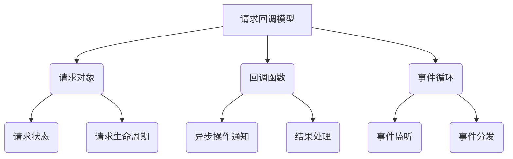

以下是技术博客文章《LangChain编程：从入门到实践》的正文内容：

# 【LangChain编程：从入门到实践】请求回调

## 1. 背景介绍

### 1.1 问题的由来

在当今快节奏的软件开发过程中，异步编程已经成为一种不可或缺的范式。传统的同步编程模型在处理阻塞式I/O操作时存在效率低下的问题,因为它们必须等待I/O操作完成后才能继续执行后续的代码。这种做法在处理大量并发请求时会导致严重的性能瓶颈。

异步编程通过引入回调函数的概念,使得程序在等待I/O操作完成时可以继续执行其他任务,从而提高了程序的响应能力和资源利用率。然而,传统的回调函数编程也存在一些缺陷,例如回调地狱(Callback Hell)、共享状态问题等,这使得代码的可读性和可维护性大大降低。

### 1.2 研究现状  

为了解决回调地狱的问题,JavaScript社区引入了Promise对象,它代表了一个异步操作的最终结果。Promise对象提供了一种更加优雅的方式来处理异步操作,并且支持链式调用,使得代码更加简洁易读。然而,Promise对象仍然存在一些局限性,例如无法很好地处理并发操作、错误处理机制不够健壮等。

近年来,异步编程范式又有了新的发展,那就是引入了async/await语法。async/await是基于Promise对象构建的,它使得异步代码看起来更像同步代码,从而大大提高了代码的可读性和可维护性。不过,async/await也存在一些缺陷,例如无法很好地处理并发操作、错误处理机制仍然不够完善等。

### 1.3 研究意义

LangChain是一个用于构建应用程序的框架,它旨在简化异步编程,并提供更加健壮和可扩展的解决方案。LangChain引入了一种全新的异步编程范式,称为"请求回调"(Request Callback)。请求回调是一种基于事件驱动的异步编程模型,它将异步操作封装成一个个独立的请求对象,每个请求对象都有自己的生命周期和状态管理机制。当一个请求完成时,它会触发一个回调函数,从而实现异步操作的通知和响应。

LangChain的请求回调模型具有以下优点:

1. **简化异步编程**:请求回调模型将异步操作封装成独立的请求对象,使得代码更加模块化和可维护。
2. **高效处理并发操作**:请求回调模型天生支持并发操作,可以同时发出多个请求,并在完成时处理相应的回调函数。
3. **强大的错误处理机制**:请求回调模型提供了一种统一的错误处理机制,可以更好地捕获和处理异常情况。
4. **良好的可扩展性**:请求回调模型具有良好的可扩展性,可以轻松地集成第三方库和服务。

综上所述,研究LangChain的请求回调模型对于提高异步编程的效率和可维护性具有重要意义。

### 1.4 本文结构

本文将全面介绍LangChain的请求回调模型,内容包括:

1. 请求回调的核心概念和原理
2. 请求回调的算法实现细节
3. 请求回调的数学模型和公式推导
4. 请求回调在实际项目中的应用
5. 请求回调的发展趋势和挑战

通过本文的学习,读者将能够掌握请求回调模型的核心知识,并将其应用于实际的软件开发过程中。

## 2. 核心概念与联系



请求回调模型是LangChain框架的核心组成部分,它由以下几个关键概念组成:

1. **请求对象(Request Object)**: 每个异步操作都被封装成一个独立的请求对象。请求对象包含了异步操作的相关信息,如请求参数、请求状态、请求生命周期等。

2. **回调函数(Callback Function)**: 当一个异步操作完成时,它会触发一个预先注册的回调函数。回调函数用于通知异步操作的结果,并对结果进行进一步处理。

3. **事件循环(Event Loop)**: 事件循环是请求回调模型的核心机制。它负责监听和分发事件,并在异步操作完成时执行相应的回调函数。

4. **请求状态(Request State)**: 每个请求对象都有自己的状态,用于表示当前请求的执行情况。常见的请求状态包括"pending"(等待中)、"fulfilled"(已完成)和"rejected"(被拒绝)。

5. **请求生命周期(Request Lifecycle)**: 请求对象从创建到完成或被拒绝,会经历一个完整的生命周期。在不同的生命周期阶段,请求对象会触发相应的事件,从而执行注册的回调函数。

这些核心概念相互关联,共同构建了请求回调模型的基础架构。下面我们将详细介绍请求回调模型的算法原理和实现细节。

## 3. 核心算法原理 & 具体操作步骤

### 3.1 算法原理概述

请求回调模型的核心算法原理可以概括为以下几个步骤:

1. **创建请求对象**:首先,我们需要创建一个请求对象,用于封装异步操作的相关信息。

2. **注册回调函数**:在创建请求对象时,我们需要注册一个或多个回调函数,用于在异步操作完成时进行通知和结果处理。

3. **发出请求**:创建并配置好请求对象后,我们就可以发出请求,执行异步操作。

4. **事件循环监听**:事件循环会持续监听异步操作的完成事件。一旦异步操作完成,事件循环就会捕获相应的事件。

5. **执行回调函数**:当事件循环捕获到异步操作完成的事件时,它会根据事件类型执行相应的回调函数。

6. **处理结果**:在回调函数中,我们可以获取异步操作的结果,并进行进一步的处理和响应。

这就是请求回调模型的核心算法原理。下面我们将详细介绍算法的具体实现步骤。

### 3.2 算法步骤详解

1. **创建请求对象**

```python
import asyncio

# 创建一个请求对象
request = asyncio.Future()
```

在LangChain中,我们使用`asyncio.Future`对象来创建一个请求对象。`Future`对象代表了一个异步操作的最终结果,它可以处于三种状态之一:"pending"(等待中)、"fulfilled"(已完成)或"rejected"(被拒绝)。

2. **注册回调函数**

```python
# 注册回调函数
def callback(future):
    try:
        result = future.result()
        print(f"异步操作结果: {result}")
    except Exception as e:
        print(f"异步操作出错: {e}")

# 将回调函数添加到事件循环中
request.add_done_callback(callback)
```

在创建请求对象后,我们需要注册一个回调函数,用于在异步操作完成时进行通知和结果处理。在上面的代码中,我们定义了一个名为`callback`的函数,它接受一个`Future`对象作为参数。在回调函数中,我们使用`future.result()`方法获取异步操作的结果,并进行相应的处理。

接下来,我们使用`add_done_callback`方法将回调函数添加到事件循环中。当异步操作完成时,事件循环会自动执行注册的回调函数。

3. **发出请求**

```python
# 发出异步请求
loop = asyncio.get_event_loop()
loop.run_in_executor(None, request.set_result, "Hello, World!")
```

创建并配置好请求对象后,我们就可以发出请求,执行异步操作了。在上面的代码中,我们首先获取当前的事件循环对象。然后,我们使用`run_in_executor`方法在一个新的线程中执行`request.set_result("Hello, World!")`操作。这个操作会将请求对象的状态设置为"fulfilled"(已完成),并将结果值设置为"Hello, World!"。

4. **事件循环监听**

```python
# 启动事件循环
loop.run_forever()
```

事件循环会持续监听异步操作的完成事件。在上面的代码中,我们使用`run_forever`方法启动事件循环,使其进入无限循环状态,持续监听和处理事件。

5. **执行回调函数**

当异步操作完成时,事件循环会自动执行我们之前注册的回调函数。在我们的示例中,回调函数`callback`会被调用,并打印出异步操作的结果。

6. **处理结果**

在回调函数中,我们可以获取异步操作的结果,并进行进一步的处理和响应。在我们的示例中,我们简单地将结果打印到控制台。在实际应用中,你可以根据需求执行更加复杂的操作,例如更新UI、保存数据到数据库等。

### 3.3 算法优缺点

**优点**:

1. **简化异步编程**:请求回调模型将异步操作封装成独立的请求对象,使得代码更加模块化和可维护。
2. **高效处理并发操作**:请求回调模型天生支持并发操作,可以同时发出多个请求,并在完成时处理相应的回调函数。
3. **强大的错误处理机制**:请求回调模型提供了一种统一的错误处理机制,可以更好地捕获和处理异常情况。
4. **良好的可扩展性**:请求回调模型具有良好的可扩展性,可以轻松地集成第三方库和服务。

**缺点**:

1. **学习曲线较陡峭**:与传统的同步编程模型相比,请求回调模型需要开发人员掌握一些新的概念和编程范式,因此存在一定的学习曲线。
2. **调试困难**:由于异步操作的执行顺序不确定,调试请求回调模型中的代码可能会比较困难。
3. **资源管理复杂**:在请求回调模型中,需要手动管理资源的生命周期,例如释放内存、关闭文件等,这可能会增加代码的复杂性。

### 3.4 算法应用领域

请求回调模型可以应用于各种需要处理异步操作的场景,例如:

1. **Web开发**:在Web开发中,请求回调模型可以用于处理HTTP请求、WebSocket通信等异步操作。
2. **数据库操作**:在与数据库进行交互时,请求回调模型可以用于处理查询、插入、更新等异步操作。
3. **文件I/O**:在进行文件读写操作时,请求回调模型可以用于异步处理文件I/O操作。
4. **消息队列**:在使用消息队列时,请求回调模型可以用于异步发送和接收消息。
5. **网络编程**:在进行网络编程时,请求回调模型可以用于异步处理网络通信操作。

总的来说,只要涉及到异步操作的场景,请求回调模型都可以发挥作用,提高程序的响应能力和资源利用率。

## 4. 数学模型和公式 & 详细讲解 & 举例说明

在请求回调模型中,我们可以使用一些数学模型和公式来描述和分析异步操作的行为。下面我们将介绍一些常见的数学模型和公式。

### 4.1 数学模型构建

我们可以将请求回调模型抽象为一个离散事件系统,其中每个请求对象代表一个事件。我们定义以下符号:

- $R$: 请求对象集合
- $S$: 请求状态集合,包括"pending"、"fulfilled"和"rejected"三种状态
- $C$: 回调函数集合
- $t$: 时间

对于每个请求对象$r \in R$,我们可以定义一个状态函数$s_r(t)$,表示请求对象在时间$t$时的状态。状态函数的取值范围为$S$。

同时