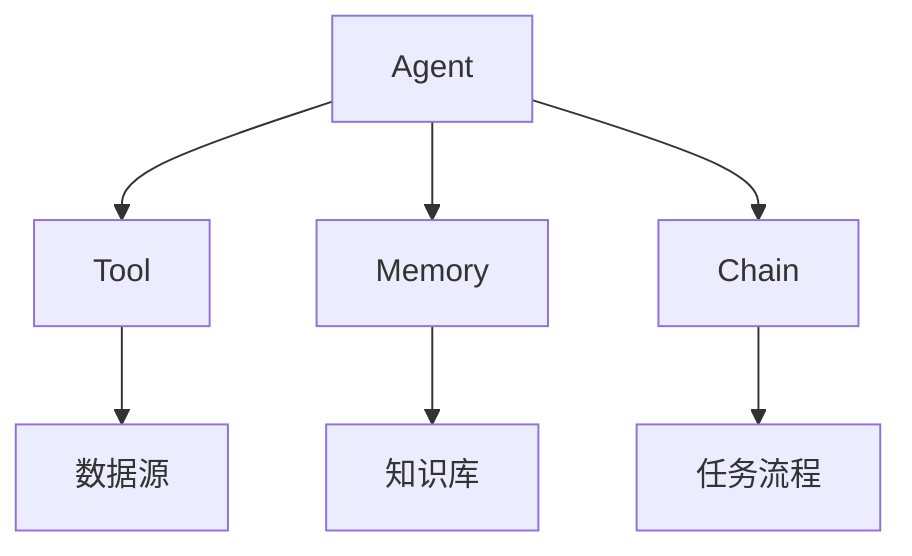

# 【LangChain编程：从入门到实践】资源和工具推荐

## 1. 背景介绍

### 1.1 问题的由来

在当今数据驱动的时代，人工智能(AI)和大数据分析已经成为各行业的核心技术。随着数据量的快速增长和复杂度的提高，传统的数据处理方法已经无法满足现代应用的需求。因此,需要一种新的编程范式来简化AI和大数据应用的开发过程。

LangChain是一个新兴的Python库,旨在帮助开发人员更轻松地构建AI和大数据应用程序。它提供了一种声明式编程模型,使开发人员能够专注于应用程序的逻辑,而不必过多关注底层的数据处理细节。

### 1.2 研究现状

LangChain是一个相对较新的库,目前仍处于快速发展阶段。尽管如此,它已经吸引了许多开发人员和研究人员的关注。一些著名的科技公司和研究机构,如OpenAI、Google和斯坦福大学,都在积极参与LangChain的开发和应用。

目前,LangChain已经被广泛应用于自然语言处理(NLP)、知识图谱构建、问答系统等领域。同时,它也在不断扩展到其他领域,如机器学习、数据分析和自动化工作流程等。

### 1.3 研究意义

LangChain的出现为AI和大数据应用程序的开发带来了全新的机遇。它提供了一种抽象层,使开发人员能够更加专注于应用程序的逻辑,而不必过多关注底层的数据处理细节。这不仅提高了开发效率,也降低了开发难度,使AI和大数据应用程序的构建变得更加简单和高效。

此外,LangChain还促进了AI和大数据领域的创新。通过提供一种统一的编程模型,LangChain使得不同领域的专家能够更容易地协作和交流,从而推动新的研究和应用的发展。

### 1.4 本文结构

本文将全面介绍LangChain编程,从入门到实践。我们将首先探讨LangChain的核心概念和算法原理,然后详细讲解数学模型和公式,并通过代码实例和实际应用场景来加深理解。最后,我们将推荐一些有用的工具和资源,并总结LangChain的未来发展趋势和挑战。

## 2. 核心概念与联系

LangChain的核心概念包括代理(Agent)、工具(Tool)、内存(Memory)和链(Chain)。这些概念相互关联,共同构建了LangChain的编程模型。

1. **代理(Agent)**: 代理是LangChain中的核心组件,它负责协调和执行任务。代理可以访问各种工具、内存和链,并根据任务需求进行组合和调用。

2. **工具(Tool)**: 工具是代理可以使用的各种功能模块,如数据库查询、Web API调用、文本处理等。工具通常与外部数据源或服务进行交互。

3. **内存(Memory)**: 内存用于存储和管理代理在执行任务过程中产生的中间结果和上下文信息。它可以是简单的数据结构,也可以是复杂的知识库。

4. **链(Chain)**: 链是一系列工具和内存的组合,用于完成特定的任务流程。链可以是线性的、分支的或循环的,具有很强的灵活性和可扩展性。

这些核心概念相互关联,共同构建了LangChain的编程模型。开发人员可以使用代理来协调和执行任务,利用工具访问各种数据源和服务,使用内存管理中间结果和上下文信息,并通过链组合各种功能模块以完成复杂的任务流程。

## 3. 核心算法原理 & 具体操作步骤

### 3.1 算法原理概述

LangChain的核心算法原理基于**代理-工具-内存-链**的编程模型。该模型旨在简化AI和大数据应用程序的开发过程,使开发人员能够专注于应用程序的逻辑,而不必过多关注底层的数据处理细节。

算法的基本思想是将任务分解为一系列子任务,每个子任务由一个或多个工具来完成。代理负责协调和执行这些子任务,并根据需要访问内存和调用链。

在执行过程中,代理会根据当前的上下文信息和任务需求,动态选择合适的工具、内存和链。这种动态组合和调用的方式,使得LangChain具有很强的灵活性和可扩展性,能够适应各种复杂的任务场景。

### 3.2 算法步骤详解

LangChain算法的具体执行步骤如下:

1. **任务分解**: 将原始任务分解为一系列子任务。

2. **工具选择**: 根据子任务的需求,从可用的工具集合中选择合适的工具。

3. **内存访问**: 根据需要,从内存中读取或写入相关的上下文信息和中间结果。

4. **链调用**: 如果子任务需要多个工具或内存的组合,则调用相应的链来执行。

5. **结果合并**: 将各个子任务的结果合并,形成原始任务的最终输出。

6. **反馈和优化**: 根据任务执行的效果,对代理、工具、内存和链进行反馈和优化,以提高未来任务的执行效率。

该算法采用了递归的思路,将复杂的任务分解为多个简单的子任务,并通过动态组合工具、内存和链来完成。这种分而治之的方式,使得LangChain能够处理各种复杂的AI和大数据应用场景。

### 3.3 算法优缺点

**优点**:

- **模块化**: 代理、工具、内存和链的模块化设计,使得系统具有很强的灵活性和可扩展性。
- **抽象层**: 提供了一种抽象层,使开发人员能够专注于应用程序的逻辑,而不必过多关注底层的数据处理细节。
- **动态组合**: 通过动态组合工具、内存和链,能够适应各种复杂的任务场景。
- **可解释性**: 算法的执行过程具有较好的可解释性,有利于调试和优化。

**缺点**:

- **性能开销**: 动态组合和递归执行可能会带来一定的性能开销。
- **依赖管理**: 需要合理管理各种工具、内存和链之间的依赖关系,避免冲突和循环依赖。
- **上下文管理**: 在复杂的任务场景下,上下文信息的管理和传递可能会变得困难。

### 3.4 算法应用领域

LangChain算法可以应用于各种AI和大数据领域,包括但不限于:

- **自然语言处理(NLP)**: 如问答系统、文本摘要、情感分析等。
- **知识图谱构建**: 从非结构化数据中提取实体、关系和事实,构建知识图谱。
- **机器学习**: 作为机器学习模型的预处理和后处理步骤,提高模型的性能和可解释性。
- **数据分析**: 将复杂的数据分析任务分解为多个子任务,并动态组合各种数据处理工具。
- **自动化工作流程**: 通过链的组合,实现各种自动化的业务流程和决策过程。

总的来说,LangChain算法为AI和大数据应用程序的开发提供了一种全新的编程范式,具有广阔的应用前景。

## 4. 数学模型和公式 & 详细讲解 & 举例说明

### 4.1 数学模型构建

LangChain算法的核心思想是将复杂的任务分解为多个简单的子任务,并通过动态组合工具、内存和链来完成。为了量化和优化这一过程,我们可以构建一个数学模型。

假设一个任务 $T$ 可以分解为 $n$ 个子任务 $\{t_1, t_2, \dots, t_n\}$,每个子任务 $t_i$ 可以由一个或多个工具 $\{w_{i1}, w_{i2}, \dots, w_{im_i}\}$ 来完成,其中 $m_i$ 表示第 $i$ 个子任务所需的工具数量。

我们定义一个代价函数 $C(T)$,表示完成任务 $T$ 所需的总代价。代价可以是时间、计算资源或其他指标。代价函数可以表示为:

$$C(T) = \sum_{i=1}^{n} C(t_i)$$

其中 $C(t_i)$ 表示完成子任务 $t_i$ 所需的代价。

对于每个子任务 $t_i$,我们可以进一步将其代价分解为工具代价和组合代价两部分:

$$C(t_i) = \sum_{j=1}^{m_i} C(w_{ij}) + C_\text{comb}(t_i)$$

其中 $C(w_{ij})$ 表示使用工具 $w_{ij}$ 所需的代价,而 $C_\text{comb}(t_i)$ 表示组合多个工具完成子任务 $t_i$ 所需的额外代价。

我们的目标是最小化总代价函数 $C(T)$,即找到一种最优的工具组合方式,使得总代价最小。这可以通过优化算法或启发式方法来实现。

### 4.2 公式推导过程

在上一节中,我们构建了一个数学模型来量化和优化LangChain算法的执行过程。现在,我们将推导一些公式,以更好地理解和分析这个模型。

首先,我们定义一个指标 $E(T)$,表示完成任务 $T$ 的效率。效率可以被定义为单位代价下的输出量,或者是代价与输出的比值。在本例中,我们将效率定义为单位代价下的任务完成度。

$$E(T) = \frac{1}{C(T)}$$

其中 $C(T)$ 是上一节中定义的总代价函数。

我们可以将效率进一步分解为子任务效率的加权和:

$$E(T) = \sum_{i=1}^{n} \frac{C(t_i)}{C(T)} E(t_i)$$

其中 $E(t_i)$ 表示完成子任务 $t_i$ 的效率,权重 $\frac{C(t_i)}{C(T)}$ 表示子任务 $t_i$ 在总代价中所占的比例。

对于每个子任务 $t_i$,我们可以将其效率表示为工具效率和组合效率的乘积:

$$E(t_i) = \prod_{j=1}^{m_i} E(w_{ij}) \cdot E_\text{comb}(t_i)$$

其中 $E(w_{ij})$ 表示使用工具 $w_{ij}$ 的效率,而 $E_\text{comb}(t_i)$ 表示组合多个工具完成子任务 $t_i$ 的效率。

通过上述公式,我们可以分析和优化LangChain算法的执行效率。例如,我们可以选择高效的工具组合,或者优化工具之间的组合方式,以提高整体效率。

### 4.3 案例分析与讲解

为了更好地理解上述数学模型和公式,我们将通过一个案例进行分析和讲解。

假设我们需要构建一个问答系统,能够回答有关某个主题的各种问题。这个任务可以分解为以下几个子任务:

1. 从互联网上搜集相关文档 ($t_1$)
2. 对文档进行预处理和清理 ($t_2$)
3. 构建知识库 ($t_3$)
4. 基于知识库回答问题 ($t_4$)

对于子任务 $t_1$,我们可以使用网络爬虫工具 $w_{11}$ 和搜索引擎 API $w_{12}$ 来完成。对于子任务 $t_2$,我们可以使用文本预处理工具 $w_{21}$ 和数据清理工具 $w_{22}$。子任务 $t_3$ 可以使用知识库构建工具 $w_{31}$,而子任务 $t_4$ 可以使用问答模型 $w_{41}$。

假设每个工具的代价和效率如下:

- $C(w_{11}) = 10, E(w_{11}) = 0.8$
- $C