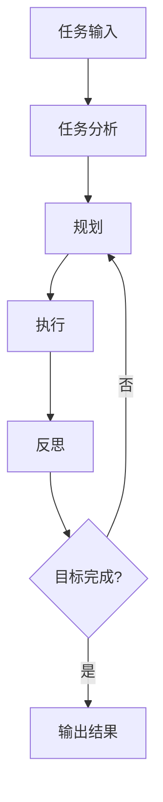

# 【大模型应用开发 动手做AI Agent】AutoGPT实战

## 1. 背景介绍

### 1.1 问题的由来

在过去几年中,大型语言模型(LLM)的出现引发了人工智能(AI)领域的一场革命。这些模型通过在海量文本数据上进行训练,展现出令人惊叹的自然语言理解和生成能力。然而,尽管取得了长足进步,但将LLM应用于实际场景仍面临诸多挑战。

传统的LLM系统通常被视为一个"黑盒",它们能够根据输入生成令人惊叹的输出,但缺乏对自身行为的理解和控制。这使得它们难以应用于需要持续交互、多任务协调和长期规划的复杂场景。此外,现有LLM系统往往缺乏主动性,无法自发地识别和解决问题,需要人类不断提供指令。

### 1.2 研究现状

为了解决上述挑战,研究人员提出了一种新型AI系统:自主智能代理(Autonomous AI Agent)。这种代理不仅拥有LLM强大的语言理解和生成能力,而且能够自主地规划和执行行动,持续学习和发展。自主智能代理被认为是通往通用人工智能(AGI)的关键一步。

近年来,自主智能代理的研究日益活跃,涌现出多种创新方法。其中,AutoGPT是一个开源的自主智能代理框架,它结合了大型语言模型、规划算法和反思机制,展现出令人鼓舞的能力。AutoGPT能够自主分析和规划任务,与人类协作完成复杂的目标。

### 1.3 研究意义

开发自主智能代理对于推进人工智能领域具有重大意义。它不仅有助于探索通用人工智能的途径,而且为解决现实世界中的复杂问题提供了新的思路。自主智能代理可应用于广泛的领域,如智能助手、自动化系统、决策支持等。

通过研究AutoGPT这一具体框架,我们可以深入理解自主智能代理的工作原理、优势和局限性。这将为未来的研究和应用奠定基础,推动AI技术向着更加通用、自主和智能的方向发展。

### 1.4 本文结构

本文将全面介绍AutoGPT的核心概念、算法原理、数学模型、实践开发和应用场景。我们将从以下几个方面进行详细阐述:

1. 核心概念与联系
2. 核心算法原理与具体操作步骤
3. 数学模型和公式详细讲解与举例说明
4. 项目实践:代码实例和详细解释说明
5. 实际应用场景
6. 工具和资源推荐
7. 总结:未来发展趋势与挑战
8. 附录:常见问题与解答

通过本文,读者将全面掌握AutoGPT的理论基础和实践技能,为开发自主智能代理系统做好准备。

## 2. 核心概念与联系

在深入探讨AutoGPT的细节之前,我们需要了解一些核心概念及它们之间的联系。这将为后续内容奠定基础。

### 2.1 大型语言模型(LLM)

大型语言模型是AutoGPT的核心组成部分之一。LLM是一种基于深度学习的自然语言处理模型,通过在海量文本数据上训练,获得了出色的语言理解和生成能力。

常见的LLM包括GPT-3、BERT、XLNet等。它们可以用于各种自然语言处理任务,如文本生成、机器翻译、问答系统等。AutoGPT利用LLM强大的语言能力来理解和生成自然语言指令,实现与人类的交互。

### 2.2 规划算法

规划算法是AutoGPT的另一个关键组件。它们用于根据当前状态和目标,生成一系列行动来实现目标。常见的规划算法包括启发式搜索算法(如A*算法)、基于案例的规划、层次任务网络规划等。

在AutoGPT中,规划算法负责分析任务,将其分解为可执行的子任务序列,并协调LLM和其他组件完成这些子任务。有效的规划算法能够确保代理以高效、合理的方式完成复杂目标。

### 2.3 反思机制

反思机制赋予AutoGPT自我评估和改进的能力。通过反思,代理可以评估自身的行为和决策是否合理,并根据反馈进行调整。这种机制有助于代理持续学习和发展,避免陷入局部最优解。

反思机制通常包括以下几个步骤:

1. 监控:跟踪代理的行为和决策过程
2. 评估:根据预定义的标准评估行为和决策的质量
3. 修正:根据评估结果,对代理的知识库、规划策略等进行修正

通过不断反思和改进,AutoGPT可以逐步优化自身,提高任务完成的效率和质量。

### 2.4 人机协作

AutoGPT不是一个完全自主的系统,它需要与人类协作才能发挥最大潜力。人机协作是AutoGPT的核心设计理念之一,体现在以下几个方面:

1. 任务分配:人类可以为代理分配高层次的目标和任务
2. 监督和指导:人类可以监督代理的行为,并在必要时提供指导和反馈
3. 知识补充:人类可以为代理提供额外的知识和信息
4. 决策审查:对于关键决策,代理可以征求人类的意见

通过合理分工和密切协作,人机结合可以发挥各自的优势,完成超出单一系统能力范围的复杂任务。

### 2.5 概念联系

上述核心概念相互关联,共同构建了AutoGPT的基本框架:

1. LLM为代理提供了强大的语言理解和生成能力,是与人类交互的基础
2. 规划算法根据任务目标生成行动序列,协调各组件的工作
3. 反思机制评估代理的行为,并对其进行改进和优化
4. 人机协作使代理能够获得人类的指导和补充知识,扩展其能力范围

这些概念相互依赖、相互促进,共同赋予了AutoGPT自主规划、持续学习和人机协作的能力。

## 3. 核心算法原理与具体操作步骤

### 3.1 算法原理概述

AutoGPT的核心算法原理可以概括为:基于大型语言模型的规划和反思循环。具体来说,它包括以下几个关键步骤:

1. **任务分析**: 利用LLM分析当前任务,识别子任务和约束条件
2. **规划**: 根据任务分析结果,使用规划算法生成行动序列
3. **执行**: 执行规划生成的行动序列,可能涉及与外部系统交互
4. **反思**: 评估行动序列的执行效果,根据反馈对知识库和规划策略进行更新
5. **循环**: 重复上述步骤,直到完成最终目标

该算法的核心思想是将复杂任务分解为可管理的子任务,并通过反馈循环不断改进和优化解决方案。这种"分而治之"和"试错学习"的策略赋予了AutoGPT强大的通用性和自适应能力。

### 3.2 算法步骤详解

接下来,我们将详细解释AutoGPT算法的每个步骤。

#### 3.2.1 任务分析

任务分析是整个算法的起点。在这一步骤中,AutoGPT利用LLM对输入的任务进行理解和分析,识别出子任务、约束条件、相关知识等关键信息。

具体来说,任务分析可能包括以下操作:

1. **自然语言理解**: 利用LLM的语言理解能力,将任务描述转换为结构化的表示
2. **知识提取**: 从代理的知识库中提取与任务相关的信息
3. **子任务识别**: 将整体任务分解为多个可执行的子任务
4. **约束分析**: 识别任务执行过程中需要满足的各种约束条件

任务分析的质量直接影响后续规划和执行的效果。一个准确的任务分析可以为代理提供清晰的路线图,而一个分析不当则可能导致代理偏离正轨。

#### 3.2.2 规划

基于任务分析的结果,AutoGPT使用规划算法生成行动序列,以完成最终目标。规划算法需要考虑多种因素,如子任务的先后顺序、资源约束、风险评估等。

AutoGPT可以采用多种规划算法,包括:

- **启发式搜索算法**:利用评估函数对可能的行动序列进行评估,选择最优序列。常见算法包括A*算法、Best-First搜索等。
- **基于案例的规划**:根据过去解决类似问题的经验,生成新的解决方案。
- **层次任务网络规划**:将复杂任务分解为层次化的子任务网络,并对网络进行搜索以生成解决方案。
- **约束优化规划**:将规划问题建模为约束优化问题,并使用求解器寻找最优解。

不同的规划算法适用于不同的场景,AutoGPT可以根据任务的性质选择合适的算法,或者将多种算法结合使用。

#### 3.2.3 执行

规划生成的行动序列需要通过执行来实现。执行过程中,AutoGPT需要与外部系统和资源进行交互,例如:

- 调用API获取数据
- 操作文件和数据库
- 与其他程序集成
- 控制物理硬件设备

为了支持这些交互,AutoGPT通常需要与各种外部系统集成。这些系统可以通过插件或中间件的方式与AutoGPT连接。

在执行过程中,AutoGPT还需要处理各种异常情况和意外事件。它可以利用LLM的语言理解能力来分析错误信息,并根据规划生成的备用方案作出相应的反应。

#### 3.2.4 反思

执行完成后,AutoGPT会对执行结果进行评估,这就是反思环节。反思的目的是检测并纠正代理的错误行为,并积累经验以指导未来的决策。

反思过程包括以下步骤:

1. **结果评估**: 将执行结果与预期目标进行比较,评估是否满足要求
2. **过程分析**: 分析整个任务执行过程,识别可能的错误和低效之处
3. **知识更新**: 根据分析结果,对代理的知识库进行更新和补充
4. **策略优化**: 对规划算法的参数和策略进行调整,以提高未来的规划质量

反思环节对于AutoGPT的持续学习和改进至关重要。通过不断积累经验并对自身进行调整,代理可以逐步提高任务完成的效率和质量。

### 3.3 算法优缺点

#### 3.3.1 优点

AutoGPT算法具有以下优点:

1. **通用性强**: 由于采用了基于LLM的任务分析和规划方法,AutoGPT可以应对各种不同领域的任务,展现出良好的通用性能。
2. **自适应能力**: 通过反思环节,AutoGPT能够根据过去的经验不断优化自身,适应新的环境和任务。
3. **人机协作**: AutoGPT设计了多种人机交互方式,能够充分利用人类的经验和指导,扩展自身的能力范围。
4. **模块化设计**: AutoGPT采用模块化设计,各个组件相对独立,便于扩展和定制。
5. **开源可控**: 作为开源项目,AutoGPT的代码透明且可控,方便研究人员进行修改和实验。

#### 3.3.2 缺点

与此同时,AutoGPT算法也存在一些不足之处:

1. **可解释性差**: 由于涉及复杂的深度学习模型和启发式算法,AutoGPT的决策过程往往缺乏透明度和可解释性。
2. **偏差和不确定性**: LLM和规划算法都可能存在偏差和不确定性,导致AutoGPT的行为存在一定的不