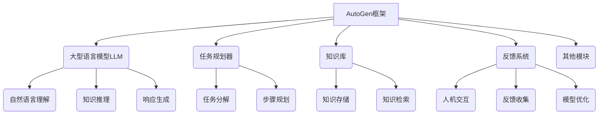

# 【大模型应用开发 动手做AI Agent】AutoGen简介

## 1. 背景介绍

### 1.1 问题的由来

在当前的人工智能发展浪潮中,大型语言模型(Large Language Models, LLMs)凭借其强大的自然语言处理能力和广泛的知识储备,成为了人工智能领域的焦点。然而,要充分发挥LLMs的潜力,仍面临着诸多挑战,例如如何将它们应用于特定任务、如何控制输出质量以及如何确保安全性和可解释性等。

为了应对这些挑战,研究人员提出了一种新型AI系统架构——AI Agent。AI Agent旨在将LLMs与其他模块(如任务规划器、知识库和反馈系统等)相结合,从而构建出更加智能、可控且符合人类意图的AI助手。AutoGen就是一个这样的AI Agent框架,它以LLMs为核心,并集成了多种功能模块,为开发人员提供了一种全新的大模型应用开发范式。

### 1.2 研究现状

目前,已有多个研究团队致力于探索AI Agent的开发和应用。例如,OpenAI的InstructGPT项目旨在构建一个可以理解和执行各种任务的通用AI助手;Anthropic公司的Constitutional AI则侧重于确保AI系统的行为符合人类价值观;DeepMind的Gato项目则尝试构建一个多模态的统一AI模型,能够处理视觉、语言和其他任务。

与此同时,一些开源项目也在推动AI Agent的发展。例如,StanfordAI实验室的Stratified Kernel Hypothesis提出了一种模块化的AI架构;OpenAI的Triton则是一个用于构建安全AI系统的开源框架。

### 1.3 研究意义

AI Agent的研究对于推动人工智能的发展具有重要意义。它不仅有望解决LLMs在实际应用中面临的各种挑战,还可能成为通往通用人工智能(Artificial General Intelligence, AGI)的一条途径。通过将不同的功能模块集成到一个统一的框架中,AI Agent有潜力实现更高级别的智能,如推理、规划、学习和自我修正等能力。

此外,AI Agent还可以促进人工智能的可解释性、可控性和安全性。通过引入明确的模块化设计,AI Agent的决策过程和行为模式将更加透明,从而有助于人类对其进行监督和调整。这对于构建值得信赖的人工智能系统至关重要。

### 1.4 本文结构

本文将全面介绍AutoGen这一AI Agent框架。我们将从核心概念出发,阐述AutoGen的设计理念和架构;接着深入探讨其中的关键算法和数学模型;然后通过代码示例展示AutoGen的实际应用;最后,我们将总结AutoGen的发展趋势和面临的挑战,并提供相关的学习资源和工具推荐。

通过本文,读者将全面了解AutoGen的工作原理、实现细节和应用场景,为开发基于大模型的智能应用系统奠定坚实基础。

## 2. 核心概念与联系

AutoGen是一个以大型语言模型(LLM)为核心的AI Agent框架,旨在构建智能、可控且符合人类意图的AI助手。它的核心思想是将LLM与多个功能模块相结合,形成一个模块化的AI系统。

上图展示了AutoGen的基本架构。其中,LLM作为核心模块,负责自然语言理解、知识推理和响应生成等功能。任务规划器则根据用户的输入,将复杂任务分解为一系列可执行的步骤。知识库用于存储和检索相关的知识信息,为LLM提供背景知识。反馈系统则通过人机交互收集用户反馈,并将这些反馈用于优化LLM的性能。

除了这些核心模块外,AutoGen还可以集成其他功能模块,如对话管理、多模态处理、安全性检查等,从而构建出更加智能和全面的AI助手系统。

AutoGen的设计理念体现了模块化和可扩展性的原则。每个模块都有明确的职责,可以独立开发和优化。同时,这些模块通过标准化的接口相互连接,形成一个灵活且可扩展的整体架构。这不仅有利于提高系统的可维护性和可重用性,还为未来的功能扩展留下了空间。

## 3. 核心算法原理 & 具体操作步骤

### 3.1 算法原理概述

AutoGen的核心算法主要包括三个方面:任务规划、知识检索和响应生成。

**任务规划**算法负责将用户的复杂需求分解为一系列可执行的子任务。它基于规划算法和启发式搜索,根据任务的目标状态和当前状态,生成一系列操作步骤。在这个过程中,任务规划器会与知识库交互,获取相关的背景知识。

**知识检索**算法则负责从知识库中检索与当前任务相关的信息。它通常采用基于语义的检索方法,如向量空间模型或神经网络模型,根据查询的语义向量在知识库中找到最相关的条目。

**响应生成**算法是AutoGen的核心,它利用LLM根据任务描述和检索到的知识,生成对应的自然语言响应。这个过程通常采用序列到序列(Seq2Seq)模型,将输入编码为隐藏状态,然后根据隐藏状态解码生成目标响应。

### 3.2 算法步骤详解

1. **用户查询处理**:首先对用户的自然语言查询进行预处理,如分词、词性标注、命名实体识别等,以获取查询的语义表示。

2. **任务规划**:根据查询的语义表示,任务规划器将其分解为一系列子任务。每个子任务都有明确的目标状态和操作空间。规划算法(如A*、STRIPS等)将根据启发式函数和约束条件,生成从当前状态到目标状态的最优操作序列。

3. **知识检索**:对于每个子任务,知识检索模块会在知识库中查找相关的背景知识。这通常是基于语义相似度的向量空间检索,或使用双塔模型等神经网络方法。检索到的知识将作为LLM的辅助信息。

4. **响应生成**:LLM将子任务描述、操作步骤和检索到的知识作为输入,生成对应的自然语言响应。这个过程采用Seq2Seq模型,将输入编码为隐藏状态,然后基于隐藏状态解码生成目标响应序列。

5. **响应后处理**:对LLM生成的原始响应进行后处理,包括格式调整、语法纠错、风格优化等,以提高响应的可读性和一致性。

6. **反馈收集与模型优化**:将生成的响应呈现给用户,并收集用户的反馈(如满意度评分、纠错等)。这些反馈数据将用于持续优化LLM及其他模块的性能。

上述步骤可以循环执行,直到完成整个任务。在这个过程中,AutoGen的各个模块紧密协作,共同实现智能的问答和任务执行功能。

### 3.3 算法优缺点

**优点**:

- 模块化设计,各模块职责明确,易于开发和维护
- 融合了规划、检索和生成等多种算法,能力全面
- 通过知识库和反馈系统,可持续学习和优化
- 具有较强的可解释性和可控性

**缺点**:

- 模块间的交互和数据流转较为复杂,需要精心设计
- 任务规划和知识检索的性能直接影响整体效果
- 需要大量的标注数据用于模块训练和优化
- 面临一些通用的LLM挑战,如偏差、不确定性等

### 3.4 算法应用领域

AutoGen作为一种通用的AI Agent框架,其应用领域十分广泛:

- 智能助手:可用于构建多功能的问答助手、任务助手等
- 知识管理:支持知识库构建、知识检索和知识推理等功能 
- 自动化:适用于工作流自动化、脚本生成、代码生成等领域
- 教育:可用于智能辅导、个性化学习路径规划等应用
- 医疗健康:支持智能诊断、治疗方案生成、患者教育等
- 客户服务:能够提供智能的客户响应和问题解决方案
- 创作辅助:可用于文案写作、内容生成、故事创作等

总的来说,凭借其模块化和可扩展的架构设计,AutoGen为广泛的AI应用场景提供了一种全新的解决方案。

## 4. 数学模型和公式 & 详细讲解 & 举例说明

在AutoGen框架中,数学模型和公式扮演着至关重要的角色,为核心算法提供理论基础和技术支撑。本节将重点介绍AutoGen中应用的三种关键数学模型:语义向量空间模型、序列到序列模型和强化学习模型。

### 4.1 数学模型构建

#### 语义向量空间模型

语义向量空间模型(Semantic Vector Space Model)是AutoGen知识检索模块的核心。它将文本映射到一个连续的向量空间中,使得语义相似的文本在该空间中彼此靠近。

设有一个文档集合 $\mathcal{D} = \{d_1, d_2, \ldots, d_n\}$,我们的目标是学习一个映射函数 $\phi: \mathcal{D} \rightarrow \mathbb{R}^m$,将每个文档 $d_i$ 映射到 $m$ 维语义向量空间中的一个向量 $\vec{v_i} = \phi(d_i)$。

常见的语义向量空间模型包括:

- 词袋模型(Bag-of-Words):将文档表示为其词频向量
- 词嵌入模型(Word Embeddings):使用Word2Vec、GloVe等技术学习词向量
- 句子/文档编码器(Sentence/Document Encoders):利用预训练语言模型(如BERT)编码句子/文档

对于给定的查询 $q$,我们可以计算其语义向量 $\vec{q} = \phi(q)$,然后在文档集合中查找与 $\vec{q}$ 最相似的文档:

$$\mathrm{sim}(q, d_i) = \cos(\vec{q}, \vec{v_i}) = \frac{\vec{q} \cdot \vec{v_i}}{|\vec{q}||\vec{v_i}|}$$

其中 $\cos(\cdot)$ 表示余弦相似度。最相似的文档对应着最大的相似度分数。

#### 序列到序列模型

序列到序列(Sequence-to-Sequence, Seq2Seq)模型是AutoGen响应生成模块的核心。它将输入序列(如查询和背景知识)映射到目标响应序列,实现自然语言生成的功能。

设有一个输入序列 $\mathbf{x} = (x_1, x_2, \ldots, x_n)$ 和目标序列 $\mathbf{y} = (y_1, y_2, \ldots, y_m)$,Seq2Seq模型需要学习条件概率分布 $P(\mathbf{y} | \mathbf{x})$。

该模型通常包括一个编码器(Encoder)和一个解码器(Decoder)两个组件:

- 编码器 $f_\text{enc}$ 将输入序列 $\mathbf{x}$ 编码为隐藏状态向量 $\vec{h}$:

$$\vec{h} = f_\text{enc}(\mathbf{x})$$

- 解码器 $f_\text{dec}$ 将隐藏状态 $\vec{h}$ 和先前生成的tokens解码为目标序列 $\mathbf{y}$:

$$P(\mathbf{y}|\mathbf{x}) = \prod_{t=1}^m P(y_t | \vec{h}, y_1, \ldots, y_{t-1})$$
$$y_t = f_\text{dec}(\vec{h}, y