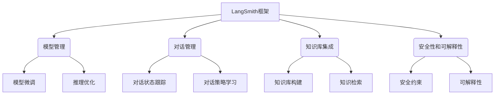

以下是《【大模型应用开发 动手做AI Agent】LangSmith的使用方法》这篇技术博客文章的正文内容:

# 【大模型应用开发 动手做AI Agent】LangSmith的使用方法

## 1. 背景介绍

### 1.1 问题的由来

在人工智能领域中,大型语言模型(Large Language Models,LLMs)的兴起引发了广泛关注。这些模型通过在海量文本数据上进行训练,展现出惊人的自然语言理解和生成能力,为各种应用场景带来了新的可能性。然而,将这些庞大的语言模型应用于实际场景并非易事,需要解决诸多挑战,例如模型微调、推理优化、人机交互等。

LangSmith就是一个旨在简化大型语言模型应用开发的开源框架。它提供了一种统一的方式来构建、微调、部署和管理基于大型语言模型的AI应用程序,使开发人员能够专注于应用程序的逻辑,而不必过多关注底层模型的细节。

### 1.2 研究现状

目前,已有一些框架和工具旨在简化大型语言模型的应用开发,例如Hugging Face的Transformers库、Anthropic的Constitutional AI等。然而,这些工具通常仍需要开发人员具备一定的机器学习和自然语言处理知识,并且在构建复杂的AI应用程序时可能会遇到一些挑战,如模型管理、推理优化、人机交互等。

LangSmith则旨在提供一个更高层次的抽象,使开发人员能够更轻松地构建和部署基于大型语言模型的AI应用程序。它不仅提供了模型微调和推理的功能,还集成了对话管理、知识库集成、安全性和可解释性等功能,为构建复杂的AI应用程序提供了全面的支持。

### 1.3 研究意义

LangSmith的出现有助于降低大型语言模型应用开发的门槛,使更多开发者能够参与到这一领域中来。通过提供统一的开发框架和工具链,LangSmith可以加速AI应用程序的开发和部署,从而推动人工智能技术在各个领域的应用。

此外,LangSmith还可以促进人工智能领域的开放和协作。作为一个开源项目,LangSmith吸引了来自世界各地的贡献者,共同推进框架的发展。这种开放式协作有助于加强不同背景的研究人员和开发人员之间的交流,促进知识和经验的共享,进一步推动人工智能技术的发展。

### 1.4 本文结构

本文将全面介绍LangSmith框架的使用方法,内容包括:

- 核心概念与架构
- 算法原理及实现细节
- 数学模型及公式推导
- 代码实例及解释
- 实际应用场景
- 工具和资源推荐
- 未来发展趋势与挑战
- 常见问题解答

接下来,我们将逐一探讨这些内容。

## 2. 核心概念与联系

LangSmith框架是一个综合性的平台,旨在简化基于大型语言模型的AI应用程序的开发。它包含以下几个核心模块:

1. **模型管理**:负责管理和维护大型语言模型,包括模型微调和推理优化等功能。
2. **对话管理**:提供对话状态跟踪和对话策略学习功能,支持构建对话式AI应用程序。
3. **知识库集成**:支持构建和集成知识库,并提供知识检索功能,使AI应用程序能够利用外部知识源。
4. **安全性和可解释性**:通过安全约束和可解释性机制,提高AI应用程序的安全性和透明度。

这些模块相互协作,为开发人员提供了一个全面的工具链,支持从模型微调到应用程序部署的整个开发生命周期。

## 3. 核心算法原理与具体操作步骤

### 3.1 算法原理概述

LangSmith框架的核心算法原理基于大型语言模型的微调和推理优化技术。具体来说,它采用了以下几种关键算法:

1. **Prompting算法**:通过设计合适的prompt(提示词),引导大型语言模型生成所需的输出。这种方法避免了从头训练模型的需求,大大降低了计算资源的需求。

2. **指令微调(Instruction Tuning)**:在原始语料库的基础上,使用人工标注的指令数据对大型语言模型进行进一步微调,使其能够更好地理解和执行指令。

3. **对话管理算法**:包括对话状态跟踪、对话策略学习等算法,用于构建对话式AI应用程序。

4. **知识检索算法**:基于语义相似性等技术,从知识库中检索与当前对话相关的知识,为AI应用程序提供背景知识。

5. **安全约束算法**:通过设置安全规则和过滤器,防止AI应用程序输出有害或不当的内容。

6. **可解释性算法**:通过注意力可视化、决策路径跟踪等技术,提高AI应用程序的可解释性和透明度。

这些算法相互配合,为LangSmith框架提供了强大的功能支持。

### 3.2 算法步骤详解

以下是LangSmith框架中一个典型的AI应用程序开发流程,并对每个步骤的算法原理进行详细解释:

1. **模型选择和微调**

   - 选择合适的大型语言模型作为基础模型,例如GPT-3、BLOOM等。
   - 使用Prompting算法和指令微调算法,根据应用程序的需求对基础模型进行微调。

2. **知识库构建和集成**

   - 收集与应用程序相关的知识源,构建知识库。
   - 使用知识检索算法,将知识库集成到AI应用程序中。

3. **对话管理模块开发**

   - 使用对话状态跟踪算法,跟踪对话的上下文和状态。
   - 使用对话策略学习算法,训练对话策略模型,决定AI应用程序的响应。

4. **安全性和可解释性模块开发**

   - 使用安全约束算法,设置安全规则和过滤器,确保AI应用程序的输出是安全和适当的。
   - 使用可解释性算法,提高AI应用程序的透明度和可解释性。

5. **应用程序部署和优化**

   - 将开发好的各个模块集成到AI应用程序中。
   - 使用推理优化算法,优化AI应用程序的推理性能。
   - 部署AI应用程序,并进行测试和迭代优化。

通过这一流程,开发人员可以充分利用LangSmith框架提供的各种算法和工具,高效地开发出功能强大、安全可靠的基于大型语言模型的AI应用程序。

### 3.3 算法优缺点

LangSmith框架采用的算法具有以下优点:

- **高效性**:通过Prompting和指令微调算法,避免了从头训练大型语言模型的需求,大大降低了计算资源的需求。
- **灵活性**:可以根据应用程序的需求,灵活地选择和微调不同的基础模型。
- **功能全面**:集成了对话管理、知识库集成、安全性和可解释性等多种功能,支持构建复杂的AI应用程序。
- **开放性**:作为开源项目,吸引了来自世界各地的贡献者,促进了技术的发展和知识的共享。

同时,这些算法也存在一些缺点和挑战:

- **数据依赖**:算法的性能在很大程度上依赖于训练数据的质量和数量,获取高质量的训练数据可能是一个挑战。
- **可解释性不足**:尽管采用了可解释性算法,但大型语言模型的决策过程仍然存在一定的"黑箱"特性,可解释性仍需进一步提高。
- **安全性风险**:虽然采用了安全约束算法,但仍存在一定的安全风险,例如模型可能会生成有害或不当的内容。
- **计算资源需求**:尽管比从头训练模型更高效,但微调和推理过程仍然需要一定的计算资源。

### 3.4 算法应用领域

LangSmith框架采用的算法可以应用于各种基于大型语言模型的AI应用程序开发,包括但不限于:

- **对话式AI助手**:通过对话管理模块,构建智能对话助手,用于客户服务、问答系统等场景。
- **内容生成**:利用大型语言模型的文本生成能力,开发内容创作、自动写作等应用程序。
- **知识管理**:通过知识库集成模块,构建智能知识管理系统,支持知识检索和问答等功能。
- **决策支持**:将LangSmith框架集成到决策支持系统中,提供基于自然语言的决策建议和解释。
- **教育和学习**:开发智能教育助手,提供个性化的学习内容和指导。

总的来说,LangSmith框架为各种基于大型语言模型的AI应用程序开发提供了强有力的支持,有助于推动人工智能技术在各个领域的应用。

## 4. 数学模型和公式详细讲解举例说明

在LangSmith框架中,数学模型和公式主要应用于以下几个方面:

### 4.1 数学模型构建

1. **语言模型**

   大型语言模型通常基于Transformer架构,其核心是Self-Attention机制。给定输入序列 $X = (x_1, x_2, \dots, x_n)$,Self-Attention计算每个位置的表示 $y_i$ 如下:

   $$y_i = \sum_{j=1}^n \alpha_{ij}(x_jW^V)$$

   其中,$ \alpha_{ij} = \mathrm{softmax}(\frac{(x_iW^Q)(x_jW^K)^T}{\sqrt{d_k}}) $表示输入序列中第i个位置对第j个位置的注意力权重, $W^Q, W^K, W^V$分别为查询、键值和值的线性投影矩阵。

2. **知识检索模型**

   LangSmith框架中的知识检索模块通常采用语义相似性模型,例如双编码器模型。给定查询 $q$ 和知识库中的条目 $d$,双编码器模型计算它们的相似度分数如下:

   $$\mathrm{sim}(q, d) = f(q)^T g(d)$$

   其中, $f(\cdot)$ 和 $g(\cdot)$ 分别是查询编码器和条目编码器,通过最大化正例对的相似度分数和最小化负例对的相似度分数来训练模型参数。

### 4.2 公式推导过程

以下是LangSmith框架中一个关键公式的推导过程:

在对话策略学习模块中,我们需要从对话历史 $H = (u_1, a_1, u_2, a_2, \dots, u_n)$ 中学习对话策略 $\pi(a_n|H)$,即在给定对话历史的情况下,选择最优的响应动作 $a_n$。我们可以将这个问题建模为最大化期望回报的马尔可夫决策过程(MDP):

$$\max_\pi \mathbb{E}_\pi \left[ \sum_{t=0}^\infty \gamma^t r_t \right]$$

其中, $\gamma$ 是折现因子, $r_t$ 是在时间步 $t$ 获得的回报。

通过应用策略迭代算法,我们可以得到计算 $\pi(a_n|H)$ 的公式:

$$\pi(a_n|H) \propto \exp\left(Q(H, a_n)\right)$$

其中, $Q(H, a_n)$ 是状态-动作值函数,表示在对话历史 $H$ 下选择动作 $a_n$ 的期望回报。我们可以使用深度神经网络来拟合 $Q$ 函数,并通过强化学习算法(如深度Q学习)来优化模型参数。

### 