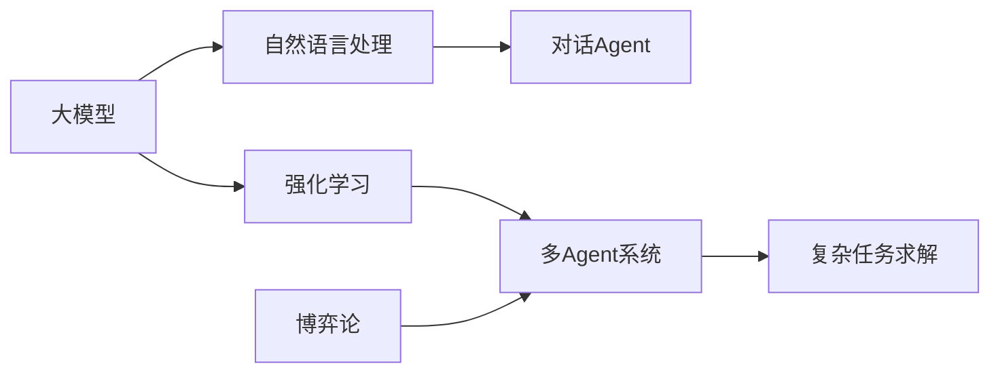

# 【大模型应用开发 动手做AI Agent】从单Agent到多Agent

关键词：大模型、AI Agent、多Agent系统、强化学习、自然语言处理

## 1. 背景介绍

### 1.1 问题的由来
随着人工智能技术的飞速发展，尤其是大模型的出现，AI在各个领域的应用越来越广泛。而Agent作为AI的重要载体，在智能系统中扮演着至关重要的角色。传统的单Agent系统已经难以满足日益复杂的应用需求，多Agent系统成为了AI领域的研究热点。如何利用大模型构建高效、智能、协作的多Agent系统，成为了亟待解决的问题。

### 1.2 研究现状
目前，学术界和工业界都在大模型多Agent系统方面进行了广泛的研究和应用探索。DeepMind、OpenAI等知名AI公司相继推出了多个大模型Agent系统，如GPT-3、DALL-E等，在对话、创作等领域取得了瞩目的成果。国内的华为、百度、阿里等企业也纷纷布局，推出了自己的大模型Agent平台和应用。但总体来说，大模型多Agent系统的研究还处于起步阶段，在算法、架构、应用等方面还有很大的优化空间。

### 1.3 研究意义
大模型多Agent系统的研究具有重要的理论和实践意义：

1. 推动人工智能走向通用智能。多Agent系统能够模拟现实世界中多个智能体的交互与协作，是构建通用人工智能系统的重要途径。 

2. 拓展大模型的应用场景。将大模型与多Agent系统结合，可以极大拓展大模型的应用领域，从单一任务走向复杂的多任务协同。

3. 提升AI系统的性能和效率。通过Agent间的分工协作，可以显著提升AI系统处理复杂任务的能力和效率。

4. 促进多学科交叉融合。多Agent系统涉及人工智能、博弈论、心理学等多个学科，研究有助于推动多学科的交叉融合和创新。

### 1.4 本文结构
本文将围绕大模型多Agent系统的关键技术展开深入探讨。第2部分介绍相关的核心概念；第3部分重点阐述多Agent系统的核心算法原理；第4部分给出算法的数学模型和公式推导；第5部分通过代码实例演示多Agent系统的实现；第6部分分析多Agent系统的实际应用场景；第7部分推荐相关的学习资源；第8部分总结全文并展望未来的发展方向。

## 2. 核心概念与联系

- **Agent**：智能体，可以感知环境，根据自身目标自主行动，通过学习不断提升能力的实体。
- **多Agent系统**：由多个Agent组成的智能系统，Agent之间存在交互和协作关系，共同完成复杂任务。
- **大模型**：基于海量数据和算力训练的超大规模AI模型，具有强大的语言理解和生成能力，代表模型有GPT-3、PaLM等。
- **强化学习**：一种重要的机器学习范式，Agent通过与环境的交互，根据反馈的奖励不断优化行为策略。多Agent强化学习是多Agent系统的核心算法之一。
- **自然语言处理**：赋予计算机处理、理解和生成人类语言的能力。大模型是自然语言处理的重要工具，使得构建人性化的对话Agent成为可能。
- **博弈论**：研究多个理性行为主体在相互影响下如何做出决策的理论。博弈论为多Agent系统的建模、分析和优化提供了理论基础。

下图展示了这些核心概念之间的关联：

大模型是实现高级AI Agent的基础，其强大的语言能力可以用于构建对话Agent，强化学习算法使其具备自主学习能力。将多个Agent组织成系统，并利用博弈论分析其交互机制，可以求解现实世界中的复杂任务。

## 3. 核心算法原理 & 具体操作步骤

### 3.1 算法原理概述
多Agent强化学习是构建多Agent系统的核心算法，其主要思想是每个Agent独立地感知环境状态，根据自身策略选择行动，通过与环境和其他Agent的交互获得反馈奖励，并利用奖励信号不断优化策略，最终实现整个系统的最优协同。

### 3.2 算法步骤详解

1. 初始化每个Agent的策略网络参数。
2. 重复第3-6步，直到满足收敛条件。
3. 每个Agent根据当前环境状态和自身策略选择行动。 
4. 执行联合行动，获得即时奖励和下一状态。
5. 将(状态,行动,奖励,下一状态)的四元组存入经验回放池。
6. 从经验回放池中随机采样一批数据，计算TD误差，更新每个Agent的策略网络参数。
7. 输出训练好的多Agent系统。

算法的核心在于如何设计个体奖励函数和全局奖励函数，以引导Agent学习协作策略。一般采用集中式训练分布式执行的范式，即在训练阶段通过集中式的全局奖励优化整体策略，执行阶段每个Agent根据自身观察独立行动。

### 3.3 算法优缺点
多Agent强化学习的优点在于：
- 通过Agent间的分工协作，可以有效处理复杂的大规模任务。
- 每个Agent只需根据局部信息做出决策，具有较好的鲁棒性和可扩展性。
- 从环境反馈中自主学习，不需要预先设定规则，适应性强。

但该算法也存在一些局限性：
- 难以设计最优的奖励函数，容易陷入局部最优。
- 随着Agent数量增加，联合行动空间呈指数爆炸，给训练带来挑战。
- 多Agent系统的收敛性和稳定性难以理论证明。

### 3.4 算法应用领域
多Agent强化学习在很多领域有重要应用，如：
- 自动驾驶：多车协同决策与控制
- 智能电网：分布式能源调度优化
- 智慧城市：交通流量控制、应急资源调配
- 网络安全：多层次动态防御
- 推荐系统：多样性与公平性权衡

## 4. 数学模型和公式 & 详细讲解 & 举例说明

### 4.1 数学模型构建
考虑一个由$n$个Agent组成的马尔可夫博弈模型，记为$G=<S,A_1,...,A_n,r_1,...,r_n,p,\gamma>$，其中：
- $S$表示有限的环境状态集；
- $A_i$表示第$i$个Agent的行动空间，联合行动$\boldsymbol{a} \in A_1 \times ... \times A_n$；
- $r_i: S \times A_1 \times ... \times A_n \to \mathbb{R}$是第$i$个Agent的奖励函数；
- $p: S \times A_1 \times ... \times A_n \to \Delta(S)$是状态转移概率函数；
- $\gamma \in [0,1]$是折扣因子。

每个Agent的策略定义为从状态到行动概率分布的映射：$\pi_i: S \to \Delta(A_i)$。联合策略记为$\boldsymbol{\pi}=<\pi_1,...,\pi_n>$。

定义第$i$个Agent在状态$s$下执行策略$\pi_i$的状态值函数为：

$$V_i^{\pi_i}(s)=\mathbb{E}\left[\sum_{t=0}^{\infty} \gamma^t r_i(s_t,\boldsymbol{a}_t) | s_0=s, \boldsymbol{a}_t \sim \boldsymbol{\pi} \right]$$

相应地，第$i$个Agent的状态-行动值函数定义为：

$$Q_i^{\pi_i}(s,a_i)=\mathbb{E}\left[\sum_{t=0}^{\infty} \gamma^t r_i(s_t,\boldsymbol{a}_t) | s_0=s, a_i, \boldsymbol{a}_{-i,t} \sim \boldsymbol{\pi}_{-i} \right]$$

其中$\boldsymbol{\pi}_{-i}$表示其他Agent的联合策略。

多Agent系统的目标是寻找纳什均衡策略$\boldsymbol{\pi}^*=<\pi_1^*,...,\pi_n^*>$，使得：

$$\forall i, \forall \pi_i, V_i^{\pi_i^*,\boldsymbol{\pi}_{-i}^*}(s) \geq V_i^{\pi_i,\boldsymbol{\pi}_{-i}^*}(s)$$

即在其他Agent的策略固定时，任何一个Agent无法通过改变自己的策略获得更高的回报。

### 4.2 公式推导过程
下面以Q学习算法为例，推导多Agent系统的策略优化公式。

对于第$i$个Agent，定义时间$t$的TD误差为：

$$\delta_i^t = r_i^t + \gamma \max_{a_i'} Q_i(s_{t+1},a_i') - Q_i(s_t,a_{i,t})$$

根据TD误差更新Q值：

$$Q_i(s_t,a_{i,t}) \leftarrow Q_i(s_t,a_{i,t}) + \alpha \delta_i^t$$

其中$\alpha \in (0,1]$为学习率。

根据更新后的Q值通过$\epsilon-greedy$策略选择下一步行动：

$$\pi_i(a_i|s)=
\begin{cases}
1-\epsilon+\frac{\epsilon}{|A_i|}, & \text{if } a_i=\arg\max_{a_i' \in A_i} Q_i(s,a_i') \\
\frac{\epsilon}{|A_i|}, & \text{otherwise}
\end{cases}
$$

即以$1-\epsilon$的概率选择Q值最大的行动，以$\epsilon$的概率随机探索。

重复以上过程直至Q值收敛，即可得到纳什均衡策略。

### 4.3 案例分析与讲解
考虑一个简单的追捕问题，假设有两个Agent：追捕者和逃逸者。追捕者的目标是尽快抓住逃逸者，逃逸者的目标是尽可能长时间地逃避追捕。

我们可以将该问题建模为马尔可夫博弈，状态空间由两个Agent的位置组成，行动空间为上下左右四个方向。追捕者的奖励函数设置为：抓住逃逸者时为1，否则为0；逃逸者的奖励函数设置为：每多生存一个时间步为1，被抓住时为-10。

通过多Agent强化学习算法，追捕者和逃逸者分别学习最优策略。追捕者学会主动封堵逃逸路线，逃逸者学会利用地形躲避。双方的博弈策略不断进化，最终收敛到纳什均衡，体现了智能体间的竞争与协作。

### 4.4 常见问题解答
**Q1: 多Agent系统的收敛性如何保证？**

A1: 一般来说，多Agent强化学习算法很难理论证明其收敛性，这是因为Agent间的策略耦合导致了复杂的动态博弈过程。但实践中，通过设计合理的学习率衰减机制、探索策略以及经验回放技术，多数情况下是可以收敛到纳什均衡点的。针对一些特定的博弈类型，如零和博弈、势博弈等，理论上也可以证明其收敛性。

**Q2: 如何处理多Agent系统中的通信问题？**

A2: 现实中的很多多Agent系统需要Agent间的通信协作。对此一般有两种处理方式：1)将通信信道显式地建模到状态和行动空间中，Agent可以学习通信策略；2)使用一些预定义的通信协议，如广播、轮询等。前者理论上可以学到最优通信策略，但增加了状态和行动空间；后者限制了通信自由度，但更易实现。需要根据具体问题灵活选择。

**Q3: 多Agent强化学习能否应用于合作博弈？**

A3: 可以。将多Agent系统建模为合作博弈，即所有Agent共享同一个奖励函数，其目标是最大化全局奖励。此时可以使用多Agent Actor-Critic等算法，学习