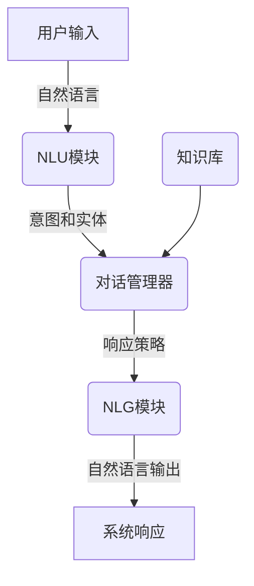

# 【大模型应用开发 动手做AI Agent】创建一个简短的虚构PPT

## 1. 背景介绍

### 1.1 问题的由来

在当今时代,人工智能(AI)已经渗透到我们生活的方方面面。大型语言模型(LLM)的出现,为构建智能对话系统提供了新的可能性。然而,如何利用这些先进技术开发实用的AI应用程序,仍然是一个巨大的挑战。

### 1.2 研究现状 

目前,已有一些公司和研究机构在探索如何将大型语言模型应用于构建智能对话系统。例如,OpenAI的ChatGPT和Anthropic的Claude等系统,都展示了LLM在自然语言处理和问答等任务中的卓越表现。但是,要将这些模型应用于实际场景,仍需要进一步的研究和开发工作。

### 1.3 研究意义

本文旨在探索如何利用大型语言模型构建一个简单的AI对话系统,即AI Agent。通过动手实践,我们可以更好地理解LLM的工作原理,并掌握将其应用于实际项目的技能。这不仅有助于推进AI技术的发展,也可以为各行业提供智能化解决方案。

### 1.4 本文结构

本文首先介绍AI Agent的核心概念和架构,然后详细阐述其算法原理和数学模型。接下来,我们将通过代码示例和实际应用场景,展示如何开发和部署AI Agent。最后,我们将探讨未来发展趋势和面临的挑战。

## 2. 核心概念与联系

AI Agent是一种智能对话系统,旨在与用户进行自然语言交互。它的核心是一个大型语言模型(LLM),能够理解和生成人类可读的文本。AI Agent通常包括以下几个核心组件:

1. **自然语言理解(NLU)模块**: 负责解析用户输入的自然语言,提取其中的意图和实体信息。
2. **对话管理器(DM)**: 根据NLU模块的输出和当前对话状态,决定系统的响应策略。
3. **自然语言生成(NLG)模块**: 将DM的决策转换为自然语言输出,以响应用户的查询或请求。
4. **知识库**: 存储系统所需的各种知识和数据,为对话提供信息支持。

这些组件通过有机结合,形成了一个完整的AI Agent系统。下图展示了AI Agent的典型架构:



## 3. 核心算法原理 & 具体操作步骤

### 3.1 算法原理概述

AI Agent的核心算法是基于大型语言模型(LLM)的序列到序列(Seq2Seq)模型。该模型将用户输入的自然语言序列作为输入,并生成相应的自然语言响应序列作为输出。

在训练过程中,LLM会学习到自然语言的语法和语义规则,以及各种领域的知识。通过大量的语料数据训练,模型可以捕捉到语言的深层次模式和关联关系。

在推理阶段,LLM会根据输入序列,生成一个概率分布,表示下一个token的可能性。然后,通过贪婪搜索或束搜索等策略,选择最可能的token序列作为输出。

### 3.2 算法步骤详解

AI Agent的核心算法可以分为以下几个主要步骤:

1. **输入编码**: 将用户输入的自然语言序列转换为模型可以理解的数字表示,通常使用词嵌入或子词嵌入等技术。

2. **模型推理**: 将编码后的输入序列输入到LLM中,模型会根据训练好的参数,计算出每个可能的输出token的概率分布。

3. **输出解码**: 根据概率分布,使用贪婪搜索或束搜索等策略,生成最可能的输出token序列。

4. **输出后处理**: 对生成的输出序列进行必要的后处理,如去除特殊标记、大小写调整等,得到最终的自然语言响应。

此外,在实际应用中,我们还需要考虑以下几个方面:

- **上下文管理**: 记录对话的历史上下文,以便模型能够理解当前输入的语境。
- **知识融合**: 将外部知识库的信息融合到模型的输出中,提高响应的准确性和信息量。
- **响应质量控制**: 通过设置阈值、过滤等策略,控制输出响应的质量和适当性。

### 3.3 算法优缺点

LLM驱动的AI Agent算法具有以下优点:

- 能够生成流畅、自然的语言响应,提供良好的用户体验。
- 具有较强的泛化能力,可以应对多种场景和话题。
- 通过持续学习,模型的性能可以不断提高。

但同时也存在一些缺点和挑战:

- 需要大量的计算资源和训练数据,成本较高。
- 存在一定的偏差和不确定性,输出可能不完全可靠。
- 缺乏对话的长期记忆和推理能力,难以维持长时间的连贯对话。

### 3.4 算法应用领域

基于LLM的AI Agent算法可以应用于多个领域,包括但不限于:

- **客户服务**: 构建智能客服系统,提供7*24小时的在线支持和问答服务。
- **教育辅助**: 开发智能教学助手,为学生提供个性化的学习指导和解答。
- **健康咨询**: 建立医疗问答系统,为用户提供专业的健康信息和建议。
- **商业分析**: 利用AI Agent进行数据分析和决策支持,提高企业的运营效率。

## 4. 数学模型和公式 & 详细讲解 & 举例说明

### 4.1 数学模型构建

AI Agent的核心是一个基于Transformer架构的大型语言模型(LLM)。该模型的数学表示可以概括为以下形式:

$$P(Y|X) = \prod_{t=1}^{T}P(y_t|y_{<t}, X;\theta)$$

其中:

- $X$表示输入序列,即用户的自然语言查询。
- $Y$表示输出序列,即模型生成的自然语言响应。
- $y_t$表示输出序列中的第$t$个token。
- $y_{<t}$表示输出序列中位于$t$之前的所有token。
- $\theta$表示模型的参数,通过训练学习得到。

该模型的目标是最大化条件概率$P(Y|X)$,即给定输入$X$,生成最可能的输出序列$Y$。

### 4.2 公式推导过程

为了计算条件概率$P(Y|X)$,我们可以将其分解为一系列token级别的条件概率的乘积:

$$\begin{aligned}
P(Y|X) &= P(y_1, y_2, \dots, y_T|X) \\
       &= \prod_{t=1}^{T}P(y_t|y_{<t}, X) \\
       &= \prod_{t=1}^{T}P(y_t|y_{<t}, X;\theta)
\end{aligned}$$

其中,最后一步是将模型参数$\theta$显式地引入到条件概率中。

在实际计算中,我们通常使用自注意力机制和前馈神经网络等模块,来建模上述条件概率分布。具体的计算过程可以参考Transformer模型的原始论文。

### 4.3 案例分析与讲解

假设用户输入了一个查询:"我想预订一间酒店房间,位于纽约市中心,入住时间是下周五到下周日。"我们来看看AI Agent是如何处理这个查询的。

首先,NLU模块会对输入进行分析,提取出以下关键信息:

- 意图: 预订酒店房间
- 实体:
    - 位置: 纽约市中心
    - 入住时间: 下周五到下周日

然后,对话管理器会根据这些信息,查询知识库中的可用酒店资源,并决定需要进一步询问用户的偏好(如价格范围、房型等)。

接下来,NLG模块会将对话管理器的决策转换为自然语言输出,例如:"好的,我明白您需要在下周五到下周日期间在纽约市中心预订酒店房间。请问您对房间价格有什么预期?是否有其他特殊要求?"

用户回复后,AI Agent会继续进行下一轮的对话,直到获取足够的信息完成预订流程。

在这个过程中,LLM会根据上下文和知识库信息,生成自然、流畅的语言响应,提供良好的用户体验。

### 4.4 常见问题解答

**Q: LLM如何处理上下文信息,以保持对话的连贯性?**

A: 通常采用一种叫做"prompt"的技术,将对话历史和当前查询拼接在一起作为LLM的输入。这样,模型就可以根据上下文信息生成相应的响应。

**Q: LLM是否能够理解和回答任何类型的查询?**

A: LLM的能力取决于它的训练数据和知识覆盖范围。对于一些特殊领域或复杂查询,可能需要进一步的微调或知识融合,以提高模型的表现。

**Q: 如何评估LLM生成响应的质量和准确性?**

A: 可以采用自动评估指标(如BLEU、ROUGE等)和人工评估相结合的方式。同时,也需要注意响应的一致性、多样性和适当性等因素。

## 5. 项目实践:代码实例和详细解释说明

### 5.1 开发环境搭建

要开发基于LLM的AI Agent应用,我们需要准备以下开发环境:

1. **Python**:主要的编程语言,版本建议使用3.7或更高。
2. **PyTorch**或**TensorFlow**:深度学习框架,用于构建和训练LLM模型。
3. **Transformers**库:提供了预训练的LLM模型和相关工具,如Hugging Face的Transformers库。
4. **NLTK**或**spaCy**:自然语言处理库,用于文本预处理和NLU任务。
5. **Flask**或**FastAPI**:Web框架,用于构建AI Agent的API接口。

此外,您还需要准备足够的GPU资源,以加速模型的训练和推理过程。

### 5.2 源代码详细实现

以下是一个基于Hugging Face Transformers库实现的简单AI Agent示例代码:

```python
from transformers import AutoModelForCausalLM, AutoTokenizer

# 加载预训练的LLM模型和tokenizer
model = AutoModelForCausalLM.from_pretrained("microsoft/DialoGPT-large")
tokenizer = AutoTokenizer.from_pretrained("microsoft/DialoGPT-large")

# 定义对话上下文
context = "Human: 你好,我想预订一间酒店房间。\nAssistant: 好的,请问您需要预订哪个城市的酒店?入住和离店日期是什么时候?\nHuman: 我想在纽约市中心预订,入住时间是下周五到下周日。\nAssistant:"

# 对输入进行编码
input_ids = tokenizer.encode(context, return_tensors="pt")

# 生成响应
output_ids = model.generate(input_ids, max_length=1024, pad_token_id=tokenizer.eos_token_id)

# 解码输出
response = tokenizer.decode(output_ids[0], skip_special_tokens=True)

print(response)
```

这段代码加载了一个预训练的对话模型DialoGPT,并基于给定的上下文生成了一个响应。让我们逐步解释一下关键步骤:

1. 使用`AutoModelForCausalLM`和`AutoTokenizer`从Hugging Face模型库中加载预训练的LLM模型和tokenizer。
2. 定义对话上下文`context`,包含之前的对话历史。
3. 使用tokenizer将上下文编码为模型可以理解的数字序列`input_ids`。
4. 调用模型的`generate`方法,传入`input_ids`,生成响应的token序列`output_ids`。
5. 使用tokenizer将`output_ids`解码为自然语言文本`response`。

通过这种方式,我们可以快速构建一个基于LLM的AI Agent原型,并进行进一步的功能扩展和优化。

### 5.3 代码解读与分析

在上面的示例代码中