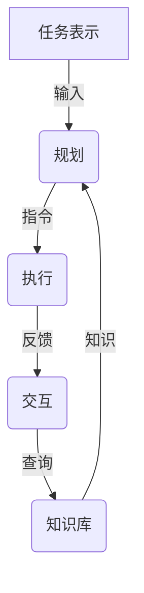

# 【大模型应用开发 动手做AI Agent】第三轮思考：模型完成任务

## 1. 背景介绍

### 1.1 问题的由来

在人工智能领域,大型语言模型已经取得了令人瞩目的成就,展现出惊人的语言理解和生成能力。然而,要真正实现智能化的人机交互,仅仅拥有强大的语言能力是不够的。我们需要一种能够完成特定任务的智能体,即AI Agent。

AI Agent需要具备以下几个关键能力:

1. **理解用户意图**:准确把握用户的需求和目标。
2. **获取相关知识**:从知识库中检索与任务相关的信息。
3. **规划行动路径**:制定合理的行动计划来完成任务。
4. **执行具体操作**:根据计划有条不紊地执行一系列操作。
5. **交互反馈**:与用户进行自然的对话交互,获取反馈并作出调整。

传统的任务导向型对话系统往往是基于规则或流程的,缺乏灵活性和通用性。而现有的大型语言模型虽然拥有强大的语言理解和生成能力,但仍然缺乏专门的任务完成能力。因此,如何赋予大型语言模型任务完成的能力,成为了一个亟待解决的重要问题。

### 1.2 研究现状  

目前,已有一些研究尝试赋予大型语言模型任务完成能力,主要有以下几种方法:

1. **指令精细化(Instruction Refinement)**: 通过对任务进行分解,将复杂任务分解为一系列简单指令,然后依次执行这些指令。这种方法的关键在于如何有效地对任务进行分解,并生成合理的指令序列。

2. **程序化思维(Program-Aided Instruction Following)**: 将任务表示为一个类似程序的形式,由模型根据这个程序化的表示来执行任务。这种方法的优点是结构清晰,但需要人工设计程序化的表示方式。

3. **交互式对话(Interactive Instruction Following)**: 模型与用户进行多轮对话交互,在交互过程中不断明确和完善任务目标,并根据用户反馈进行调整,最终完成任务。这种方法更接近真实场景,但对模型的理解和交互能力要求更高。

4. **强化学习(Reinforcement Learning)**: 将任务完成过程建模为强化学习问题,通过奖惩机制让模型逐步学习如何完成任务。这种方法的优点是无需人工设计任务表示,但需要大量的数据和计算资源进行训练。

5. **多模态融合(Multimodal Integration)**: 除了文本输入,还融合了图像、视频等多模态信息,使模型能够基于多种信息源完成任务。这种方法更贴近真实场景,但数据准备和模型设计都更加复杂。

这些方法各有优缺点,都在不同程度上推进了大型语言模型的任务完成能力。但总的来说,赋予大型语言模型通用的任务完成能力仍然是一个巨大的挑战,需要在模型架构、训练方法、数据构建等多个方面进行创新和突破。

### 1.3 研究意义

赋予大型语言模型通用的任务完成能力,对于推动人工智能的发展具有重大意义:

1. **拓展人机交互的应用场景**:智能化的任务型人机交互将极大拓展人工智能在生活、工作等各个领域的应用场景,为人类带来更多便利。

2. **验证人工智能的通用智能**:任务完成能力是通用智能的重要体现。赋予大型语言模型这种能力,将是人工智能通用智能研究取得重大进展的标志。

3. **推动人工智能理论与技术创新**:实现大型语言模型的任务完成能力,需要在模型架构、训练算法、知识表示等多个领域进行创新,必将推动人工智能理论和技术的发展。

4. **促进人工智能产业化应用**:具有任务完成能力的大型语言模型将为人工智能的产业化应用提供有力支撑,有望在智能助手、自动化办公等领域取得突破性应用。

5. **探索人类智能的本质**:通过研究赋予大型语言模型任务完成能力的方法,我们可以进一步探索人类智能的本质,为构建通用人工智能奠定理论基础。

总之,赋予大型语言模型任务完成能力是人工智能发展的必经之路,具有重大的理论意义和应用价值。

### 1.4 本文结构  

本文将围绕如何赋予大型语言模型任务完成能力这一主题,对相关理论和方法进行全面的介绍和分析。文章的主要结构如下:

1. **背景介绍**:阐述问题的由来、研究现状和意义,为后续内容做好铺垫。

2. **核心概念与联系**:介绍任务完成所需的关键概念,如任务表示、规划、执行等,并分析它们之间的联系。

3. **核心算法原理与具体操作步骤**:重点介绍几种赋予大型语言模型任务完成能力的核心算法,包括算法原理、具体步骤、优缺点和应用场景等。

4. **数学模型和公式详细讲解与举例说明**:对相关的数学模型进行形式化描述,并通过具体案例对公式推导过程进行讲解。

5. **项目实践:代码实例和详细解释说明**:提供一个完整的项目实践案例,包括开发环境搭建、源代码实现、代码解读和运行结果展示等。

6. **实际应用场景**:介绍赋予大型语言模型任务完成能力在智能助手、自动化办公等领域的实际应用,并对未来应用前景进行展望。

7. **工具和资源推荐**:为读者提供相关的学习资源、开发工具、论文推荐和其他有价值的资源。

8. **总结:未来发展趋势与挑战**:总结研究成果,展望未来发展趋势,并分析可能面临的挑战和研究方向。

9. **附录:常见问题与解答**:针对一些常见的问题,给出解答和说明。

通过对上述内容的全面阐述,读者能够全面深入地了解如何赋予大型语言模型任务完成能力的理论基础和实践方法,把握这一领域的发展脉络和未来趋势。

## 2. 核心概念与联系

要赋予大型语言模型任务完成能力,需要理解和掌握以下几个核心概念及其内在联系:

1. **任务表示(Task Representation)**
2. **规划(Planning)** 
3. **执行(Execution)**
4. **交互(Interaction)**
5. **知识库(Knowledge Base)**

### 2.1 任务表示

任务表示指的是如何将待完成的任务以机器可理解的形式表示出来,是赋予模型任务完成能力的基础。一个好的任务表示方式应该是结构清晰、语义明确、信息完整的。常见的任务表示方式包括:

1. **自然语言描述**:用自然语言对任务进行描述,如"预订一张从纽约到旧金山的机票"。这种方式直观简单,但可能存在歧义和信息缺失的问题。

2. **结构化表示**:使用一种结构化的形式来表示任务,如树状结构、图结构等。这种方式更加形式化和明确,但需要设计合适的表示语言。

3. **程序化表示**:将任务表示为一个类似程序的形式,如一系列指令序列。这种方式清晰简洁,但需要人工设计指令集。

不同的任务表示方式各有优缺点,在实际应用中需要根据任务的特点和模型的能力进行选择和设计。

### 2.2 规划

规划是根据任务表示生成行动计划的过程。一个好的规划算法应该能够生成高效、合理的行动路径,并具有一定的鲁棒性和可解释性。常见的规划算法包括:

1. **启发式搜索算法**:如A*算法、IDA*算法等,通过评估函数对搜索空间进行有效剪枝,以获得最优解。

2. **自动规划器**:如快速向下规划器(Fast Downward Planner)等,将规划问题建模为满足性问题,并使用启发式搜索等方法求解。

3. **强化学习规划**:将规划过程建模为强化学习问题,通过奖惩机制让模型学习生成最优行动路径。

4. **层次化规划**:将规划问题分解为多个层次,在不同层次上使用不同的规划算法,以提高效率和鲁棒性。

规划算法的选择需要考虑任务的复杂性、模型的能力以及对效率和可解释性的要求等多方面因素。

### 2.3 执行

执行是按照规划出的行动路径,依次执行具体的操作步骤,以完成任务的过程。执行环节需要解决以下几个关键问题:

1. **操作映射**:如何将抽象的行动转化为具体可执行的操作。
2. **前置条件检查**:在执行每个操作之前,检查其前置条件是否满足。
3. **异常处理**:如何检测和处理执行过程中可能出现的异常情况。
4. **并行执行**:是否可以并行执行多个操作,以提高效率。
5. **执行监控**:实时监控执行进度,并根据反馈进行调整。

执行环节的复杂程度取决于任务的性质和所使用的操作集的复杂性。对于简单的任务,执行可能只需要调用相应的API即可;而对于复杂任务,可能需要设计复杂的执行引擎。

### 2.4 交互

交互是指模型与用户之间的对话交互过程,用于明确任务目标、获取反馈并作出调整。良好的交互能力对于完成复杂任务至关重要,需要解决以下几个关键问题:

1. **意图识别**:准确识别用户的意图和需求。
2. **上下文理解**:理解对话的上下文,保持交互的连贯性。
3. **自然语言生成**:使用自然、流畅的语言与用户交互。
4. **交互策略**:制定合理的交互策略,决定什么时候需要与用户交互。
5. **反馈融合**:将用户反馈融合到任务执行过程中,对行动路径进行动态调整。

交互环节的复杂程度取决于任务的开放性和不确定性。对于高度结构化的任务,交互可能仅需要在关键节点获取用户确认;而对于开放性强的任务,则需要频繁的交互来不断明确和调整目标。

### 2.5 知识库

知识库是存储与任务相关的背景知识和规则的知识源,为规划和执行提供所需的信息支持。一个好的知识库应该具有以下特点:

1. **覆盖面广**:包含与各种任务相关的知识。
2. **结构合理**:知识以合理的形式组织和存储。
3. **高效访问**:能够快速检索和获取所需知识。
4. **持续学习**:能够不断吸收新的知识,与时俱进。

常见的知识库形式包括:

1. **结构化知识库**:如知识图谱、本体库等,使用结构化的形式存储知识。
2. **语料库**:以自然语言文本的形式存储知识,需要进行知识抽取。
3. **规则库**:存储一系列可执行的规则,用于推理和决策。
4. **embeddings空间**:将知识表示为高维向量,通过向量相似性获取相关知识。

知识库的构建和维护是一个巨大的挑战,需要大量的人力和资源投入。未来,知识库可能会向自主学习和自我进化的方向发展。

以上五个核心概念相互关联、环环相扣,共同构成了赋予大型语言模型任务完成能力的理论框架。任务表示是输入,为规划提供依据;规划生成行动路径,指导执行的具体步骤