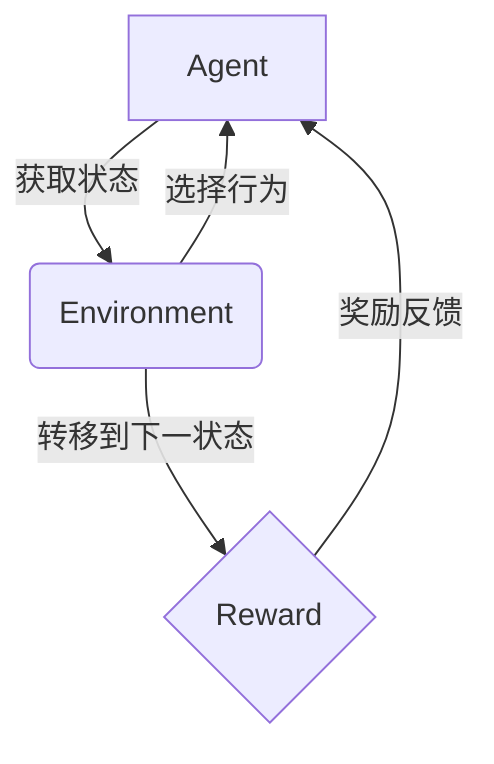

以下是《一切皆是映射：AI Q-learning在作物病虫害预防中的实践》这篇技术博客文章的正文内容：

# 一切皆是映射：AI Q-learning在作物病虫害预防中的实践

## 1. 背景介绍

### 1.1 问题的由来

农业是人类赖以生存的根本，确保农作物健康生长一直是农业生产中的核心问题。病虫害一直是威胁农作物生长的主要因素之一，其带来的损失每年高达数十亿美元。传统的防治方式主要依赖人工监测和化学农药，存在诸多弊端，如劳动力投入大、成本高昂、环境污染等。因此，寻求更加智能高效的病虫害防治方式迫在眉睫。

### 1.2 研究现状

近年来，随着人工智能技术的飞速发展，越来越多的智能化解决方案被应用于农业领域。其中，基于强化学习的智能病虫害防治技术备受关注。强化学习算法能够通过与环境的交互来学习最优策略，在无需事先标注数据的情况下自主获取知识,非常适合解决病虫害防治这一复杂决策问题。

Q-learning是强化学习中最成熟和广泛使用的算法之一。它通过估计状态-行为对的长期回报值,逐步更新并最终收敛到最优策略。已有研究将Q-learning应用于农场环境监测、施肥决策等农业任务中,取得了不错的效果。但将其应用于病虫害防治的研究还相对较少。

### 1.3 研究意义

本文将探讨如何将Q-learning算法应用于农作物病虫害的智能防治,旨在提供一种高效、环保、可持续的解决方案。具体来说,我们将建立数学模型并设计算法流程,通过模拟实践探索Q-learning在该领域的应用前景。研究成果有望为农业生产提供新的技术支撑,促进农业现代化和绿色发展。

### 1.4 本文结构  

本文将从以下几个方面展开:
1) 介绍Q-learning算法的核心概念与原理
2) 构建作物病虫害防治的数学模型,并推导相关公式
3) 设计Q-learning算法的具体实现步骤
4) 通过代码实例演示算法在模拟场景中的应用
5) 分析算法的实际应用场景及未来发展趋势
6) 总结研究成果,指出面临的挑战并展望未来

## 2. 核心概念与联系

Q-learning算法源于强化学习(Reinforcement Learning)范式。强化学习是机器学习的一个重要分支,旨在让智能体(Agent)通过与环境(Environment)的互动来学习获取最优策略,以maximizereward。

该范式的核心要素包括:

- 智能体(Agent)
- 环境(Environment) 
- 状态(State)
- 行为(Action)
- 奖励(Reward)

智能体与环境交互的过程如下:

1) 智能体获取当前环境状态
2) 根据当前状态选择一个行为
3) 环境根据这个行为转移到下一个状态
4) 环境给出对应的奖励反馈

智能体的目标是通过不断探索和利用,学习到一个最优的状态-行为映射策略,从而最大化获得的累积奖励。

Q-learning算法属于无模型(Model-free)的强化学习方法,不需要事先了解环境的状态转移规律,可以通过在线学习来逐步获取最优策略。

它维护一个Q函数(Q: State x Action -> R),用于估计在当前状态下执行某个行为可获得的长期累积奖励。通过不断更新Q函数,最终可以收敛到最优策略。

将Q-learning应用于病虫害防治,可将农场环境抽象为马尔可夫决策过程(MDP):

- 状态包括作物生长状况、病虫危害程度等
- 行为是防治措施的选择(如喷洒农药种类及浓度等)  
- 奖励与作物收益、防治成本等因素相关

智能体的目标是学习到一个状态-行为映射策略,在作物受到病虫危害时作出最佳的防治决策,从而获得最大的收益。

## 3. 核心算法原理 & 具体操作步骤

### 3.1 算法原理概述

Q-learning算法的核心思想是通过探索和利用的方式,不断更新Q函数的估计值,使之逐渐收敛到最优策略对应的真实Q值。

具体来说,算法会维护一个Q表(Q-table),其中的每个元素Q(s,a)表示在状态s下执行行为a可获得的长期累积奖励的估计值。

在每一个时刻t,智能体根据当前状态st和策略选择一个行为at,并观测到执行该行为后转移到新状态st+1且获得即时奖励rt。然后,根据这个转移过程更新Q(st,at)的估计值:

$$Q(s_t,a_t) \leftarrow Q(s_t,a_t) + \alpha[r_t + \gamma \max_a Q(s_{t+1},a) - Q(s_t,a_t)]$$

其中:
- $\alpha$是学习率,控制新知识的学习速度
- $\gamma$是折现因子,它使智能体更关注未来的长期回报  
- $\max_a Q(s_{t+1},a)$是执行任意行为后在新状态下可获得的最大预期累积奖励

通过不断探索和利用,逐步更新Q表中的所有状态-行为对的Q值估计,最终可以收敛到最优策略对应的真实Q函数。

在实际应用中,我们可以采用$\epsilon$-贪婪策略(epsilon-greedy policy)在探索和利用之间权衡:

- 以$\epsilon$的概率随机选择一个行为(探索)
- 以1-$\epsilon$的概率选择当前Q值最大的行为(利用)

探索有助于发现新的潜在最优策略,而利用则可以获取已知最优策略下的高回报。随着学习的进行,$\epsilon$值会逐渐减小,使算法趋向于利用已学习的经验。

### 3.2 算法步骤详解

Q-learning算法在病虫害防治任务中的具体步骤如下:

1. **初始化**
   - 构建Q表,所有Q(s,a)初值设为0或小的正数
   - 设置学习率$\alpha$、折现因子$\gamma$、探索率$\epsilon$等超参数
   - 获取初始状态s0

2. **循环**
   - 对当前状态st,根据$\epsilon$-贪婪策略选择行为at
     - 以$\epsilon$的概率随机选择一个行为(探索)
     - 以1-$\epsilon$的概率选择当前Q值最大的行为(利用): $a_t = \arg\max_a Q(s_t,a)$
   - 执行选择的行为at,观测到:
     - 环境转移到新状态st+1 
     - 获得即时奖励rt
   - 根据观测结果更新Q(st,at)的估计值:
     $$Q(s_t,a_t) \leftarrow Q(s_t,a_t) + \alpha[r_t + \gamma \max_a Q(s_{t+1},a) - Q(s_t,a_t)]$$
   - 将st+1设为新的当前状态,进入下一循环
   - 根据策略衰减函数逐步降低探索率$\epsilon$

3. **终止**
   - 当达到最大迭代次数或Q值收敛时,终止算法
   - 输出最终的Q表,其中最优策略对应的Q值最大

通过以上步骤,Q-learning算法可以在线学习到病虫害防治的最优策略,而无需了解环境的精确模型。

### 3.3 算法优缺点

**优点:**

1. **无需事先了解环境模型**,可以通过在线互动直接学习最优策略
2. **可处理连续、高维的状态和行为空间**,具有很强的通用性
3. **收敛性理论支持**,确保在满足一定条件下可以收敛到最优解
4. **易于理解和实现**,算法思路简单直观

**缺点:**

1. **收敛速度较慢**,需要大量的探索和迭代次数
2. **维数灾难**,当状态和行为空间过大时,Q表将变得非常庞大
3. **环境的随机性**可能导致Q值估计出现偏差
4. **超参数选择**对算法性能影响较大,需要一定调优经验

### 3.4 算法应用领域

除了病虫害防治外,Q-learning算法还可以应用于其他农业决策问题,如:

- 农田灌溉调度
- 施肥策略优化  
- 农机作业路径规划
- 农产品库存管理
- ......

此外,Q-learning作为强化学习的经典算法,在工业控制、机器人路径规划、游戏AI、网络通信等诸多领域都有广泛应用。

## 4. 数学模型和公式 & 详细讲解 & 举例说明

### 4.1 数学模型构建

为了将Q-learning算法应用于病虫害防治,我们需要首先构建相应的数学模型。

具体来说,可将农场环境抽象为一个马尔可夫决策过程(Markov Decision Process, MDP):

- 状态(State)s描述了农作物的生长状况、病虫危害程度等相关信息
- 行为(Action)a是可选择的防治措施,如喷洒不同种类和浓度的农药
- 转移概率P(s'|s,a)表示在状态s下执行行为a后,转移到新状态s'的概率
- 奖励函数R(s,a)定义了在状态s下执行行为a可获得的即时奖励

在该MDP模型中,智能体的目标是学习到一个最优策略$\pi^*(s)$,使得在任意初始状态s0下,按该策略执行时可获得的累积期望奖励最大:

$$\pi^* = \arg\max_\pi \mathbb{E}\left[\sum_{t=0}^\infty \gamma^t R(s_t,\pi(s_t))|s_0\right]$$

其中$\gamma \in [0,1)$是折现因子,用于权衡当前和未来奖励的重要性。

根据强化学习理论,存在一个值函数Q(s,a),表示在状态s下执行行为a,之后按最优策略执行可获得的累积期望奖励:

$$Q(s,a) = \mathbb{E}\left[R(s,a) + \gamma \max_{a'} Q(s',a')|s,a\right]$$

该方程被称为Bellman方程,Q-learning算法的目标就是通过迭代更新,求解出最优Q函数对应的Q*值。

### 4.2 公式推导过程

现在让我们来推导Q-learning算法的核心更新公式:

$$Q(s_t,a_t) \leftarrow Q(s_t,a_t) + \alpha[r_t + \gamma \max_a Q(s_{t+1},a) - Q(s_t,a_t)]$$

首先,根据Bellman方程:

$$\begin{aligned}
Q(s_t,a_t) &= \mathbb{E}[R(s_t,a_t) + \gamma \max_{a'} Q(s_{t+1},a')|s_t,a_t] \\
           &= R(s_t,a_t) + \gamma \max_{a'} \mathbb{E}[Q(s_{t+1},a')|s_t,a_t]
\end{aligned}$$

由于我们无法获知环境的精确模型,因此无法计算$\mathbb{E}[Q(s_{t+1},a')]$的期望值。但我们可以用一个样本$r_t + \gamma \max_a Q(s_{t+1},a)$来估计它。

所以有:

$$Q(s_t,a_t) \approx R(s_t,a_t) + \gamma \max_a Q(s_{t+1},a)$$

我们的目标是使Q(s,a)的估计值逐步接近其真实值,可采用下面的更新规则:

$$Q(s_t,a_t) \leftarrow Q(s_t,a_t) + \alpha[R(s_t,a_t) + \gamma \max_a Q(s_{t+1},a) - Q(s_t,a_t)]$$

其中$\alpha$是学习率,控制了新知识的学习速度。当$\alpha=0$时,Q值不会更新;当$\alpha=1$时,只利用