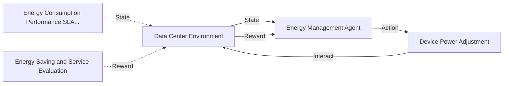

# 一切皆是映射：AI Q-learning在数据中心能源管理的锐利工具

关键词：Q-learning, 强化学习, 数据中心, 能源管理, 智能优化

## 1. 背景介绍
### 1.1  问题的由来
随着云计算、大数据、人工智能等新兴技术的快速发展,数据中心作为支撑这些技术的基础设施,其规模和能耗也在不断增长。据统计,全球数据中心能耗已占到全球总用电量的2%左右,预计到2030年这一比例将上升到8%。面对日益增长的能耗压力,如何实现数据中心的绿色节能已成为业界亟需解决的重要课题。

### 1.2  研究现状
目前,针对数据中心能源管理的研究主要集中在硬件设施优化、资源调度策略、能耗模型构建等方面。其中,基于人工智能的能源管理方法因其强大的学习优化能力和灵活的适应性,正受到学术界和工业界的广泛关注。强化学习作为一种无需预先建模、可通过试错实现策略自学习的AI方法,为解决数据中心能源管理这一复杂场景下的优化问题提供了新思路。

### 1.3  研究意义
将强化学习应用于数据中心能源管理,一方面可充分利用数据中心海量运行数据,通过机器学习不断挖掘设备间的内在联系和调控规律,另一方面可根据环境的动态变化实时调整优化策略,从而实现数据中心能耗的动态精准控制。这不仅可有效降低数据中心PUE,助力其绿色节能发展,更为探索通用的能源系统智能优化范式提供了有益参考。

### 1.4  本文结构
本文将重点介绍将Q-learning这一经典强化学习算法应用于数据中心能源管理的相关工作。第2节介绍Q-learning的核心概念和基本原理;第3节详细阐述将Q-learning用于能源管理的算法流程;第4节给出Q-learning能源优化的数学模型和关键公式;第5节通过示例代码演示Q-learning在数据中心环境中的具体实现;第6节讨论Q-learning在数据中心能源管理中的实际应用场景;第7节推荐Q-learning相关的学习资源和开发工具;第8节对全文进行总结并探讨未来的研究方向;第9节列举Q-learning能源优化的常见问题解答。

## 2. 核心概念与联系
Q-learning是一种无模型(model-free)的离线策略强化学习算法。与监督学习和非监督学习不同,强化学习是一种试错式学习,通过智能体(agent)与环境的交互,根据环境的反馈不断调整策略,最终学习到最优行为策略。

在强化学习的框架下,agent通过采取action与environment产生交互,environment根据action的执行结果向agent反馈reward和下一时刻的state。agent的目标是学习一个最优策略函数π,使得在该策略下行动可获得的累积reward最大化。Q-learning算法通过学习状态-动作值函数Q(s,a)来无需预先建模地逼近最优策略π。

将Q-learning应用于数据中心能源管理时,可将数据中心物理环境和IT设备运行状态视为environment,将能源管理系统视为agent,将各设备的功率调整视为action,将能耗、性能、环境参数等视为state,将节能减排效果和服务水平评价视为reward,如此即可建立起数据中心能源管理的强化学习优化闭环。下图展示了Q-learning在数据中心能源管理场景下的基本概念联系:

## 3. 核心算法原理 & 具体操作步骤
### 3.1  算法原理概述
Q-learning算法的核心是学习状态-动作值函数Q(s,a),Q(s,a)表示在状态s下采取动作a可获得的期望累积reward。Q(s,a)的更新遵循贝尔曼方程:

$Q(s_t,a_t) \leftarrow Q(s_t,a_t)+\alpha [r_{t+1}+\gamma \max _{a}Q(s_{t+1},a)-Q(s_t,a_t)]$

其中,s_t和a_t分别表示t时刻的状态和动作,r_{t+1}表示执行动作后环境返回的即时奖励,α为学习率,γ为折扣因子。该更新公式的含义是,Q(s,a)应该向 "即时奖励+下一状态的最大Q值"逼近,学习率α控制逼近的速度,折扣因子γ平衡即时奖励和未来奖励的相对重要性。

### 3.2  算法步骤详解
Q-learning的具体算法步骤如下:

1. 初始化Q(s,a),对所有s∈S,a∈A,任意初始化Q(s,a)
2. 初始化状态s
3. 重复以下步骤直到收敛:
    1) 在状态s下,基于ϵ-greedy策略选择动作a,即以1-ϵ的概率选择Q(s,a)最大的动作,以ϵ的概率随机选择动作
    2) 执行动作a,观察环境反馈的奖励r和下一状态s'
    3) 根据贝尔曼方程更新Q(s,a)
    4) s←s'
4. 返回Q(s,a)

其中,ϵ-greedy策略在探索(exploration)和利用(exploitation)之间进行权衡,以一定概率ϵ随机选择动作可避免算法过早收敛于局部最优。随着训练的进行,ϵ可逐渐减小,使得算法在后期更专注于对已有知识的利用。

### 3.3  算法优缺点
Q-learning算法的主要优点包括:
- 无需预先建立环境模型,通过试错学习逼近最优策略
- 通过值函数逼近和ϵ-greedy平衡探索利用,可收敛至全局最优
- 采用离线更新,数据利用效率高,训练稳定性好

Q-learning算法的主要缺点包括:
- 难以处理连续状态和动作空间
- 容易受奖励稀疏性问题的影响,学习效率较低
- 难以应对非平稳环境,泛化能力较弱

### 3.4  算法应用领域
Q-learning在众多领域得到了广泛应用,如:
- 游戏AI:国际象棋、围棋、雅达利游戏等
- 机器人控制:自动驾驶、机械臂操作等  
- 网络优化:流量调度、缓存策略等
- 推荐系统:个性化推荐、广告投放等
- 智能电网:需求响应、能源存储管理等

将Q-learning应用于数据中心能源管理,可充分利用其数据驱动、自适应学习的优势,实现设备能耗的动态优化调控。

## 4. 数学模型和公式 & 详细讲解 & 举例说明
### 4.1  数学模型构建
为应用Q-learning优化数据中心能源管理,首先需建立如下数学模型:

1. 状态空间S:数据中心所有设备的能耗、性能、环境参数等构成一个多维状态向量,每个状态s∈S表示数据中心某一时刻的整体运行状态。

2. 动作空间A:每台设备的功率调整幅度构成一个多维动作向量,每个动作a∈A表示对数据中心设备功率的一次整体调控。

3. 奖励函数R(s,a):将动作a在状态s下的能源优化效果量化为一个标量奖励值r,可使用如下奖励函数:

$$R(s,a)=\omega_1 \frac{E_0-E(s,a)}{E_0}+\omega_2 \frac{perf(s,a)-perf_0}{perf_0}$$

其中,E_0和E(s,a)分别表示优化前后的能耗,perf_0和perf(s,a)分别表示优化前后的性能,ω_1和ω_2为平衡能耗和性能的权重系数。该奖励函数的含义是,在满足性能约束的前提下,能耗每降低1%,奖励增加ω_1,性能每提升1%,奖励增加ω_2。

4. 折扣因子γ:平衡当前奖励和未来奖励的相对重要性,γ∈[0,1]。γ越大,表示对未来奖励的重视程度越高。

### 4.2  公式推导过程
根据上述数学模型,数据中心能源管理问题可形式化为如下Q-learning优化问题:

$$\begin{aligned}
\max \limits_{\pi} \quad & E_{s_0 \sim \rho_0,a_t \sim \pi} [\sum_{t=0}^{\infty} \gamma^t R(s_t,a_t)]\\
s.t. \quad 
& Q(s_t,a_t) \leftarrow Q(s_t,a_t)+\alpha [r_{t+1}+\gamma \max _{a}Q(s_{t+1},a)-Q(s_t,a_t)]\\
& a_t=\arg \max_{a} Q(s_t,a), \text{with probability} \  1-\epsilon \\
& a_t= \text{random action}, \text{with probability} \  \epsilon
\end{aligned}$$

其中,ρ_0为初始状态分布,π为能源管理策略。该优化问题的目标是最大化能源管理策略在初始状态分布下的期望累积折扣奖励,约束条件包括Q值函数的更新公式和ϵ-greedy动作选择策略。求解该优化问题的过程即Q-learning算法在数据中心能源管理场景下的训练过程。

### 4.3  案例分析与讲解
下面我们以一个简单的数据中心能源管理案例来说明Q-learning的工作原理。假设数据中心只有1台服务器和1台制冷设备,状态空间S为两个设备的能耗值(P_server, P_cooling),动作空间A为两个设备的功率调整值(ΔP_server, ΔP_cooling),奖励函数R(s,a)如4.1节所述。

在训练开始时,Q值函数被初始化为0。在每个控制周期,能源管理系统根据当前状态和ϵ-greedy策略选择一个功率调整动作,并观察执行动作后环境返回的能耗变化和性能变化,由此计算得到即时奖励r。然后,根据r和下一状态的最大Q值,对当前状态-动作对的Q值进行更新。不断重复这一过程,Q值函数将逐渐收敛,最终得到的贪婪策略π(s)=argmax_a Q(s,a)即为最优的能源管理策略。

例如,假设当前状态s_t=(300W, 200W),如果此时选择动作a_t=(-20W, +10W),即将服务器功率下调20W,制冷功率上调10W,执行后环境返回新的状态s_{t+1}=(280W, 210W),能耗下降10W,性能下降1%,代入奖励函数(ω_1=1, ω_2=0.5)得到即时奖励r_{t+1}=0.1-0.005=0.095。再假设下一状态的最大Q值为0.5,代入Q值更新公式(α=0.1, γ=0.9)得到:

$$Q(s_t,a_t) \leftarrow Q(s_t,a_t)+0.1 \times [0.095+0.9 \times 0.5-Q(s_t,a_t)]=0.1 \times [0.545-Q(s_t,a_t)]$$

通过这样的Q值更新,Q-learning算法可逐步学习到最优的状态-动作值函数,进而得到最优能源管理策略。

### 4.4  常见问题解答
**Q1:Q-learning能否处理连续的状态和动作空间?**

A1:传统的Q-learning算法只能处理离散的状态和动作空间,对于连续空间问题,可使用函数逼近的方法将Q值函数参数化,如线性逼近、神经网络逼近等,将Q-learning扩展为DQN(Deep Q-Network)算法。

**Q2:如何降低Q-learning的数据需求和计算复杂度?**

A2:可采取如下措施:1)通过特征工程降低状态和动作空间的维度;2