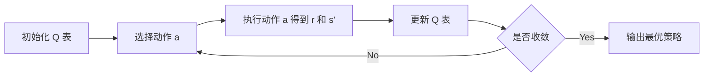

# 一切皆是映射：AI Q-learning在机器人领域的创新

关键词：Q-learning, 机器人, 人工智能, 强化学习, 决策, 自主学习

## 1. 背景介绍
### 1.1 问题的由来
随着人工智能技术的快速发展,机器人领域也迎来了前所未有的机遇和挑战。传统的机器人控制方法已经难以满足日益复杂的任务需求,急需一种更加智能、灵活的控制策略。强化学习作为人工智能的重要分支,为机器人的自主决策和适应性学习提供了新的思路。其中,Q-learning 作为一种经典的强化学习算法,以其简洁高效的特点在机器人领域得到了广泛关注和应用。

### 1.2 研究现状
目前,国内外学者已经在 Q-learning 算法在机器人领域的应用进行了大量研究。Watkins 等人最早提出了 Q-learning 算法的基本原理和实现框架。此后,不断有学者对算法进行改进和扩展,如 Littman 提出的 Minimax-Q 算法,Sutton 等人提出的 SARSA 算法等。在机器人应用方面,Gaskett 等人利用 Q-learning 实现了机器人自主避障,Bakker 等人将其用于机器人足球等。国内学者如周志华、朱松纯等也在 Q-learning 的理论和应用方面做出了重要贡献。

### 1.3 研究意义
将 Q-learning 引入机器人控制,可以让机器人通过自主学习和探索获得最优决策策略,而无需人工设计复杂的控制规则。这大大提高了机器人的智能化水平和环境适应能力,为实现机器人的自主性和通用性奠定了基础。同时,Q-learning 作为一种模型无关的学习方法,不需要预先建立系统模型,因此具有很强的鲁棒性,可以应对动态未知的环境。深入研究 Q-learning 在机器人领域的应用,对于推动机器人智能化发展具有重要意义。

### 1.4 本文结构
本文将从以下几个方面对 Q-learning 算法在机器人领域的应用进行探讨:
- 介绍 Q-learning 的基本概念和数学原理
- 详细讲解 Q-learning 算法的关键步骤和实现细节 
- 构建 Q-learning 的数学模型并推导相关公式
- 结合代码实例对 Q-learning 算法进行说明
- 分析 Q-learning 在机器人领域的典型应用场景
- 总结 Q-learning 的研究现状和未来发展趋势
- 讨论 Q-learning 在实际应用中面临的挑战和对策

## 2. 核心概念与联系
Q-learning 是一种无模型的离散时间差分学习算法,属于强化学习范畴。其核心思想是:智能体(agent)通过不断与环境(environment)进行交互,根据观察到的状态(state)采取动作(action),并获得相应的奖励(reward)。通过学习状态-动作值函数 Q(s,a),智能体可以逐步学习到最优策略(optimal policy)。

Q-learning 涉及到几个关键概念:
- 状态(State):表示智能体所处的环境状态,通常用向量表示。
- 动作(Action):表示智能体在某状态下可以采取的动作,通常用有限集合表示。
- 奖励(Reward):表示智能体执行动作后,环境给出的即时反馈,可正可负。
- 策略(Policy):根据当前状态选择动作的映射,用 π 表示。
- 价值函数(Value Function):表示状态或状态-动作对的长期累积奖励期望,分为状态价值函数 V(s) 和动作价值函数 Q(s,a)。

在 Q-learning 中,我们的目标是学习最优的动作价值函数 Q*(s,a),使得在每个状态下选择具有最大 Q 值的动作,就可以获得最优策略。Q 函数的更新遵循贝尔曼最优方程(Bellman Optimality Equation):

$$Q(s_t,a_t) \leftarrow Q(s_t,a_t)+\alpha[r_{t+1}+\gamma \max_a Q(s_{t+1},a)-Q(s_t,a_t)]$$

其中,s_t 和 a_t 分别表示 t 时刻的状态和动作,r_{t+1} 表示执行动作后获得的奖励。α 为学习率,γ 为折扣因子。max 项表示下一状态的最大 Q 值,体现了 Q-learning 的异策略(off-policy)特性。

Q-learning 通过不断更新 Q 表来逼近最优 Q 函数,整个过程可以用下面的 Mermaid 流程图表示:

## 3. 核心算法原理 & 具体操作步骤
### 3.1 算法原理概述
Q-learning 的核心是通过不断更新动作价值函数 Q(s,a) 来逼近最优策略。算法主要分为两个阶段:
1. 探索阶段:智能体采取随机策略,通过与环境交互收集状态转移和奖励信息,更新 Q 表。
2. 利用阶段:智能体根据学到的 Q 表,采取 贪婪策略,选择具有最大 Q 值的动作。

算法的关键是 Q 表的更新,遵循时间差分学习的思想。每次状态转移,根据观测到的奖励和下一状态的最大 Q 值,对当前状态-动作对的 Q 值进行更新,使其逐步收敛到最优值。

### 3.2 算法步骤详解
Q-learning 算法可以分为以下几个关键步骤:

1. 初始化 Q 表:对每个状态-动作对初始化为 0 或随机值。
2. 状态初始化:智能体处于初始状态 s。
3. 动作选择:根据当前状态 s,按照 ε-贪婪策略选择动作 a。即以 ε 的概率随机选择动作,否则选择具有最大 Q 值的动作。
4. 执行动作:执行动作 a,观测到奖励 r 和下一状态 s'。 
5. 更新 Q 表:根据观测值 (s,a,r,s') 更新 Q 表,即:
$$Q(s,a) \leftarrow Q(s,a)+\alpha[r+\gamma \max_{a'}Q(s',a')-Q(s,a)]$$
6. 状态转移:s ← s'。
7. 重复步骤 3-6,直到达到终止状态或满足收敛条件。

其中,ε-贪婪策略可以平衡探索和利用,ε 的取值可以随时间衰减以逐步减少探索。此外,可以引入经验回放(experience replay)机制,将观测到的转移样本 (s,a,r,s') 存入回放缓冲区,并从中随机抽取小批量样本进行训练,提高样本利用效率和训练稳定性。

### 3.3 算法优缺点
Q-learning 算法的主要优点包括:
- 简单易实现,计算效率高。
- 可以在模型未知的情况下进行学习,具有较强的适应性。
- 通过异策略学习,可以学习到比当前策略更优的策略。
- 具有很好的收敛性,在一定条件下可以收敛到最优策略。

但 Q-learning 也存在一些局限性:
- 对于状态和动作空间很大的问题,Q 表难以存储和更新。需要引入函数近似等方法。
- 样本利用率低,难以处理非平稳环境。可以引入经验回放等机制缓解。
- 对奖励函数比较敏感,奖励设计不当会影响学习效果。
- 在连续状态和动作空间上难以直接应用,需要进行离散化。

### 3.4 算法应用领域
Q-learning 在机器人领域有广泛的应用,主要包括:
- 机器人运动规划与控制:如自主导航、避障、抓取等。
- 机器人决策与任务规划:如多机器人协作、任务分配等。
- 机器人技能学习:如行为模仿、运动技能学习等。
- 智能体控制:如游戏 AI、自动驾驶、智能调度等。

此外,Q-learning 还可以与深度学习结合,形成 DQN(Deep Q Network)等强大的端到端学习范式,进一步拓展其应用范围。

## 4. 数学模型和公式 & 详细讲解 & 举例说明
### 4.1 数学模型构建
为了对 Q-learning 算法进行数学建模,我们首先引入马尔可夫决策过程(MDP)的概念。一个 MDP 由以下元组定义:

$$\mathcal{M}=\langle\mathcal{S},\mathcal{A},\mathcal{P},\mathcal{R},\gamma\rangle$$

其中:
- $\mathcal{S}$ 表示有限的状态集合。 
- $\mathcal{A}$ 表示有限的动作集合。
- $\mathcal{P}$ 表示状态转移概率矩阵,$\mathcal{P}_{ss'}^a=P(s'|s,a)$ 表示在状态 s 下执行动作 a 后转移到状态 s' 的概率。
- $\mathcal{R}$ 表示奖励函数,$\mathcal{R}_s^a=E[r|s,a]$ 表示在状态 s 下执行动作 a 的期望奖励。
- $\gamma\in[0,1]$ 表示折扣因子,用于平衡即时奖励和长期奖励。

MDP 的目标是寻找一个最优策略 $\pi^*(s)$,使得从任意状态 s 出发,采取该策略能获得最大的期望累积奖励。即:

$$\pi^*=\arg\max_{\pi}E[\sum_{t=0}^{\infty}\gamma^tr_t|\pi]$$

其中,r_t 表示 t 时刻获得的奖励。

在 Q-learning 中,我们定义动作价值函数 $Q^{\pi}(s,a)$ 表示在状态 s 下采取动作 a,并在之后都遵循策略 $\pi$ 的期望累积奖励:

$$Q^{\pi}(s,a)=E[\sum_{t=0}^{\infty}\gamma^tr_t|s_0=s,a_0=a,\pi]$$

最优动作价值函数 $Q^*(s,a)$ 满足贝尔曼最优方程:

$$Q^*(s,a)=\mathcal{R}_s^a+\gamma\sum_{s'\in\mathcal{S}}\mathcal{P}_{ss'}^a\max_{a'\in\mathcal{A}}Q^*(s',a')$$

Q-learning 的目标就是通过不断的探索和更新,逼近最优 Q 函数 $Q^*$。

### 4.2 公式推导过程
Q-learning 的核心是价值函数的更新公式。我们可以从贝尔曼最优方程出发进行推导。

根据贝尔曼最优方程,我们有:

$$Q^*(s,a)=\mathcal{R}_s^a+\gamma\sum_{s'\in\mathcal{S}}\mathcal{P}_{ss'}^a\max_{a'\in\mathcal{A}}Q^*(s',a')$$

由于 $\mathcal{P}_{ss'}^a$ 和 $\mathcal{R}_s^a$ 未知,我们可以用蒙特卡洛估计来近似:

$$Q(s,a) \leftarrow Q(s,a)+\alpha[r+\gamma \max_{a'\in\mathcal{A}}Q(s',a')-Q(s,a)]$$

其中,r 是执行动作 a 后观测到的即时奖励,s' 是观测到的下一状态。$\alpha\in(0,1]$ 为学习率,控制更新步长。

这就是 Q-learning 的核心更新公式。可以看到,它只利用了观测到的转移样本 (s,a,r,s'),而不需要知道状态转移概率和期望奖励。通过不断地采样和更新,Q 函数最终会收敛到最优值 $Q^*$。

### 4.3 案例分析与讲解
下面我们以一个简单的迷宫寻路问题为例,说明 Q-learning 算法的具体应用。

假设一个机器人在如下所示的 3x4 网格迷