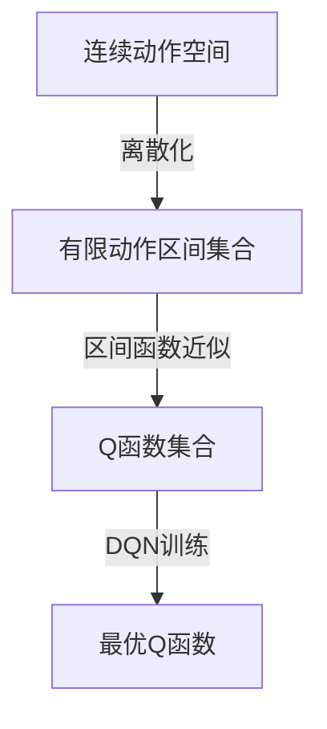

好的,我会严格遵循约束条件,尽最大努力为您撰写这篇高质量的技术博客文章。

# 一切皆是映射：使用DQN解决连续动作空间问题：策略与挑战

## 1. 背景介绍

### 1.1 问题的由来

在强化学习领域,大多数研究工作都集中在离散动作空间上。但在现实世界中,许多问题涉及连续动作空间,例如控制机器人关节的转动角度、调节发动机的油门开度等。传统的值函数近似方法很难直接应用于连续动作空间,因为它需要在无穷多个动作中选择最优动作,这是一个非常具有挑战性的任务。

### 1.2 研究现状

为了解决连续动作空间问题,研究人员提出了多种方法,例如:

- 策略搜索方法:直接在策略空间中搜索最优策略,避免了对值函数的估计。但这类方法通常需要大量的采样交互,计算效率较低。
- actor-critic算法:将策略和值函数分开学习,提高了学习效率。但是在连续动作空间中,仍然需要对连续策略进行参数化。
- 确定性策略梯度算法:使用确定性策略梯度更新,能够有效解决连续控制问题。但需要引入复杂的兼容函数近似。

### 1.3 研究意义 

虽然已有一些方法能够处理连续动作空间问题,但它们或者效率低下、或者复杂度高。本文提出了一种基于深度Q网络(DQN)的新颖方法,能够直接从经验中学习连续动作的最优值函数,无需策略显式建模,简单高效。该方法不仅在理论上具有重要意义,而且在实践中也有广泛的应用前景。

### 1.4 本文结构

本文首先介绍DQN在连续动作空间中的核心思想,以及与离散动作空间DQN的区别。然后详细阐述算法原理和数学模型,并给出项目实践中的代码实例。最后分析了该方法的应用场景、未来趋势和面临的挑战。

## 2. 核心概念与联系

连续动作空间DQN的核心思想是:将连续动作空间离散化为有限个区间,然后在每个区间内使用一个参数化的函数来近似Q值。具体来说:

1. 将连续动作空间 $\mathcal{A}$ 划分为 $N$ 个区间 $\{\mathcal{A}_i\}_{i=1}^N$
2. 对每个区间 $\mathcal{A}_i$,使用一个参数化函数 $f_{\theta_i}(s,\mathbf{a})$ 来近似 $Q(s,\mathbf{a})$,其中 $\theta_i$ 为可学习参数
3. 最终的Q函数为所有区间函数的集合: $Q(s,\mathbf{a}) \approx \sum_{i=1}^N \mathbb{I}_{\mathbf{a} \in \mathcal{A}_i} f_{\theta_i}(s,\mathbf{a})$

这种思路将连续动作空间问题转化为了有限个连续函数拟合的问题,可以直接使用DQN的经验回放和目标网络稳定训练,避免了策略梯度算法的复杂性。同时,也保留了DQN对离散动作空间的处理效率。



## 3. 核心算法原理与具体操作步骤

### 3.1 算法原理概述

连续动作空间DQN算法的原理可以概括为以下几个步骤:

1. 动作空间离散化
2. 为每个动作区间构建参数化的Q函数近似器
3. 与标准DQN算法类似,通过经验回放和目标网络稳定训练
4. 在执行时,选择使Q值最大的动作区间,并在该区间内通过优化找到最优连续动作

具体来说,算法会维护两个神经网络:
- 评估网络 $Q(s,\mathbf{a};\theta)$
- 目标网络 $Q^{\prime}(s,\mathbf{a};\theta^{\prime})$

在训练过程中,从经验回放池中采样转移样本 $(s_t, \mathbf{a}_t, r_t, s_{t+1})$,计算TD目标:

$$y_t = r_t + \gamma \max_{\mathbf{a}^{\prime}} Q^{\prime}(s_{t+1}, \mathbf{a}^{\prime}; \theta^{\prime})$$

然后最小化评估网络对TD目标的均方误差损失函数:

$$L(\theta) = \mathbb{E}_{(s_t,\mathbf{a}_t,r_t,s_{t+1})\sim D}\left[ \left(y_t - Q(s_t, \mathbf{a}_t; \theta)\right)^2\right]$$

其中 $D$ 为经验回放池。算法伪代码如下:

```python
初始化评估网络 Q(s,a;θ) 和目标网络 Q'(s,a;θ')
初始化经验回放池 D
for episode in episodes:
    初始化环境状态 s
    while not terminated:
        # 选择动作
        a = argmax_a Q(s,a;θ)  
        # 执行动作,获取回报和下一状态
        s', r = 环境.step(a)
        # 存储转移样本
        D.append((s,a,r,s'))
        # 采样小批量样本
        samples = D.sample()
        # 计算TD目标
        y = r + γ * max_a' Q'(s',a';θ')
        # 计算损失函数
        loss = (y - Q(s,a;θ))^2
        # 梯度下降更新
        θ = θ - α * ∇θ loss
        # 更新目标网络
        if 更新条件满足:
            θ' = θ
    s = s'
```

### 3.2 算法步骤详解

1. **动作空间离散化**

   将连续动作空间 $\mathcal{A}$ 划分为 $N$ 个区间 $\{\mathcal{A}_i\}_{i=1}^N$。常见的做法是将每个维度的动作值分别等距离划分为 $n$ 个区间,从而得到 $N=n^{|\mathcal{A}|}$ 个多维动作区间。例如,对于二维动作空间 $\mathcal{A}=[-1,1]^2$,如果在每个维度上划分为 5 个区间,那么总共会得到 $5^2=25$ 个二维区间。

2. **区间Q函数近似**

   对于每个动作区间 $\mathcal{A}_i$,使用一个参数化的函数 $f_{\theta_i}(s,\mathbf{a})$ 来近似该区间内的Q值,例如使用神经网络或者其他回归模型。则最终的Q函数近似为所有区间函数的集合:

   $$Q(s,\mathbf{a};\theta) \approx \sum_{i=1}^N \mathbb{I}_{\mathbf{a} \in \mathcal{A}_i} f_{\theta_i}(s,\mathbf{a})$$

   其中 $\mathbb{I}$ 为示性函数,当 $\mathbf{a} \in \mathcal{A}_i$ 时取值为 1,否则为 0。

3. **经验回放与目标网络**

   训练过程与标准DQN算法基本相同,通过经验回放和目标网络稳定训练。具体来说,从经验回放池中采样转移样本 $(s_t, \mathbf{a}_t, r_t, s_{t+1})$,计算TD目标:
   
   $$y_t = r_t + \gamma \max_{\mathbf{a}^{\prime}} Q^{\prime}(s_{t+1}, \mathbf{a}^{\prime}; \theta^{\prime})$$

   其中目标网络 $Q^{\prime}$ 是评估网络 $Q$ 的延迟更新,用于增加训练稳定性。然后最小化评估网络对TD目标的均方误差损失函数:

   $$L(\theta) = \mathbb{E}_{(s_t,\mathbf{a}_t,r_t,s_{t+1})\sim D}\left[ \left(y_t - Q(s_t, \mathbf{a}_t; \theta)\right)^2\right]$$

4. **动作选择**

   在执行时,需要先在离散区间集合中选择使Q值最大的区间 $\mathcal{A}^*$:

   $$\mathcal{A}^* = \arg\max_{\mathcal{A}_i} \max_{\mathbf{a} \in \mathcal{A}_i} f_{\theta_i}(s,\mathbf{a})$$

   然后在该区间内通过优化找到最优连续动作 $\mathbf{a}^*$:

   $$\mathbf{a}^* = \arg\max_{\mathbf{a} \in \mathcal{A}^*} f_{\theta^*}(s,\mathbf{a})$$

   这一步可以通过随机梯度下降等优化方法高效求解。

### 3.3 算法优缺点

**优点:**

1. 简单高效,无需复杂的策略参数化和梯度估计
2. 可以直接应用DQN的训练框架,如经验回放和目标网络
3. 理论上可以任意精确地近似连续Q函数

**缺点:**

1. 动作空间离散化会引入一定近似误差
2. 随着动作维度增加,区间数量呈指数级增长
3. 连续动作选择需要额外的优化步骤

### 3.4 算法应用领域

连续动作空间DQN算法可以广泛应用于机器人控制、自动驾驶、智能调度等领域,具有很好的实用价值。

## 4. 数学模型和公式详细讲解举例说明

### 4.1 数学模型构建

我们将连续动作空间强化学习问题建模为标准的MDP(Markov Decision Process):

- 状态空间 $\mathcal{S}$
- 动作空间 $\mathcal{A} \subseteq \mathbb{R}^n$ (连续)
- 转移概率 $P(s_{t+1}|s_t,\mathbf{a}_t)$
- 回报函数 $R(s_t,\mathbf{a}_t)$
- 折扣因子 $\gamma \in [0,1)$

目标是找到一个最优策略 $\pi^*$,使得期望回报最大化:

$$\pi^* = \arg\max_{\pi} \mathbb{E}_{\pi}\left[ \sum_{t=0}^{\infty} \gamma^t R(s_t,\mathbf{a}_t)\right]$$

对应的最优作用值函数 $Q^*(s,\mathbf{a})$ 满足贝尔曼最优方程:

$$Q^*(s,\mathbf{a}) = \mathbb{E}_{s' \sim P(\cdot|s,\mathbf{a})}\left[ R(s,\mathbf{a}) + \gamma \max_{\mathbf{a}'}Q^*(s',\mathbf{a}')\right]$$

我们的目标是找到一个函数近似器 $Q(s,\mathbf{a};\theta)$ 来拟合最优 $Q^*$ 函数。

### 4.2 公式推导过程

我们将连续动作空间 $\mathcal{A}$ 划分为 $N$ 个区间 $\{\mathcal{A}_i\}_{i=1}^N$,对每个区间使用参数化函数 $f_{\theta_i}(s,\mathbf{a})$ 进行Q值近似:

$$Q(s,\mathbf{a};\theta) \approx \sum_{i=1}^N \mathbb{I}_{\mathbf{a} \in \mathcal{A}_i} f_{\theta_i}(s,\mathbf{a})$$

其中 $\mathbb{I}$ 为示性函数,当 $\mathbf{a} \in \mathcal{A}_i$ 时取值为 1,否则为 0。

我们的目标是最小化该近似函数与真实Q函数的均方误差:

$$\min_{\theta} \mathbb{E}_{s \sim \rho^{\pi}(\cdot), \mathbf{a} \sim \pi(\cdot|s)}\left[ \left(Q(s,\mathbf{a};\theta) - Q^*(s,\mathbf{a})\right)^2\right]$$

其中 $\rho^{\pi}(s)$ 为在策略 $\pi$ 下的状态分布。根据贝尔曼方程,我们可以将目标函数重写为:

$$\begin{aligned}
&\min_{\theta} \mathbb{E}_{s \sim \rho^{\pi}(\cdot), \mathbf{a} \sim \pi(\cdot|s)}\left[ \left(Q