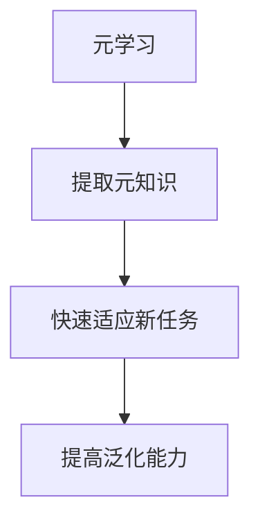

以下是题为《一切皆是映射：元学习在空间数据分析中的应用》的技术博客文章正文:

# 一切皆是映射：元学习在空间数据分析中的应用

## 1. 背景介绍

### 1.1 问题的由来

在当今数据时代,空间数据分析已成为许多领域的关键任务。从气象预报到交通规划,从城市发展到环境监测,空间数据无处不在。然而,传统的机器学习算法在处理这些复杂、高维、异构的空间数据时往往表现不佳。这促使研究人员开始探索新的学习范式,以更好地捕捉和利用空间数据中蕴含的丰富模式和结构。

### 1.2 研究现状  

近年来,元学习(Meta-Learning)作为一种新兴的机器学习范式,在空间数据分析领域引起了广泛关注。与传统机器学习算法直接从原始数据中学习不同,元学习旨在学习如何更快、更有效地学习新任务,从而提高在看似不相关的任务之间的泛化能力。通过从大量相关任务中提取元知识,元学习算法能够快速适应新的空间数据分布,并生成更准确、更鲁棒的模型。

### 1.3 研究意义

将元学习应用于空间数据分析具有重要意义:

1. **提高泛化能力**:空间数据具有高度多样性,元学习可帮助模型从已有数据中提取通用知识,从而更好地适应新的空间数据分布。

2. **减少标注成本**:空间数据的标注通常代价高昂,元学习可从少量标注数据中学习,降低标注成本。

3. **处理异构数据**:空间数据通常包含多种形式(栅格、矢量等),元学习能够融合不同模态数据,提取更丰富的特征。

4. **提高计算效率**:通过快速适应新任务,元学习可避免从头开始训练,从而提高计算效率。

### 1.4 本文结构

本文将系统地介绍元学习在空间数据分析中的应用。我们首先阐述元学习的核心概念及其与空间数据分析的联系,然后深入探讨主要的元学习算法原理和数学模型。接下来,我们将通过实际案例分析元学习算法在不同空间数据分析任务中的具体实现,并讨论其实际应用场景。最后,我们总结元学习在该领域的发展趋势和面临的挑战,并推荐相关工具和资源以供读者进一步学习和实践。

## 2. 核心概念与联系

元学习(Meta-Learning)的核心思想是"学习如何学习"。与传统机器学习算法直接从原始数据中学习模型不同,元学习旨在从一系列相关任务中提取出通用的知识,并将其应用于新的相似任务,从而加快学习速度并提高泛化能力。

在空间数据分析中,我们通常面临以下挑战:

1. **数据异质性**:空间数据可能来自多种来源(如遥感、地理信息系统等),并且具有不同的数据格式和特征。

2. **标注成本高昂**:对空间数据进行标注通常需要专家参与,代价高昂且耗时。

3. **数据分布变化**:由于地理位置、时间等因素的影响,空间数据分布可能发生显著变化。

4. **计算资源有限**:空间数据通常具有高维度和大体量,需要强大的计算资源进行建模和分析。

元学习为解决上述挑战提供了一种有效的方法。通过从大量相关任务中提取通用知识,元学习算法能够快速适应新的空间数据分布,并生成更准确、更鲁棒的模型。同时,元学习还可以从少量标注数据中学习,降低标注成本;并且能够融合异构数据,提取更丰富的特征。此外,通过快速适应新任务,元学习可避免从头开始训练,从而提高计算效率。

## 3. 核心算法原理与具体操作步骤

在这一部分,我们将详细介绍元学习在空间数据分析中的核心算法原理和具体操作步骤。

### 3.1 算法原理概述

元学习算法通常采用两级优化策略:在第一级(内循环),算法从一个或多个支持集(support set)中学习一个新的任务;在第二级(外循环),算法根据在查询集(query set)上的性能,更新用于快速学习新任务的元知识。

$$
\begin{aligned}
\phi &= \text{参数初始化}() \\
\textbf{repeat}\\
\quad D_\text{train}, D_\text{val} &\sim p(D) &&\text{从任务分布中采样训练集和验证集}\\
\quad \theta' &= \text{内循环优化}(\phi, D_\text{train}) &&\text{在训练集上优化任务参数}\\
\quad \mathcal{L} &= \text{损失函数}(\theta', D_\text{val}) &&\text{计算验证集上的损失}\\
\quad \phi &\leftarrow \text{外循环优化}(\phi, \mathcal{L}) &&\text{更新元参数}\\
\textbf{until} \quad \text{收敛}
\end{aligned}
$$

上述伪代码描述了一种基于优化的元学习算法的一般框架。其中,$\phi$表示元参数,$\theta$表示任务参数,$D$表示任务数据集。在内循环中,算法使用当前的元参数$\phi$从训练集$D_\text{train}$中学习任务参数$\theta'$;在外循环中,算法根据在验证集$D_\text{val}$上的损失$\mathcal{L}$,更新元参数$\phi$,使得在新任务上的学习能力得到提高。

不同的元学习算法在具体的优化策略、损失函数等方面有所不同,我们将在接下来的章节中详细介绍几种主要的元学习算法。

### 3.2 算法步骤详解

#### 3.2.1 模型初始化(Model-Agnostic Meta-Learning, MAML)

MAML是一种广为人知的基于优化的元学习算法。它的核心思想是:在内循环中,使用梯度下降法从支持集中学习一个新任务的模型参数;在外循环中,通过在查询集上的性能,更新一个可以快速适应新任务的初始参数。

MAML算法的具体步骤如下:

1. 初始化元参数$\phi$。

2. 从任务分布$p(D)$中采样一批任务$\{D_i\}$,每个任务$D_i$包含支持集$D_i^\text{train}$和查询集$D_i^\text{val}$。

3. 对于每个任务$D_i$:
   
   a. 计算支持集损失: $\mathcal{L}_i^\text{train}(\phi) = \text{损失函数}(f_\phi, D_i^\text{train})$
   
   b. 通过梯度下降更新任务参数: $\theta_i' = \phi - \alpha \nabla_\phi \mathcal{L}_i^\text{train}(\phi)$
   
   c. 计算查询集损失: $\mathcal{L}_i^\text{val}(\theta_i') = \text{损失函数}(f_{\theta_i'}, D_i^\text{val})$

4. 更新元参数: $\phi \leftarrow \phi - \beta \nabla_\phi \sum_i \mathcal{L}_i^\text{val}(\theta_i')$

5. 重复步骤2-4,直至收敛。

通过上述步骤,MAML算法可以找到一个好的初始参数$\phi$,使得在新任务上只需少量梯度步骤即可获得良好的性能。

#### 3.2.2 关系网络(Relation Networks, RN)

关系网络是一种用于少样本学习的元学习算法,它通过建模样本之间的关系来学习新概念。在空间数据分析中,关系网络可用于从少量标注样本中快速学习新的空间模式或对象。

关系网络算法的核心思想是:首先使用卷积神经网络从每个样本中提取特征;然后,对于每一对样本特征,使用一个小型神经网络建模它们之间的关系;最后,通过聚合所有样本对的关系,对新样本进行分类或回归。

具体步骤如下:

1. 从任务分布$p(D)$中采样一批任务$\{D_i\}$,每个任务$D_i$包含支持集$D_i^\text{train}$和查询集$D_i^\text{val}$。

2. 对于每个任务$D_i$:
   
   a. 使用卷积网络从每个样本$x$中提取特征$f_\phi(x)$。
   
   b. 对于每一对支持集样本$(x_i, x_j)$,使用关系模块$g_\theta$计算它们的关系分数:
      $$r_{ij} = g_\theta([f_\phi(x_i), f_\phi(x_j)])$$
      
   c. 对于每个查询样本$x_q$,聚合所有支持集样本与之的关系分数:
      $$s_q = \sum_{(x_i, y_i) \in D_i^\text{train}} r_{iq}y_i$$
      
   d. 根据$s_q$对查询样本$x_q$进行分类或回归。

3. 在所有任务上的查询集损失之和上,联合优化元参数$\phi$和关系模块参数$\theta$。

通过上述步骤,关系网络可以学习到一种通用的关系建模能力,从而快速适应新的空间数据分布。

### 3.3 算法优缺点

元学习算法在空间数据分析中具有以下优点:

1. **强大的泛化能力**:通过从大量相关任务中提取通用知识,元学习算法能够快速适应新的空间数据分布。

2. **降低标注成本**:元学习算法可以从少量标注数据中学习,降低了空间数据标注的高昂成本。

3. **处理异构数据**:元学习算法能够融合多种形式的空间数据,提取更丰富的特征。

4. **提高计算效率**:通过快速适应新任务,元学习可避免从头开始训练,从而提高计算效率。

然而,元学习算法也存在一些不足之处:

1. **任务相关性假设**:元学习算法假设所有任务都来自同一个潜在分布,如果任务之间的相关性较弱,其性能可能会受到影响。

2. **计算开销较大**:元学习算法通常需要在大量任务上进行训练,计算开销较大。

3. **任务分布偏移**:如果测试任务与训练任务的分布存在显著差异,元学习算法的性能可能会下降。

4. **理论基础薄弱**:尽管元学习算法在实践中取得了不错的成绩,但其理论基础仍然相对薄弱,缺乏足够的理论支持。

### 3.4 算法应用领域

元学习算法在空间数据分析中有广泛的应用前景,包括但不限于:

1. **遥感图像分析**:通过从大量遥感图像中学习,元学习算法可以快速适应新的地理区域、新的传感器类型等,实现高效的目标检测、分类和语义分割等任务。

2. **地理信息系统(GIS)**:在GIS中,元学习可用于从少量标注数据中快速学习新的地理要素(如道路、建筑物等),降低人工标注的成本。

3. **交通规划与预测**:元学习算法可以从历史交通数据中提取通用模式,并将其应用于新的城市或路网,实现准确的交通流量预测和路线规划。

4. **环境监测**:通过融合多源异构数据(如卫星影像、地面观测站等),元学习算法可以更好地监测环境变化,如森林覆盖、水体质量等。

5. **气象与气候建模**:元学习可用于从历史气象数据中提取通用模式,并快速适应新的地理区域和气候条件,提高气象预报和气候建模的准确性。

## 4. 数学模型和公式详细讲解与举例说明

在这一部分,我们将详细介绍元学习算法中的数学模型和公式,并通过具体案例进行讲解和说明。

### 4.1 数学模型构建

元