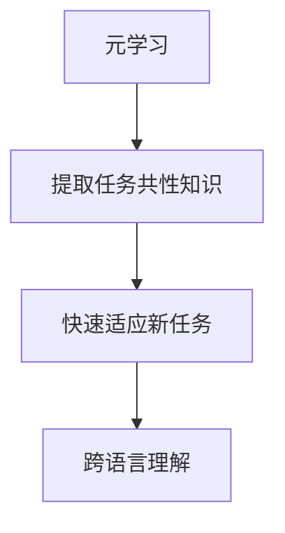

正文内容如下：

# 一切皆是映射：如何通过元学习实现AI的跨语言理解

## 1. 背景介绍

### 1.1 问题的由来

在当今的数字时代,信息以多种形式和语言在全球范围内流动。然而,语言的障碍使得跨语言理解成为了一个巨大的挑战。无论是在商业、科研还是日常生活中,我们都会遇到需要理解不同语言的情况。传统的机器翻译方法虽然可以提供一定的帮助,但由于缺乏上下文理解和语义分析能力,往往难以准确地传达原文的意图和细微差别。

### 1.2 研究现状  

为了解决这一问题,研究人员一直在探索利用人工智能(AI)技术来实现跨语言理解的方法。其中,元学习(Meta-Learning)作为一种新兴的AI范式,展现出了巨大的潜力。元学习旨在让AI系统具备"学习如何学习"的能力,从而更好地适应新的任务和环境。

目前,已有一些研究尝试将元学习应用于跨语言理解任务,取得了初步的成果。但是,由于这一领域的复杂性,仍然存在诸多挑战亟待解决。

### 1.3 研究意义

实现AI的跨语言理解不仅对于促进全球信息交流和文化交流具有重要意义,而且还可以为各种语言相关的应用带来革命性的变革,如机器翻译、多语种客户服务、跨语种信息检索等。此外,它也将为人工智能系统在更广泛的领域发挥作用奠定基础。

### 1.4 本文结构

本文将首先介绍元学习在跨语言理解中的核心概念和思路,然后详细阐述相关的算法原理和数学模型。接下来,我们将通过代码实例和案例分析,展示如何将这些理论付诸实践。最后,我们将探讨元学习在跨语言理解领域的实际应用场景,并对未来的发展趋势和挑战进行展望。

## 2. 核心概念与联系

元学习(Meta-Learning)是一种旨在提高AI系统学习能力的范式。它的核心思想是通过学习不同任务之间的共性知识,从而更快地适应新的任务。在跨语言理解的场景中,我们可以将不同的语言视为不同的任务,利用元学习来捕捉它们之间的共性特征和规律。

具体来说,元学习算法通过在多种语言的数据集上进行训练,学习到一个初始化模型,该模型能够捕捉不同语言之间的共性特征。然后,当遇到一种新的语言时,我们只需要在初始化模型的基础上,利用少量的新语言数据进行微调(Fine-tuning),就可以快速获得一个适用于该语言的模型。

这种方法的关键在于,元学习算法能够从多种语言中提取出一种通用的语言表示,并将其编码到初始化模型中。这种通用的语言表示捕捉了不同语言之间的共性规律,因此可以加速新语言的学习过程。

## 3. 核心算法原理与具体操作步骤

### 3.1 算法原理概述

元学习算法在跨语言理解任务中的核心思想,是通过在多种语言的数据集上进行训练,学习到一个能够捕捉不同语言共性特征的初始化模型。然后,当遇到一种新的语言时,我们只需要在这个初始化模型的基础上,利用少量的新语言数据进行微调,就可以快速获得一个适用于该语言的模型。

这种方法的优势在于,它可以有效地利用不同语言之间的共性知识,从而加速新语言的学习过程。相比于从头开始训练一个全新的模型,这种方法可以大大节省计算资源和时间成本。

### 3.2 算法步骤详解

1. **数据准备**:收集多种语言的数据集,包括文本、语音等多模态数据。这些数据集将被用于训练初始化模型。

2. **特征提取**:对原始数据进行预处理,提取出有用的特征,如词向量、语音特征等。这些特征将作为模型的输入。

3. **模型架构设计**:设计一个适合于元学习的模型架构,通常采用基于神经网络的深度学习模型。该模型应该具有足够的容量,能够捕捉不同语言之间的共性特征。

4. **元学习训练**:在多种语言的数据集上训练模型,使用元学习算法(如MAML、Reptile等)来优化模型参数。目标是学习到一个能够捕捉不同语言共性特征的初始化模型。

5. **微调**:当遇到一种新的语言时,在初始化模型的基础上,利用少量的新语言数据进行微调。这个过程通常只需要少量的训练步骤,就可以获得一个适用于该语言的模型。

6. **模型评估**:在测试集上评估微调后的模型性能,检验其在新语言上的表现。

7. **模型部署**:将训练好的模型部署到实际的应用场景中,用于跨语言理解任务。

### 3.3 算法优缺点

**优点**:

- 加速新语言的学习过程,节省计算资源和时间成本。
- 利用不同语言之间的共性知识,提高模型的泛化能力。
- 具有较好的可解释性,可以分析不同语言之间的相似性和差异性。

**缺点**:

- 需要大量的多语言数据集进行元学习训练,数据准备工作量较大。
- 模型架构和训练过程相对复杂,需要专门的设计和优化。
- 存在负迁移(Negative Transfer)的风险,即初始化模型中编码的共性特征可能对某些语言产生不利影响。

### 3.4 算法应用领域

元学习在跨语言理解领域具有广泛的应用前景,包括但不限于:

- **机器翻译**:通过元学习,可以快速适应新的语言对,提高机器翻译的准确性和效率。
- **多语种客户服务**:为不同语言的客户提供智能客服服务,实现无缝的跨语言交互。
- **跨语种信息检索**:在多种语言的文本数据中进行信息检索和知识发现。
- **语言教育**:辅助语言学习,提供个性化的语言学习建议和练习。
- **语音识别**:实现跨语种的语音识别和理解,应用于智能助手、会议记录等场景。

## 4. 数学模型和公式详细讲解及举例说明

### 4.1 数学模型构建

在元学习算法中,我们需要构建一个能够捕捉不同语言共性特征的初始化模型。这个模型通常采用基于神经网络的深度学习架构,其中包含多个可学习的参数。我们将使用一个简化的模型来说明其基本原理。

假设我们有一个由多个语言组成的数据集 $\mathcal{D} = \{D_1, D_2, \dots, D_N\}$,其中 $D_i$ 表示第 $i$ 种语言的数据集。我们的目标是学习一个初始化模型参数 $\theta_0$,使得在任何一种语言 $D_i$ 上微调后的模型性能都较好。

我们定义一个元学习目标函数 $\mathcal{L}$,它衡量了在所有语言数据集上微调后的模型性能:

$$\mathcal{L}(\theta_0) = \sum_{i=1}^{N} \mathcal{L}_i(\theta_i^*)$$

其中,$\theta_i^*$ 表示在语言 $D_i$ 上微调后的模型参数,它是通过以下方式获得的:

$$\theta_i^* = \theta_0 - \alpha \nabla_{\theta} \mathcal{L}_i(\theta_0)$$

这里,$\alpha$ 是学习率,$\nabla_{\theta} \mathcal{L}_i(\theta_0)$ 表示在语言 $D_i$ 上计算的模型参数梯度。

我们的目标是找到一个初始化参数 $\theta_0$,使得元学习目标函数 $\mathcal{L}(\theta_0)$ 最小化。这可以通过梯度下降法等优化算法来实现。

### 4.2 公式推导过程

接下来,我们将推导出如何计算元学习目标函数 $\mathcal{L}(\theta_0)$ 的梯度,从而能够使用梯度下降法来优化初始化参数 $\theta_0$。

根据链式法则,我们有:

$$\nabla_{\theta_0} \mathcal{L}(\theta_0) = \sum_{i=1}^{N} \nabla_{\theta_i^*} \mathcal{L}_i(\theta_i^*) \cdot \nabla_{\theta_0} \theta_i^*$$

其中,第一项 $\nabla_{\theta_i^*} \mathcal{L}_i(\theta_i^*)$ 可以通过反向传播算法在语言 $D_i$ 上计算得到。

对于第二项 $\nabla_{\theta_0} \theta_i^*$,根据 $\theta_i^*$ 的定义,我们有:

$$\begin{aligned}
\nabla_{\theta_0} \theta_i^* &= \nabla_{\theta_0} \left(\theta_0 - \alpha \nabla_{\theta} \mathcal{L}_i(\theta_0)\right) \\
&= I - \alpha \nabla_{\theta_0} \nabla_{\theta} \mathcal{L}_i(\theta_0)
\end{aligned}$$

其中,$I$ 是单位矩阵。

将上式代入元学习目标函数的梯度表达式,我们得到:

$$\nabla_{\theta_0} \mathcal{L}(\theta_0) = \sum_{i=1}^{N} \nabla_{\theta_i^*} \mathcal{L}_i(\theta_i^*) \cdot \left(I - \alpha \nabla_{\theta_0} \nabla_{\theta} \mathcal{L}_i(\theta_0)\right)$$

这个公式给出了如何计算元学习目标函数梯度的具体步骤,从而可以使用梯度下降法来优化初始化参数 $\theta_0$。

### 4.3 案例分析与讲解

为了更好地理解元学习在跨语言理解中的应用,我们将通过一个简单的案例进行分析和讲解。

假设我们有三种语言的数据集:英语($D_1$)、西班牙语($D_2$)和法语($D_3$)。我们的目标是训练一个初始化模型 $\theta_0$,使得在任何一种新的语言上微调后,模型都能够达到较好的性能。

首先,我们在英语和西班牙语数据集上进行元学习训练,优化初始化模型参数 $\theta_0$。在训练过程中,我们会交替地在两种语言上进行微调和计算损失,然后根据公式更新 $\theta_0$。

$$\theta_0 \leftarrow \theta_0 - \beta \left(\nabla_{\theta_1^*} \mathcal{L}_1(\theta_1^*) \cdot \left(I - \alpha \nabla_{\theta_0} \nabla_{\theta} \mathcal{L}_1(\theta_0)\right) + \nabla_{\theta_2^*} \mathcal{L}_2(\theta_2^*) \cdot \left(I - \alpha \nabla_{\theta_0} \nabla_{\theta} \mathcal{L}_2(\theta_0)\right)\right)$$

其中,$\beta$ 是元学习的学习率。

经过多轮迭代后,我们可以获得一个能够捕捉英语和西班牙语共性特征的初始化模型 $\theta_0$。

接下来,当我们遇到一种新的语言(如法语)时,只需要在初始化模型 $\theta_0$ 的基础上,利用少量的法语数据进行微调,就可以快速获得一个适用于法语的模型 $\theta_3^*$。

$$\theta_3^* = \theta_0 - \alpha \nabla_{\theta} \mathcal{L}_3(\theta_0)$$

通过这种方式,我们可以有效地利用不同语言之间的共性知识,加速新语言的学习过程。同时,由于初始化模型已经捕捉了一定的语言共性特征,因此微调后的模型性能也会相对较好。

### 4.4 常见问题解答

1. **为什么需要