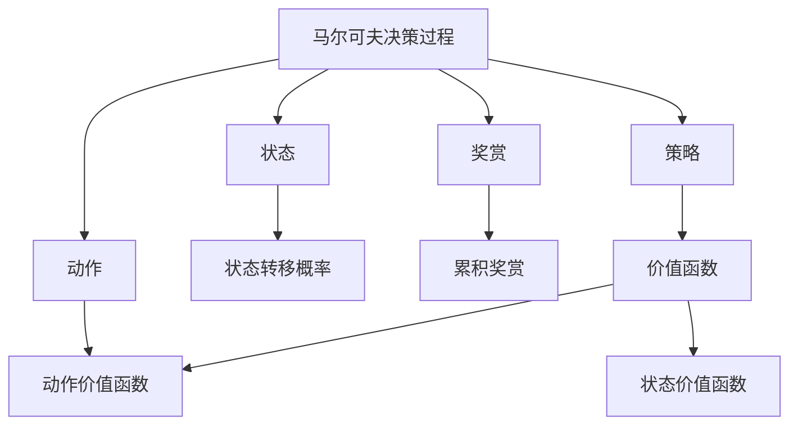

以下是题为《一切皆是映射：强化学习在智能家居系统中的应用：挑战与机遇》的技术博客文章正文：

# 一切皆是映射：强化学习在智能家居系统中的应用：挑战与机遇

## 1. 背景介绍

### 1.1 问题的由来

随着人工智能和物联网技术的不断发展,智能家居系统正在逐渐走进我们的生活。智能家居系统旨在通过集成多种智能设备和传感器,自动化管理家居环境,提高生活质量和能源利用效率。然而,由于家居环境的复杂多变性,如何有效管理和优化智能家居系统仍然是一个巨大的挑战。

传统的规则based控制方法由于缺乏学习和自适应能力,难以应对复杂动态环境。而强化学习(Reinforcement Learning)作为一种基于奖赏机制的机器学习方法,具有探索环境、自主学习和决策优化的能力,被认为是解决智能家居系统管理问题的有效途径之一。

### 1.2 研究现状

近年来,越来越多的研究开始将强化学习应用于智能家居系统的优化控制。例如,有研究使用深度Q网络(Deep Q-Network)来优化家居能源管理系统,实现能源消耗的最小化。另一些研究则采用多智能体强化学习(Multi-Agent Reinforcement Learning)来协调多个智能设备的行为,提高整体系统性能。

然而,将强化学习应用于实际智能家居系统仍面临诸多挑战,如高维状态空间、环境动态变化、多目标优化、隐私和安全等问题。因此,如何有效设计强化学习算法、构建合理的环境模型、平衡多个优化目标等,都是亟待解决的重要课题。

### 1.3 研究意义

成功应用强化学习于智能家居系统,将带来以下重要意义:

1. 提高家居系统的智能化水平,实现自主学习和决策优化,提升用户体验。
2. 降低家居系统的能源消耗,实现节能环保,推动可持续发展。
3. 探索强化学习在复杂环境中的应用,推动人工智能技术发展。
4. 为未来智能城市、智慧社区等场景提供借鉴和基础。

### 1.4 本文结构  

本文将首先介绍强化学习在智能家居系统中应用所涉及的核心概念,如马尔可夫决策过程、价值函数等,并阐述它们之间的关联。接下来,将重点讲解基于价值迭代和策略迭代的核心强化学习算法原理及具体操作步骤。

然后,我们将构建数学模型,推导出贝尔曼最优方程等重要公式,并结合具体案例进行讲解和分析。在此基础上,将给出一个基于Python和OpenAI Gym的强化学习智能家居系统实践项目,包括开发环境搭建、源代码实现、代码解读和运行结果展示等内容。

此外,文章还将探讨强化学习在智能家居系统中的实际应用场景,如家电控制、能源管理等,并对未来的应用前景进行展望。最后,我们将总结研究成果,分析发展趋势和面临的挑战,并给出相关的学习资源、工具和论文推荐。

## 2. 核心概念与联系

应用强化学习于智能家居系统管理首先需要建立马尔可夫决策过程(Markov Decision Process, MDP)模型。MDP是一种数学框架,用于描述一个完全可观测的、随机环境下的序贯决策问题。

在MDP中,系统的状态(State)是环境的一种可观测描述,如房间温度、能源消耗等。智能体(Agent)在当前状态下选择一个动作(Action),如开启空调、关闭灯光等。环境将根据当前状态和智能体的动作,通过状态转移概率(State Transition Probability)转移到下一个状态,并给出对应的奖赏(Reward),如降低能耗获得正奖赏,温度过高或过低获得负奖赏。

智能体的目标是学习一个最优策略(Optimal Policy),使得在该策略指导下,从任意初始状态出发,预期的累积奖赏(Cumulative Reward)最大。策略实际上是一个映射函数,将状态映射到相应的动作。

为了评估一个策略的好坏,我们定义了价值函数(Value Function),包括状态价值函数(State Value Function)和动作价值函数(Action Value Function)。前者度量了在当前状态下,执行某策略能获得的预期累积奖赏;后者则度量了在当前状态下执行某动作,之后遵循该策略能获得的预期累积奖赏。

基于这些核心概念,强化学习算法通过不断探索环境、尝试不同动作,并根据反馈奖赏来更新价值函数和策略,最终收敛到一个最优策略。这个自主学习和优化的过程,使强化学习成为解决智能家居系统管理问题的有力工具。

## 3. 核心算法原理与具体操作步骤

强化学习算法主要分为两大类:基于价值迭代(Value Iteration)和基于策略迭代(Policy Iteration)。前者先估计出最优价值函数,再由此推导出最优策略;后者则先随机初始化一个策略,然后不断优化更新该策略,使其收敛到最优策略。

### 3.1 算法原理概述

#### 3.1.1 价值迭代

价值迭代算法的核心思想是,基于贝尔曼最优方程(Bellman Optimality Equation)不断迭代更新价值函数,直至收敛到最优价值函数。然后基于最优价值函数推导出对应的最优策略。

贝尔曼最优方程给出了最优价值函数必须满足的条件,包括状态价值函数的贝尔曼最优方程:

$$
V^*(s) = \max_{a} \mathbb{E}[R_{t+1} + \gamma V^*(S_{t+1}) | S_t=s, A_t=a]
$$

和动作价值函数的贝尔曼最优方程:

$$
Q^*(s,a) = \mathbb{E}[R_{t+1} + \gamma \max_{a'} Q^*(S_{t+1}, a') | S_t=s, A_t=a]
$$

其中,$\gamma$是折现因子,用于权衡即时奖赏和未来奖赏的权重。

#### 3.1.2 策略迭代

策略迭代算法则先随机初始化一个策略$\pi_0$,然后不断估计该策略的价值函数,并基于价值函数对策略进行改进,直至收敛到最优策略。

具体来说,在策略评估(Policy Evaluation)阶段,算法基于当前策略$\pi_k$,计算出其对应的价值函数$V^{\pi_k}$,通常采用迭代方法求解贝尔曼方程:

$$
V^{\pi}(s) = \mathbb{E}_{\pi}[R_{t+1} + \gamma V^{\pi}(S_{t+1}) | S_t=s]
$$

在策略提升(Policy Improvement)阶段,算法基于价值函数$V^{\pi_k}$对策略$\pi_k$进行改进,得到一个新的更优的策略$\pi_{k+1}$:

$$
\pi_{k+1}(s) = \arg\max_a \mathbb{E}[R_{t+1} + \gamma V^{\pi_k}(S_{t+1}) | S_t=s, A_t=a]
$$

重复上述两个阶段,直至策略收敛为最优策略$\pi^*$。

### 3.2 算法步骤详解

#### 3.2.1 价值迭代算法

以Q-Learning为例,价值迭代算法的具体步骤如下:

1. 初始化动作价值函数$Q(s,a)$,如将所有$(s,a)$对应的值初始化为0。
2. 对每个状态$s$,计算期望最优动作价值函数:

$$
Q(s,a) \leftarrow \sum_{s',r} p(s',r|s,a)[r + \gamma \max_{a'} Q(s',a')]
$$

其中,$p(s',r|s,a)$是在状态$s$执行动作$a$后,转移到状态$s'$并获得奖赏$r$的概率。

3. 重复步骤2,直至动作价值函数收敛。
4. 根据最终的$Q(s,a)$,得到最优策略:

$$
\pi^*(s) = \arg\max_a Q(s,a)
$$

在实际应用中,我们可以采用离线方式,基于已有的状态转移样本和奖赏样本,执行上述迭代过程。也可以采用在线方式,通过与环境交互获取样本,并同步更新价值函数。

#### 3.2.2 策略迭代算法

以策略迭代算法为例,具体步骤如下:

1. 初始化一个随机策略$\pi_0$。
2. 策略评估:对当前策略$\pi_k$,求解其对应的价值函数$V^{\pi_k}$,通常采用迭代方法:

$$
V^{\pi_k}(s) \leftarrow \sum_a \pi_k(s,a) \sum_{s',r} p(s',r|s,a)[r + \gamma V^{\pi_k}(s')]
$$

重复上式直至收敛。

3. 策略提升:基于$V^{\pi_k}$,对策略$\pi_k$进行改进,得到新策略$\pi_{k+1}$:

$$
\pi_{k+1}(s) = \arg\max_a \sum_{s',r} p(s',r|s,a)[r + \gamma V^{\pi_k}(s')]
$$

4. 重复步骤2和3,直至策略收敛为最优策略$\pi^*$。

在实践中,策略迭代算法通常更适用于小规模的MDP问题,因为需要针对每个策略求解其准确的价值函数。而价值迭代算法由于直接基于样本更新价值函数,因此更适用于大规模问题。

### 3.3 算法优缺点

#### 3.3.1 价值迭代算法

优点:

- 无需事先了解环境的转移概率和奖赏模型,可以通过与环境交互在线学习。
- 收敛性能良好,可以找到最优策略。
- 可以处理大规模状态空间和动作空间。

缺点:

- 收敛速度较慢,需要大量样本和迭代次数。
- 对于确定性环境,无法利用环境的确定性加速学习。
- 可能会遇到维数灾难问题,当状态空间和动作空间过大时,计算和存储开销将快速增长。

#### 3.3.2 策略迭代算法

优点:

- 对于小规模MDP问题,收敛速度较快。
- 每次策略评估都会得到更好的策略,单调收敛。
- 可以利用环境的确定性加速求解价值函数。

缺点:

- 需要事先知道环境的转移概率和奖赏模型,否则无法求解价值函数。
- 对于大规模问题,求解准确的价值函数将非常耗时。
- 收敛性能不如价值迭代算法,可能陷入次优策略。

### 3.4 算法应用领域

强化学习算法已被广泛应用于多个领域,包括:

- 机器人控制:训练机器人执行特定任务,如行走、操作机械臂等。
- 游戏AI:训练智能体玩大型视频游戏,如AlphaGo、Dota等。
- 资源管理:优化数据中心资源调度、网络流量控制等。
- 自动驾驶:训练无人驾驶汽车在复杂环境中安全行驶。
- 金融交易:自动化交易策略优化。

在智能家居系统中,强化学习算法可用于以下领域:

- 能源管理:优化家居能源消耗,实现节能减排。
- 舒适度控制:自动调节温度、湿度、光线等,提高居住舒适度。
- 安全监控:检测异常行为,预防入室盗窃等安全事件。
- 智能助理:根据用户习